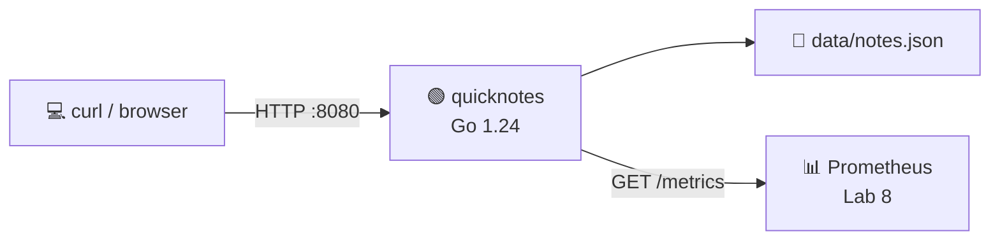
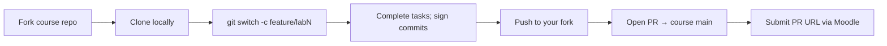

# DevOps Intro — Modern DevOps Practices Through One Project

[](#course-roadmap)
[-success)](#the-project-quicknotes)
[](#course-roadmap)
[](#grading)

A 10-week practical introduction to DevOps at Innopolis University. You will package, ship, observe, harden, and deploy **one** Go service — QuickNotes — across every lab. The discipline you learn here is the spine of modern production engineering.

> 💬 *"If it hurts, do it more often."* — Jez Humble

---

## Course Roadmap

10 weekly labs + 2 optional bonus labs:

| Week | Lab | Module | Key Topics & Technologies |
|------|-----|--------|---------------------------|
| 1 | Lab 1 | DevOps Foundations & Git | DevOps history, fork → branch → PR, signed commits (SSH 2.34+), PR templates |
| 2 | Lab 2 | Version Control Deep Dive | Object model, reflog recovery, reset modes, signed tags, rebase, bisect |
| 3 | Lab 3 | CI/CD | GitHub Actions (matrix, cache, OIDC); Bonus: GitLab CI mirror |
| 4 | Lab 4 | OS & Networking | OSI, DNS, HTTP, TLS, `ss`/`dig`/`tcpdump`/`journalctl` debugging |
| 5 | Lab 5 | Virtualization | Vagrant + VirtualBox, snapshots, cloud-init |
| 6 | Lab 6 | Containers | Multi-stage Dockerfile, distroless, Compose, hardening |
| 7 | Lab 7 | Configuration Management | Ansible playbook to deploy QuickNotes to Lab 5 VM; ansible-pull GitOps preview |
| 8 | Lab 8 | SRE & Monitoring | Golden signals, Prometheus, Grafana, one good alert, Checkly |
| 9 | Lab 9 | DevSecOps | Trivy, OWASP ZAP, SBOM, govulncheck reachability |
| 10 | Lab 10 | Cloud Computing | `ghcr.io` push from CI, Hugging Face Spaces deploy (card-free), Cloudflare Tunnel comparison |
| — | Lab 11 | Reproducible Builds *(bonus)* | Nix flake for QuickNotes; deterministic OCI image |
| — | Lab 12 | WebAssembly Containers *(bonus)* | TinyGo + Spin/WAGI; perf comparison vs Docker |

---

## The Project: QuickNotes

A small Go 1.24 notes API. You don't write the app — you **operationalize** it.



| Endpoint | Method | Returns |
|----------|--------|---------|
| `/notes` | GET | All notes |
| `/notes/{id}` | GET | One note / 404 |
| `/notes` | POST | Created note (201) |
| `/notes/{id}` | DELETE | 204 / 404 |
| `/health` | GET | `{"status":"ok","notes":N}` |
| `/metrics` | GET | Prometheus text format |

**Stack:** Go 1.24 + standard library (`net/http`, `encoding/json`). No third-party deps in the core app. Static binary, tiny container, clean WASM target.

See [app/README.md](app/README.md) for run instructions.

---

## Lectures

12 lecture files in `lectures/` — 10 main + 2 bonus readings:

| # | Title | File |
|---|-------|------|
| 1 | Introduction to DevOps: From Conflict to Collaboration | [lec1.md](lectures/lec1.md) |
| 2 | Version Control Deep Dive: Git Internals & Recovery | [lec2.md](lectures/lec2.md) |
| 3 | CI/CD: From `it works on my machine` to `it works on every machine` | [lec3.md](lectures/lec3.md) |
| 4 | Operating Systems & Networking: The Substrate Underneath | [lec4.md](lectures/lec4.md) |
| 5 | Virtualization: One Box, Many Worlds | [lec5.md](lectures/lec5.md) |
| 6 | Containers: Same Kernel, Different Worlds | [lec6.md](lectures/lec6.md) |
| 7 | Configuration Management with Ansible | [lec7.md](lectures/lec7.md) |
| 8 | SRE & Monitoring: Reliability Is an Engineering Discipline | [lec8.md](lectures/lec8.md) |
| 9 | DevSecOps: Shift Security Left | [lec9.md](lectures/lec9.md) |
| 10 | Cloud Computing: Ship QuickNotes to the Real World | [lec10.md](lectures/lec10.md) |
| R11 | Reading — Reproducible Builds with Nix *(bonus)* | [reading11.md](lectures/reading11.md) |
| R12 | Reading — WebAssembly Containers *(bonus)* | [reading12.md](lectures/reading12.md) |

Each main lecture has a 15-question post-quiz in EN + RU (uploaded to the course quiz platform — see [Quiz leaderboards](#quiz-leaderboards-the-5)).

---

## Technology Stack

Versions pinned to **April 2026**:

| Category | Tool | Version | Introduced |
|----------|------|---------|-----------|
| Application runtime | Go + std lib | 1.24 | Week 1 (provided) |
| Git | git | 2.49+ | Week 1 |
| CI/CD | GitHub Actions, GitLab CI | — | Week 3 |
| Hypervisor | VirtualBox | 7.1.x | Week 5 |
| VM provisioning | Vagrant | 2.4.x | Week 5 |
| Containers | Docker + Compose | 28.x | Week 6 |
| Configuration Mgmt | Ansible | 10.x | Week 7 |
| Metrics | Prometheus | v3.x | Week 8 |
| Dashboards | Grafana | 13.x | Week 8 |
| Security scan | Trivy | 0.59.x | Week 9 |
| DAST | OWASP ZAP | 2.16.x | Week 9 |
| Cloud | Hugging Face Spaces + Cloudflare Tunnel (card-free) | — | Week 10 |
| *(bonus)* Reproducibility | Nix Flakes | 2.x | Lab 11 |
| *(bonus)* WASM | TinyGo + Spin | 0.34 / 3.x | Lab 12 |

---

## What Ships vs What Students Produce

The upstream course repo provides plumbing. Students produce skill in their forks.

| Path | Ships in repo | Students produce |
|------|:-------------:|:----------------:|
| `app/` (Go service + tests + Makefile + seed.json) | ✅ | |
| `lectures/` | ✅ | |
| `labs/labN.md` (lab specs) | ✅ | |
| `.github/pull_request_template.md` | | ✅ Lab 1 |
| `.github/workflows/ci.yml` | | ✅ Lab 3 |
| `Vagrantfile` | | ✅ Lab 5 |
| `app/Dockerfile`, `compose.yaml` | | ✅ Lab 6 |
| `ansible/` (playbook, inventory, templates) | | ✅ Lab 7 |
| `monitoring/` (Prometheus + Grafana provisioning) | | ✅ Lab 8 |
| `docs/runbook/` | | ✅ Lab 8 |
| Security headers middleware, `.trivyignore` | | ✅ Lab 9 |
| `cloud/` (deploy scripts, fly.toml) | | ✅ Lab 10 |
| `flake.nix`, `flake.lock` | | ✅ Lab 11 (bonus) |
| `wasm/` (main.go, spin.toml) | | ✅ Lab 12 (bonus) |
| `submissions/labN.md` | | ✅ every lab |

---

## Lab Structure

Every main lab (1-10) follows the same shape:

| Task | Points | Description | Required? |
|------|-------:|-------------|:---------:|
| **Task 1** | 6 | Core step that advances the project. Future labs depend on it. | Yes |
| **Task 2** | 4 (3 in Lab 1) | Deeper dive into the week's topic. Skippable — won't affect future labs. | No |
| **Task 3** | 1 pt | *Lab 1 only* — open-source community engagement (GH or GitLab) | Lab 1 only |
| **Bonus Task** | 2 | Extension for motivated students (flat 2 pts each, no difficulty weighting). | No |

Bonus labs 11 & 12: **Task 1 (6 pts) + Task 2 (4 pts) only** — the lab *is* the bonus.

### Submission Workflow



PRs target the **upstream course repo's `main`**, not your fork's main.

---

## Grading

| Component | Weight | What it rewards |
|-----------|-------:|-----------------|
| **Main labs 1-10** (Task 1 + Task 2 + Task 3-where-applicable) | **70%** | Diligent project work — the floor for any serious student |
| **Bonus tasks 1-10** (2 pts each, flat — no difficulty weighting) | **14%** | Going above and beyond on weekly topics |
| **Quiz leaderboards** (5 rolling per-2-labs windows, top-10 share 1% pool each) | **up to 5%** | Engagement + excellence; rewards late-joining students too |
| **Bonus labs 11 + 12** (Task 1 + Task 2 only — 10 pts each) | **30%** | Mastering reproducibility + WebAssembly |
| **Final exam** | **30%** | Optional path — written, comprehensive |
| **Sum (capped at 100%)** | **149%** | Multiple paths to A |

### What this produces in practice

| Profile | Main | L-bonus | Bonus labs | Exam | Quiz | Total |
|---------|-----:|--------:|-----------:|-----:|-----:|------:|
| All Task 1 only, nothing else | 42% | 0% | 0% | 0% | 0% | **42%** |
| All Task 1+2, no bonuses, no exam | 70% | 0% | 0% | 0% | 0% | **70%** |
| Add all weekly bonuses | 70% | 14% | 0% | 0% | 0% | **84%** |
| + good quiz | 70% | 14% | 0% | 0% | 5% | **89%** ← *just short of A* |
| + finish at least one bonus lab | 70% | 14% | 15% | 0% | 5% | **100%** (capped) |
| Or take the exam instead | 70% | 14% | 0% | 25% | 5% | **100%** (capped) |
| Coast (Task 1 only + lucky quiz) | 42% | 0% | 0% | 0% | 5% | **47%** |

### Quiz leaderboards (the 5%)

Each lecture has a post-quiz on the course quiz platform. Quizzes feed 5 rolling leaderboards:

| Window | Labs covered |
|-------:|--------------|
| 1 | labs 1-2 |
| 2 | labs 3-4 |
| 3 | labs 5-6 |
| 4 | labs 7-8 |
| 5 | labs 9-10 |

Top-10 per window share 1% of the total grade.

### Performance tiers

| Grade | Range | Required to reach |
|-------|------:|-------------------|
| **A** | 90-100 | All main labs + at least one of: bonus labs / exam (multiple paths) |
| **B** | 75-89 | Main labs + most bonuses, no extension work |
| **C** | 60-74 | Main lab Task 1 across most labs |
| **D** | 0-59 | Below expectations |

### Late submissions

- Within 1 week of deadline: max 6/10 for that lab
- After 1 week: 0
- Bonus tasks and bonus labs: no late credit

---

## Required Software

| Week | Add |
|-----:|-----|
| 1 | Git 2.49+, Go 1.24, an SSH client, a GitHub *or* GitLab account |
| 3 | (nothing new — CI runs in the cloud) |
| 4 | `tcpdump`, `ss` (iproute2), `dig`, `mtr`, `jq`, optionally Wireshark |
| 5 | VirtualBox 7.1.x, Vagrant 2.4.x |
| 6 | Docker 28.x (Compose v2 built in) |
| 7 | Ansible 10.x (Python 3.11+) |
| 8 | (Prometheus + Grafana run in containers — nothing host-side needed) |
| 9 | (Trivy + ZAP run in containers) |
| 10 | A Hugging Face account (free, no card); `cloudflared` for the Bonus tunnel |
| 11 (bonus) | Nix (Determinate installer recommended) |
| 12 (bonus) | TinyGo 0.34+, Spin 3.x |

---

## Repository Structure

```text
DevOps-Intro/
├── app/                      # QuickNotes Go service (provided)
│   ├── main.go, store.go, handlers.go
│   ├── *_test.go             # tests
│   ├── go.mod, Makefile
│   ├── .golangci.yml, README.md
│   └── seed.json
├── lectures/
│   ├── lec1.md … lec10.md    # 10 main lectures
│   ├── reading11.md          # Nix bonus reading
│   └── reading12.md          # WASM bonus reading
├── labs/
│   ├── lab1.md … lab10.md    # 10 main lab specs
│   ├── lab11.md, lab12.md    # 2 bonus lab specs
└── README.md                 # you are here
```

Students add (in their forks):

```text
├── .github/                  # Lab 1, Lab 3
├── Vagrantfile               # Lab 5
├── ansible/                  # Lab 7
├── monitoring/               # Lab 8
├── cloud/                    # Lab 10
├── flake.nix                 # Lab 11
├── wasm/                     # Lab 12
└── submissions/
    ├── lab1.md … labN.md
```

---

## Key Books & Resources

* 📕 *The Phoenix Project* — Gene Kim, Kevin Behr, George Spafford (2013) — DevOps via novel
* 📕 *The DevOps Handbook* — Kim, Humble, Debois, Willis (2nd ed 2021) — the practitioner's manual
* 📕 *Accelerate* — Forsgren, Humble, Kim (2018) — the scientific evidence behind DORA
* 📗 *Pro Git* — Chacon & Straub — free at [git-scm.com/book](https://git-scm.com/book)
* 📗 *Continuous Delivery* — Humble & Farley (2010) — Jolt-award winner
* 📘 *Site Reliability Engineering* — Beyer, Jones, Petoff, Murphy — free at [sre.google](https://sre.google/sre-book/table-of-contents/)
* 📘 *Docker Deep Dive* — Nigel Poulton — practical containers
* 📘 *Ansible: Up & Running* — Lorin Hochstein & René Moser (3rd ed)
* 📘 [Brendan Gregg — Linux Performance](https://www.brendangregg.com/linuxperf.html) — the canonical map of Linux observability

---

## Course Completion

By Week 10, you will have:
- Forked, signed-committed, and PR-merged your way through 10 weeks
- Built CI, containers, VMs, monitoring, security scans, and a real cloud deploy of **the same** Go service
- Filed a blameless mini-postmortem after each lab
- Maybe pushed yourself further with Nix and/or WebAssembly

The tools change every five years. The discipline doesn't. Welcome to DevOps.

> 🎯 *Reference: this course's Spring 2026 structure mirrors the SRE-Intro standard (Innopolis University, completed Apr 2026). DevOps-Intro is the broader intro to **how software is shipped**; SRE-Intro is the deeper dive into **keeping it reliable**.*
