```mermaid
flowchart LR
    subgraph "🌐 Production & Cloud"
        direction LR
        I[🔐 Week 9: DevSecOps<br/>OWASP ZAP & Trivy]
        J[☁️ Week 10: Cloud<br/>AWS/Azure/GCP]
    end
    
    subgraph "⭐ Bonus: Cutting Edge"
        direction LR
        K[🌐 IPFS/4EVERLAND<br/>Decentralized Web]
        L[⚡ WASM Containers<br/>Performance & Edge]
    end
    
    subgraph "🎯 Advanced DevOps"
        direction LR
        G[🚀 Week 7: GitOps<br/>Reconciliation & Drift]
        H[🛡️ Week 8: SRE<br/>Monitoring & Reliability]
    end
    
    subgraph "🏗️ Infrastructure Layer"
        direction LR
        E[💻 Week 5: Virtualization<br/>VirtualBox & VMs]
        F[📦 Week 6: Containers<br/>Docker Fundamentals]
    end
    
    subgraph "🔧 Development Layer"
        direction LR
        C[⚙️ Week 3: CI/CD<br/>GitHub Actions]
        D[🖥️ Week 4: Systems<br/>Linux & Networking]
    end
    
    subgraph "🏗️ Foundation Layer"
        direction LR
        A[📚 Week 1: DevOps<br/>Principles & Git]
        B[🔄 Week 2: Git Advanced<br/>Version Control Mastery]
    end
    
    A --> C
    B --> C
    C --> E
    D --> E
    D --> F
    E --> F
    F --> G
    F --> H
    G --> I
    H --> I
    I --> J
    J -.-> K
    J -.-> L
    
    classDef foundation fill:#e8f6f3,stroke:#1abc9c,stroke-width:3px,color:#2c3e50
    classDef development fill:#fef9e7,stroke:#f39c12,stroke-width:3px,color:#2c3e50
    classDef infrastructure fill:#eaf2f8,stroke:#3498db,stroke-width:3px,color:#2c3e50
    classDef advanced fill:#f4ecf7,stroke:#9b59b6,stroke-width:3px,color:#2c3e50
    classDef production fill:#fdedec,stroke:#e74c3c,stroke-width:3px,color:#2c3e50
    classDef bonus fill:#fff3cd,stroke:#f1c40f,stroke-width:3px,color:#2c3e50
    
    class A,B foundation
    class C,D development
    class E,F infrastructure
    class G,H advanced
    class I,J production
    class K,L bonus
```

# 🚀 DevOps Introduction Course: Principles, Practices & Tooling

[](#-lab-based-learning-experience)
[](#-evaluation-framework)
[](#-lab-based-learning-experience)
[](#-course-roadmap)

Welcome to the **DevOps Introduction Course**, where you will gain a **solid foundation in DevOps principles and practical skills**.  
This course is designed to provide a comprehensive understanding of DevOps and its key components.  

Through **hands-on labs and lectures**, you'll explore version control, software distribution, CI/CD, containerization, cloud computing, and beyond — the same workflows used by modern engineering teams.

---

## 📚 Course Roadmap

**10-week intensive course** with practical modules designed for incremental skill development:

| Week | Lab | Module                              | Key Topics & Technologies                                                                                                 |
|------|-----|-------------------------------------|--------------------------------------------------------------------------------------------------------------------------|
| 1    | 1   | **Introduction to DevOps**          | Core principles, Git workflow, SSH commit signing, PR templates                                                          |
| 2    | 2   | **Version Control & Advanced Git**  | Object model, reset/reflog, history visualization, tagging, modern Git commands                                          |
| 3    | 3   | **CI/CD with GitHub Actions**       | Workflow creation, triggers, logs, system information, automation pipelines                                              |
| 4    | 4   | **Networking & OS for DevOps**      | System analysis, boot performance, networking diagnostics, DNS, packet capture                                           |
| 5    | 5   | **Virtualization**                  | VirtualBox setup, VM deployment, system information discovery                                                            |
| 6    | 6   | **Containers with Docker**          | Container lifecycle, image management, networking, volumes, persistence                                                  |
| 7    | 7   | **GitOps Fundamentals**             | Reconciliation loops, drift detection, health monitoring, declarative configuration                                      |
| 8    | 8   | **SRE & Monitoring**                | System metrics, SLAs, website monitoring (Checkly), alerting, reliability engineering                                    |
| 9    | 9   | **DevSecOps Tools**                 | OWASP ZAP, Trivy scanning, vulnerability analysis, security integration                                                  |
| 10   | 10  | **Cloud Computing Fundamentals**    | Artifact registries (AWS/GCP/Azure), serverless platforms comparison                                                     |
| —    | 11  | **🎁 Bonus: Web3 Infrastructure**   | IPFS node setup, decentralized storage, 4EVERLAND deployment, content addressing                                         |
| —    | 12  | **🎁 Bonus: WASM Containers**       | WebAssembly containers, performance comparison, Spin framework, edge computing                                           |

> **Note:** Labs 11-12 are **optional bonus labs** for extra credit. Complete them to boost your grade or explore cutting-edge technologies!

---

## 🗒️ Lecture Slide Overview

This is the final slide index extracted from `lectures/lec*.md`. Each lecture expands to list all slide titles and links to the source file.

<details>
<summary>📌 Lecture 1 - Introduction to DevOps (37 slides)</summary>

Source: lectures/lec1.md

- 📍 Slide 1 – 🚀 What is DevOps?
- 📍 Slide 2 – 📜 A Brief History of DevOps
- 📍 Slide 3 – 🎯 Why DevOps? (Key Goals)
- 📍 Slide 4 – ⚖️ DevOps vs. Traditional IT
- 📍 Slide 5 – 🔑 Core Principles: The CAMS Model
- 📍 Slide 6 – 🌱 Culture in DevOps
- 📍 Slide 7 – 🔄 Shift-Left Mindset
- 📍 Slide 8 – 👥 Collaboration Between Teams
- 📍 Slide 9 – 🔔 Feedback Loops
- 📍 Slide 10 – 📚 Continuous Learning & Blameless Postmortems
- 📍 Slide 11 – 🏗️ Infrastructure as Code (IaC)
- 📍 Slide 12 – 🔄 Continuous Integration (CI) Basics
- 📍 Slide 13 – 🚀 Continuous Delivery & Deployment (CD)
- 📍 Slide 14 – 🐮 Cattle vs. Pets (Immutable Infrastructure)
- 📍 Slide 15 – 📊 DevOps Metrics & KPIs
- 📍 Slide 16 – 🤖 Automation First Approach
- 📍 Slide 17 – ⚙️ Configuration Management
- 📍 Slide 18 – 📦 Containerization Basics
- 📍 Slide 19 – 🗂️ Orchestration Basics (Kubernetes Preview)
- 📍 Slide 20 – 🔍 Observability (Logs, Metrics, Tracing)
- 📍 Slide 21 – 📂 Version Control (Git Basics)
- 📍 Slide 22 – ⚙️ CI/CD Tools Overview
- 📍 Slide 23 – 📦 Artifact Repositories
- 📍 Slide 24 – 🏗️ Infrastructure as Code (IaC) Tools
- 📍 Slide 25 – ☁️ Cloud Providers
- 📍 Slide 26 – 💬 Collaboration Tools
- 📍 Slide 27 – 🔄 Typical DevOps Pipeline Workflow
- 📍 Slide 28 – 🐙 Example: GitHub Actions CI/CD Workflow
- 📍 Slide 29 – 🎬 Case Study: Netflix & Simian Army
- 📍 Slide 30 – 📦 Case Study: Amazon’s “You Build It, You Run It”
- 📍 Slide 31 – ⚠️ Challenges in DevOps Adoption
- 📍 Slide 32 – 🌟 Best Practices for DevOps Success
- 📍 Slide 33 – 🌀 DevOps Myths & Misconceptions
- 📍 Slide 34 – ⚖️ Balancing Speed vs Stability (DevOps vs SRE)
- 📍 Slide 35 – 📚 Summary of Key DevOps Concepts
- 📍 Slide 36 – 📖 Recommended Reading & Learning
- 📍 Slide 37 – 🛠️ Hands-on Practice Resources

</details>

<details>
<summary>📌 Lecture 2 - Version Control (37 slides)</summary>

Source: lectures/lec2.md

- 📍 Slide 1 – 🧭 What is a Version Control System (VCS)?
- 📍 Slide 2 – 🔎 Why We Need Version Control
- 📍 Slide 3 – 🕰️ A Short History of VCS (to Understand Today)
- 📍 Slide 4 – 🧭 Centralized vs Distributed VCS
- 📍 Slide 5 – 🧰 The Git Ecosystem (What We’ll Use)
- 📍 Slide 6 – 🏁 Getting Started with Git (Install & First Config)
- 📍 Slide 7 – 🧩 Git’s Mental Model: Working Tree, Staging (Index), Repository
- 📍 Slide 8 – 🧱 Commits, Trees & Hashes (SHA = Secure Hash Algorithm)
- 📍 Slide 9 – 🌿 Branches & 🎯 HEAD (Current Position)
- 📍 Slide 10 – 🧪 The Basic Local Workflow (Edit → Stage → Commit)
- 📍 Slide 11 – 🔍 Exploring History (Logs, Shows, Blame, Search)
- 📍 Slide 12 – 🧮 Understanding Diffs (Working, Staged, Commits, Ranges)
- 📍 Slide 13 – 🔀 Rebase vs. Merge (and When to Use Each)
- 📍 Slide 14 – ♻️ Undo & Recovery (Without Tears)
- 📍 Slide 15 – 🌐 Collaborating with Remotes (Clone, Fetch, Pull, Push)
- 📍 Slide 16 – 🛣️ Branching Strategies: GitFlow, GitHub Flow, Trunk-Based
- 📍 Slide 17 – 👀 Pull Requests (PR) / Merge Requests (MR) & Code Review
- 📍 Slide 18 – 🏷️ Tags & Releases (Versioning for Humans and Machines)
- 📍 Slide 19 – 🗃️ Stashing Work-in-Progress (WIP) with Git Stash
- 📍 Slide 20 – 🤖 Git Hooks & Local Automation (Quality Gates)
- 📍 Slide 21 – 🪵 Large Files & Huge Repositories (LFS, Sparse, Partial)
- 📍 Slide 22 – 🧭 Other Version Control Systems (Landscape & Use Cases)
- 📍 Slide 23 – ⚖️ Git vs. SVN (Subversion) — Models & Workflows
- 📍 Slide 24 – ⚖️ Git vs. Mercurial (Hg) — Same Goal, Different Feel
- 📍 Slide 25 – ⚔️ War Stories & History Nuggets (Git vs the Old Guard)
- 📍 Slide 26 – 🐧 Case Study: Linux Kernel Workflow at Scale
- 📍 Slide 27 – 🏢 Case Study: Enterprise Migration & “Git at Scale”
- 📍 Slide 28 – 🧭 Team Best Practices (Day-to-Day Git Hygiene)
- 📍 Slide 29 – 🧯 Common Pitfalls & Recovery Patterns
- 📍 Slide 30 – 🔐 Security, Signing & Compliance (Trust Your History)
- 📍 Slide 31 – 🧱 Beyond Code: Everything-as-Code & 🚢 GitOps
- 📍 Slide 32 – 🧭 Learning Resources & 🎯 Practice Playground
- 📍 Slide 33 – 🧾 Summary & ✅ Next Steps (Hands-On)
- 📍 Slide 34 – 🔭 Trends in Version Control: Decentralization & Content Addressing
- 📍 Slide 35 – 🧊 Using IPFS with Git (CIDs, Pinning, Remotes)
- 📍 Slide 36 – 🕸️ Radicle: P2P, Sovereign Code Collaboration (Built on Git)
- 📍 Slide 37 – ⛓️ Blockchain-Backed Collaboration: Gitopia & Timestamps

</details>

<details>
<summary>📌 Lecture 3 - CI/CD (42 slides)</summary>

Source: lectures/lec3.md

- 📍 Slide 1 – 🌍 What is CI/CD?
- 📍 Slide 2 – 🕰️ Short History of CI/CD
- 📍 Slide 3 – 📈 Why CI/CD Matters
- 📍 Slide 4 – 🏗️ Core Principles of Continuous Integration
- 📍 Slide 5 – 🔄 CI Workflow (Commit → Build → Test → Package)
- 📍 Slide 6 – 📂 Build Automation Basics
- 📍 Slide 7 – 🧪 Automated Testing in CI
- 📍 Slide 8 – 🛠️ Popular CI Tools (1/2)
- 📍 Slide 9 – 🛠️ Popular CI Tools (2/2)
- 📍 Slide 10 – 🚚 Continuous Delivery vs Continuous Deployment
- 📍 Slide 11 – 🛤️ Release Pipeline Explained
- 📍 Slide 12 – 🧩 Configuration Management & IaC in CD
- 📍 Slide 13 – 🌱 Blue-Green Deployment (Concept & History)
- 📍 Slide 14 – 🏢 Blue-Green Deployment (Real-World Use Cases)
- 📍 Slide 15 – 🐤 Canary Deployment (Concept & History)
- 📍 Slide 16 – 🚏 Canary Deployment (Real-World Examples)
- 📍 Slide 17 – 🧪 A/B Testing (Concept & History)
- 📍 Slide 18 – 🏆 A/B Testing (Real-World Use Cases)
- 📍 Slide 19 – 🔄 Rolling & Shadow Deployments
- 📍 Slide 20 – 📦 CI/CD Pipeline Stages Explained
- 📍 Slide 21 – 🔄 Event-Driven Pipelines (Triggers)
- 📍 Slide 22 – 📝 Pipelines as Code
- 📍 Slide 23 – 🧑‍🤝‍🧑 Branching Models with CI/CD
- 📍 Slide 24 – ⚡ Pipeline Optimization Techniques
- 📍 Slide 25 – 🐳 CI/CD with Containers (Docker & Podman)
- 📍 Slide 26 – ☸️ CI/CD with Kubernetes (Helm, ArgoCD, Flux)
- 📍 Slide 27 – ☁️ Cloud-Native CI/CD Services
- 📍 Slide 28 – 🎯 Observability & Monitoring in CI/CD
- 📍 Slide 29 – 🔄 Rollbacks & Recovery in CI/CD
- 📍 Slide 30 – 🧯 Common Issues & Anti-Patterns
- 📍 Slide 31 – 🔒 Security in CI/CD Pipelines
- 📍 Slide 32 – 📜 Compliance, Audit & Governance in CI/CD
- 📍 Slide 33 – 🛡️ Security Tools for CI/CD
- 📍 Slide 34 – 🧪 Case Study: GitHub Actions vs GitLab CI vs Jenkins
- 📍 Slide 35 – 🌐 Industry Adoption & Statistics of CI/CD
- 📍 Slide 36 – 🔮 Emerging Trends in CI/CD
- 📍 Slide 37 – 🧵 Decentralized & P2P CI/CD Concepts
- 📍 Slide 38 – 🏆 Best Practices from Top Companies
- 📍 Slide 39 – 📖 CI/CD Lifecycle in One Diagram
- 📍 Slide 40 – 📚 Recommended Readings & Resources
- 📍 Slide 41 – 🖥️ Hands-On Practice Suggestions
- 📍 Slide 42 – ❓ Q&A + Reflection

</details>

<details>
<summary>📌 Lecture 4 - Networking & OS for DevOps (37 slides)</summary>

Source: lectures/lec4.md

- 📍 Slide 1 – 🌐 Introduction to Networking in DevOps
- 📍 Slide 2 – 📡 OSI Model & TCP/IP Stack
- 📍 Slide 3 – 🔢 IP Addressing & Subnetting
- 📍 Slide 4 – 🌐 DNS (Domain Name System)
- 📍 Slide 5 – 🌍 HTTP & HTTPS
- 📍 Slide 6 – 🔌 Load Balancing
- 📍 Slide 7 – 🧩 Network Segmentation
- 📍 Slide 8 – 🔒 Firewalls & Network Security
- 📍 Slide 9 – 🔑 TLS & Certificate Management
- 📍 Slide 10 – 🕵️ Network Monitoring & Troubleshooting
- 📍 Slide 11 – 🛡️ VPNs & Secure Tunneling
- 📍 Slide 12 – 🐧 Linux History & Distributions
- 📍 Slide 13 – 💻 Linux File System Hierarchy
- 📍 Slide 14 – 👨‍💻 Shell Environments & Scripting
- 📍 Slide 15 – 📂 File Management & Text Processing
- 📍 Slide 16 – 👤 User & Group Management
- 📍 Slide 17 – 🔄 Process Management in Linux
- 📍 Slide 18 – 🛠️ Systemd & Service Management
- 📍 Slide 19 – 📊 Resource Monitoring & Performance
- 📍 Slide 20 – 📝 Logging Systems
- 📍 Slide 21 – 📆 Scheduling & Automation
- 📍 Slide 22 – 🔐 File Permissions & Ownership
- 📍 Slide 23 – 💪 Sudo & Privilege Escalation
- 📍 Slide 24 – 🛡️ SELinux & AppArmor
- 📍 Slide 25 – 🔒 Hardening Linux Systems
- 📍 Slide 26 – 🌐 Network Interface Configuration
- 📍 Slide 27 – 🔄 DHCP & DNS Setup
- 📍 Slide 28 – 🌍 Web Servers: Apache & Nginx
- 📍 Slide 29 – 🔄 Proxies & Reverse Proxies
- 📍 Slide 30 – 🔐 SSH & Remote Administration
- 📍 Slide 31 – 🔍 Network Troubleshooting Tools
- 📍 Slide 32 – 🔬 System Diagnostics
- 📍 Slide 33 – 🧰 Log Analysis
- 📍 Slide 34 – ⚠️ Common DevOps Network/System Issues
- 📍 Slide 35 – 🚀 Current Trends in DevOps Networking
- 📍 Slide 36 – 🔮 Bleeding Edge Tools & Technologies
- 📍 Slide 37 – 🔮 Future of DevOps: 2024-2030

</details>

<details>
<summary>📌 Lecture 5 - Virtualization & Modern IT Infrastructure (20 slides)</summary>

Source: lectures/lec5.md

- 📍 Slide 1 – 🌟 Introduction to Virtualization - What & Why
- 📍 Slide 2 – 📚 History of Virtualization (1960s IBM Mainframes → Modern Cloud)
- 📍 Slide 3 – 💡 Core Concepts - Physical vs Virtual Resources
- 📍 Slide 4 – 🎯 Benefits of Virtualization (Cost, Efficiency, Flexibility)
- 📍 Slide 5 – ⚠️ Challenges & Limitations of Virtualization
- 📍 Slide 6 – 🧠 Hypervisor Fundamentals - The Virtual Machine Monitor
- 📍 Slide 7 – 🏗️ Type 1 Hypervisors (Bare Metal) - VMware ESXi, Hyper-V, Xen
- 📍 Slide 8 – 🖥️ Type 2 Hypervisors (Hosted) - VirtualBox, VMware Workstation
- 📍 Slide 9 – ⚖️ Type 1 vs Type 2 Comparison & Use Cases
- 📍 Slide 10 – 🔍 Hypervisor Architecture Deep Dive
- 📍 Slide 11 – 🐳 Container Revolution - Docker, Podman, containerd
- 📍 Slide 12 – ⚖️ VMs vs Containers - Architecture & Use Cases
- 📍 Slide 13 – 🌐 WebAssembly (WASM) - Server-Side Revolution
- 📍 Slide 14 – 🔬 Unikernels & Microkernels - Specialized Virtualization
- 📍 Slide 15 – ⚡ Serverless Computing - Functions-as-a-Service Evolution
- 📍 Slide 16 – 🛡️ Security-Focused Virtualization - Firecracker, gVisor, Kata
- 📍 Slide 17 – 📊 Performance Optimization - Modern Hardware Features
- 📍 Slide 18 – 🔧 Hybrid Architectures - Best of All Worlds
- 📍 Slide 19 – 🌐 Edge & IoT Virtualization - 5G Revolution
- 📍 Slide 20 – 🔮 Emerging Technologies - The Next Decade

</details>

<details>
<summary>📌 Lecture 6 - Containers: Docker & Kubernetes (19 slides)</summary>

Source: lectures/lec6.md

- 📍 Slide 1 – 🐳 What are Containers?
- 📍 Slide 2 – 📜 History of Containers (1979 → 2024)
- 📍 Slide 3 – 💡 Why Containers Matter in DevOps
- 📍 Slide 4 – ⚖️ Containers vs Virtual Machines (VMs)
- 📍 Slide 5 – 🧩 Container Components (Images, Layers, Registries)
- 📍 Slide 6 – 🛠️ Container Engine Differences (Docker vs Podman vs containerd vs CRI-O)
- 📍 Slide 7 – 🔍 OCI (Open Container Initiative) Standards
- 📍 Slide 8 – ⚙️ Container Runtime Internals (runc, crun, Kata Containers, gVisor)
- 📍 Slide 9 – 🏗️ Linux Kernel Features (Namespaces, cgroups, Capabilities, SELinux/AppArmor)
- 📍 Slide 10 – 🐋 Docker Architecture (Client-Server, Daemon, CLI, Engine)
- 📍 Slide 11 – 📦 Docker Images & Layers (Build Process, Caching, Multi-stage)
- 📍 Slide 12 – 🎯 Dockerfile Best Practices (Optimization, Security, Size)
- 📍 Slide 13 – 🌐 Docker Networking (Bridge, Host, Overlay, Container Communication)
- 📍 Slide 14 – 💾 Docker Storage (Volumes, Bind Mounts, tmpfs, Drivers)
- 📍 Slide 15 – ☸️ Introduction to Kubernetes (What, Why, Architecture)
- 📍 Slide 16 – 🧩 Kubernetes Core Components (Control Plane, Nodes, etcd)
- 📍 Slide 17 – 🎯 Kubernetes Objects (Pods, Deployments, Services, ConfigMaps, Secrets)
- 📍 Slide 18 – 🌐 Kubernetes Networking (CNI, Services, Ingress, NetworkPolicies)
- 📍 Slide 19 – 💾 Kubernetes Storage (PersistentVolumes, PVCs, StorageClasses)

</details>

<details>
<summary>📌 Lecture 7 - GitOps & Progressive Delivery (18 slides)</summary>

Source: lectures/lec7.md

- 📍 Slide 1 – 🚀 What is GitOps? - The Modern Way to Operate
- 📍 Slide 2 – 📜 GitOps History - From FTP to Pull Requests
- 📍 Slide 3 – 🎯 GitOps Principles - The Four Golden Rules
- 📍 Slide 4 – ⚡ Push vs Pull Deployment Models - The Great Debate
- 📍 Slide 5 – 🛠️ GitOps Tooling Landscape - Choosing Your Weapon
- 📍 Slide 6 – 🏗️ GitOps Repository Strategies - Organizing Your Git Repos
- 📍 Slide 7 – ☸️ Argo CD Architecture & Core Concepts
- 📍 Slide 8 – 🎨 Argo CD in Action - Hands-On Deployment
- 📍 Slide 9 – 🔐 Argo CD Best Practices - Production-Ready Patterns
- 📍 Slide 10 – 🎯 What is Progressive Delivery? - Beyond Basic Deployments
- 📍 Slide 11 – 🔄 Deployment Strategies - Canary, Blue-Green, A/B Testing
- 📍 Slide 12 – 📊 Observability & Metrics for Progressive Delivery
- 📍 Slide 13 – 🎭 Argo Rollouts - Progressive Delivery Powerhouse
- 📍 Slide 14 – 🚢 Flagger - Automated Progressive Delivery
- 📍 Slide 15 – 🎯 Feature Flags & Experimentation
- 📍 Slide 16 – 🔐 Security & Compliance in GitOps
- 📍 Slide 17 – ⚙️ CI/CD Integration - The Complete Pipeline
- 📍 Slide 18 – 🎉 Real-World Case Studies & Future Trends

</details>

<details>
<summary>📌 Lecture 8 - SRE & Monitoring: System Metrics, SLAs & Reliability Engineering (20 slides)</summary>

Source: lectures/lec8.md

- 📍 Slide 1 – 🛡️ What is SRE? - Engineering Approach to Operations
- 📍 Slide 2 – 📜 History of SRE - From Google's Need to Industry Standard
- 📍 Slide 3 – 🤝 SRE vs DevOps vs Platform Engineering - Clarifying the Roles
- 📍 Slide 4 – 🎨 SRE Principles - Reliability, Scalability, and Toil Reduction
- 📍 Slide 5 – 🌟 Golden Signals of Monitoring - The Four Pillars of Observability
- 📍 Slide 6 – 📏 SLI (Service Level Indicators) - What to Measure
- 📍 Slide 7 – 🎯 SLO (Service Level Objectives) - Setting Realistic Targets
- 📍 Slide 8 – 📋 SLA (Service Level Agreements) - Business Commitments and Consequences
- 📍 Slide 9 – 💰 Error Budgets - Balancing Innovation and Reliability
- 📍 Slide 10 – 📈 Prometheus & Grafana - The Open Source Monitoring Stack
- 📍 Slide 11 – 🖥️ System Monitoring - Infrastructure Metrics (CPU, Memory, Disk, Network)
- 📍 Slide 12 – 🌐 Application Performance Monitoring (APM) - Code-Level Observability
- 📍 Slide 13 – 🌍 Website Monitoring with Checkly - Synthetic & API Monitoring
- 📍 Slide 14 – 🔔 Smart Alerting Strategies - When and How to Alert
- 📍 Slide 15 – 📱 Notification Systems - Slack, PagerDuty, Email Integration
- 📍 Slide 16 – 🚨 Incident Response - From Detection to Resolution
- 📍 Slide 17 – 🧪 Chaos Engineering - Testing Failure Scenarios
- 📍 Slide 18 – 🔄 Capacity Planning - Scaling for Growth
- 📍 Slide 19 – 📝 Runbooks & Playbooks - Standardizing Operations
- 📍 Slide 20 – 📊 SRE in Practice - Real-World Case Studies and Lessons

</details>

<details>
<summary>📌 Lecture 9 - Introduction to DevSecOps: Security as Code (20 slides)</summary>

Source: lectures/lec9.md

- 📍 Slide 1 – 🛡️ What is DevSecOps? - Security as Code
- 📍 Slide 2 – 📜 History of DevSecOps - From Afterthought to Built-in
- 📍 Slide 3 – 🎯 Why DevSecOps Matters - The Security Crisis
- 📍 Slide 4 – 🔑 Core DevSecOps Principles - The Security Mindset
- 📍 Slide 5 – 🛡️ Threat Modeling - Understanding Attack Surfaces
- 📍 Slide 6 – ⚠️ Common Security Vulnerabilities - OWASP Top 10
- 📍 Slide 7 – 🔐 Security in the SDLC - Integrating at Every Stage
- 📍 Slide 8 – 🔍 SAST (Static Application Security Testing) - Code Analysis
- 📍 Slide 9 – 🌐 DAST (Dynamic Application Security Testing) - Runtime Testing
- 📍 Slide 10 – 📦 Software Composition Analysis (SCA) - Dependency Scanning
- 📍 Slide 11 – 🐳 Container & Image Security - Securing the Runtime
- 📍 Slide 12 – 🔐 Secrets Management - Never Commit Credentials
- 📍 Slide 13 – 🤖 CI/CD Security Integration - Automated Security Gates
- 📍 Slide 14 – 📜 Infrastructure as Code Security - IaC Scanning
- 📍 Slide 15 – 🔒 Security Policy as Code - Automated Enforcement
- 📍 Slide 16 – 🚨 Security Monitoring & Incident Response
- 📍 Slide 17 – ✅ Compliance & Audit in DevSecOps
- 📍 Slide 18 – 🏢 DevSecOps Culture & Team Structure
- 📍 Slide 19 – 🎉 DevSecOps Success Stories & Real-World Impact
- 📍 Slide 20 – 🚀 Your DevSecOps Journey Starts Now

</details>

<details>
<summary>📌 Lecture 10 - Cloud Computing Fundamentals: Common Cloud Services (AWS/GCP/Azure) (20 slides)</summary>

Source: lectures/lec10.md

- 📍 Slide 1 – ☁️ Cloud Computing Overview
- 📍 Slide 2 – 🖥️ Compute Services - VMs
- 📍 Slide 3 – 📦 Compute Services - Containers
- 📍 Slide 4 – ⚡ Compute Services - Serverless
- 📍 Slide 5 – 💾 Storage Services - Object Storage
- 📍 Slide 6 – 💿 Storage Services - Block & File
- 📍 Slide 7 – 🗄️ Database Services - SQL
- 📍 Slide 8 – 📊 Database Services - NoSQL
- 📍 Slide 9 – 🌐 Networking - VPC & Load Balancers
- 📍 Slide 10 – 🌍 Content Delivery - CDN
- 📍 Slide 11 – 📦 Artifact Registries
- 📍 Slide 12 – 📨 Messaging & Event Services
- 📍 Slide 13 – 📊 Monitoring & Logging
- 📍 Slide 14 – 🔐 Security & IAM
- 📍 Slide 15 – 🔄 CI/CD Services
- 📍 Slide 16 – 💰 Cost Management
- 📍 Slide 17 – 🌍 Multi-Cloud Strategy
- 📍 Slide 18 – 🆚 Cloud Provider Comparison
- 📍 Slide 19 – 🎯 Common Architecture Patterns
- 📍 Slide 20 – 🚀 Getting Started & Best Practices

</details>

---

## 🗺️ DevOps Learning Journey

```mermaid
graph TB
    ROOT[🚀 DevOps Mastery] 
    
    %% Foundation Branch
    ROOT --- FOUND[🏗️ Foundation]
    FOUND --- A[📚 Week 1: DevOps Intro<br/>• Principles<br/>• Git Workflow<br/>• PR Templates]
    FOUND --- B[🔄 Week 2: Version Control<br/>• Advanced Git<br/>• History Management<br/>• Modern Commands]
    
    %% Development Branch  
    ROOT --- DEV[👨‍💻 Development]
    DEV --- C[⚙️ Week 3: CI/CD<br/>• GitHub Actions<br/>• Pipelines<br/>• Automation]
    DEV --- D[🖥️ Week 4: Networking & OS<br/>• Linux Fundamentals<br/>• DNS/TCP/IP<br/>• System Analysis]
    
    %% Infrastructure Branch
    ROOT --- INFRA[🏗️ Infrastructure]
    INFRA --- E[💻 Week 5: Virtualization<br/>• VirtualBox<br/>• VMs<br/>• System Discovery]
    INFRA --- F[📦 Week 6: Containers<br/>• Docker<br/>• Networking<br/>• Volumes]
    
    %% Advanced Branch
    ROOT --- ADV[🎯 Advanced]
    ADV --- G[🚀 Week 7: GitOps<br/>• Reconciliation<br/>• Drift Detection<br/>• Health Monitoring]
    ADV --- H[🛡️ Week 8: SRE<br/>• Monitoring<br/>• SLAs/SLOs<br/>• Reliability]
    
    %% Production Branch
    ROOT --- PROD[🌐 Production]
    PROD --- I[🔐 Week 9: DevSecOps<br/>• OWASP ZAP<br/>• Trivy<br/>• Security Scanning]
    PROD --- J[☁️ Week 10: Cloud<br/>• AWS/Azure/GCP<br/>• Registries<br/>• Serverless]
    
    %% Bonus Branch
    ROOT --- BONUS[⭐ Bonus Labs]
    BONUS --- K[🌐 Lab 11: IPFS/4EVERLAND<br/>• Decentralized Storage<br/>• Web3 Hosting<br/>• Content Addressing]
    BONUS --- L[⚡ Lab 12: WASM Containers<br/>• WebAssembly<br/>• Performance<br/>• Edge Computing]
    
    %% Styling
    classDef rootStyle fill:#1a1a1a,stroke:#ffffff,stroke-width:3px,color:#ffffff
    classDef branchStyle fill:#2c3e50,stroke:#3498db,stroke-width:2px,color:#ffffff
    classDef foundationModule fill:#e8f8f5,stroke:#16a085,stroke-width:2px,color:#2c3e50
    classDef devModule fill:#fdf2e9,stroke:#e67e22,stroke-width:2px,color:#2c3e50
    classDef infraModule fill:#eaf2f8,stroke:#3498db,stroke-width:2px,color:#2c3e50
    classDef advModule fill:#f4ecf7,stroke:#9b59b6,stroke-width:2px,color:#2c3e50
    classDef prodModule fill:#fdedec,stroke:#e74c3c,stroke-width:2px,color:#2c3e50
    classDef bonusModule fill:#fff3cd,stroke:#f1c40f,stroke-width:2px,color:#2c3e50
    
    class ROOT rootStyle
    class FOUND,DEV,INFRA,ADV,PROD,BONUS branchStyle
    class A,B foundationModule
    class C,D devModule
    class E,F infraModule
    class G,H advModule
    class I,J prodModule
    class K,L bonusModule
```

<details>
<summary>🌳 View Skill Tree Structure</summary>



</details>

<details>
<summary>🏗️ View Technology Stack Layers</summary>



</details>

---

## 🛠 Lab-Based Learning Experience

**Your grade comes from labs and exam** — with flexible paths to success.

> **Key Points:**
> - **10 required labs** provide 80% of possible grade points
> - **Bonus labs (11-12)** can add up to 22 extra points maximum
> - **Labs 11 and 12 can substitute for the exam** if completed
> - **Completing only 10 required labs = 80% maximum** (without exam or bonus)

### Lab Structure

* **Required Labs (1-10):** Core curriculum covering essential DevOps skills
* **Bonus Labs (11-12):** Optional advanced topics for extra credit
* **Task-oriented challenges** with clear objectives and deliverables
* **Safe environments** using containers, local VMs, or cloud platforms
* **Real-world workflows** mirroring professional DevOps practices
* **Progressive difficulty** building on previous labs

### Lab Overview

<details>
<summary>📋 View All Lab Topics</summary>

**Required Labs (Weeks 1-10):**

1. **Introduction to DevOps** — Git workflow, SSH signing, PR templates
2. **Version Control & Advanced Git** — Object model, reset/reflog, modern commands
3. **CI/CD with GitHub Actions** — Workflows, triggers, automation
4. **Networking & OS** — System analysis, diagnostics, packet capture
5. **Virtualization** — VirtualBox, VM deployment, system discovery
6. **Containers** — Docker lifecycle, networking, volumes, persistence
7. **GitOps Fundamentals** — Reconciliation, drift detection, monitoring
8. **SRE & Monitoring** — Metrics, SLAs, Checkly, reliability engineering
9. **DevSecOps Tools** — OWASP ZAP, Trivy, vulnerability scanning
10. **Cloud Computing** — AWS/GCP/Azure registries, serverless platforms

**Bonus Labs (Optional):**

11. **🎁 IPFS & 4EVERLAND** — Decentralized storage, Web3 hosting, content addressing
12. **🎁 WASM Containers** — WebAssembly performance, Spin framework, edge computing

> **Bonus Lab Benefits:**
> - Extra credit toward final grade
> - Explore cutting-edge technologies
> - Gain competitive advantage in job market
> - Optional but highly recommended for A-grade students

</details>

### Submission Workflow

```mermaid
graph LR
    A[Fork Repo] --> B[Create Branch]
    B --> C[Complete Tasks]
    C --> D[Push to Fork]
    D --> E[Open PR to Course Repo]
    E --> F[Submit PR Link via Moodle]
    F --> G[Receive Feedback]
    
    style A fill:#e8f8f5,stroke:#16a085,color:#2c3e50
    style B fill:#e8f8f5,stroke:#16a085,color:#2c3e50
    style C fill:#fef9e7,stroke:#f39c12,color:#2c3e50
    style D fill:#eaf2f8,stroke:#3498db,color:#2c3e50
    style E fill:#f4ecf7,stroke:#9b59b6,color:#2c3e50
    style F fill:#fdedec,stroke:#e74c3c,color:#2c3e50
    style G fill:#e8f6f3,stroke:#1abc9c,color:#2c3e50
```



<details>
<summary>📋 Detailed Submission Process</summary>

**Step-by-Step Guide:**

1. **Fork the course repository** to your GitHub account

2. **Clone your fork locally:**
   ```bash
   git clone https://github.com/YOUR_USERNAME/REPO_NAME.git
   cd REPO_NAME
   ```

3. **Create and work on your lab branch:**
   ```bash
   git switch -c feature/labX
   # Complete lab tasks, create submission files
   git add labs/submissionX.md
   git commit -m "docs: add labX submission"
   git push -u origin feature/labX
   ```

4. **Open PR from your fork → course repository main branch**
   - Navigate to the course repository on GitHub
   - Click "New Pull Request"
   - Select: `base: course-repo/main` ← `compare: your-fork/feature/labX`
   - Fill in the PR template with task completion checklist

5. **Copy the PR URL and submit via Moodle before deadline**

**⚠️ Important:** PRs must target the **course repository's main branch**, not your fork's main branch.

</details>

### Grading Policy

<details>
<summary>🎯 Lab Grading Breakdown</summary>

**Each required lab (1-10) is worth 10 points:**

* **Perfect Submissions (10/10):**
  - All tasks completed with thorough documentation
  - Clear analysis and understanding demonstrated
  - Code/commands work correctly
  - Submitted on time
  - **Benefit:** Counts toward exam exemption

* **Strong Submissions (8-9/10):**
  - All tasks completed with minor issues
  - Good documentation and analysis
  - Minor improvements needed

* **Passing Submissions (6-7/10):**
  - Core tasks completed
  - Basic documentation present
  - Some areas need improvement

* **Below Passing (<6/10):**
  - Incomplete tasks
  - Insufficient documentation
  - Major gaps in understanding

**Bonus Labs (11-12):**
- Worth up to **12 points each**
- **Maximum 22 bonus points total** (capped to maintain grade scale)
- **Can replace the exam requirement** if both completed
- Same quality standards as required labs
- No penalty for not completing them

**Late Submissions (Required Labs Only):**
- Maximum score: 6/10
- Accepted within 1 week after deadline
- No credit after 1 week
- Does not apply to bonus labs

</details>

<details>
<summary>🏆 Exam Exemption Policy</summary>

**Path 1: Bonus Labs Replace Exam**

Complete **both Lab 11 AND Lab 12** with passing scores:
- No exam requirement
- Bonus points replace the 20 exam points
- Must still complete all 10 required labs

**Path 2: Maximum Score Strategy**

Combine all components:
- Complete 10 required labs (80 pts)
- Take exam (20 pts)
- Complete bonus labs (22 pts)
- Total: 122 pts available (capped at 100 for final grade)

**Important Notes:**
- **Completing only 10 labs = 80% maximum** (B grade)
- Need exam OR bonus labs to reach A grade
- Bonus labs provide safety buffer for required lab scores
- Late required lab submissions max out at 6/8 points

</details>

---

## 📊 Evaluation Framework

### Grade Composition

| Component | Points | Details |
|-----------|--------|---------|
| **Required Labs (1-10)** | 80 points | 10 labs × 8 points each (80% of grade) |
| **Final Exam** | 20 points | Comprehensive assessment OR skip if both bonus labs completed |
| **Bonus Labs (11-12)** | +22 points max | Lab 11: 10 pts, Lab 12: 12 pts (capped at 22 total) |
| **Total Base** | 100 points | Required to pass: 60+ points |
| **Maximum Possible** | 122 points | With bonus labs (capped at 100% for final grade) |

### Performance Tiers

<details>
<summary>📈 Grading Scale</summary>

| Grade | Range | Description |
|-------|-------|-------------|
| **A** | 90-100+ | Mastery of core concepts, innovative solutions, exceptional documentation |
| **B** | 75-89 | Consistent completion, solid understanding, minor improvements needed |
| **C** | 60-74 | Basic competency demonstrated, needs reinforcement in some areas |
| **D** | 0-59 | Fundamental gaps, re-attempt required |

**Grade Calculation Examples:**

**Scenario 1: Standard Path (Labs + Exam)**
```
Required Labs: 72/80 points (9 labs at 8pts each)
Exam: 18/20 points
Total: 90/100 = A
```

**Scenario 2: Labs Only (80% Maximum)**
```
Required Labs: 80/80 points (perfect scores)
No Exam: 0/20 points
Total: 80/100 = B (cannot exceed 80% without exam/bonus)
```

**Scenario 3: Labs + Bonus (No Exam)**
```
Required Labs: 75/80 points
Bonus Lab 11: 10/10 points
Bonus Lab 12: 12/12 points
Total: 97/100 = A (bonus labs replace exam)
```

**Scenario 4: Maximum Score**
```
Required Labs: 80/80 points
Exam: 20/20 points
Bonus Labs: 22/22 points
Total: 122 points → capped at 100/100 = A+ with buffer
```

</details>

---

## ✅ Success Path

> **"Complete all 10 required labs to earn 80%. Add exam (20%) OR both bonus labs (22%) to reach higher grades. Maximum 122 points available, capped at 100% for final grade."**

<details>
<summary>💡 Tips for Success</summary>

**Lab Completion Strategy:**
1. **Weeks 1-10:** Focus on required labs first
2. **After Week 10:** Tackle bonus labs if time permits
3. Start each lab early - don't wait until the deadline
4. Read instructions thoroughly before beginning
5. Test all commands/code before documenting

**Prioritization:**
- **Must Do:** Labs 1-10 (required, gives 80% max)
- **Must Do One Of:**
  - Final exam (20 pts) OR
  - Both bonus labs (22 pts max)
- **Should Do:** Bonus labs to skip exam or boost grade
- **Nice to Have:** All components for maximum buffer

**Documentation Best Practices:**
1. Use clear Markdown formatting with headers
2. Include both outputs AND analysis
3. Explain WHY, not just WHAT you did
4. Screenshot key results for proof
5. Organize files logically in the lab folder

**Git Workflow:**
1. Always work on feature branches, never on main
2. Use descriptive commit messages (e.g., `docs: add lab1 submission`)
3. Push regularly to avoid losing work
4. Open PRs to the course repository, not your fork
5. Review the PR checklist before submitting

**Time Management:**
1. Allocate 3-5 hours per required lab
2. Allocate 4-6 hours per bonus lab (more complex)
3. Break labs into manageable tasks
4. Use lab deadlines visible in Moodle
5. Review previous labs before starting new ones

**Bonus Lab Strategy:**
- Complete if you have time after required labs
- Prioritize if aiming for exam exemption
- Excellent for portfolio building
- Great for learning cutting-edge tech

**Getting Help:**
1. Review lab guidelines and examples
2. Check course documentation and resources
3. Discuss concepts with classmates (collaboration encouraged)
4. Attend office hours or ask on course forum
5. Submit questions early - don't wait until deadline

</details>

<details>
<summary>📅 Recommended Study Schedule</summary>

**Weekly Pattern (10-week course):**

**Weeks 1-10 (Required Labs):**
- **Day 1-2:** Attend lecture, review materials
- **Day 3-5:** Complete hands-on lab
- **Day 6:** Document findings, take screenshots
- **Day 7:** Review, polish submission, submit PR

**After Week 10 (Bonus Labs - Optional):**
- **Week 11 equivalent:** Lab 11 - IPFS/4EVERLAND
- **Week 12 equivalent:** Lab 12 - WASM Containers
- Can be done during/after exam prep period

**Before Each Lab:**
1. Review previous lab concepts
2. Ensure development environment is ready
3. Read entire lab instructions first
4. Identify any prerequisites or installations needed

**After Each Lab:**
1. Reflect on key learnings
2. Note challenges for future reference
3. Review instructor feedback when provided
4. Connect concepts to real-world scenarios

**Exam Preparation (if needed):**
- Review all lab submissions
- Revisit key concepts from lectures
- Practice commands and workflows
- Focus on understanding, not memorization

</details>

---

## 📚 Additional Resources

<details>
<summary>🔗 Essential Links</summary>

**Course Materials:**
- [Moodle Course Page](https://moodle.innopolis.university/) - Lectures, deadlines, grades
- [Course Repository](https://github.com/your-org/devops-course) - Lab assignments and resources

**DevOps Fundamentals:**
- [The DevOps Handbook](https://itrevolution.com/product/the-devops-handbook/)
- [Site Reliability Engineering Book](https://sre.google/sre-book/table-of-contents/)
- [The Phoenix Project](https://itrevolution.com/product/the-phoenix-project/)

**Version Control:**
- [Pro Git Book](https://git-scm.com/book/en/v2)
- [GitHub Skills](https://skills.github.com/)
- [Git Branching Interactive](https://learngitbranching.js.org/)

**CI/CD:**
- [GitHub Actions Documentation](https://docs.github.com/en/actions)
- [CI/CD Best Practices](https://www.atlassian.com/continuous-delivery/principles/continuous-integration-vs-delivery-vs-deployment)

**Containers & Orchestration:**
- [Docker Documentation](https://docs.docker.com/)
- [Kubernetes Documentation](https://kubernetes.io/docs/home/)
- [Docker Curriculum](https://docker-curriculum.com/)

**Cloud Platforms:**
- [AWS Documentation](https://docs.aws.amazon.com/)
- [Google Cloud Documentation](https://cloud.google.com/docs)
- [Azure Documentation](https://docs.microsoft.com/azure/)

**Bonus Lab Technologies:**
- [IPFS Documentation](https://docs.ipfs.tech/)
- [4EVERLAND Docs](https://docs.4everland.org/)
- [WebAssembly Official Site](https://webassembly.org/)
- [Spin Framework](https://spin.fermyon.dev/)

</details>

<details>
<summary>🛠️ Required Tools & Software</summary>

**Core Tools (Needed for most labs):**
- Git (version control)
- Docker (containerization)
- Text editor (VS Code, Vim, etc.)
- Web browser (Chrome, Firefox)
- Terminal/Command line

**Platform-Specific:**
- **Windows:** WSL2, PowerShell, or Git Bash
- **macOS:** Homebrew, Terminal
- **Linux:** Native terminal, package manager (apt/yum)

**Lab-Specific Tools (install as needed):**
- **Lab 3:** GitHub account
- **Lab 5:** VirtualBox
- **Lab 8:** Checkly account (free tier)
- **Lab 9:** OWASP ZAP, Trivy
- **Lab 11 (Bonus):** 4EVERLAND account
- **Lab 12 (Bonus):** WasmEdge runtime

**Installation Guides:**
- Tools installation instructions provided in each lab
- Most tools run in Docker containers (minimal setup)
- Cloud services use free tiers (no payment required)

</details>

<details>
<summary>📖 Learning Resources by Topic</summary>

**Week 1-2: Git & Version Control**
- [Git Handbook](https://guides.github.com/introduction/git-handbook/)
- [GitHub Flow Guide](https://guides.github.com/introduction/flow/)
- [Atlassian Git Tutorials](https://www.atlassian.com/git/tutorials)

**Week 3: CI/CD**
- [GitHub Actions Quickstart](https://docs.github.com/en/actions/quickstart)
- [CI/CD Concepts](https://www.redhat.com/en/topics/devops/what-is-ci-cd)

**Week 4: OS & Networking**
- [Linux Journey](https://linuxjourney.com/)
- [Networking Basics](https://www.cloudflare.com/learning/network-layer/what-is-a-computer-network/)

**Week 5-6: Virtualization & Containers**
- [VirtualBox Manual](https://www.virtualbox.org/manual/)
- [Docker Get Started](https://docs.docker.com/get-started/)
- [Play with Docker](https://labs.play-with-docker.com/)

**Week 7: GitOps**
- [GitOps Principles](https://opengitops.dev/)
- [ArgoCD Tutorial](https://argo-cd.readthedocs.io/en/stable/getting_started/)

**Week 8: SRE**
- [Google SRE Book](https://sre.google/sre-book/table-of-contents/)
- [Monitoring Best Practices](https://sre.google/sre-book/monitoring-distributed-systems/)

**Week 9: DevSecOps**
- [OWASP Top 10](https://owasp.org/www-project-top-ten/)
- [Shift Left Security](https://www.devsecops.org/)

**Week 10: Cloud**
- [AWS Free Tier](https://aws.amazon.com/free/)
- [GCP Free Tier](https://cloud.google.com/free)
- [Azure Free Account](https://azure.microsoft.com/free/)

**Bonus: Web3 & WASM**
- [IPFS Concepts](https://docs.ipfs.tech/concepts/)
- [WebAssembly Concepts](https://webassembly.org/docs/high-level-goals/)

</details>

---

## 🎓 Course Completion

Upon successful completion of this course, you will have:

✅ **Practical DevOps Skills** — Hands-on experience with industry-standard tools  
✅ **Portfolio of Work** — 10+ documented lab projects showcasing your abilities  
✅ **Version Control Mastery** — Advanced Git workflows and collaboration practices  
✅ **CI/CD Experience** — Automated pipeline creation and deployment strategies  
✅ **Container Knowledge** — Docker and orchestration fundamentals  
✅ **Cloud Familiarity** — Understanding of major cloud platforms and services  
✅ **Security Awareness** — DevSecOps practices and vulnerability management  
✅ **SRE Principles** — Monitoring, reliability, and incident management skills  

**Bonus Achievements (if completed):**  
⭐ **Web3 Experience** — Decentralized storage and hosting knowledge  
⭐ **Edge Computing Skills** — WebAssembly and next-gen container technology  
# test-push
