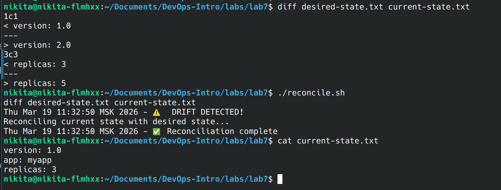
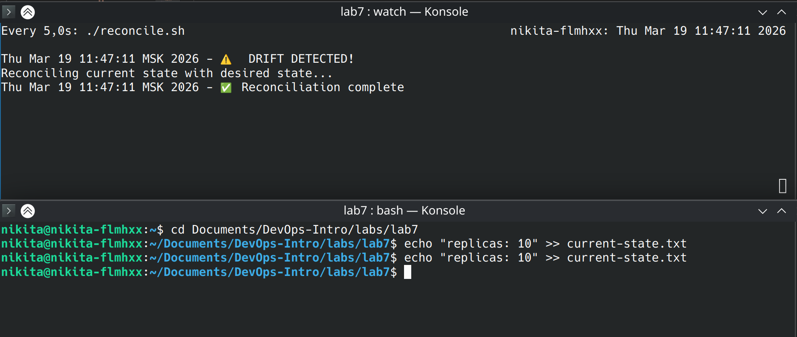

# Lab 7 — GitOps Fundamentals

## Task 1 — Git State Reconciliation 

### 1.1 Desired State Configuration
- **`desired-state.txt`** (source of truth):
  ```
  version: 1.0
  app: myapp
  replicas: 3
  ```
- **`current-state.txt`** after initial synchronization:
  ```
  version: 1.0
  app: myapp
  replicas: 3
  ```

### 1.2 Reconciliation Script
- **`reconcile.sh`** content:
  ```bash
  #!/bin/bash
  # reconcile.sh - GitOps reconciliation loop

  DESIRED=$(cat desired-state.txt)
  CURRENT=$(cat current-state.txt)

  if [ "$DESIRED" != "$CURRENT" ]; then
      echo "$(date) - ⚠️  DRIFT DETECTED!"
      echo "Reconciling current state with desired state..."
      cp desired-state.txt current-state.txt
      echo "$(date) - ✅ Reconciliation complete"
  else
      echo "$(date) - ✅ States synchronized"
  fi
  ```

### 1.3 Manual Drift Detection
- **Command to introduce drift**:
  ```bash
  echo "version: 2.0" > current-state.txt
  echo "app: myapp" >> current-state.txt
  echo "replicas: 5" >> current-state.txt
  ```
- **Reconciliation and fix**:

  

### 1.4 Automated Continuous Reconciliation
- **Continuous loop command**:  
  `watch -n 5 ./reconcile.sh` (run in one terminal)
- **Drift introduced in another terminal**:  
  ```bash
  echo "replicas: 10" >> current-state.txt
  ```
- **Observed output from the watch terminal** 


### Analysis
1. **Explain the GitOps reconciliation loop. How does this prevent configuration drift?**  
   The reconciliation loop continuously compares the current state (what is actually running) with the desired state stored in Git (here, `desired-state.txt`). When a mismatch is detected, the loop automatically applies the desired state, overwriting any manual changes. This prevents drift because any unauthorized or accidental modifications are reverted to the declared configuration within the next reconciliation cycle. In real GitOps tools (like ArgoCD), this same principle keeps Kubernetes clusters in sync with Git repositories.

2. **What advantages does declarative configuration have over imperative commands in production?**  
   Declarative configuration describes the intended end state (e.g., “I want 3 replicas of my app”), not the steps to achieve it. This makes systems idempotent, easier to audit, and more reliable. In production, declarative config reduces human error, enables automated rollbacks, provides a single source of truth that can be version controlled, and allows teams to use Git as the central control plane. Imperative commands, by contrast, are harder to track, prone to drift, and cannot be easily reviewed or rolled back.


## Task 2 — GitOps Health Monitoring

### 2.1 Health Check Script
- **`healthcheck.sh`** content:
  ```bash
  #!/bin/bash
  # healthcheck.sh - Monitor GitOps sync health

  DESIRED_MD5=$(md5sum desired-state.txt | awk '{print $1}')
  CURRENT_MD5=$(md5sum current-state.txt | awk '{print $1}')

  if [ "$DESIRED_MD5" != "$CURRENT_MD5" ]; then
      echo "$(date) - ❌ CRITICAL: State mismatch detected!" | tee -a health.log
      echo "  Desired MD5: $DESIRED_MD5" | tee -a health.log
      echo "  Current MD5: $CURRENT_MD5" | tee -a health.log
  else
      echo "$(date) - ✅ OK: States synchronized" | tee -a health.log
  fi
  ```

### 2.2 Test Health Monitoring
- **Initial healthy state** (after `./reconcile.sh`):
  - Command: `./healthcheck.sh`
  - Output:
    ```
    Thu Mar 19 11:57:10 MSK 2026 - ✅ OK: States synchronized
    ```
- **Introduce drift**:
  ```bash
  echo "unapproved-change: true" >> current-state.txt
  ```
- **Run health check again**:
  - Output:
    ```
    Thu Mar 19 11:57:47 MSK 2026 - ❌ CRITICAL: State mismatch detected!
    Desired MD5: a15a1a4f965ecd8f9e23a33a6b543155
    Current MD5: 48168ff3ab5ffc0214e81c7e2ee356f5
    ```
- **Fix drift with `./reconcile.sh` and verify**:
  - After reconciliation, run `./healthcheck.sh`:
    ```
    Thu Mar 19 11:57:55 MSK 2026 - ✅ OK: States synchronized
    ```
- **Complete `health.log` after these steps**:
  ```
  Thu Mar 19 11:57:10 MSK 2026 - ✅ OK: States synchronized
  Thu Mar 19 11:57:47 MSK 2026 - ❌ CRITICAL: State mismatch detected!
  Desired MD5: a15a1a4f965ecd8f9e23a33a6b543155
  Current MD5: 48168ff3ab5ffc0214e81c7e2ee356f5
  Thu Mar 19 11:57:55 MSK 2026 - ✅ OK: States synchronized
  ```

### 2.3 Continuous Monitoring
- **`monitor.sh`** content:
  ```bash
  #!/bin/bash
  # monitor.sh - Combined reconciliation and health monitoring

  echo "Starting GitOps monitoring..."
  for i in {1..10}; do
      echo -e "\n--- Check #$i ---"
      ./healthcheck.sh
      ./reconcile.sh
      sleep 3
  done
  ```
- **Final `health.log` after the monitoring run**:
  ```
  Thu Mar 19 11:57:10 MSK 2026 - ✅ OK: States synchronized
  Thu Mar 19 11:57:47 MSK 2026 - ❌ CRITICAL: State mismatch detected!
  Desired MD5: a15a1a4f965ecd8f9e23a33a6b543155
  Current MD5: 48168ff3ab5ffc0214e81c7e2ee356f5
  Thu Mar 19 11:57:55 MSK 2026 - ✅ OK: States synchronized
  Thu Mar 19 12:04:26 MSK 2026 - ✅ OK: States synchronized
  Thu Mar 19 12:04:29 MSK 2026 - ✅ OK: States synchronized
  Thu Mar 19 12:04:32 MSK 2026 - ✅ OK: States synchronized
  Thu Mar 19 12:04:35 MSK 2026 - ✅ OK: States synchronized
  ```

### Analysis
1. **How do checksums (MD5) help detect configuration changes?**  
   Checksums provide a unique fingerprint of file contents. Even a tiny change (like adding a space) produces a completely different hash. By comparing the hash of the desired state with the hash of the current state, we can instantly detect drift without reading the whole file line by line. This is efficient and reliable, especially when dealing with large configurations.

2. **How does this relate to GitOps tools like ArgoCD's "Sync Status"?**  
   ArgoCD continuously compares the live state of Kubernetes resources with the manifests stored in Git. It uses mechanisms similar to checksums (e.g., resource versions, diffs) to determine if the cluster is out‑of‑sync. The "Sync Status" (Synced/OutOfSync) in ArgoCD is exactly this kind of health indicator – it tells operators whether the current state matches the desired state defined in Git. The health checks we built mimic this core functionality.