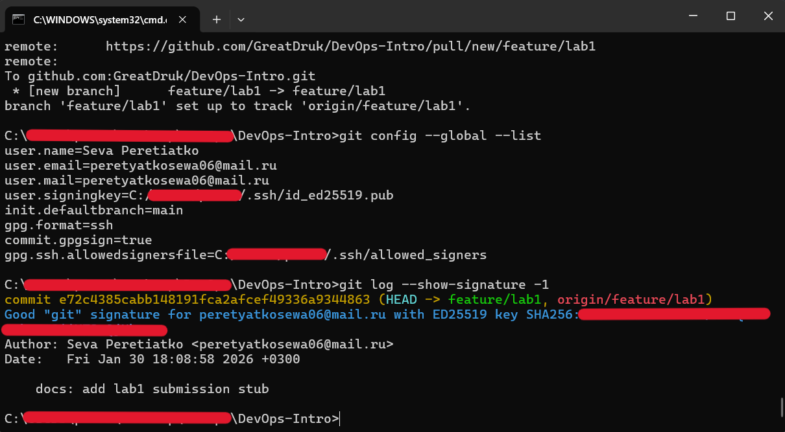
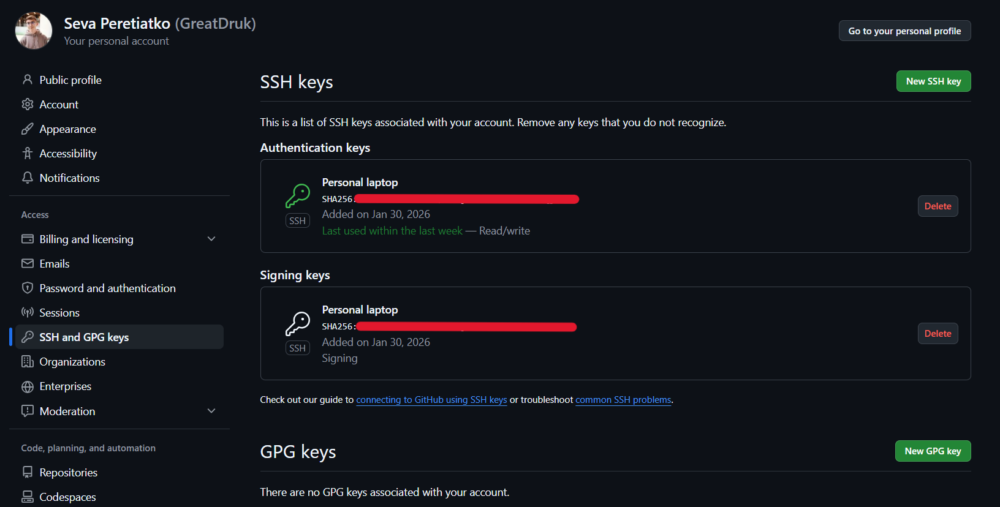

# Lab 1 Submission

## Task 1 - SSH Commit Signature Verification

### Benefits of Signing Commits

Commit signing provides proof of the authenticity and integrity of code changes. A signed commit verifies that the commit was made by the stated author and that the content has not been modified since the signing. This protects against identity spoofing and ensures that the code and its metadata remain unchanged since the commit was signed, providing a verifiable chain of trust.

### SSH Commit Signing Setup

I configured Git to sign commits using an SSH key (`ed25519`). The public SSH key was added to my GitHub account as a **Signing Key**, and Git was configured with `gpg.format=ssh` and automatic commit signing enabled.

A test commit was created using the `-S` flag, and GitHub successfully verified the signature.

### Why is commit signing important in DevOps workflows?

In DevOps workflows, where code moves quickly through CI/CD pipelines, commit signing ensures trust in the software supply chain. Only verified changes from trusted developers can be merged and deployed with confidence, reducing the risk of malicious code entering production and improving auditability.
