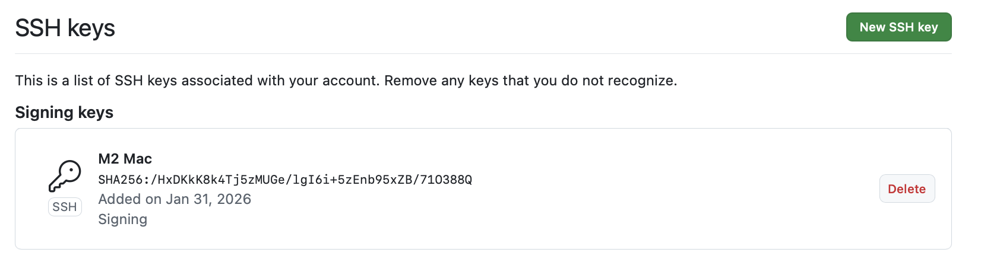
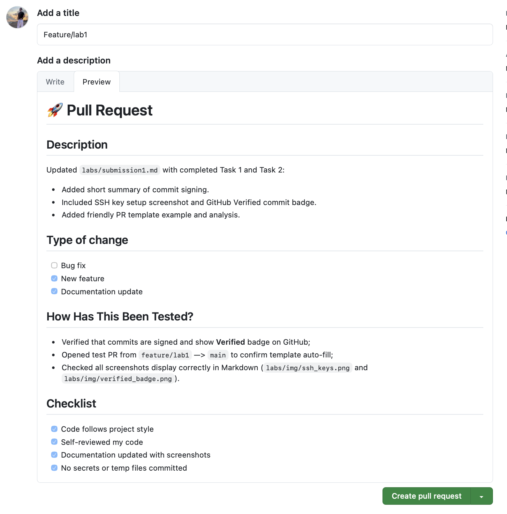
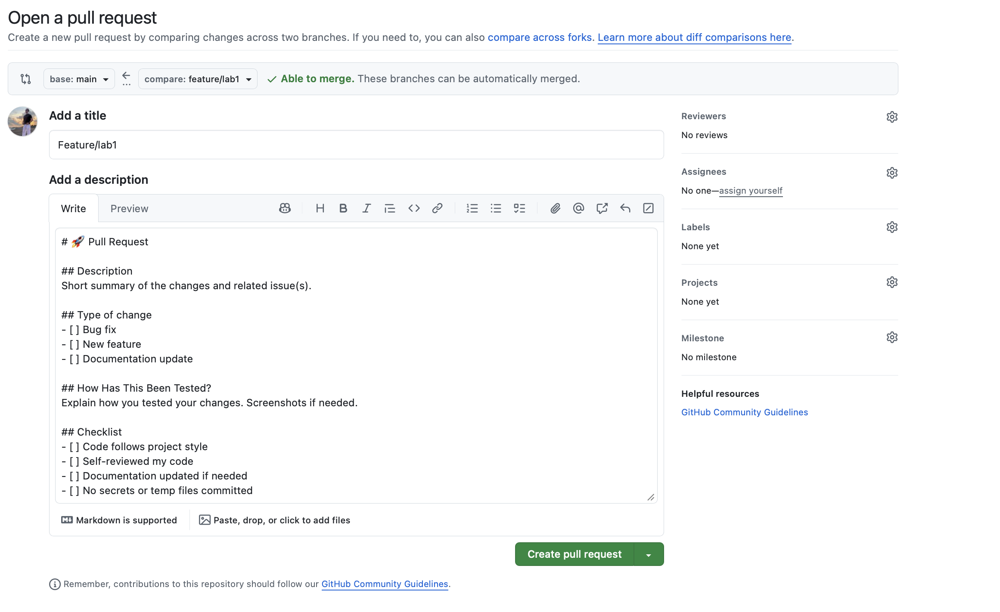

# Lab 1 Submission

## Short Summary

Without commit signing, anyone can fake a commit by setting a name and email, for example pretending to be Yann LeCun. Git will accept it.

With commit signing, this is not possible: without the real private key, the commit cannot be verified and GitHub will mark it as Unverified.

Signing commits proves real authorship and protects commits from being modified.

## Evidence of Signed Commit

The screenshot shows the SSH key added in GitHub. This is required for GitHub to verify signed commits.

The commit is marked as **Verified** on GitHub, confirming that it was signed with a registered SSH signing key.

## Why is commit signing important in DevOps workflows?

Commit signing is important in DevOps because:
- It prevents impersonation: no one can fake a commit using someone else’s name;
- CI/CD pipelines can trust that changes come from real contributors;
- It improves security and auditability of the Git history;
- Branch protection rules can enforce signed commits automatically;
- It helps maintain a secure and trustworthy software supply chain.

## Task 2 — PR Template & Checklist

### Screenshot Evidence

  
The PR template auto-filled correctly in the PR description.

  
The file `.github/pull_request_template.md` exists on the main branch.

### Analysis

Using PR templates improves collaboration because:
- All PRs follow a consistent structure, making it easier for reviewers to find information.
- Reduces human error and missing details in PRs.
- Saves time by providing a ready-to-fill description.
- Helps enforce best practices (e.g., testing, documentation) automatically.

### Challenges Encountered

- Initially, the template did not appear because it was only added in the feature branch.  
- GitHub requires the template to exist on the default branch (`main`) for auto-fill.  
- Opening a new PR after adding the template solved the issue.