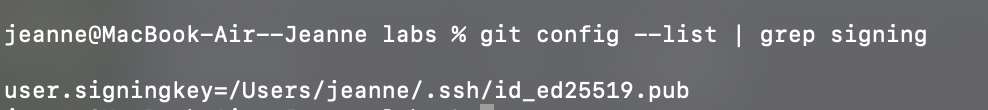
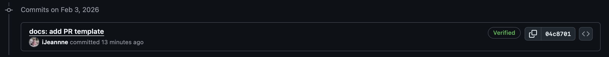
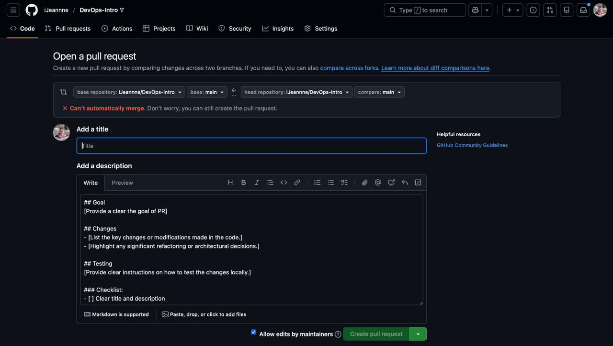

# Lab 1 Submission — Introduction to DevOps & Git Workflow

## Goal
The goal of this lab is to learn the basic Git workflow (fork → branch → PR) and practice secure commit practices by setting up SSH commit signature verification and standardizing collaboration with a PR template.

---

## Task 1: SSH Commit Signature Verification

### 1.1 Importance of Signed Commits
**Why is commit signing important in DevOps workflows?**
Commit signing is crucial for security and trust in a DevOps environment. It allows verification that the code was actually written by the person claimed in the commit author field. This prevents "identity spoofing," where a malicious actor could push bad code pretending to be a trusted developer. It ensures the integrity and authenticity of the codebase.

### 1.2 Evidence of Setup
Below is the configuration showing that Git is set up to use my SSH key for signing.

### 1.3 Signed Commit Verification
I have successfully set up SSH signing. Below is the proof that my commits are marked as "Verified" on GitHub.

---

## Task 2: PR Template & Checklist

### 2.1 PR Template Setup
I created a `.github/pull_request_template.md` file in the `main` branch to standardize all future pull requests.

### 2.2 Template in Action
When I opened a Pull Request from `feature/lab1`, the description field was automatically populated with the template structure.

### 2.3 Analysis
**How do PR templates improve collaboration?**
PR templates ensure consistency across the team. They force every developer to answer key questions (What is the goal? How was it tested?) before asking for a review. This saves time for reviewers because they don't have to guess the context, and the checklist reminds developers of critical steps (like checking for secrets) that might otherwise be forgotten.

---

## Conclusion
I have successfully configured SSH signing and set up a PR template, fulfilling the requirements for a secure and standardized Git workflow.
