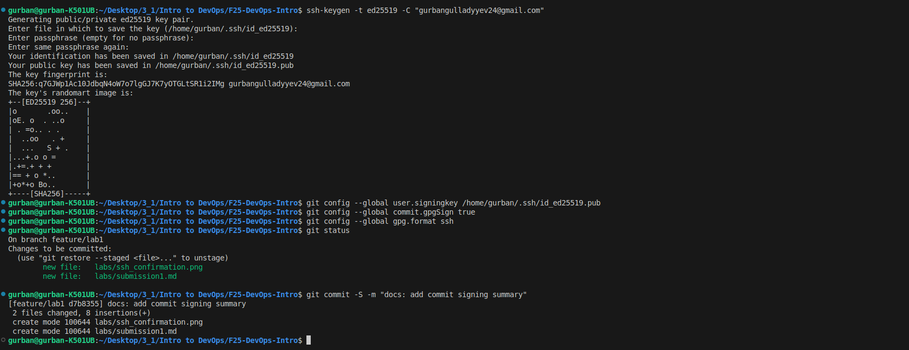
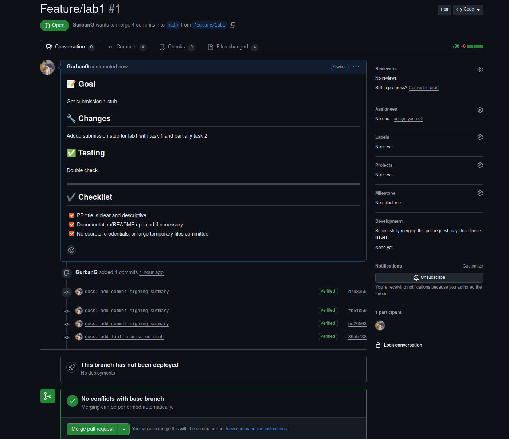

# Lab 1 — Introduction to DevOps & Git Workflow
## 1. SSH Commit Signature Verification
### 1. A short summary explaining the benefits of signing commits.
**The benefits of signed commits:**
- **Authenticity: to ensure that you are the person who authored this commit.**
- **Integity: to ensure that the commit hasn't been tampered with**
### 2. Evidence of successful SSH key setup and signed commit.
- 
### 3. Answer: "Why is commit signing important in DevOps workflows?"
Commit signing is helpful for DevOps workflows because it ensures that code that goes through CI/CD pipeline is written by trusted and verified author. It also adds to accountability, so teams can track who made what change and confirm conde hasn't been altered.
### 4. Screenshots or verification of the "Verified" badge on GitHub.
- 

## 2. PR Template & Checklist
### 1. Screenshot of PR template auto-filling the description.
- 
### 2. Evidence that `.github/pull_request_template.md` exists on main branch.
- 
### 3. Analysis of how PR templates improve collaboration.
**PR template improve collaboration by making pull request more consistent and complete. It enforces different different contributors to use the same structure. This leads to higher-quality contributions and fewer errors.**
### 4. Note any challenges encountered during setup.
- **Mistakenly putting `.github/pull_request_template` in lab1 branch instead of main**