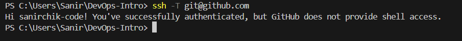
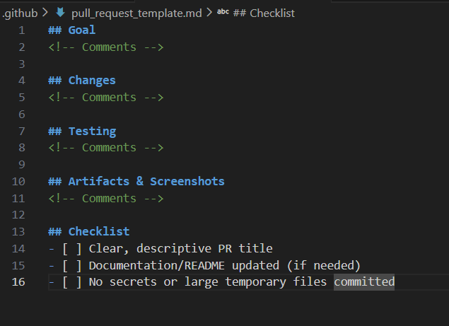

# Задача 1.1: SSH-подпись коммитов
## Краткое объяснение преимуществ подписи коммитов
Подпись коммитов с использованием SSH-ключей обеспечивает несколько важных преимуществ:

- Аутентификация авторства - подтверждает, что коммит действительно сделан владельцем SSH-ключа, а не злоумышленником.

- Целостность данных - гарантирует, что содержимое коммита не было изменено после подписания.

- Невозможность отказа от авторства (non-repudiation) - автор не может отрицать, что сделал коммит.

- Защита от подмены авторства - предотвращает ситуацию, когда кто-то может сделать коммит от вашего имени.

- Повышение доверия в команде - в проектах с открытым исходным кодом позволяет проверять легитимность вкладов.

# Задание 1.2
```
# Generate SSH key
ssh-keygen -t ed25519 -C "email@example.com"

# Configure Git for SSH Signing
git config --global user.signingkey <YOUR_SSH_KEY>
git config --global commit.gpgSign true
git config --global gpg.format ssh

# Test connection to GitHub
ssh -T git@github.com
# Expected response:
# Hi username! You've successfully authenticated, but GitHub does not provide shell access.
```



# Задание 1.3
## Подпись коммитов критически важна в DevOps-процессах по следующим причинам:

- Безопасность цепочки поставок (Supply Chain Security) - обеспечивает отслеживаемость изменений от разработки до продакшена, что особенно важно для compliance-требований (SOC2, GDPR, HIPAA).

- Аудит и соответствие требованиям - позволяет точно определить, кто, когда и какие изменения внес в код, что необходимо для инцидент-менеджмента и расследований.

- Непрерывная интеграция/непрерывное развертывание (CI/CD) - в автоматизированных пайплайнах подписанные коммиты гарантируют, что в сборку попадает только проверенный и авторизованный код.

- Контроль доступа в распределенных командах - в крупных организациях с множеством разработчиков подпись коммитов предотвращает несанкционированные изменения в критических компонентах.

- Доверие в автоматических деплоях - системы автоматического развертывания могут проверять подписи коммитов перед деплоем в прод, снижая риски внедрения вредоносного кода.

- Процесс code review - ревьюеры могут быть уверены, что коммиты действительно сделаны указанными авторами, а не скомпрометированы.

# Задание 1.4


# Задание 2.1




# Задание 2.2


# Задание 2.3
## Основные преимущества шаблонов PR для командной работы:
### 1.Стандартизация коммуникации
- Единый формат для всех PR обеспечивает консистентность

- Предсказуемая структура позволяет ревьюерам быстро находить нужную информацию

- Унификация языка — все используют одинаковые термины и разделы

### 2.Повышение качества ревью
- Полнота информации — обязательные поля (Цель, Изменения, Тестирование) гарантируют, что ревьюер получает весь контекст

- Сокращение времени на уточнения — меньше вопросов "а что это делает?" или "как это тестировалось?"

- Фокус на важном — ревьюер может сразу перейти к анализу кода, а не к выяснению базовой информации

### 3.Улучшение процесса разработки
- Самопроверка автора — заполняя шаблон, разработчик сам проверяет полноту своих изменений

- Чеклисты качества — напоминание о важных аспектах (обновление документации, проверка на секреты)

- Проактивное мышление — разработчик заранее думает о тестировании и документации

### 4.Эффективность для распределенных команд
- Асинхронная работа — ревьюеры в разных часовых поясах получают всю информацию сразу

- Онбординг новых членов команды — шаблон служит обучающим инструментом

- Снижение барьеров входа — новички знают, что именно нужно описать в PR

### 5.Контроль качества и соответствие стандартам
- Автоматическая валидация — можно интегрировать проверку заполнения шаблона в CI/CD

- Соответствие compliance-требованиям — гарантия, что все необходимые аспекты рассмотрены

- Архитектурная согласованность — стандартные разделы помогают следить за архитектурными решениями.
