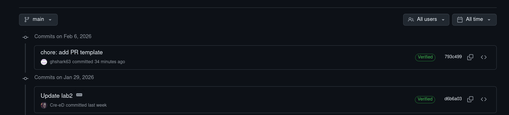
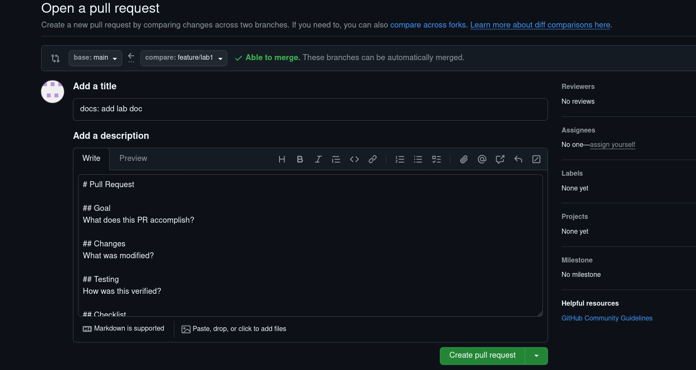

Signed commits are important in DevOps workflows because:
1. **Security**: Prevents unauthorized commits by verifying the committer's identity
2. **Trust**: Ensures the code history hasn't been tampered with
3. **Compliance**: Meets audit requirements for regulated industries
4. **Collaboration**: Verifies contributions in open-source projects
5. **Traceability**: Provides cryptographic proof of authorship

Verified commit:

Pull request template in repo:
`https://github.com/ghshark63/DevOps-Intro/tree/main/.github`

**Template content analysis:**
The template includes:
1. **Structured sections** (Goal, Changes, Testing) for consistent communication
2. **Practical checklist** with essential items for quality control
3. **Additional notes** section for extra context
4. **Concise format** for easy adoption

**How PR templates improve collaboration:**
1. **Consistency**: All PRs follow the same structure
2. **Completeness**: Checklist ensures important items aren't missed
3. **Efficiency**: Reviewers know what to look for
4. **Documentation**: PR description serves as change documentation
5. **Onboarding**: New team members understand expectations

Template pull request:

