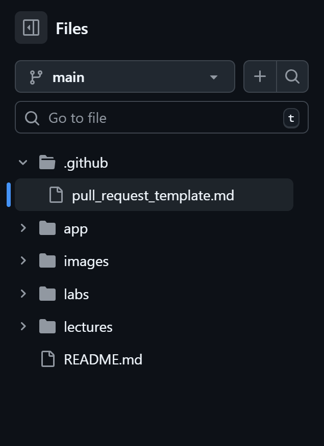
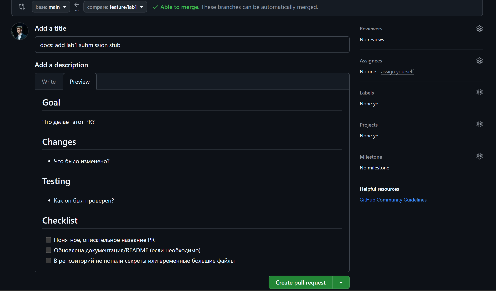

# Лабораторная работа 1 — Подпись коммитов и шаблон PR

## Task 1 — SSH Commit Signature Verification

### 1. Краткое объяснение преимуществ подписанных коммитов

Подписанные коммиты позволяют однозначно подтвердить, что автором изменения является конкретный разработчик, а не кто‑то посторонний, кто знает его имя/email.  
Также подпись защищает от подмены истории: если кто‑то попытается изменить коммит или его автора, подпись станет недействительной, и это будет заметно в системе контроля версий.  
Ещё, в командной работе подписанные коммиты повышают уровень доверия и прозрачности: ревьюеры видят значок **Verified** и понимают, что изменения пришли из доверенного источника.

### 2. Доказательство успешной настройки SSH‑ключа и подписанного коммита
Скриншот привязанного в git SSH-ключа для подписи коммитов

Скриншот подписанных коммитов с verified меткой на GitHub

Этот значок подтверждает, что GitHub распознал подпись коммита, ассоциировал её с моим аккаунтом и считает коммит проверенным.

### 3. Почему подпись коммитов важна в DevOps‑воркфлоу?

Подпись коммитов помогает гарантировать, что код, который отправляется в этом коммите, действительно был создан и одобрен известными участниками команды.  
Это снижает риск внедрения вредоносных изменений: если неизвестный пользователь попытается внести правку без корректной подписи, такие коммиты можно автоматически блокировать или помечать как недоверенные.  
Кроме того, в бигтехах часто следят за изменениями. Подписанные коммиты упрощают отслеживание того, кто и когда внёс конкретное изменение. Это важно для безопасности и разборов инцидентов.

---

## Task 2 — PR Template & Checklist

### 1. Наличие и использование шаблона PR

В репозитории был создан файл `.github/pull_request_template.md` в ветке `main`, чтобы GitHub мог автоматически подставлять шаблон при создании новых pull request.

### 2. Автоматическая подстановка шаблона в описании PR

При открытии PR из ветки `feature/lab1` в ветку `main` моего форка описание PR автоматически заполнилось секциями **Goal**, **Changes**, **Testing** и чек‑листом.

### 3. Как шаблоны PR улучшают командную работу

Шаблоны PR помогают сделать код‑ревью более структурированным и предсказуемым, поскольку каждый PR содержит одни и те же разделы (цель, список изменений, способ тестирования).  
Это уменьшает вероятность того, что автор PR забудет описать важные детали. Тогда ревьюеру не придётся каждый раз задавать одни и те же уточняющие вопросы.  
Чек‑листы в шаблоне напоминают разработчику о базовых нормах (осмысленное название PR, обновление документации, отсутствие сикретов в репозитории). Это повышает качество и безопасность изменений.

### 4. Проблемы в процессе

Изначально залил шаблон с одной опечаткой, хотел сразу поправить её. Но понял, что тогда мне нужно будет вернуться из новой ветки `feature/lab1` назад в ветку `main`, запушить исправление и снова перейти в `feature/lab1`.
В итоге решил, что это не очень осмысленно. Вместо этого я просто запушил поправленный шаблон в ветку `feature/lab1`. А опечатку на этот раз поправил вручную.
В будущем же получается, что в `main` будет лежать уже исправленный шаблон (так как сделал PR) и исправлять вручную уже ничего не придётся.