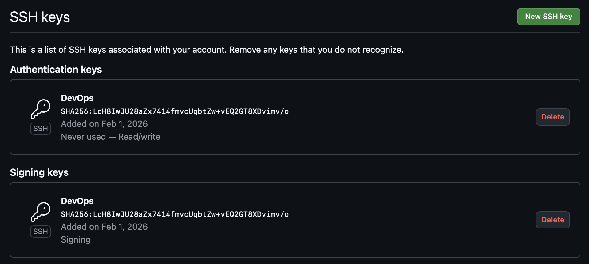
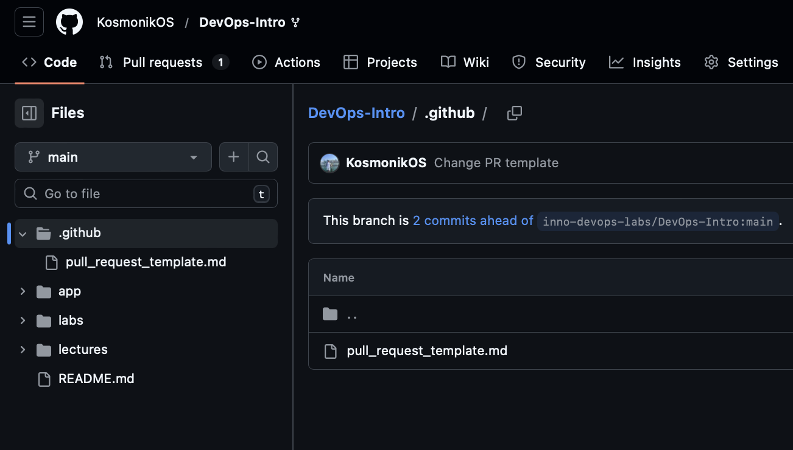
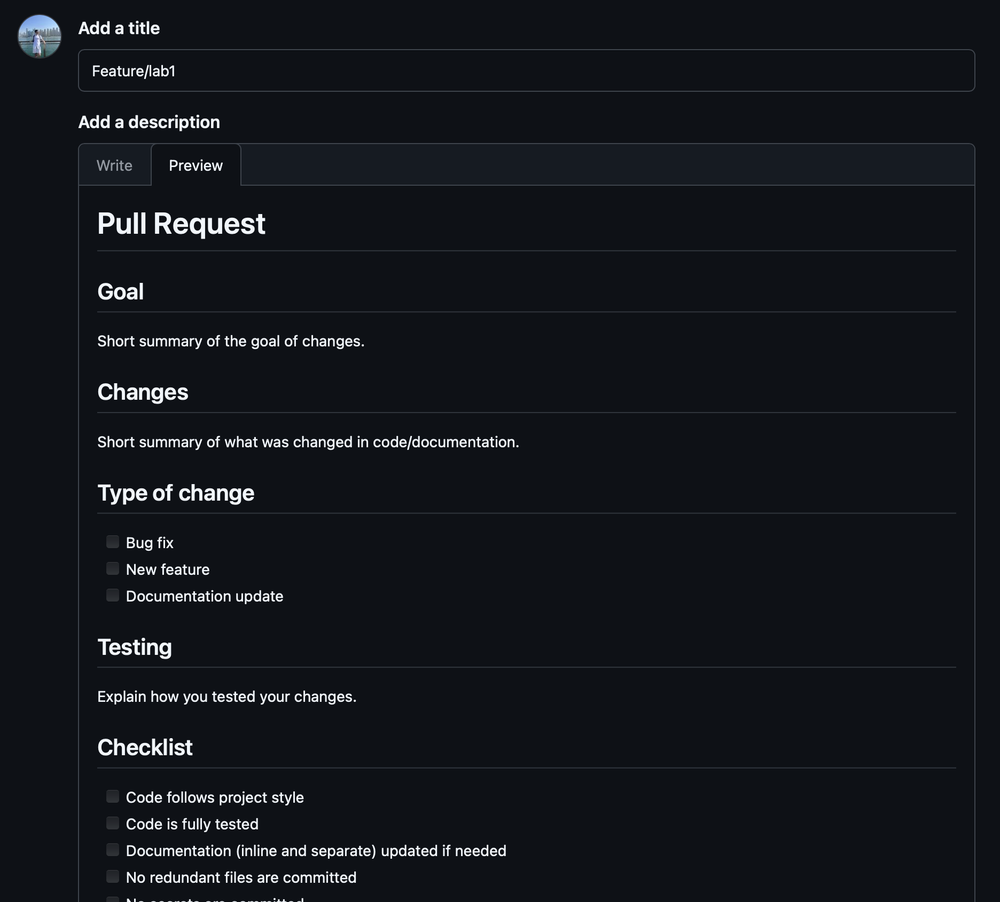
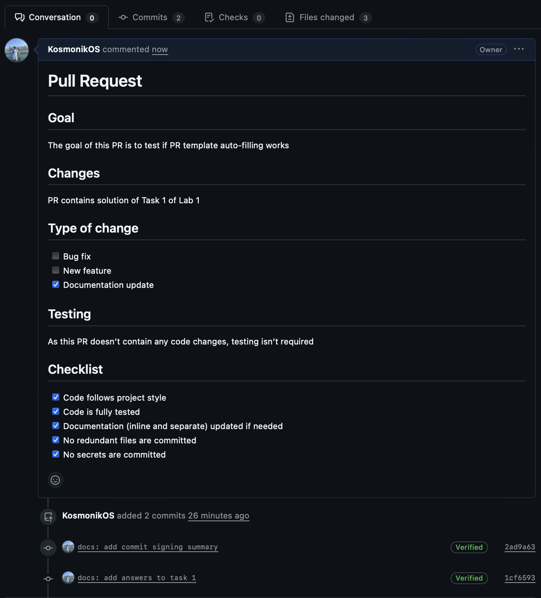

# Lab 1 Submission

## Task 1

### Importance of Signed Commits

Commit signing is important as without it anyone can pretend to be another human by setting a name and email and create fake commits from another person.

Commit signing prevents this by requiring private key to prove real authorship. If no private key isn't provided GitHub will mark it as Unverified.

### Evidence of successful SSH key setup and signed commit

The screenshot shows SSH key added to GitHub for authorization and signing.

The screenshot shows that commit is marked as **Verified** on GitHub.

### Why is commit signing important in DevOps workflows?
- Ensures commits come from trusted developers via digital signatures;
- Tracks exactly who made code changes, aiding audits and debugging in CI/CD pipelines;
- Protects the software supply chain by blocking unsigned commits, reducing risks of malicious code.

## Task 2

### PR Template

This screenshot shows that PR template exists in main branch of fork repository.

The screenshot shows that added PR template is used to auto-fill description.

This screenshot shows created PR with filled sections.

### Why PR Template is beneficial

Using PR templates improves collaboration because:
- PRs follow a consistent structure, making reviewing process easier;
- Remind developers to check changes against repository style and testing policies;
- Provide ready-to-use sections to save time (no need to manually type them every time).

### Challenges Encountered

No challenges were encountered during PR template setup process.