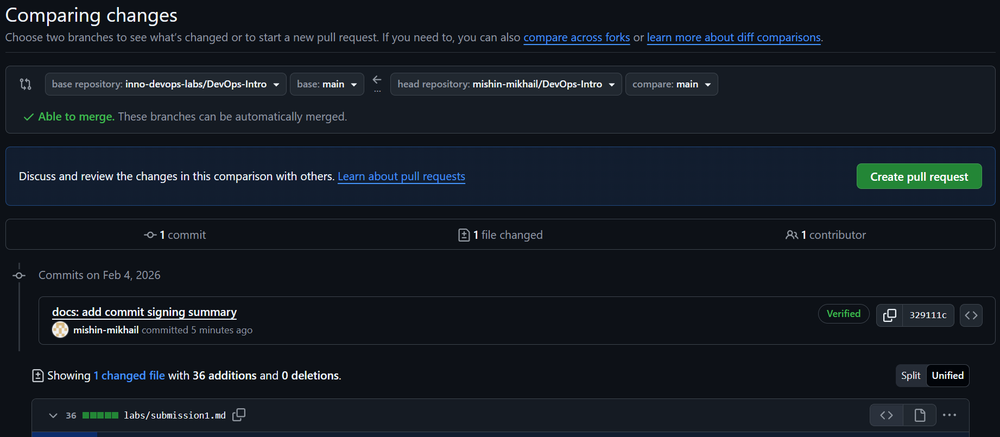
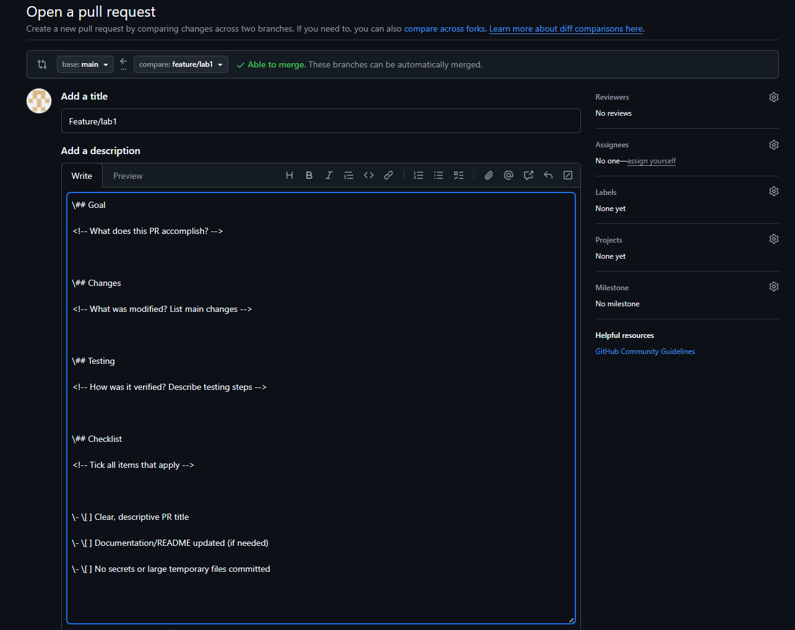

## Task 1
# Short Summary

## Benefits of Signing Commits

Signing commits ensures that all changes in the repository are authentic and made by trusted contributors.  
It helps prevent impersonation, protects code integrity, and increases trust within DevOps teams.

## Evidence of Successful SSH Key Setup and Signed Commit

- An SSH key was generated and added to GitHub.
- Git was configured to sign commits using SSH.
- A signed commit was created and verified on GitHub with a "Verified" badge.

## Why is commit signing important in DevOps workflows?

Commit signing is important in DevOps workflows because it establishes trust, accountability, and security.  
It allows DevOps teams to verify the author of each commit, prevent unauthorized changes, and maintain a reliable audit trail in collaborative environments.

## Task 2: PR Template & Checklist

### Analysis

Templates standardize the review process by reminding developers of necessary checks and helping reviewers quickly understand the nature of changes.

### Challenges
"None"

## Verification

**ALL SCREENSHOTS:** `DevOps-Intro/labs/images`

