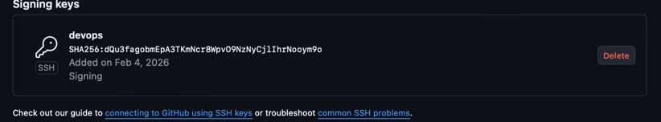

# Lab 1

## Task 1

* A short summary explaining the benefits of signing commits.

Signing your Git commits proves you are the actual author. It attaches a digital signature, generated by your private
key, to the commit itself. This serves several important purposes.

First, it provides verification. It confirms that the commit truly came from you and not someone else using your name
and email address. On platforms like GitHub or GitLab, this is shown with a "Verified" badge next to the commit, making
trusted contributions easy to spot.

Second, it ensures integrity. The signature also confirms that the commit—its code, message, author, and date—has not
been tampered with after you created it. If any part is altered, the verification will fail.

This practice is a cornerstone of software supply chain security, particularly for open-source projects and teams. It
prevents malicious actors from injecting code while pretending to be a trusted contributor. For organizations, it can be
a requirement for security compliance and audit trails, as it creates a non-repudiable record of who changed what and
when.

In short, signing commits is a straightforward technical step that establishes a chain of trust for your code's history.
It moves the project from "this commit claims to be from person X" to "this commit is verified to be from person X."

* Evidence of successful SSH key setup and signed commit.

  
  
*
* Answer: "Why is commit signing important in DevOps workflows?"

  In DevOps workflows, automation plays a huge role. CI/CD pipelines automatically build and deploy code.
  If a hacker impersonates a developer and pushes malicious code, the pipeline might deploy it to production.
  Commit signing prevents this: pipelines can be configured to reject any commits that are not signed by a trusted key.
  This protects the software supply chain.

* Screenshots or verification of the "Verified" badge on GitHub.

  