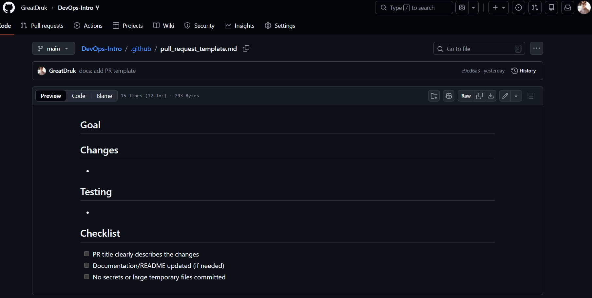
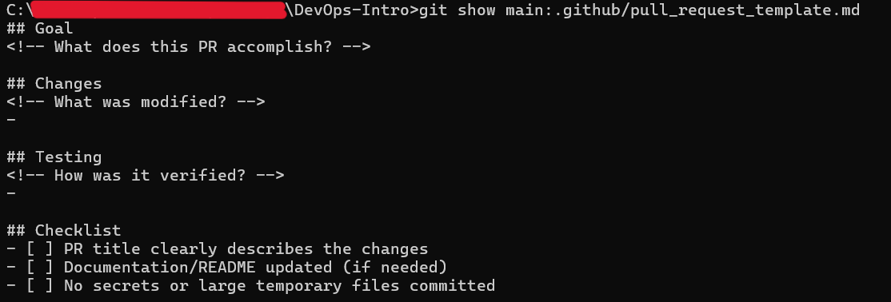
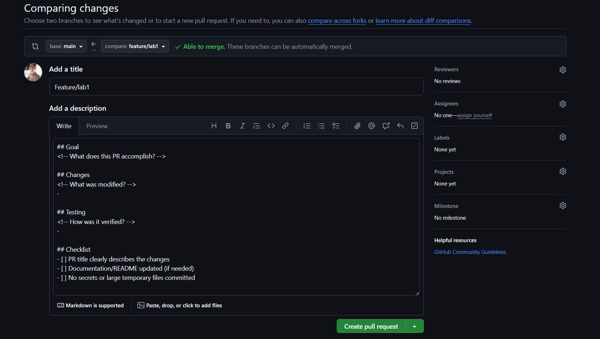

# Lab 1 Submission

## Task 1 - SSH Commit Signature Verification

### Benefits of Signing Commits

Commit signing provides proof of the authenticity and integrity of code changes. A signed commit verifies that the commit was made by the stated author and that the content has not been modified since the signing. This protects against identity spoofing and ensures that the code and its metadata remain unchanged since the commit was signed, providing a verifiable chain of trust.

### SSH Commit Signing Setup

I configured Git to sign commits using an SSH key (`ed25519`). The public SSH key was added to my GitHub account as a **Signing Key**, and Git was configured with `gpg.format=ssh` and automatic commit signing enabled.

A test commit was created using the `-S` flag, and GitHub successfully verified the signature.

### Why is commit signing important in DevOps workflows?

In DevOps workflows, where code moves quickly through CI/CD pipelines, commit signing ensures trust in the software supply chain. Only verified changes from trusted developers can be merged and deployed with confidence, reducing the risk of malicious code entering production and improving auditability.

---

## Task 2: PR Template & Checklist

### Analysis of how PR templates improve collaboration

Pull request (PR) templates improve collaboration by reducing uncertainty and complexity during review. Reviewers do not need to ask basic questions about the purpose or testing of changes, as this information is provided upfront and consistently. Checklists help prevent errors such as missing documentation updates or accidentally including sensitive data. 

In DevOps teams, where reviews need to be quick yet reliable, templates create a predictable and efficient review process that scales well across teams and projects.

### PR Template Setup

A pull request template was created at `.github/pull_request_template.md` on the main branch of my fork. The template includes standardized sections for Goal, Changes, and Testing, along with a short checklist to prevent common mistakes.

### Screenshot of PR template auto-filling the description

### Challenges Encountered

Several difficulties arose during the setup process:

- Distinguishing between Authentication SSH keys and Signing SSH keys on GitHub (I needed to add my key as a "Signing key," not just for authentication).

- Issues with verifying SSH commits, where commits appeared valid locally but were initially marked as "Unverified" on GitHub.

Solving these issues helped clarify how GitHub handles SSH-based commit signing and pull request templates internally.
