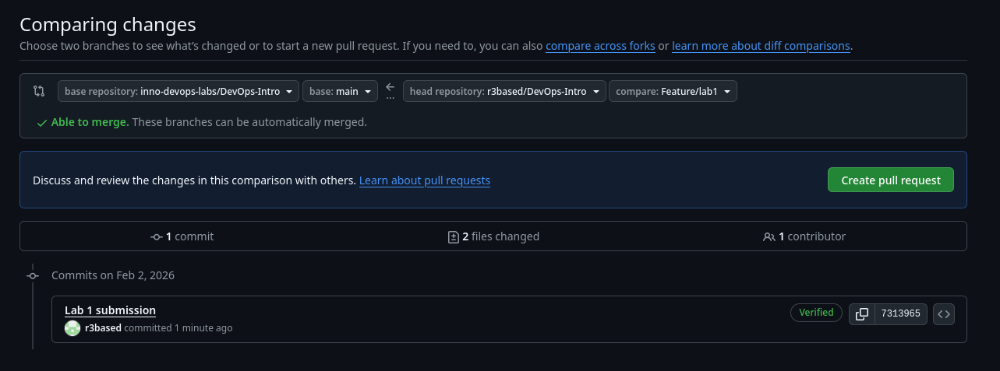
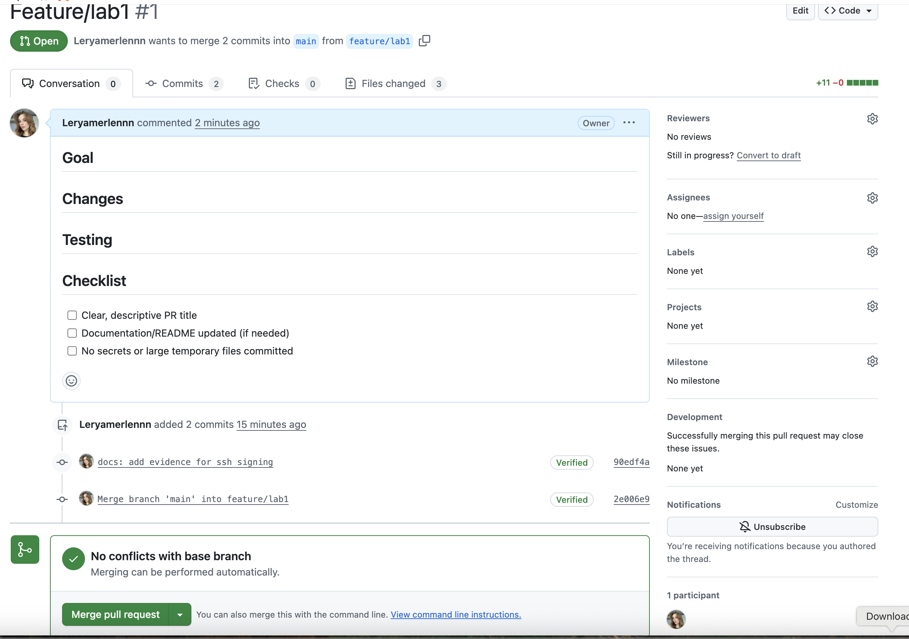

# Lab 1 — Submission

## Task 1 — SSH commit signing

### Benefits of signing commits
- Authenticity: proves who created the commit.
- Integrity: helps detect tampering with commit history.
- Trust in collaboration: reviewers can rely on verified authorship.

### Why is commit signing important in DevOps workflows?
Commit signing increases supply-chain security and accountability: teams can verify that code changes come from trusted identities, which reduces risk of malicious or spoofed commits.

### Evidence: signed + verification
### Evidence

SSH authentication to GitHub was successfully verified using `ssh -T git@github.com`.

A signed commit was created using SSH signing. GitHub shows the commit as **Verified**, and local verification with `git log --show-signature -1` confirms a valid ED25519 signature.

Verification evidence:

## Task 2 — PR template & checklist

### Evidence
- `.github/pull_request_template.md` exists on the `main` branch of my fork.
- Screenshot: PR description was auto-filled when opening a PR from `feature/lab1` to `main` in my fork.

### Analysis
PR templates standardize communication and ensure reviewers always see the goal, changes, and testing steps. The checklist reduces common mistakes and improves review quality.

### Challenges
None.

