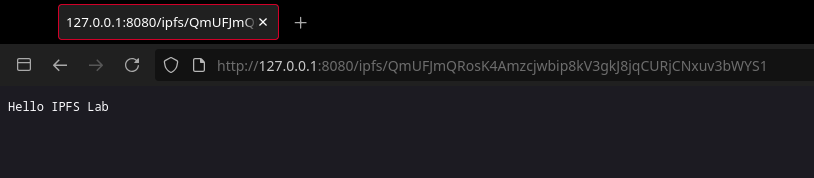
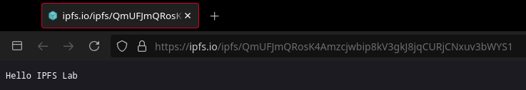
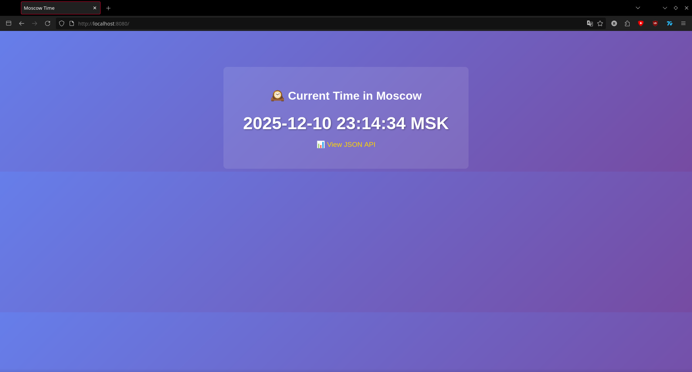

- A short summary explaining the benefits of signing commits.

Signing commits is a way to confirm that the changes were actually made by the original creator and not someone else. Signing adds credibility to the repository's history and helps protect the project from code tampering.

- Evidence of successful SSH key setup and signed commit.
    

- Answer: "Why is commit signing important in DevOps workflows?"

Commit signing is important because DevOps is built on automation, trust, and security. Important: CI/CD security Signed commits reduce the risk of malicious code being injected into pipelines.Change Control: You can check exactly who made the change. Audit and compliance: for companies and projects with compliance (for example, ISO), it is important to have proof of authorship. well, repository protection: so that an attacker does not push changes on behalf of another.

- Screenshots or verification of the "Verified" badge on GitHub.

---

- Screenshot of PR template auto-filling the description.

- Evidence that .github/pull_request_template.md exists on main branch.

- Analysis of how PR templates improve collaboration.
PR templates make pull requests equally clear: the author always specifies the purpose, changes, and testing. This speeds up reviews, reduces the number of questions, and helps remember important checks thanks to the checklist.

- Note any challenges encountered during setup.

GitHub only applies the PR template if the file is in the main branch. Initially, the template was in the feature branch, so autocomplete didn't work. After merging it into main, everything became correct.
