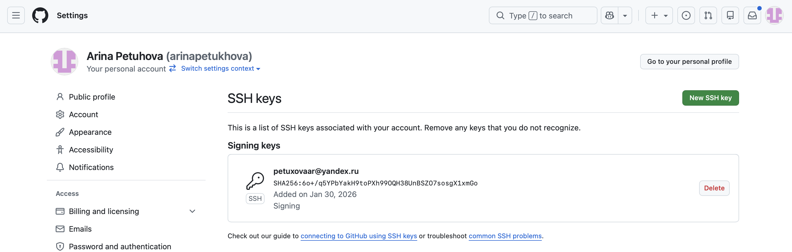
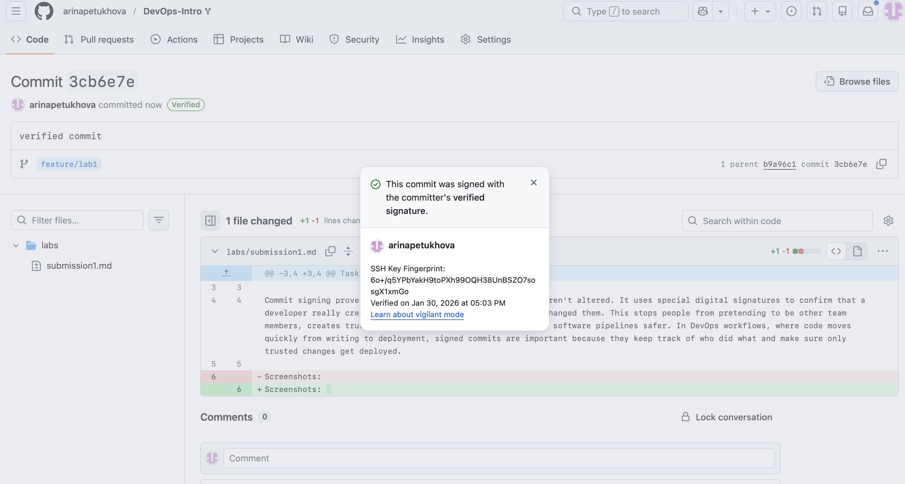
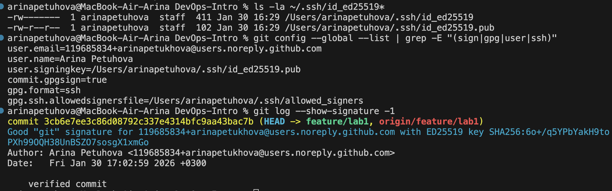
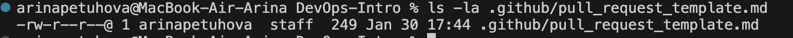
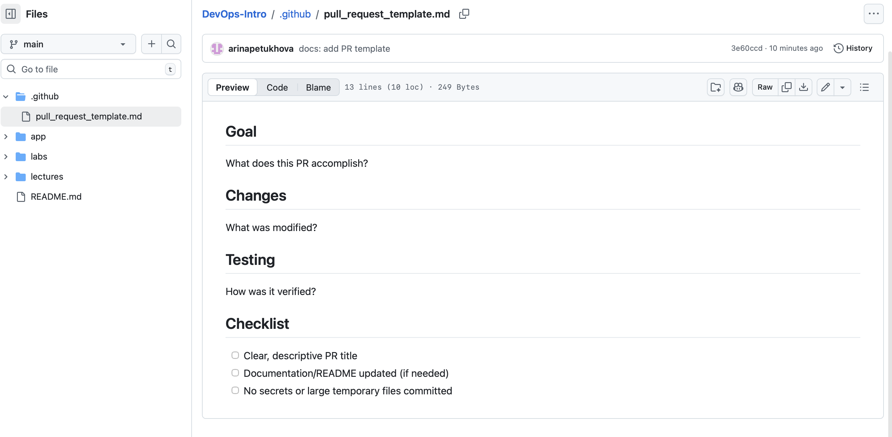
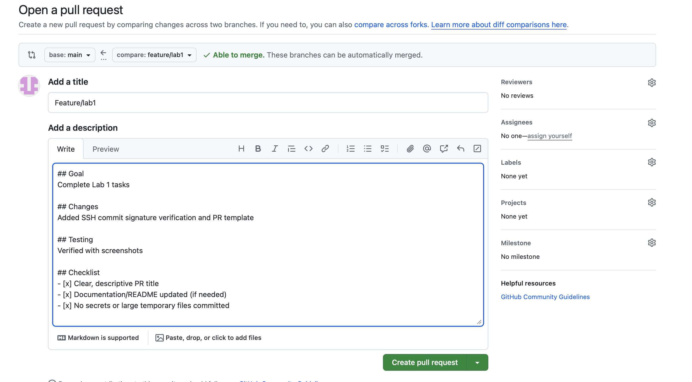
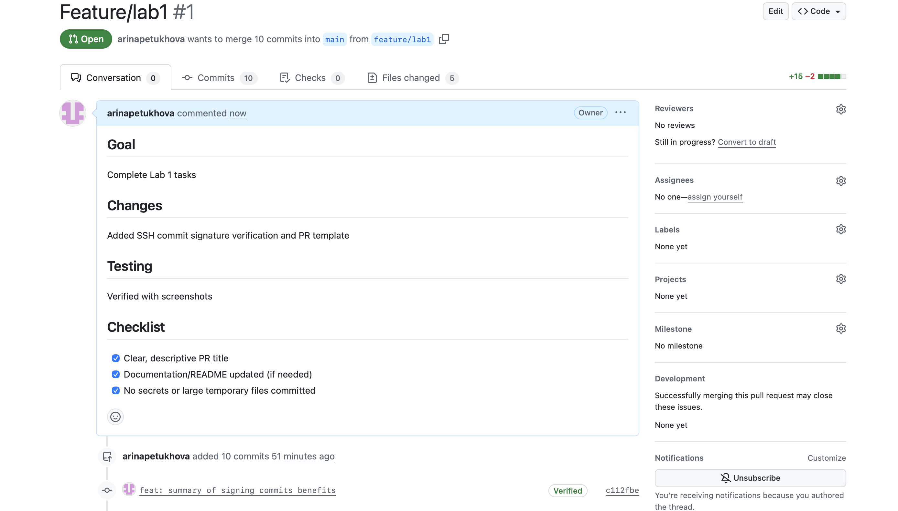

# Lab 1 Submission
## Task 1: SSH Commit Signature Verification

Commit signing proves who made code changes and that they weren't altered. It uses special digital signatures to confirm that a developer really created those commits and nobody secretly changed them. This stops people from pretending to be other team members, creates trust in team projects, and makes automated software pipelines safer. 

In DevOps workflows, where code moves quickly from writing to deployment, signed commits are important because they keep track of who did what and make sure only trusted changes get deployed.

#### Screenshots for Task 1:  

## Task 2: PR Template & Checklist

PR templates make team collaboration smoother and more efficient. By providing a standard structure for every pull request, they ensure that all necessary information is included from the start. When everyone uses the same format with sections like Goal, Changes, and Testing, reviewers know exactly where to look for information instead of going through comments or asking repetitive questions. The checklist also prevents common mistakes, like forgetting to update documentation or accidentally including sensitive files.

Templates saves time and reduces frustration for everyone. New team members can quickly understand what's expected, experienced developers don't waste time on incomplete submissions, and the entire review process becomes more predictable. In fast-paced DevOps workflows where code moves quickly through automated pipelines, these templates create a reliable foundation that helps teams maintain quality while moving fast together.

Several challenges emerged during setup. I initially found the repository structure confusing: understanding that work flows from the course repo to my fork to a feature branch. SSH key setup also required troubleshooting: I had to re-add my key as a "Signing Key" instead of just for authentication. Finally, I learned PR templates must exist on the main branch before they auto-fill, and they serve as empty forms that users complete when opening each PR.

#### Screenshots for Task 2:

