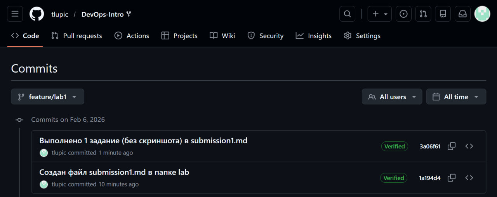
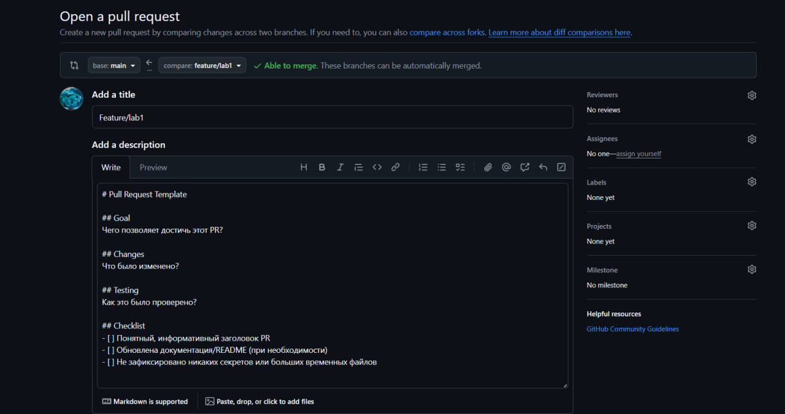
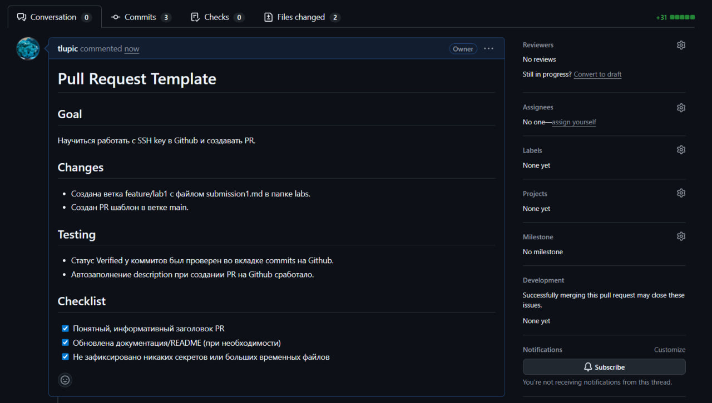

# Lab 1

## Task 1 - SSH Commit Signature Verification

### Что такое подписание commit и почему это важно?
Подпись коммитов нужна для подтверждения того, что изменения действительно
сделаны мной (автором) и не были подделаны. Без этого понижается безопасность работы в команде.

### Доказательства настройки SSH
SSH ключ был создан и добавлен в GitHub как Authentication key. После этого был выполнен коммит и пуш, однако данный коммит помечался как Not Verified. После добавления этого же ключа как Signing Key, у меня получилось одновременно делать pull/push и подписывать коммиты.

Выполненные команды для настройки:
1. Генерация ключа: ssh-keygen -t ed25519 -C "kamilyskaa@yandex.ru"
2. Добавление в ssh-agent: ssh-add ~/.ssh/id_ed25519
3. Настройка git для подписи:
- - git config --global user.signingkey ~/.ssh/id_ed25519.pub
- - git config --global gpg.format ssh
- - git config --global commit.gpgsign true

### Скриншот Verified статуса коммитов

## Task 2 - PR Template & Checklist

### Описание PR-шаблона
Файл pull_request_template.md создан в папке .github в репозитории.  
Шаблон PR содержит секции Goal, Changes, Testing и чеклист из 3 пунктов.

### Скриншот PR с автоматически подставленным шаблоном

### Скриншот созданного PR на странице Fork репозитория

### Как PR-шаблоны улучшают сотрудничество
- Любой сразу видит, зачем сделан PR и что в нём изменилось.  
- Не надо каждый раз объяснять, проверили ли что-то - есть поле Testing.  
- Чеклист помогает не забыть про документацию и безопасные коммиты.

## Трудности
- Работа была сложновата, т.к. раньше мы не работали с Git и GitHub, поэтому потребовалось намного больше времени, чтобы разобраться во всем (особеннно в том, что не написано в лекциях и лабах).
- Файл lab1.md неправильно структурирован: в первом задании говорится работать с веткой и файлом, который создается только на втором задании.
- В лабе не указано, какой SSH ключ нужно создавать на Github (Authentication или Signing). Пришлось самостоятельно искать ответ и оказалось, что необходимо создать и Authentication и Signing key с одним и тем же значением ключа. Также можно было сделать через GPG, но это дольше по времени.