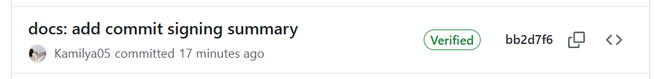

# Lab 1 Submission — Introduction to DevOps & Git Workflow

**Student:** Kamilya Shakirova
**Date:** 06-02-2026

---

## Task 1 — SSH Commit Signature Verification

[X] A short summary explaining the benefits of signing commits.

[X] Evidence of successful SSH key setup and signed commit.

[X] Answer: "Why is commit signing important in DevOps workflows?"

[X] Screenshots or verification of the "Verified" badge on GitHub.

### 1.1 Summary of Commit Signing Benefits

The signature of commits is important because it is a digital signature that confirms that it was I who made the commit and my code was not changed after sending it.

**Why is commit signing important in DevOps workflows?**

In DevOps, processes are automated: code is automatically included in testing, assembly, and production. Signed commits guarantee that no unconfirmed code will leak into the automatic pipeline.


### 1.2 GitHub SSH key
Result:


### 1.3 Make a Signed Commit
```
PS D:\Programs\DevOps-Intro> git add labs/submission1.md
PS D:\Programs\DevOps-Intro> git commit -S -m "docs: add commit signing summary"
[feature/lab1 bb2d7f6] docs: add commit signing summary
 1 file changed, 29 insertions(+)
 create mode 100644 labs/submission1.md
```
Result:



## Task 2 — PR Template & Checklist

[X] Screenshot of PR template auto-filling the description.

[X] Evidence that .github/pull_request_template.md exists on main branch.

[X] Analysis of how PR templates improve collaboration.

[X] Note any challenges encountered during setup.

### 2.1 Create PR Template

PR templates transform pull requests from informal notes to structured, actionable artifacts that streamline collaboration, improve code quality, and accelerate delivery cycles in DevOps teams.

```
PS D:\Programs\DevOps-Intro> git status       
On branch main
Your branch is up to date with 'origin/main'.

nothing to commit, working tree clean
PS D:\Programs\DevOps-Intro> mkdir -Force .github


    Каталог: D:\Programs\DevOps-Intro


Mode                 LastWriteTime         Length Name
----                 -------------         ------ ----
d-----        06.02.2026     18:38                .github


PS D:\Programs\DevOps-Intro> git add .github/pull_request_template.md
PS D:\Programs\DevOps-Intro> git commit -m "chore: add PR template"
[main 54bd17f] chore: add PR template
 1 file changed, 14 insertions(+)
 create mode 100644 .github/pull_request_template.md
PS D:\Programs\DevOps-Intro> git push origin main
```

### 2.2 Create Lab Branch and Open PR
```
PS D:\Programs\DevOps-Intro> git checkout -b feature/lab1
Switched to a new branch 'feature/lab1'
PS D:\Programs\DevOps-Intro> git status
On branch feature/lab1
nothing to commit, working tree clean
PS D:\Programs\DevOps-Intro> New-Item -Path labs/submission1.md -ItemType File


    Каталог: D:\Programs\DevOps-Intro\labs


Mode                 LastWriteTime         Length Name
----                 -------------         ------ ----
-a----        06.02.2026     18:40              0 submission1.md


PS D:\Programs\DevOps-Intro> git add labs/submission1.md
PS D:\Programs\DevOps-Intro> git commit -S -m "docs: add commit signing summary"
[feature/lab1 bb2d7f6] docs: add commit signing summary
 1 file changed, 29 insertions(+)
 create mode 100644 labs/submission1.md
```

### 2.3 Verify Template Application

