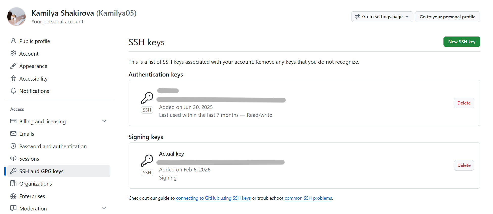

# Lab 1 Submission — Introduction to DevOps & Git Workflow

**Student:** Kamilya Shakirova
**Date:** 06-02-2026

---

## Task 1 — SSH Commit Signature Verification

[X] A short summary explaining the benefits of signing commits.

[X] Evidence of successful SSH key setup and signed commit.

[X] Answer: "Why is commit signing important in DevOps workflows?"

[X] Screenshots or verification of the "Verified" badge on GitHub.

### 1.1 Summary of Commit Signing Benefits

The signature of commits is important because it is a digital signature that confirms that it was I who made the commit and my code was not changed after sending it.

**Why is commit signing important in DevOps workflows?**

In DevOps, processes are automated: code is automatically included in testing, assembly, and production. Signed commits guarantee that no unconfirmed code will leak into the automatic pipeline.

### 1.2 GitHub SSH key
Result:

