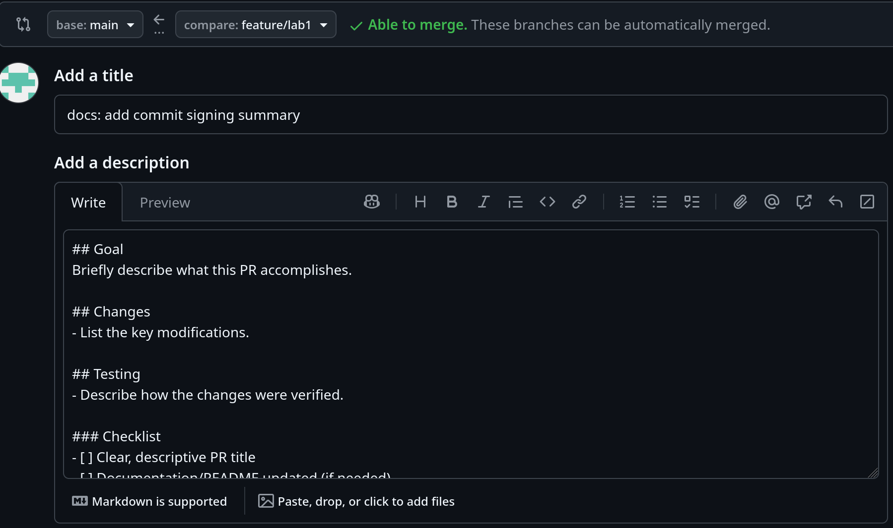

# Lab 1 submission

## Task 1

### A short summary explaining the benefits of signing commits. 

Signing commits allows to verify that commit was made my authorized and trusted user. That helps to insure that account was not stolen (if keys were not also stolen) and code was pushed by known user.

### Evidence of successful SSH key setup and signed commit.

Output of `ssh -T git@github.com`: 

`Hi I-y6o-I! You've successfully authenticated, but GitHub does not provide shell access.`. 

Signed commit
```
commit 7468b083b3d3f2937576a5321f3017911174ae2c (HEAD -> feature/lab1, origin/feature/lab1)
Good "git" signature for mailkirill17@gmail.com with ED25519 key SHA256:9gRW7LX6eDoBr58XqIPU0iw9rclmQ2oNIObmLaVKvYg
Author: |-y6o-| <mailkirill17@gmail.com>
Date:   Fri Feb 6 16:17:27 2026 +0300

    docs: add commit signing summary
```

### Why is commit signing important in DevOps workflows?

As mentioned before signed commits allow to prevent unauthorized or malicious code from entering the pipeline. In devops pipelines that ensures the authenticity of code changes as they move through automated pipelines.

### Screenshots or verification of the "Verified" badge on GitHub

```
This commit was signed with the committer's verified signature.
I-y6o-I
SSH Key Fingerprint: 9gRW7LX6eDoBr58XqIPU0iw9rclmQ2oNIObmLaVKvYg
Verified on Feb 6, 2026, 04:17 PM
```

## Task 2

### Screenshot of PR template auto-filling the description


### Evidence that `.github/pull_request_template.md` exists on main branch.


### Analysis of how PR templates improve collaboration.
PR templates standardize how changes are presented and reviewed, which helps teams to quickly focus on main changes and scope of new code. Also that helps to develop automated instruments, for example PR messages parser. Moreover, checklists help catch common issues early, e.g missing docs. 

### Challenges encountered during setup.
Uploading screenshots)
