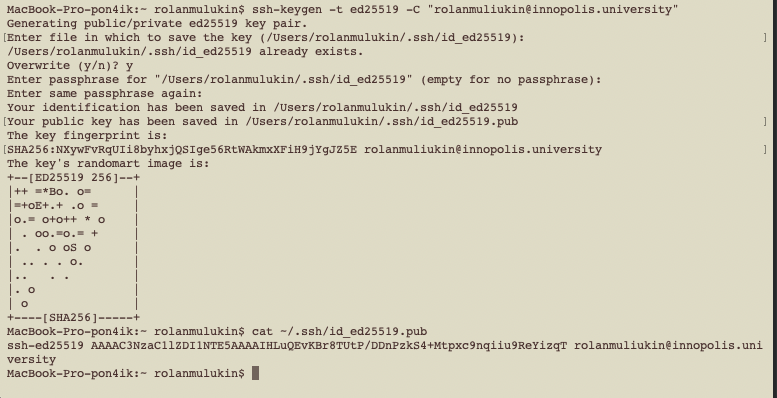
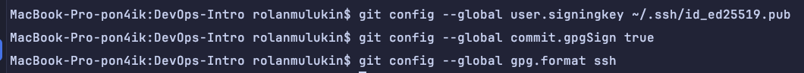
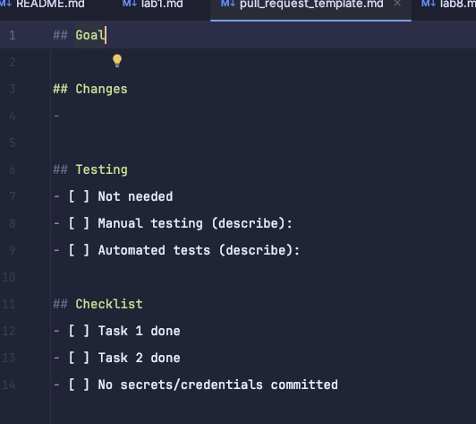
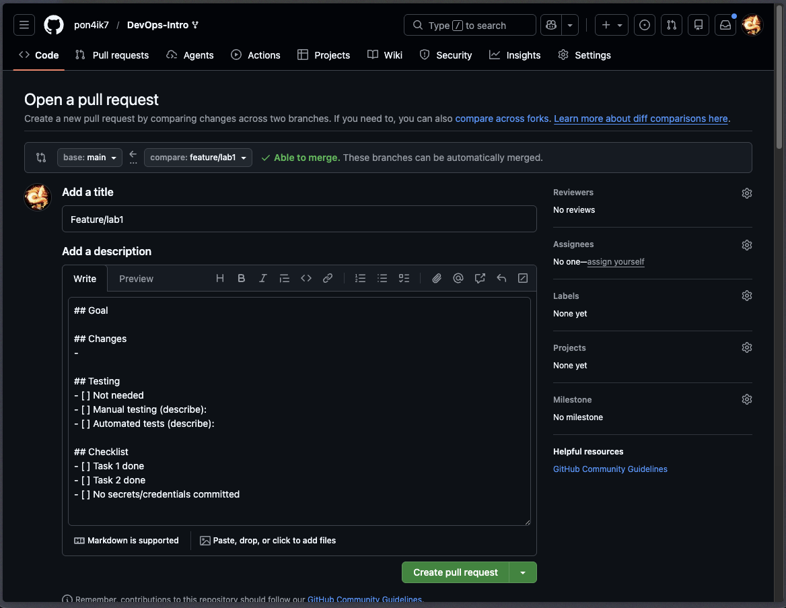

# Rolan Muliukin Lab 1 submission

## Task 1

- I create my SHH key for this Mac

```bash
ssh-keygen -t ed25519 -C "rolanmuliukin@innopolis.university"
```



- And put this key into my git `user.signingkey`



- After I create this file, and make the commit. Also I add `ssh.pub` on git  and get `Verified`


### Commit signing adds a cryptographic signature to a commit, which proves two things:
1.	Authenticity: the commit was created by the holder of the private SSH key (it’s much harder to impersonate an author).
2.	Integrity: if the commit content changes after signing, the signature becomes invalid, so tampering is detectable.

## Task 2

- I create file `.github/pull_request_template.md` on my `main` brunch


- And add this template 



- Now I check It is apply to my PR



And how you can see this template apply to my PR

PR templates standardize PR descriptions so reviewers always receive the same key information (goal, changes, testing). This reduces back-and-forth questions, speeds up reviews, and improves consistency across the team. A checklist also prevents missing steps (e.g., testing, security checks, documentation).


