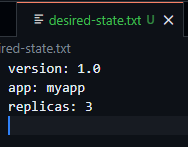

Answer: "Why is commit signing important in DevOps workflows?"
Summary of Benefits:
Signing commits cryptographically proves that each change originated from a trusted, specific developer. Using a GPG, SSH, or S/MIME key, it creates a verifiable signature attached to the commit. This process guarantees the integrity of the code history, ensuring that commits have not been tampered with after the fact and providing strong authentication of the author's identity. On platforms like GitHub, verified signatures are prominently marked, adding a layer of trust and transparency to the project's history.

Importance in DevOps:
In DevOps workflows, commit signing is crucial for security and compliance, particularly in automated CI/CD pipelines. It enforces a strong chain of custody for code changes, allowing automated systems to verify that each deployment originates from an authenticated source and has not been maliciously altered. This prevents unauthorized code from being promoted through the pipeline, directly supporting security requirements, and the principle of least privilege in collaborative environments.

Evidence of commiting via ssh:

Able to pull request 

