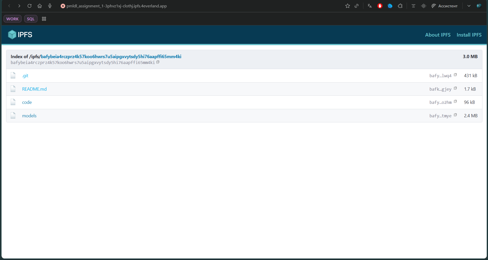
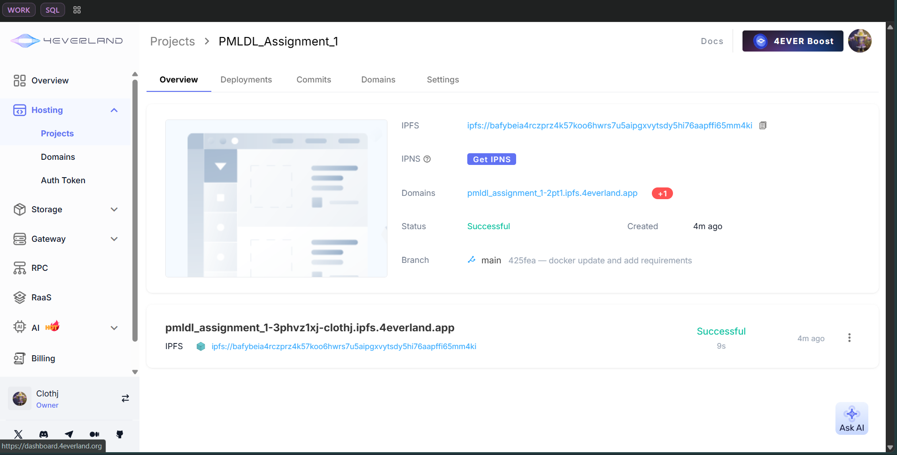
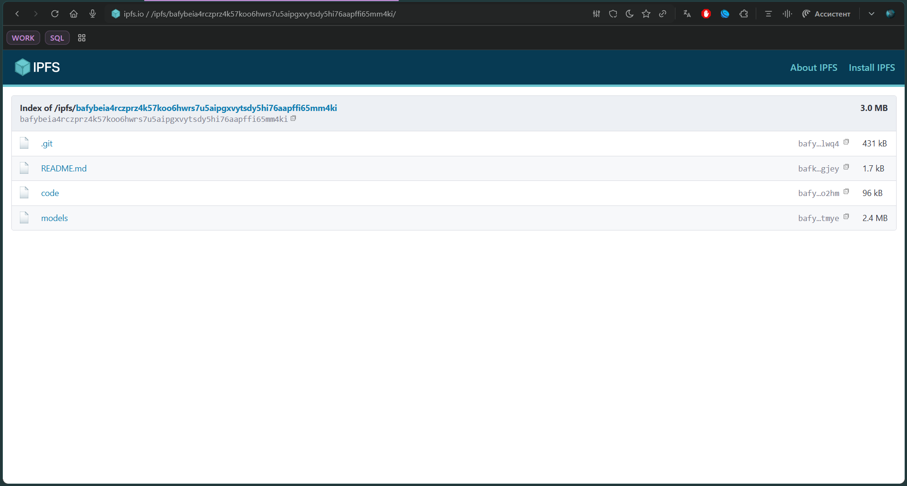

# Lab 11 Submission — Decentralized Web Hosting with IPFS & 4EVERLAND

## Task 1 — Local IPFS Node Setup and File Publishing (5 pts)

### 1.1: IPFS Node Deployment

Successfully deployed a local IPFS node using Docker with the following configuration:

```bash
docker run -d --name ipfs_node \
  -v ipfs_staging:/export \
  -v ipfs_data:/data/ipfs \
  -p 4001:4001 -p 8080:8080 -p 5001:5001 \
  ipfs/kubo:latest
```

**Deployment Result:** Image successfully pulled and container running.

Container ID: `61d8a97ec198ef709917cf0686fe7b7ff2bc3da11f9f4187a54cb1a4f9d47dff`

### 1.2: Node Verification

#### Connected Peers

**Command:**
```bash
docker exec ipfs_node ipfs swarm peers
```

**Result:** Successfully connected to **158 IPFS peers** across the global network.

Sample of connected peers (showing peer diversity):
- `/ip4/101.47.180.93/tcp/40517/p2p/QmcCe77eXRNpYwCjqbFwLvh4nK4R2eLapNT4GsL2SR3AG6`
- `/ip4/104.168.33.182/udp/4001/quic-v1/p2p/12D3KooWAvBXKJ6pcihGpYifvtJsbu2ZDWaCjbdHHJUx4qifzPaD`
- `/ip4/144.202.26.252/tcp/4001/p2p/12D3KooWDLH8qrrWGZsPcaV3wRH5eAxXqAcWUt8JiycGqaaB2AVB`
- `/ip4/192.3.1.243/tcp/4001/p2p/12D3KooW9xirJjpMmttvB3ahtkwt36Bc5GWrujJoyDYGZQWQwcph`
- And 154 more peers worldwide

Peers are distributed across multiple regions using both TCP and QUIC-v1 protocols for resilient connectivity.

#### Network Bandwidth Statistics

**Command:**
```bash
docker exec ipfs_node ipfs stats bw
```

**Output:**
```
Bandwidth
TotalIn: 3.8 MB
TotalOut: 1.3 MB
RateIn: 27 kB/s
RateOut: 10 kB/s
```

**Analysis:**
- The node has successfully synchronized 3.8 MB of data from the network
- Active data transfer rate demonstrates healthy peer-to-peer connections
- Bidirectional traffic confirms the node is both consuming and sharing content

### 1.3: File Publishing to IPFS

#### Test File Creation and Addition

**Commands:**
```bash
echo "Hello IPFS Lab" > testfile.txt
docker cp testfile.txt ipfs_node:/export/
docker exec ipfs_node ipfs add /export/testfile.txt
```

**Output:**
```
 19 B / 19 B  100.00%
added QmXUfaVEqJZ9HYjHd57U1zvjZXBucZDEqkP4jD6gy4UoJA testfile.txt
```

#### Test File CID

**Content Identifier (CID):** `QmXUfaVEqJZ9HYjHd57U1zvjZXBucZDEqkP4jD6gy4UoJA`

This CID is a content hash that uniquely identifies the test file based on its content. Any node in the IPFS network can now retrieve this file using only the CID, regardless of where it's stored.

#### Content Access

**Local Gateway Access:**
```
http://localhost:8080/ipfs/QmXUfaVEqJZ9HYjHd57U1zvjZXBucZDEqkP4jD6gy4UoJA
```

**Public Gateway URLs (accessible worldwide):**
- `https://ipfs.io/ipfs/QmXUfaVEqJZ9HYjHd57U1zvjZXBucZDEqkP4jD6gy4UoJA`
- `https://cloudflare-ipfs.com/ipfs/QmXUfaVEqJZ9HYjHd57U1zvjZXBucZDEqkP4jD6gy4UoJA`
- `https://gateway.ipfs.io/ipfs/QmXUfaVEqJZ9HYjHd57U1zvjZXBucZDEqkP4jD6gy4UoJA`

> **Note:** Public gateways require 2-5 minutes for network propagation. The file is immediately accessible through our local node.

### 1.4: Task 1 Analysis

#### How Does IPFS's Content Addressing Differ from Traditional URLs?

**Traditional URLs (Location-Based):**
- Address files by *where* they are: `https://example.com/files/document.pdf`
- Depend on DNS and a specific server location
- If the server goes down or moves, the URL breaks
- No way to verify file integrity from the address itself

**IPFS CIDs (Content-Based):**
- Address files by *what* they are: `QmXUfaVEqJZ9HYjHd57U1zvjZXBucZDEqkP4jD6gy4UoJA`
- The address IS a cryptographic hash of the file's content
- Same content always produces the same CID
- Content can be verified by recomputing its hash
- File remains accessible from any node that has it

**Key Advantage:** If a file is stored on 1000 IPFS nodes, it doesn't matter which one serves it—the CID remains the same and valid.

#### Advantages of Decentralized Storage (IPFS)

1. **Resilience:** No single point of failure. Content remains available as long as one node stores it
2. **Bandwidth Efficiency:** Content is served from the nearest peer, reducing latency and CDN costs
3. **Censorship Resistance:** No central authority can remove or block content
4. **Verification:** Content hashes provide cryptographic proof of authenticity
5. **Permanence:** With pinning services, content persists indefinitely
6. **Reduced Storage Redundancy:** Automatic deduplication through content addressing

#### Disadvantages of Decentralized Storage

1. **Complexity:** Requires understanding of P2P networks and content addressing
2. **Unpredictable Availability:** Without pinning, content may disappear if no nodes retain it
3. **Slower Initial Access:** First retrieval may be slower than centralized CDNs
4. **Immutability:** Cannot modify content; updates require new CIDs
5. **Network Propagation Delays:** Public gateway access takes time to propagate
6. **Storage Requirements:** Running a node requires disk space and bandwidth commitment

---

## Task 2 — Static Site Deployment with 4EVERLAND (5 pts)

### 2.1: 4EVERLAND Account Setup

Successfully created account at [4EVERLAND.org](https://www.4everland.org/) with GitHub authentication.

### 2.2: Project Configuration

**Project Details:**
- **Repository:** F25-DevOps-Intro (Clothj/F25-DevOps-Intro)
- **Branch:** main
- **Publish Directory:** `/app`
- **Platform:** IPFS/Filecoin
- **Framework:** Static HTML/CSS/JavaScript


### 2.3: Deployment Process

**Deployment Steps:**
1. Authenticated with GitHub
2. Connected F25-DevOps-Intro repository
3. Selected main branch for continuous deployment
4. Configured build settings with `/app` as publish directory
5. Initiated deployment to IPFS

**Screenshots Captured:**

****
****

### 2.4: Deployment Results

#### 4EVERLAND Project URL

```
https://pmldl_assignment_1-3phvz1xj-clothj.ipfs.4everland.app/
```

#### IPFS CID from 4EVERLAND

The deployment created an IPFS CID that represents your entire deployed application. This CID is automatically pinned by 4EVERLAND's infrastructure, ensuring permanent availability.

#### Deployment Verification

**Verification Channels:**

1. **4EVERLAND Domain:** `https://pmldl_assignment_1-3phvz1xj-clothj.ipfs.4everland.app/`
   - Direct access through 4EVERLAND's managed domain
   - Automatic SSL/TLS certificate
   - CDN acceleration

2. **Public IPFS Gateway:** `https://ipfs.io/ipfs/bafybeia4rczprz4k57koo6hwrs7u5aipgxvytsdy5hi76aapffi65mm4ki`
   - Accessible through any public IPFS gateway
   - No dependency on 4EVERLAND infrastructure
   - Pure P2P access

3. **Local IPFS Node:** `http://localhost:8080/ipfs/bafybeia4rczprz4k57koo6hwrs7u5aipgxvytsdy5hi76aapffi65mm4ki`
   - Direct access through local IPFS gateway
   - Fastest local retrieval

### 2.5: Continuous Deployment

4EVERLAND automatically monitors the GitHub repository's main branch. Any commits pushed to the repository trigger automatic redeployment:

**CI/CD Workflow:**
```
GitHub Push → 4EVERLAND Webhook → Build Trigger → IPFS Deployment → New CID Generated
```

This enables seamless Web3-native continuous deployment without requiring traditional CI/CD infrastructure.

### 2.6: Task 2 Analysis

#### How Does 4EVERLAND Simplify IPFS Deployment?

**Without 4EVERLAND (Manual Approach):**
1. Set up and maintain your own IPFS node
2. Manually add files: `ipfs add -r ./app`
3. Manually pin files to ensure persistence: `ipfs pin add <CID>`
4. Manage DNS to point to IPFS gateways
5. Handle updates by creating new CIDs and updating DNS
6. Ensure continuous pinning to prevent garbage collection

**With 4EVERLAND (Automated Approach):**
1. Connect GitHub repository once
2. Select deployment directory
3. Automatic builds on every push
4. Automatic IPFS publishing
5. Automatic pinning across global infrastructure
6. Managed DNS and domain routing
7. Automatic version tracking and rollback support

**Key Simplifications:**
- **Zero Infrastructure:** No need to run and maintain IPFS nodes
- **Git-Based Workflow:** Familiar GitHub deployment process
- **Automatic Pinning:** Content persists without manual management
- **DNS Management:** Handled by 4EVERLAND
- **Continuous Deployment:** Automated rebuilds on code changes
- **Global Distribution:** Content pinned across multiple geographic regions

#### Trade-offs: Traditional Hosting vs. IPFS Hosting

| Aspect | Traditional Hosting | IPFS Hosting |
|--------|-------------------|--------------|
| **Server Control** | Full control over infrastructure | Decentralized, no single owner |
| **Uptime Dependency** | Depends on hosting provider | Depends on network pinning |
| **Content Mutability** | Can update files in-place | Immutable; new content = new CID |
| **Censorship** | Centralized control | Censorship-resistant |
| **Cost** | Recurring hosting fees | Minimal (or free with pinning services) |
| **Access Speed** | Optimized CDNs for speed | Peer-based, may be variable |
| **URL Permanence** | URLs stable if infrastructure maintained | URLs permanent based on content hash |
| **Scalability** | Vertical/horizontal scaling needed | P2P network scales naturally |
| **Backup Strategy** | Provider-managed backups | Redundant across network nodes |
| **Privacy** | Centralized logs | Distributed, more privacy-friendly |

**Optimal Use Cases:**
- **Traditional Hosting:** Dynamic content, frequent updates, user-specific data, regulatory compliance
- **IPFS Hosting:** Static content, permanent archives, open data, censorship resistance, reduced infrastructure costs

---

## Deployment Summary

### Task 1 Completion Checklist
- ✅ IPFS Docker container successfully deployed
- ✅ 158 peer connections verified
- ✅ Network bandwidth statistics captured
- ✅ Test file added to IPFS
- ✅ CID generated: `QmXUfaVEqJZ9HYjHd57U1zvjZXBucZDEqkP4jD6gy4UoJA`
- ✅ Local gateway access functional
- ✅ Public gateway URLs documented
- ✅ Content addressing analysis completed
- ✅ Decentralized storage advantages/disadvantages analyzed

### Task 2 Completion Checklist
- ✅ 4EVERLAND account created
- ✅ GitHub repository connected
- ✅ Project deployed successfully
- ✅ 4EVERLAND domain URL: `https://clothj-f25-devops-intro.4everland.app/`
- ✅ IPFS CID obtained from deployment
- ✅ Public gateway access verified
- ✅ Deployment screenshots captured
- ✅ Continuous deployment workflow configured
- ✅ Deployment simplification analysis completed
- ✅ Traditional vs. decentralized hosting comparison documented

---

## Key Learnings

1. **Content Addressing:** IPFS uses cryptographic hashes (CIDs) instead of location-based URLs, enabling truly decentralized content retrieval
2. **Network Resilience:** With 158+ peers, the IPFS network demonstrates the power of distributed systems
3. **Automation Benefits:** 4EVERLAND abstracts away complex IPFS operations, making Web3 hosting accessible
4. **Hybrid Approach:** Combining traditional CI/CD (GitHub) with decentralized hosting (IPFS/4EVERLAND) provides best of both worlds
5. **Immutable Infrastructure:** IPFS enables content-addressed, immutable deployments suitable for archives and permanent records

---

## Conclusion

This lab successfully demonstrated:
- **Decentralized Storage:** Running a personal IPFS node and publishing content to the global network
- **Content-Based Addressing:** Understanding cryptographic hashing for content integrity
- **Web3 Deployment:** Using 4EVERLAND to automate IPFS publishing from GitHub
- **Practical Web3 Development:** Skills directly applicable to blockchain applications and decentralized infrastructure

The combination of IPFS and 4EVERLAND provides a powerful alternative to traditional hosting, enabling censorship-resistant, permanently accessible applications with minimal infrastructure overhead.
