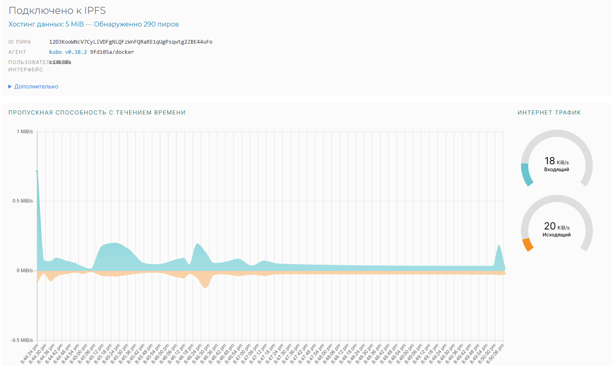
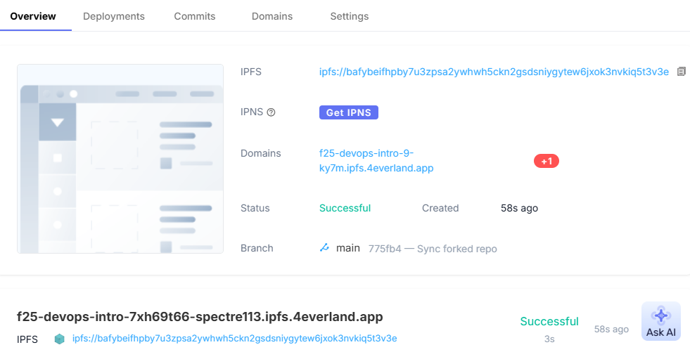
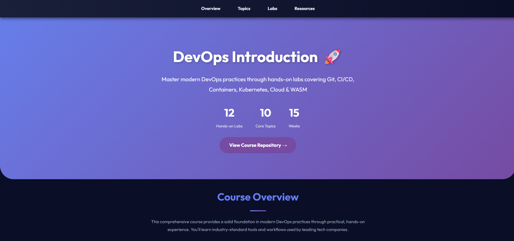

# Task 1 — IPFS Node Setup and Basic Operations

## Start the IPFS Node in Docker

The IPFS Kubo node was started on Windows using the command:

docker run -d --name ipfs_node `  -v ipfs_staging:/export`
-v ipfs_data:/data/ipfs `  -p 4001:4001 -p 8080:8080 -p 5001:5001`
ipfs/kubo:latest

The container started successfully and showed a "healthy" status.

---

## Verify Node Operation

Check running containers:

docker ps

List active peers:

docker exec ipfs_node ipfs swarm peers

The command returned a large list of peers (around 293), confirming the node is fully connected to the IPFS network.

Web UI opened successfully at:

http://127.0.0.1:5001/webui/

---

## Add a File to IPFS

A test file was created and added to the node:

echo "Hello IPFS Lab" > testfile.txt  
docker cp testfile.txt ipfs_node:/export/  
docker exec ipfs_node ipfs add /export/testfile.txt

The resulting CID:

QmNyiQsY3bKDLinnBWghYS6xz1gTV3W1hYiJ5j4CDfkBSw

---

##Retrieve the File via Gateway

The file was successfully retrieved from the local IPFS gateway:

http://127.0.0.1:8080/ipfs/QmNyiQsY3bKDLinnBWghYS6xz1gTV3W1hYiJ5j4CDfkBSw

Output content: "Hello IPFS Lab"

## Analysis

IPFS uses content addressing via CIDs (Content Identifiers), which reference files by their content hash rather than their location. Unlike traditional URLs that point to specific server locations, IPFS ensures the content can be retrieved from any node storing it, enhancing decentralization and resilience.

---

## Reflection

**Advantages:**

- No single point of failure, content remains accessible as long as one node hosts it.
- Resistance to censorship and control by centralized entities.
- Efficient bandwidth use via content deduplication and caching.

**Disadvantages:**

- Content availability depends on nodes pinning the data.
- Initial propagation through the network can be slow.
- Limited support and infrastructure compared to traditional hosting.

# Task 2 — Static Site Deployment with 4EVERLAND (or alternative)

## Project Setup and Deployment

- GitHub Repository: https://github.com/Spectre113/F25-DevOps-Intro
- Deployed site URL: https://bafybeifhpby7u3zpsa2ywhwh5ckn2gsdsniygytew6jxok3nvkiq5t3v3e.ipfs.dweb.link/
- IPFS CID: bafybeifhpby7u3zpsa2ywhwh5ckn2gsdsniygytew6jxok3nvkiq5t3v3e

## Screenshots

### Deployment Dashboard

### Site accessed through 4EVERLAND domain

---

## Analysis

4EVERLAND simplifies IPFS deployment by automating the build and publish process, managing pinning, and providing a stable, user-friendly gateway URL. This eliminates the need for manual IPFS CLI commands and ensures content availability.

---

## Comparison of IPFS hosting vs Traditional Web Hosting

**Advantages:**

- Decentralized delivery improves resilience and uptime.
- Content addressed by hash ensures immutability and verifiability.
- Censorship-resistant and less reliant on central servers.

**Disadvantages:**

- Content availability depends on pinning services and network propagation.
- Slower initial content access compared to traditional CDN-backed sites.
- Limited support for server-side dynamic content or complex backend logic.
