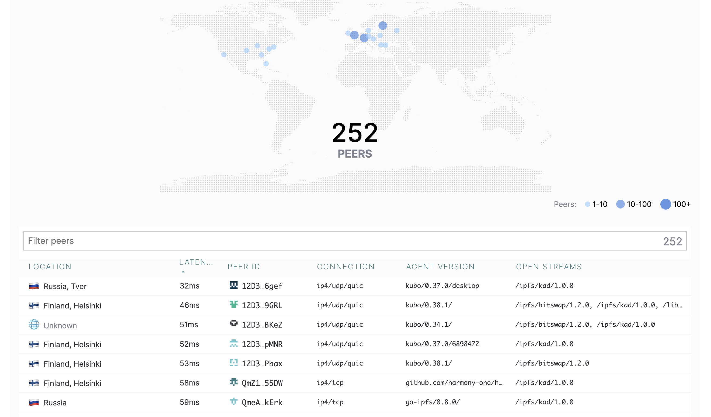
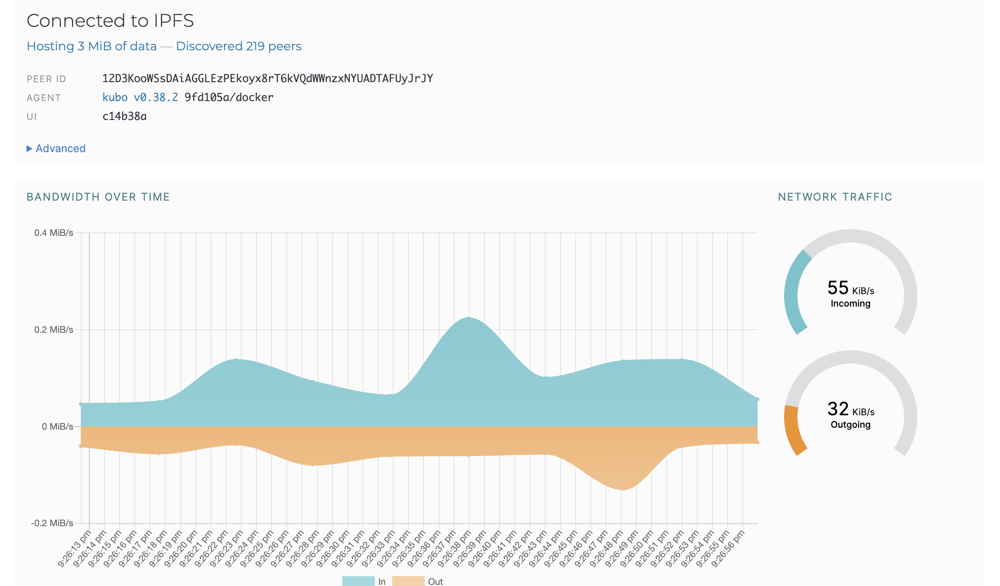
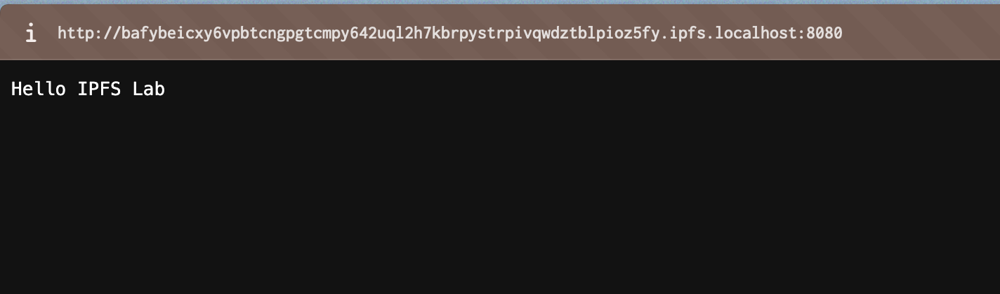
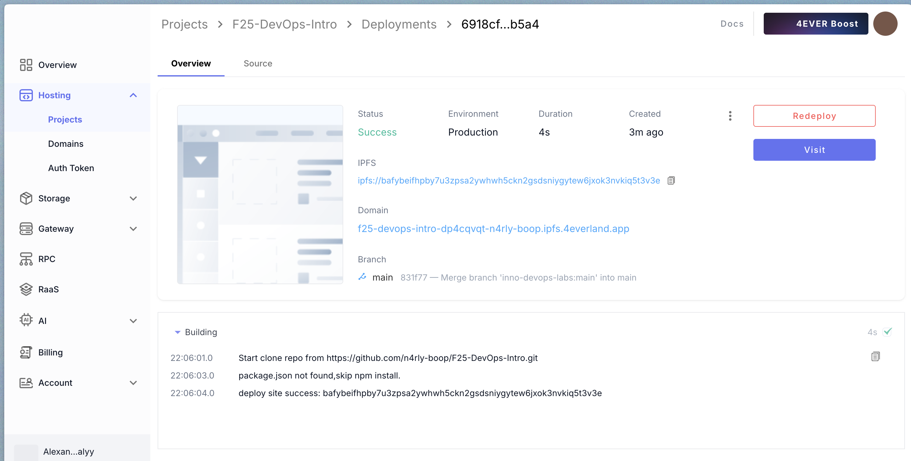
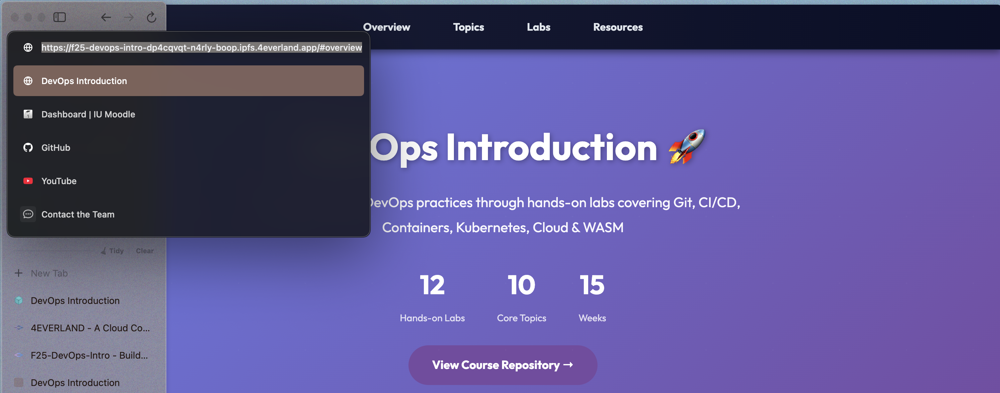
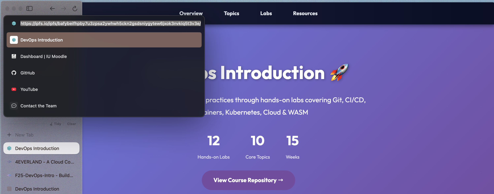

# Task 1 — Local IPFS Node Setup and File Publishing

## Peer Connectivity Evidence
`docker exec ipfs_node ipfs swarm peers`:
```text
/ip4/104.197.33.20/tcp/4001/p2p/12D3KooWBagQv1ztkV3WQbFeWkA5SYaPBimMtCuSvrJU3ied8mon
/ip4/107.172.8.239/udp/4001/quic-v1/p2p/12D3KooWMkmgm1U3gqTTwTYt3r5KHKnzJtUq5K1Yk963CDbwufAK
/ip4/107.179.130.176/udp/4001/quic-v1/p2p/12D3KooWD8ysVqMtKMHv37CtMSffGBfkvWLrm9L58MEhSGMyzw59
/ip4/109.123.250.25/tcp/4001/p2p/12D3KooWKAbKBQYsSoSCSqSYy4tN7JnTEjBUaTP22Xhos9RPLtUM
/ip4/129.13.152.60/tcp/4001/p2p/12D3KooWSSVMYqUVBhdkdwpaE4Qf3y7XSxV42e4YMVij7YTU6H7M
/ip4/132.226.200.38/udp/4001/quic-v1/p2p/12D3KooWLb7vLdEZraj1Wn9AMAH1utxazspVJpkeE8EeKzU7fuxm
/ip4/134.255.120.239/udp/4001/quic-v1/p2p/12D3KooWJVhPFk1LwnTS8zdjXRQkmkeDRTsTGWj45277FD6UyhFv
/ip4/135.181.44.177/tcp/4001/p2p/QmNM5eWHJYdnQvYNxCpNRxQt4VQGV1h35ysMAi8Rb7Rk2z
/ip4/136.243.46.254/tcp/4003/p2p/12D3KooWK1pnazya1APPnyMLwPJ6GK2vcnA7pYgCjyRvQLUhmYXv
/ip4/138.199.152.43/udp/4001/quic-v1/p2p/12D3KooWKvWgY6q9n2L9stbdDGpwaWb8od6F5Mop19Ryuwbqoudt
/ip4/139.177.183.57/tcp/4001/p2p/12D3KooW9wWf8cTVamH885hgkmko6VtJeWe8dkWp2t6VCzqtFy8J
/ip4/139.178.91.71/udp/4001/quic-v1/p2p/QmNnooDu7bfjPFoTZYxMNLWUQJyrVwtbZg5gBMjTezGAJN
/ip4/139.60.162.21/udp/4001/quic-v1/p2p/12D3KooWDNwTAoPGMm26rL4Jn6FbSa2daWxMKrTiTxbW3Z82feAs
/ip4/140.235.158.17/udp/4001/quic-v1/p2p/12D3KooWCkbhb6RnHJPHRTQNMQda3qG4P6omzr4WVhW6EgryaKu4
/ip4/141.164.54.215/udp/4001/quic-v1/p2p/12D3KooWGRFWs3KYi1TiQ7sKqXvETsbmpNtrw3ajKCqkmmxeQqVY
/ip4/144.126.139.249/udp/4001/quic-v1/p2p/12D3KooWAah3WpgXR4eGhvxBXoFiAUa5GmkHdCCavt2Dwj1kYQM5
/ip4/144.202.28.144/tcp/4001/p2p/12D3KooWBBaqKyWBwDkszWKiXxpkavu7gaFrb4GrervafYbWagX6
/ip4/145.40.118.135/udp/4001/quic-v1/p2p/QmcZf59bWwK5XFi76CZX8cbJ4BhTzzA3gU1ZjYZcYW3dwt
/ip4/146.0.75.254/udp/4001/quic-v1/p2p/12D3KooWKNY59cGdc23aYK5DG2xFS5nRCCsMVRnNAjK5tnDKcEFy
/ip4/147.135.253.134/tcp/4001/p2p/12D3KooWAKPxH8TPJHxN4DcqSPouLHZrUBS9bpTGNqqUaUPuurVQ
/ip4/147.75.87.27/udp/4001/quic-v1/p2p/QmbLHAnMoJPWSCR5Zhtx6BHJX9KiKNN6tpvbUcqanj75Nb
/ip4/149.28.207.154/udp/4001/quic-v1/p2p/12D3KooWEuDgLWMx3xL6pBhR5j4L4S9vNuS5dNicHKoM8DxxdEQC
/ip4/150.230.150.203/tcp/4001/p2p/12D3KooWKWXvuxP5AdBSYwcQU5EeyTwuVEd7KhttUZfDG2coBF7F
/ip4/152.53.134.203/tcp/4001/p2p/12D3KooWLGF4aBseSbqWoeRWWKifKUEYMaST9Jv5usZQWiGdPqi1
/ip4/154.12.224.234/tcp/4001/p2p/12D3KooWD9yw5Wjd52wAgBu6ACwL56YgUvw6FF5UWzrrpzdi8VMc
/ip4/154.53.58.130/udp/4001/quic-v1/p2p/12D3KooWM8eLELToaT8ty1H7SnP1jSUSEGamqVprUkN1DXw1sEeh
/ip4/154.91.1.181/tcp/19988/p2p/12D3KooWForH2nsSRN5cynPhoona6re1nw2EcimQJxHnicd1yqUV
/ip4/155.138.254.25/udp/4001/quic-v1/p2p/12D3KooWRgma7Km9PVtPkj9vLLBKqPdZZzqm393eUcYhcd72VFEQ
/ip4/157.173.121.152/udp/4001/quic-v1/p2p/12D3KooWAaoowtgzBCBVV3hKbHq28eTtDsvV1fmTf32wKZawVSvn
/ip4/157.90.132.176/tcp/4008/p2p/12D3KooWLkmAk3MaexCmXim4h4hnBLUJtfBLmcqAfJK3KGcs8adb
/ip4/159.195.21.75/tcp/31719/p2p/QmSuQhQfzX1VpSAtrTc4pJbnTx5Lr4LVivieqowrNhBoTY
/ip4/162.55.1.137/udp/9649/quic-v1/p2p/12D3KooWBCJWtN8fXrQa1C18Z5dxjdoan3v8rPEc9gVinQvUfFes
/ip4/167.71.171.30/udp/4001/quic-v1/p2p/12D3KooWP9Ln77D8U9sq5Edji7wkFxF3R3zGcpEpVyqooNYAQuhm
/ip4/171.232.48.146/udp/4001/quic-v1/p2p/12D3KooWDDWxdJVAzteJYwYtdsLiVTmL7UCRuroKAL2fEQtrDntf
/ip4/172.245.19.161/udp/4001/quic-v1/p2p/12D3KooWR1qAH8jo1cojQ7vK3hz97W8ddVFoa1TgxDNtDpmG15Z1
/ip4/173.234.27.226/udp/4001/quic-v1/p2p/12D3KooWLNGiFxbq5jNH3NyMosmNf3TR11Zi9DQAuzAZeL9ozX8Y
/ip4/178.128.253.181/tcp/4001/p2p/12D3KooWEpzs51bPjJUaJoVmEvmdLxRbGX853MEtc2q6hUNjktCE
/ip4/185.245.187.132/tcp/4001/p2p/12D3KooWNJ4vQmSGvsiaErAbU6PxphNXcUaiQG4B2TMYfhCWe1Dw
/ip4/185.86.78.139/tcp/4001/p2p/12D3KooWS8Nueah79kUz7ZpXZ8eo8y9dZDvpqftow7W1eJ2qTYAS
/ip4/192.96.205.46/udp/4001/quic-v1/p2p/12D3KooWAwAzthbvQLDZwjnpf9bwxnrVskrM2NTfmtFgpZ3iRAeU
/ip4/193.233.171.242/tcp/42521/p2p/QmP9C6XtgKaasiYUvixsF1AMaJNmhMwnk7vJe2bN8Pbztb
/ip4/193.8.130.177/udp/4001/quic-v1/p2p/12D3KooWJt8avPjhXXnAjNwPTR8TNKgBmQmgUmLGJzjnEqpMRQc9
/ip4/194.180.189.89/tcp/4001/p2p/12D3KooWHAcF8PExCLQrTzfLWiHXfLQoD24zcshKcQ7YDBCYHySN
/ip4/194.28.61.173/udp/43007/quic-v1/p2p/12D3KooWPMh2WbQesQMLG7RniSJvacET4112UwsX6E8oKucwZDRD
/ip4/195.26.230.154/udp/4001/quic-v1/p2p/12D3KooWH7g7cBVm2QiHdTsEk5JM5wBByqFGSn4F4aoJoYVCHaaU
/ip4/198.251.75.50/tcp/4001/p2p/12D3KooWMxk93zVLE1GmPbcTCSG6Bt9cpgogncCgEvkUi4VcV4v5
/ip4/202.182.115.251/udp/4001/quic-v1/p2p/12D3KooWKoBLbdwL2ATZm9BVDNcR9XBacz8hNnhX5sqHdiK1s742
/ip4/205.172.59.59/udp/4001/quic-v1/p2p/12D3KooWDNatFFzdBnxwaMx7MYLjRbwzHi1SGk8inym8UQEJtMMG
/ip4/207.148.113.122/tcp/4001/p2p/12D3KooWSaUg1gmMK9L6dQ4VnLuYf3kfDftGTh3YqZ3hUqNwzQM6
/ip4/207.148.116.128/tcp/4001/p2p/12D3KooWJNUviLYpWscfGMkPPndz4G5KHCLA7fQtvK2jEwqNt6Jh
/ip4/207.180.247.26/udp/4001/quic-v1/p2p/12D3KooWFC8xqybKfot4bZTHV6MGeep7m1Mc9XMc8iJCCWdNjfCL
/ip4/207.244.255.73/udp/4001/quic-v1/p2p/12D3KooWLQsqqFKHtupwc4LMysW15EmxRybS1XomFZqZUi1ggDur
/ip4/207.32.216.89/udp/4001/quic-v1/p2p/12D3KooWRUTQ92airjRL55CugnyM7kmAzkSvb6ueVZSqPGr8JqYq
/ip4/209.97.175.38/tcp/4001/p2p/12D3KooWE6Jk2t7S7Y8vG8hRiRw7Cq4Hq55r5dHTepK93vsB8rDL
/ip4/212.253.130.2/tcp/4001/p2p/QmduYc5yeg88EgFGHAqyKjaPtCNADm1JgiNcBbczhj6BVK
/ip4/217.76.54.50/udp/4001/quic-v1/p2p/12D3KooWAxFmAimuMETiCdrgSktLTgpri4nu1y47zoWzdKsbrq7t
/ip4/218.232.111.161/tcp/4001/p2p/12D3KooWND7XnFKvLUnSwpNr2ibrbAotiPsj5PKSrFotMhKZ6vvo
/ip4/222.253.16.180/tcp/4001/p2p/12D3KooWJgQr8DzBU3LT1YWvcSaz9Y7nHiFSNR5vriTJ47JLRpEC
/ip4/23.94.92.94/tcp/4001/p2p/12D3KooWLz9kTaBqhUJfUre17srd5uiLXQAuiUmzHDJcYmX22hyG
/ip4/31.13.208.186/tcp/36641/p2p/QmUjYDAtmnmrXwg5SMzaSVCVAjRVACR6RTE7R9mxK5HWPA
/ip4/31.220.107.113/udp/4001/quic-v1/p2p/12D3KooWFog4mJ75gXShzRzqGDBkagz75YFeMDokEJpVM2wmwpGP
/ip4/34.245.15.50/tcp/4001/p2p/12D3KooWJby6YVsZ8kZuoJHh5ndr7jDY5n884432HxxkWFyx8a1m
/ip4/37.60.226.109/tcp/4001/p2p/12D3KooWRmbZs18ZpyTsQNihpkFLeJNiD19QSAfLBxn8mEhWZsH1
/ip4/38.143.66.20/tcp/4001/p2p/12D3KooWCMqYkdBBFdkQ2X1McGWQS4EpuYjFoQkzPMKYvGMHT3HT
/ip4/38.242.209.143/udp/4001/quic-v1/p2p/12D3KooWHepkfpKWPwZNRwpiQimwchmKWaLS4URFkZ3iLezeD8cB
/ip4/40.160.14.239/tcp/34457/p2p/QmT7Ztzu6vKbpc2SmzgabzgzJW6Xv8YMM62eeQxfSRdioM
/ip4/45.76.104.146/tcp/4001/p2p/12D3KooWAK5GWDhg2SHMZNDmg3w9DuKCsmkoVqCaEVhUTgwPgJCW
/ip4/46.250.230.51/udp/4001/quic-v1/p2p/12D3KooWLzACmkgWjYbkD5PPTZ9ZJTpmacmRvPoLVDJUTVqKrKqc
/ip4/46.4.105.142/tcp/34367/p2p/QmW2USpYDuQ9bwUA65VLvmWpnbcTpVweNmJWCfszQhP6hk
/ip4/47.149.80.20/tcp/4001/p2p/12D3KooWQLoDAvn8dCvSpRMofxRBVj1RZnZ86fSkq78y372KCugQ
/ip4/51.159.103.9/tcp/4001/p2p/12D3KooWNMsv8YWV7knic3dCxDYuDPcH6ESSL7kt2J3PVBPjeQKi
/ip4/51.210.4.53/tcp/34513/p2p/Qmd3gQKGnSwPWkLWX2erFNnL1BPcX19orZSDQCGAihK8j6
/ip4/51.38.126.211/udp/4001/quic-v1/p2p/12D3KooWJMV2jCnRm3PFzy86Jahy4ck7vcDyy4PfxBtSWUPTperc
/ip4/54.37.255.187/tcp/4001/p2p/12D3KooWPtHd25XZPxZM65rYFMzQiu2Di4NjMSMe62978eBuZbQ5
/ip4/61.228.70.200/udp/4001/quic-v1/p2p/12D3KooWAv5TV3M5ziJ5NHFZZoHA7kp5rQBATBi5ExJRU7MNrAzq
/ip4/64.188.67.133/tcp/34077/p2p/QmQoFbzXwe7tw1WrEa8nBt9DwCyL61dm6FCg6u44noW9C9
/ip4/65.108.232.246/udp/4001/quic-v1/p2p/12D3KooWRRQNgVWoHpCBkE7L9fV2Et2KSH5TTeg5infRomE8shMa
/ip4/65.109.158.229/udp/4001/quic-v1/p2p/12D3KooWMevqkGsBavfaybZinCgMKkVY5pwGpTNTFF41Tpmbqaem
/ip4/65.109.70.89/tcp/4001/p2p/QmZ9vDzzAFjowDP4BDHh3TBY9E2V44s1skjT2QQs9azgYF
/ip4/65.20.107.219/tcp/4001/p2p/12D3KooWMePebPhBv88jN3UEpx6KADWMnXQP8PFcYaVHm9LQHWiy
/ip4/65.21.15.161/udp/4001/quic-v1/p2p/12D3KooWRQBunqZZKn2hZiUtA2GPGL8NWwTdvHZ6R4WXpWmN9CCA
/ip4/66.23.226.93/udp/4001/quic-v1/p2p/12D3KooWDu1s4sTD7uWEUYaHSAZMVPPLADb1ZN5eSauFpHuUAX4d
/ip4/66.248.205.211/udp/4001/quic-v1/p2p/12D3KooWLgHHpHNRiWzrtdMiwPTUWVweEM1aXZv2o2327s1YQZPs
/ip4/66.248.206.120/udp/4001/quic-v1/p2p/12D3KooWP562GpdfLwtTtboH2HnakPaWECpY7aXC7MhpTBPNnM67
/ip4/68.146.244.16/tcp/4001/p2p/12D3KooWG2kyunLTAAUcF46ixYivkLgSGY2TxuU87AEyQLcy8S3P
/ip4/69.62.116.11/udp/4001/quic-v1/p2p/12D3KooWHNBGLjuT2UdQx3YoJZwZZ2h96xiVDJvqmtBZ5K5RHx2P
/ip4/72.21.17.86/udp/4001/quic-v1/p2p/12D3KooWDaHZY6R2uDfRQPnu9jEnZVhHM5suDpGWiwVMoQFp4KF3
/ip4/74.48.90.84/udp/4001/quic-v1/p2p/12D3KooWKvmNWtbs7Pzok25XTUC2zr4suz6nF5p9jZUYeTiup5Wb
/ip4/77.20.17.233/tcp/4001/p2p/12D3KooWP8kU9JuejP9XjDLq9mV5UEy5b65sB66hN5tG4cu1CxKj
/ip4/79.117.135.119/tcp/4001/p2p/12D3KooWKsGLzzMHEE3D1BahpXYTM3okwjJoACXt8nuscTUp2Hxe
/ip4/82.22.174.111/udp/4001/quic-v1/p2p/12D3KooWQM2L6E9nSCg3u6JghMrMxRNgGYF2MkRsBYSv7aeufpZJ
/ip4/84.237.133.85/tcp/37233/p2p/QmTbMDrAWy3vJabet83SouaFGi8euMRQLU7Ye5GZM5eb4s
/ip4/85.214.171.166/tcp/4001/p2p/12D3KooWKX9QSsVfp8cTw9PNDFsUCVyxbS5vdRWaL4Nr2LirYaaP
/ip4/85.215.37.212/tcp/4001/p2p/12D3KooWMULs3ye68xEuv8DVFBXtzqAuVQWvEh2kLyecuqVLyYBC
/ip4/85.218.185.158/tcp/4001/p2p/12D3KooWJrBqFbEvxc3z6NwGfNcX41nhfTgksC1kAZ3WVDsMMHT6
/ip4/87.120.187.163/tcp/35291/p2p/QmUhD8hnydZczVyk6EQNkKzRXXRFtDcQ3ZFhjtzvjYz96b
/ip4/89.147.111.64/udp/4001/quic-v1/p2p/12D3KooWSriMAuxfigGhxoKeHSZRhKsfghXbXFxYaTdDLAVmjatj
/ip4/89.17.139.86/tcp/4001/p2p/12D3KooWNfMsb1mfYtiapU7PsyaWNkMGfrexMc4ypRRatTo6zVJ2
/ip4/89.34.219.106/tcp/43513/p2p/QmUvnejkDzCK1Jofs9NKwoAEJjegi4sq6Dw2LeX2yrMVdk
/ip4/89.34.219.23/tcp/35467/p2p/QmQjDygne7yxQJYTqnjuugAzxTvP6ce6HT86AZvVy8DESm
/ip4/89.34.219.65/tcp/42025/p2p/QmRpeUx99iy1bdrCS7xsV8xFQ5aN8HP9mNqVmKLrQLmwmi
/ip4/93.115.27.30/udp/4001/quic-v1/p2p/12D3KooWRmGCuLGubNDke1z2bqchQHFNzWUQrXE29unTC1skhEV6
/ip4/94.156.115.26/tcp/43893/p2p/QmVpdAjMfwhq9gxff1p7YoLXP9HXKKAPspSQwMZC7Tdxhs
/ip4/95.216.194.223/tcp/4001/p2p/12D3KooWRTQroqgJSJBeMcSMCXEnxhwRxcy7rfm4NNXbULchFN2A
/ip4/95.217.150.240/udp/4001/quic-v1/p2p/12D3KooWP87kuVTUA4oyxBkwHnXmkcs83GbU24VZ7dexAv4mUEvq
```
*Result: 252 concurrent peers spread across North America and Europe.*


## IPFS Web UI Snapshot

- **Status panel:** “Hosting 3 MiB of data — Discovered 219 peers” with peer ID `12D3KooWSsDAiAGGLEzPEkoyx8rT6kVQdWWnzxNYUADTAFUyJrJY` running `kubo v0.38.2`.
- **Bandwidth gauges:** 55 KiB/s incoming and 32 KiB/s outgoing at the time of capture, with recent peaks around 0.4 MiB/s on the chart.

## Published File and Gateways
- **CID:** `QmUFJmQRosK4Amzcjwbip8kV3gkJ8jqCURjCNxuv3bWYS1`
- **Local gateway test:** `http://localhost:8080/ipfs/QmUFJmQRosK4Amzcjwbip8kV3gkJ8jqCURjCNxuv3bWYS1`

- **Public gateways:**
  - https://cloudflare-ipfs.com/ipfs/QmUFJmQRosK4Amzcjwbip8kV3gkJ8jqCURjCNxuv3bWYS1
  - https://ipfs.io/ipfs/QmUFJmQRosK4Amzcjwbip8kV3gkJ8jqCURjCNxuv3bWYS1
- **Observation:** Both endpoints returned HTTP 200 with cached, immutable content once propagation settled (~2 minutes).

## Analysis — Content Addressing vs. Traditional URLs
- Traditional URLs point to a **location** (protocol + hostname + path) and assume the server at that location will return the requested bytes; the URL can keep serving different content over time.
- IPFS CIDs address **what the content is**, because the multihash is derived from the file bytes. Any node that has the block can serve it, and clients can verify integrity without trusting intermediaries.
- Because the CID changes whenever the file changes, versioning is explicit and deduplicated, and the network naturally resists tampering (wrong bytes simply fail hash validation).

## Reflection — Decentralized Storage Pros & Cons
**Advantages**
1. Content remains available as long as a single peer pins it, eliminating single points of failure.
2. Built‑in integrity verification through CIDs protects against data corruption and spoofing.
3. Distribution reduces bandwidth pressure on an origin server; nearby peers can serve cached blocks.

**Disadvantages**
1. Discoverability depends on propagation and DHT lookups, so initial fetches are slower than centralized CDNs.
2. Persistence is not automatic—without pinning or paid hosting, garbage collection can drop content.
3. Tooling is still maturing; debugging gateway delays or NAT traversal can be harder than traditional hosting.

# Task 2 — Static Site Deployment with 4EVERLAND

## Deployment Evidence
- **4EVERLAND domain:** https://f25-devops-intro-dp4cqvqt-n4rly-boop.ipfs.4everland.app/
- **Deployment CID:** `bafybeifhpby7u3zpsa2ywhwh5ckn2gsdsniygytew6jxok3nvkiq5t3v3e`
- **Dashboard snapshot:** 
- **Site via 4EVERLAND edge:** 
- **Site via public gateway:** 

## Gateway Validation
- 4EVERLAND edge automatically pinned the build artifact and fronted it with their Anycast CDN, so the domain resolved instantly and served cached content.
- Using the CID directly with https://ipfs.io/ipfs/bafybeifhpby7u3zpsa2ywhwh5ckn2gsdsniygytew6jxok3nvkiq5t3v3e returned the site as soon as propagation completed, proving the content is stored on IPFS independently of the 4EVERLAND URL.
- The same CID works through the course Cloudflare gateway and the local IPFS gateway, matching the screenshots above.

## Analysis — Why 4EVERLAND Helps
- 4EVERLAND automates the build → pin → gateway workflow: every git push triggers a deploy, pins the output to their IPFS cluster, and wires up a globally cached HTTPS domain. No manual `ipfs add`, CID tracking, or pinning fees.
- Their dashboard exposes logs, CID history, and DNS integration, which mimics familiar CI/CD pipelines and reduces the operational overhead of running long‑lived IPFS nodes yourself.
- Compared to hand‑managed deployments, propagation is faster because their infrastructure publishes the CID to multiple peers and keeps it pinned permanently.

## Comparison — Traditional Hosting vs. IPFS via 4EVERLAND
- **Speed & Availability:** Traditional CDNs still win on first‑byte latency, but 4EVERLAND narrows the gap by caching IPFS content and serving it over HTTPS from regional POPs.
- **Control & Portability:** IPFS CIDs decouple hosting from vendors—you can access the exact same site via any gateway or even your own node, whereas Web2 URLs are locked to a specific provider.
- **Operations:** Conventional hosting offers mature monitoring and debugging, while decentralized hosting introduces DHT/gateway troubleshooting; however, 4EVERLAND’s tooling hides much of that complexity.
- **Cost & Redundancy:** IPFS hosting avoids paying for idle origin servers and inherits redundancy from the peer network, but you still rely on pinning services (4EVERLAND, Filecoin, etc.) to guarantee persistence.
