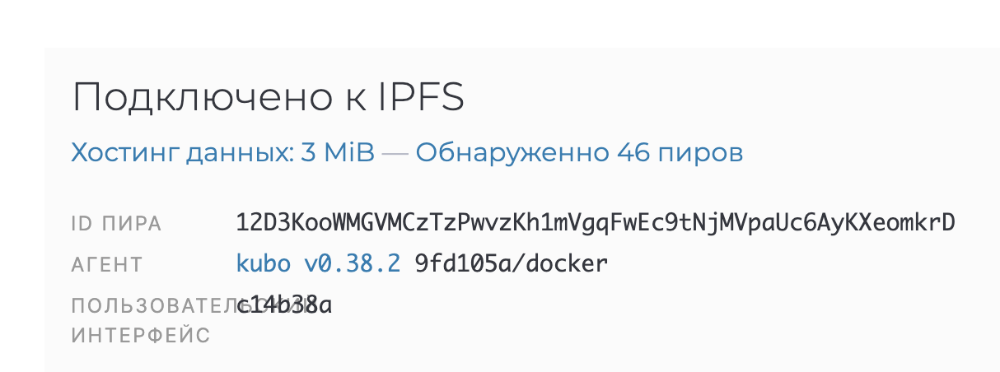
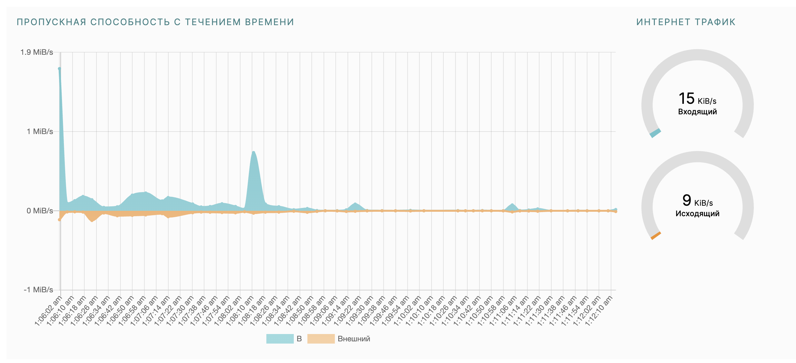
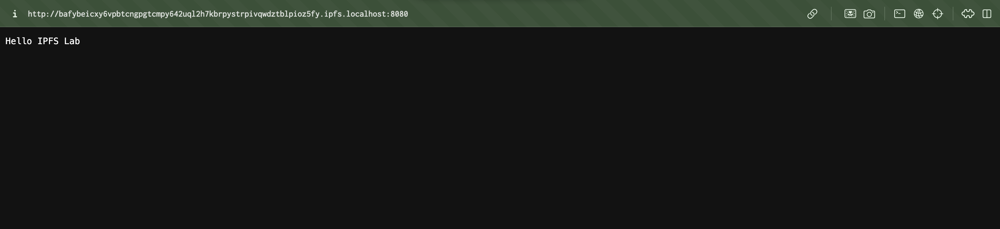
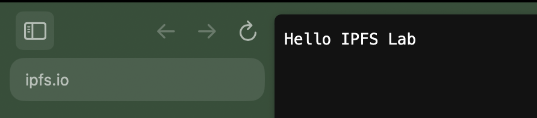
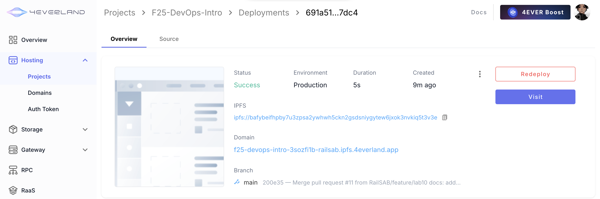
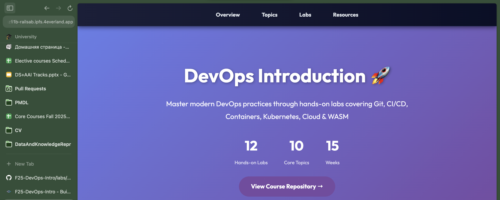
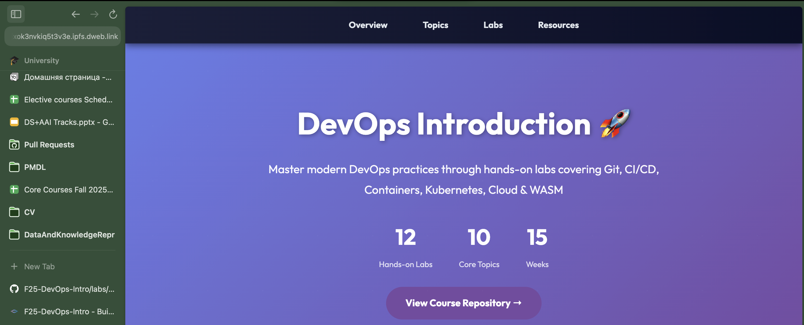

# Lab 11 — Decentralized Web Hosting with IPFS & 4EVERLAND

## Task 1 — Local IPFS Node Setup and File Publishing

### 1.1 IPFS Node Peer Count

Started the IPFS Docker container and opened Web UI (`http://127.0.0.1:5001/webui/`), the node successfully connected to the IPFS network.

**Peer count observed:**  
**46 peers**



### 1.2 Network Bandwidth Statistics

The Web UI dashboard with statistics shows healthy incoming and outgoing traffic.



### 1.3 Test File CID

A test file created and added to IPFS using:

```bash
echo "Hello IPFS Lab" > testfile.txt
docker cp testfile.txt ipfs_node:/export/
docker exec ipfs_node ipfs add /export/testfile.txt
```

**CID:**

```txt
QmUFJmQRosK4Amzcjwbip8kV3gkJ8jqCURjCNxuv3bWYS1
```

### 1.4 Local Gateway Access

The file was successfully accessed through the local IPFS gateway:

```txt
http://localhost:8080/ipfs/QmUFJmQRosK4Amzcjwbip8kV3gkJ8jqCURjCNxuv3bWYS1
```



### 1.5 Public Gateway Access

The public IPFS gateways:

* [https://ipfs.io/ipfs/QmUFJmQRosK4Amzcjwbip8kV3gkJ8jqCURjCNxuv3bWYS1](https://ipfs.io/ipfs/QmUFJmQRosK4Amzcjwbip8kV3gkJ8jqCURjCNxuv3bWYS1)
* [https://cloudflare-ipfs.com/ipfs/QmUFJmQRosK4Amzcjwbip8kV3gkJ8jqCURjCNxuv3bWYS1](https://cloudflare-ipfs.com/ipfs/QmUFJmQRosK4Amzcjwbip8kV3gkJ8jqCURjCNxuv3bWYS1)

Both gateways successfully display the file content after a short propagation delay.

Example:



### 1.6 Analysis: Content Addressing vs Traditional URLs

- Traditional URLs point to a location (host + path). The same URL can serve different content over time.
- IPFS uses content addressing: a CID is a cryptographic hash of the content. The CID uniquely identifies the data itself, not a server location.
- Integrity is inherent: any change to content changes the CID, enabling tamper detection and immutable references.
- Retrieval is from any peer that has the content, improving resilience and enabling deduplication.

### 1.7 Reflection: Decentralized Storage Pros and Cons

Advantages:

- Resilience: content can be fetched from multiple peers; no single point of failure.
- Integrity: content hashes ensure data hasn’t been altered.
- Efficient distribution: deduplication and peer-to-peer delivery can reduce bandwidth and improve locality.

Disadvantages:

- Availability depends on pinning/replication; data may disappear if no peers pin it.
- Higher latency for cold content until it propagates or is fetched the first time.
- Operational complexity: pinning strategies, gateway behavior, and NAT/firewall issues.
- Discoverability and access controls require additional patterns compared to centralized storage.

---

## Task 2 — Static Site Deployment with 4EVERLAND

### 2.1 4EVERLAND Project URL

The website was available at (i deleted project after practice finished):

```txt
https://f25-devops-intro-3sozfi1b-railsab.ipfs.4everland.app/
```

### 2.2 GitHub Repository Used

The GitHub repository:

```txt
https://github.com/RailSAB/F25-DevOps-Intro
```

There is static site in `labs/lab11/app`, and it is automatically redeployed when changes pushed to the branch `main`.

### 2.3 IPFS CID from 4EVERLAND Dashboard

IPFS CID for the website:

```txt
bafybeifhpby7u3zpsa2ywhwh5ckn2gsdsniygytew6jxok3nvkiq5t3v3e
```

### 2.4 Deployment Dashboard Screenshot

4EVERLAND deployment dashboard:



### 2.5 Site Accessed Through 4EVERLAND Domain

Site accessed through 4EVERLAND domain:



### 2.6 Site Accessed Through a Public IPFS Gateway

Site accessed through public IPFS gateway:

```txt
https://ipfs.io/ipfs/bafybeifhpby7u3zpsa2ywhwh5ckn2gsdsniygytew6jxok3nvkiq5t3v3e
```



### 2.7 Analysis: How 4EVERLAND Simplifies IPFS Deployment

- Automates build → IPFS publish → pinning, removing need to run/maintain a local IPFS node.
- Provides a stable subdomain and dashboard for builds, logs, and redeploys.
- Integrates with GitHub for automatic redeploy on push.

### 2.8 Comparison: Traditional hosting vs IPFS hosting (trade-offs)

Advantages of IPFS hosting:

- Content-addressed immutability, decentralized retrieval, potential cost savings via distribution.
- Reduced reliance on a single origin server.

Disadvantages / trade-offs:

- Updating content requires republishing new CID; mutable patterns need gateways or name systems (e.g., IPNS, DNSLink).
- Availability depends on pinning/replication; may need third-party pinning services.
- Some CDNs/features (edge logic, auth) are easier on traditional hosts.
