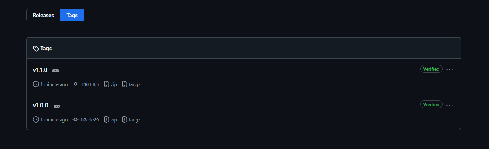
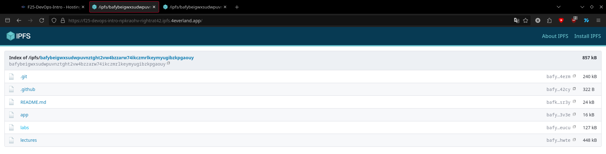

## Task 1

```sh
[RatPC|rightrat ~] sudo docker exec ipfs_node ipfs swarm peers
/ip4/134.122.18.76/udp/30630/quic-v1/p2p/12D3KooWMvybaSavX1JNfyW3hxJ8h2Xy5vS2y1aiMUjBhF7ETXhW
/ip4/134.122.22.75/udp/30454/quic-v1/p2p/12D3KooWCcAPPohHKbNBCxK167mUfSMgWxzptx9oCRheFf38aNxt
/ip4/134.122.67.87/tcp/4001/p2p/QmTJpSbvgoBtRLv1rKvA24dRw7eG8h6k5BYH3qhJp7wFwe
/ip4/135.148.34.140/tcp/4001/p2p/12D3KooWM1245XHofWPcaQBEsUtZjBZwwnrvgLR7qHnZ1ufu6x1e
/ip4/137.184.69.51/tcp/30202/p2p/12D3KooWA6uRE5fcVALywsEpyxRPuK3nM365pSYCeHt3S3zNKLri
/ip4/142.93.194.112/udp/30134/quic-v1/p2p/12D3KooWSMBHbeX9PKhRRLbYBy4LisoKSzvSwABhNFtLwmXwiFDY
/ip4/143.244.144.138/udp/30470/quic-v1/p2p/12D3KooWFXwCV7ddJJcJdJgKBkJCzANWvcgWeaBqDrT1MCZB9YRu
/ip4/143.244.144.138/udp/30471/quic-v1/p2p/12D3KooWJm2KQAY1jqUQtbDN2u15NGJHvLyfef7TxpTkYp7CqxwQ
/ip4/147.182.214.252/udp/30755/quic-v1/p2p/12D3KooWGPHaVkR4uqLfpHgCfAhhFBnmeq33QsnLWe3iDv8q2j3L
/ip4/157.230.188.151/udp/30464/quic-v1/p2p/12D3KooWQ74gpn5DX2AvTRJcUXSK7PDJuLe1v7DaZ1hCe6z1NS5P
/ip4/157.245.139.88/udp/30092/quic-v1/p2p/12D3KooWA7xePLe8cEYcZr5hopxaUSNskvtES3FvwdTb4xT4WoTg
/ip4/157.245.143.229/udp/30790/quic-v1/p2p/12D3KooWE51CkNAhbpKufah2HR22eEAugxytFCyEL9RwC5rLiBAv
/ip4/159.203.180.37/udp/30925/quic-v1/p2p/12D3KooWEoYAMBmYHnsmRnVqhB3ddJAhJLi7XHFePg7d4BJZKa9U
/ip4/159.223.164.190/udp/30300/quic-v1/p2p/12D3KooWDx8XzU7uvTzeJDYvA8qin4SmhQxSaxcWo5NB1hoKoxH5
/ip4/161.97.154.184/tcp/9867/p2p/Qmdfjtk6hPoyrH1zVD9PEH4zfWLo38dP2mDvvKXfh3tnEv
/ip4/167.172.140.24/udp/30712/quic-v1/p2p/12D3KooWNB4R6ziZGG3xwE2KzQ8f3CvCJoYgpm87WgP1XkUnFhbe
/ip4/167.99.234.33/udp/30832/quic-v1/p2p/12D3KooWHwMngomDhmZnjokRWeZF799fw4DBX3972MkdixgfRAwT
/ip4/174.138.34.41/udp/30893/quic-v1/p2p/12D3KooWPysGnfduZSBMVmc9ejqYckD4WvyehZBWJ8nB4RMxc82r
/ip4/192.241.150.112/udp/30701/quic-v1/p2p/12D3KooWQBkqA3DVrB1tSmKAwSHGZD2cBQqcvrx7YPzex1ACt3rP
/ip4/192.241.150.112/udp/30703/quic-v1/p2p/12D3KooWRD4PyETFviS7aHJckaH1mFjMuJoC5yAvGYfznFjGRs7b
/ip4/24.199.84.188/udp/30314/quic-v1/p2p/12D3KooWMZLnPV6cmJkqXL9U6mAMPZFP9eCBDXfAoVitRzumyiBR
/ip4/62.171.167.248/udp/4001/quic-v1/p2p/12D3KooWC2yT9MWKbMsbEsW2Z8amkM3hnahdvL9JokxGoWfJpja6
/ip4/64.227.16.111/tcp/30425/p2p/12D3KooWPKyXLmUfj67ZLHMrHuzsRchSHZ8dTRP5qX1kMZXiWgK3
/ip4/80.182.85.206/udp/4001/quic-v1/p2p/12D3KooWCqNroH7cVHmBbSuUqBiduwa4gDUhkWSnG3RUH1Z7TM5L
/ip4/95.217.120.51/udp/4001/quic-v1/p2p/12D3KooWAqwajk51THgoFanJ9XjWFqAAiALPRVYoY1CJJPGCWBnB
[RatPC|rightrat ~] sudo docker exec ipfs_node ipfs swarm peers | wc -l
25
```
Well, a lot more actually:


Network statistics:


```sh
[RatPC|rightrat F25-DevOps-Intro] sudo docker cp testfile.txt ipfs_node:/export/
Successfully copied 2.05kB to ipfs_node:/export/
[RatPC|rightrat F25-DevOps-Intro] sudo docker exec ipfs_node ipfs add /export/testfile.txt
added QmUFJmQRosK4Amzcjwbip8kV3gkJ8jqCURjCNxuv3bWYS1 testfile.txt
```
Test file CID: **QmUFJmQRosK4Amzcjwbip8kV3gkJ8jqCURjCNxuv3bWYS1**

File upload:


As can be seen, it is indeed working. 

Traditional URLs store domain hierarchy, while IPFS encapsulates everything in a single hash. IPFS allows for decentralisation, and gurantees constant uplink if content doesn't change.

Advantages: decentralization, scalability
Disadvantages: speed inconsistency, harder to manage security

## Task 2
4EVERLAND URL: ``https://f25-devops-intro-npkraohv-rightrat42.ipfs.4everland.app/``

Used repo: this project's

CID: ``bafybeigwxsudwpuvnztght2vw4bzzarw74ikczmrlkeymyugibzkpgaouy``





4EVERLIFE is simpler to initiate (import from GitHub repo), provides a web domain, supports CI

Traditional web hosting alllows for consistency, especially in dynamic cases, since centralization means focused compute and load balancing. IPFS is less consistent, but is also less pront to failing due to decentralization and is more performant on static sites.
