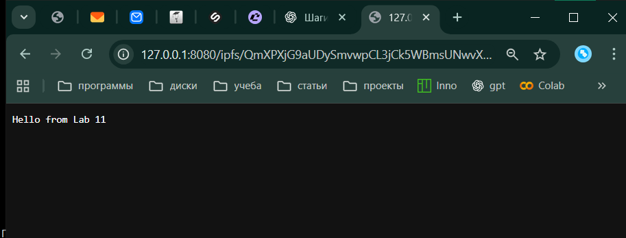
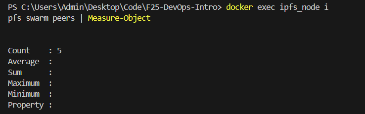
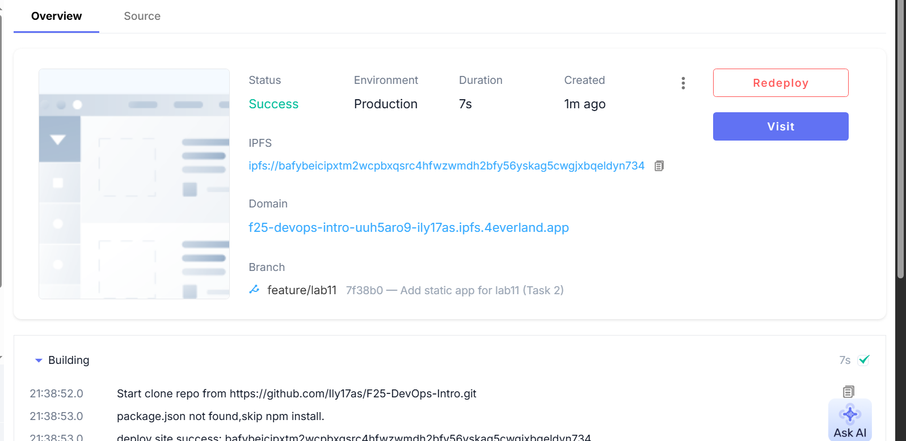
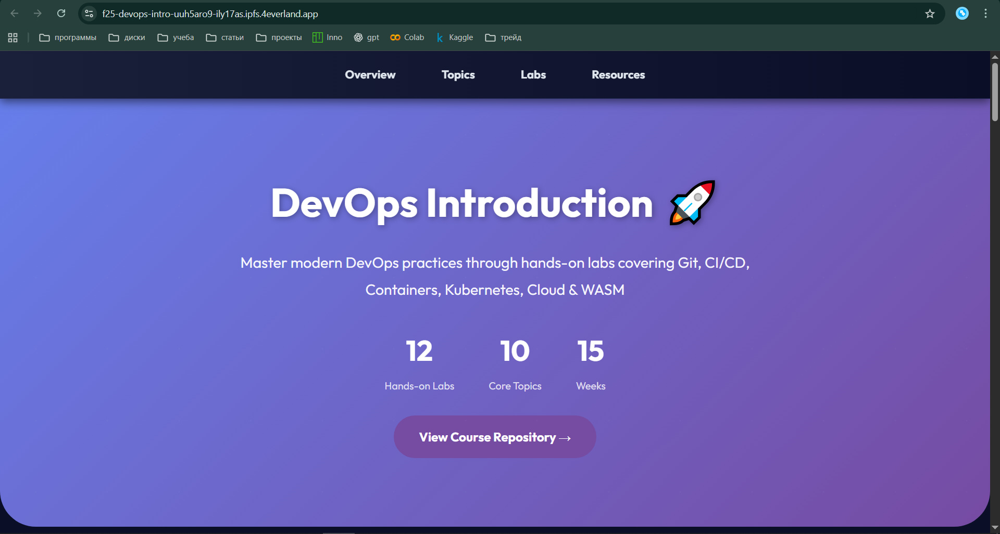

# Lab 11 — Decentralized Web Hosting with IPFS & 4EVERLAND

## Task 1 — Local IPFS Node Setup and File Publishing

### 1.1 Running a Local IPFS Node

A local IPFS node was deployed inside a Docker container using the official `ipfs/kubo:latest` image:

```bash
docker run -d --name ipfs_node `
  -v ipfs_staging:/export `
  -v ipfs_data:/data/ipfs `
  -p 4001:4001 `
  -p 8080:8080 `
  -p 5001:5001 `
  ipfs/kubo:latest
``` 

The node successfully started and exposes:
- **Swarm port:** 4001  
- **Gateway:** 8080  
- **API:** 5001  

### 1.2 Peer Connectivity

```bash
docker exec ipfs_node ipfs swarm peers | Measure-Object
```

**Output:**

```
Count : 5
```

### 1.3 Bandwidth Statistics

```bash
docker exec ipfs_node ipfs stats bw
```

**Output:**

```
TotalIn:  2.0 MB
TotalOut: 261 kB
RateIn:   0 B/s
RateOut:  0 B/s
```

### 1.4 Publishing a File to IPFS

A test file was created and added to IPFS.

**CID:**

```
QmXPXjG9aUDySmvwpCL3jCk5WBmsUNwvXBUXT75JU9SSUf
```

Local gateway:

```
http://127.0.0.1:8080/ipfs/QmXPXjG9aUDySmvwpCL3jCk5WBmsUNwvXBUXT75JU9SSUf
```

---

## Task 2 — Static Site Deployment with 4EVERLAND

### 2.1 Static Site Setup

Static site stored in:

```
labs/lab11/app/index.html
```

### 2.2 Deployment Configuration

- **Branch:** feature/lab11  
- **Framework preset:** Other  
- **Root Directory:** ./labs/lab11/app  
- **Output Directory:** ./  
- **Build Command:** *(empty)*  

Deployment succeeded.

### 2.3 Deployment Output

**CID:**

```
bafybeicipxtm2wcpbxqsrc4hfwzwmdh2bfy56yskag5cwgijxbqeldyn734
```

**4EVERLAND domain:**

```
https://f25-devops-intro-uuh5aro9-ily17as.ipfs.4everland.app
```

### 2.4 Verification

- Site opens via 4EVERLAND domain  
- Site opens via IPFS public gateway  

---

## Reflection

This lab demonstrates practical decentralized hosting using IPFS and 4EVERLAND.


Screens:

.png)
.png)
.png)
.png)


