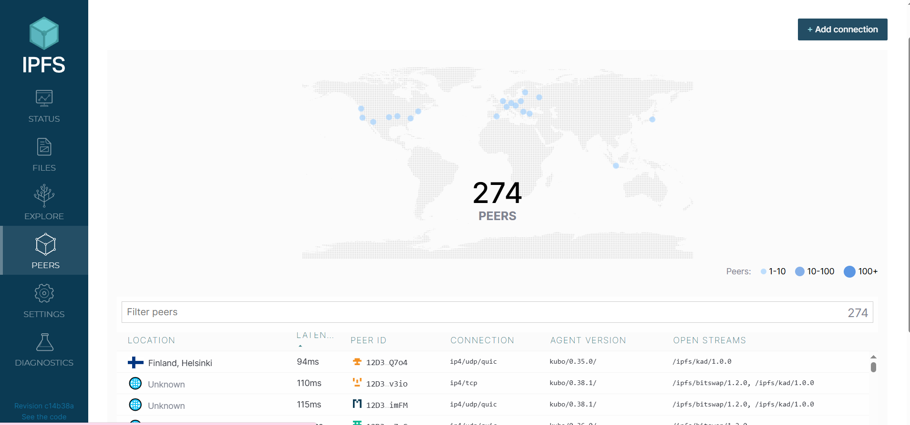
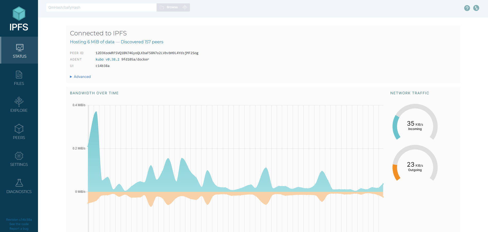
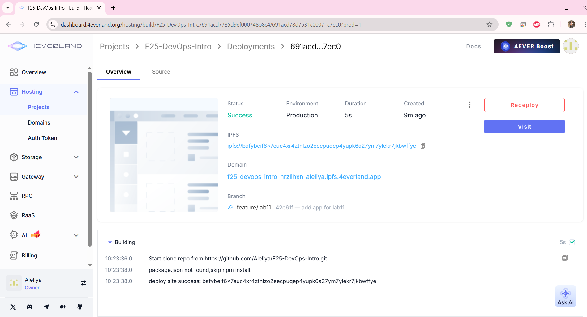
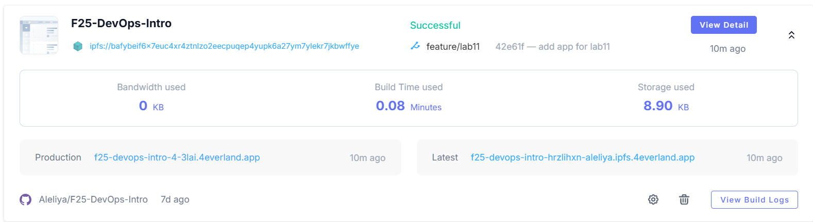
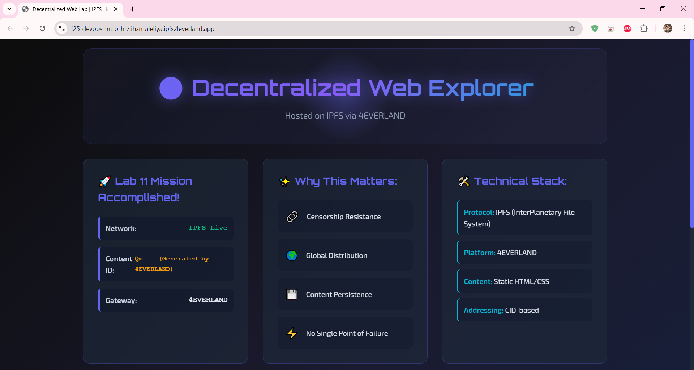
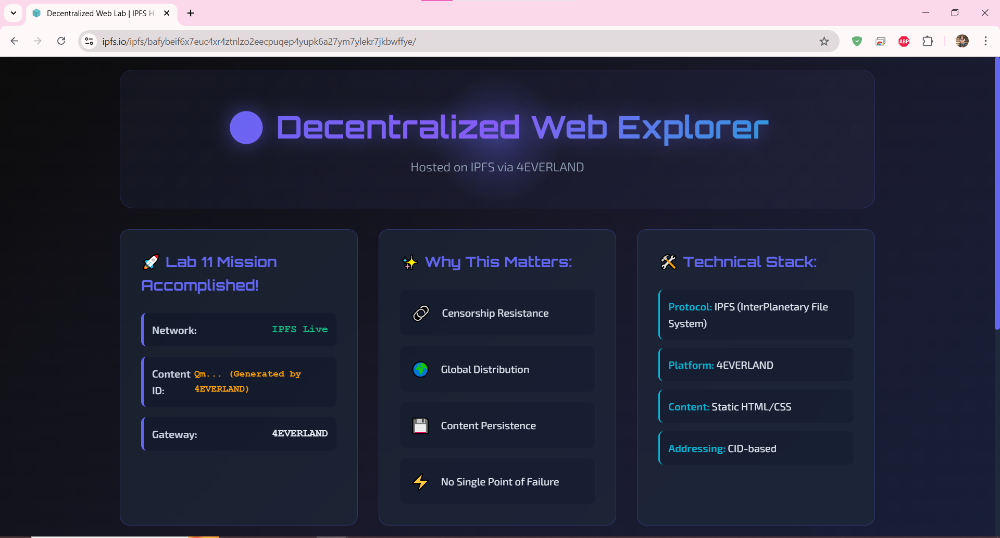

# Lab 11

## Task 1

**IPFS node peer count from Web UI**

274 peers



---
**Network bandwidth statistics**


---
**Test file CID**
```bash
echo "Hello IPFS Lab" > testfile.txt
docker cp testfile.txt ipfs_node:/export/
docker exec ipfs_node ipfs add /export/testfile.txt
```
Generated CID:
```
QmNyiQsY3bKDLinnBWghYS6xz1gTV3W1hYiJ5j4CDfkBSw 
```

---
**Screenshots of local gateway access**

`http://localhost:8080/ipfs/QmNyiQsY3bKDLinnBWghYS6xz1gTV3W1hYiJ5j4CDfkBSw`


---
**Public gateway URLs**

```
https://ipfs.io/ipfs/QmNyiQsY3bKDLinnBWghYS6xz1gTV3W1hYiJ5j4CDfkBSw 

https://cloudflare-ipfs.com/ipfs/QmNyiQsY3bKDLinnBWghYS6xz1gTV3W1hYiJ5j4CDfkBSw
```

---
**How does IPFS's content addressing differ from traditional URLs?**

IPFS uses content-based addressing, where content is identified by a unique cryptographic hash (CID), while traditional systems use location-based addressing with URLs that point to a specific server location. This means an IPFS address remains constant for a file, regardless of where it is stored, ensuring its integrity and making it permanent as long as it exists on the network. URLs, however, become invalid if the content is moved or the server goes offline. 

---
**What are the advantages and disadvantages of decentralized storage?**

Advantages of decentralized storage:

- Enhanced reliability: Data is distributed across multiple servers, so the system can continue to operate even if some nodes fail
- Improved security: Data is often encrypted and split into smaller pieces, making it more difficult for hackers to access an entire file even if they compromise a single node
- Lower costs: Decentralized storage can be more affordable as it uses the unused storage space from a global network of computers, and it can also avoid the fees and vendor lock-in associated with centralized providers
- Greater user control: Users have more autonomy over their data and are less reliant on a single company
- Censorship resistance: Because data is not stored in one central location, it is more resistant to censorship by any single authority


Disadvantages of decentralized storage:

- Slower speeds: Data retrieval can be slower compared to centralized systems, as it may need to be reassembled from multiple sources, especially if a user's data is not cached nearby
- Technical complexity: Setting up and managing a decentralized storage system can be more challenging for users and businesses compared to a centralized cloud service
- Inconsistent performance: Performance can be inconsistent if the network is not properly optimized, and it depends on the speed and availability of the nodes in the network
- Security risks: While generally more secure, a system is only as secure as its weakest link. Malicious nodes can still attempt to compromise data, and interoperability can be an issue if different protocols use different encryption methods
- Data availability issues: Data may become unavailable if network outages occur or if the nodes storing a user's data go offline


## Task 2

**4EVERLAND project URL**

`https://f25-devops-intro-hrzlihxn-aleliya.ipfs.4everland.app/`

---
**GitHub repository used**

`https://github.com/Aleliya/F25-DevOps-Intro`

This repository contains the website located in `labs/lab11/app` on the `feature/lab11` branch.

---
**IPFS CID from 4EVERLAND dashboard**

During deployment, 4EVERLAND generated and pinned the following IPFS CID for the website:

`bafybeif6x7euc4xr4ztnlzo2eecpuqep4yupk6a27ym7ylekr7jkbwffye`


---
**Screenshots**

4EVERLAND deployment dashboard






Site accessed through 4EVERLAND domain




Site accessed through public IPFS gateway

`https://ipfs.io/ipfs/bafybeif6x7euc4xr4ztnlzo2eecpuqep4yupk6a27ym7ylekr7jkbwffye/`



---
**How does 4EVERLAND simplify IPFS deployment compared to manual methods?**

4EVERLAND simplifies IPFS deployment by automating workflows, integrating with code repositories like GitHub for continuous deployment, and providing a user-friendly interface that handles technical complexities. It abstracts away manual setup and infrastructure management by offering a complete hosting solution that includes a global Content Delivery Network (CDN), free SSL certificates, and easy custom domain management.

---
**What are the trade-offs between traditional web hosting and IPFS hosting?**

| Aspect | Traditional Web Hosting | IPFS Hosting |
|--------|------------------------|--------------|
| Architecture | Centralized servers | Distributed P2P Network |
| Content addressing | Location-based (URL) | Content-based (CID) |
| Availability | Single Point of Failure | Multiple redundant sources |
| Speed | High for popular content | Depends on the proximity of the feasts |
| Cost | Monthly hosting fee | Potentially lower (P2P) |
| Censorship | Easy to block/Delete | Censorship Resistant |
| Content security | Is guaranteed by the provider | Requires active pinning |
| Difficulty of setting up | Simple, well documented | More complex, technical |
| Updates | Instant rewrite | New CID for each change |
| Global distribution | Requires CDN configuration | Embedded distribution |

**Traditional hosting wins in:** Speed, simplicity, reliability  
**IPFS hosting wins in:** Resistance to censorship, redundancy, and decentralization
