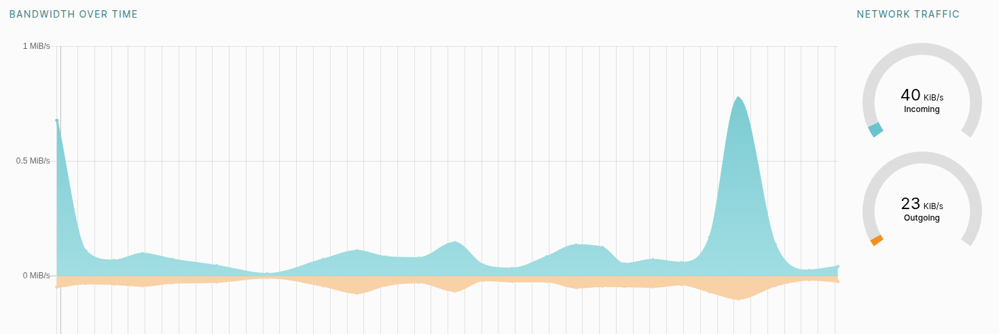
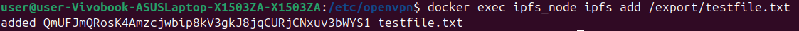
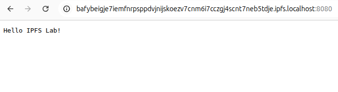
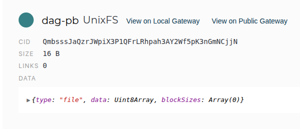
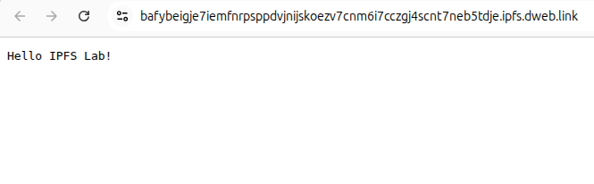
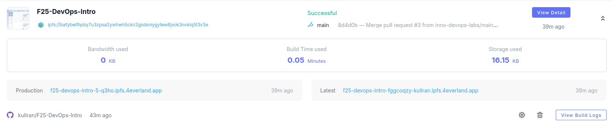
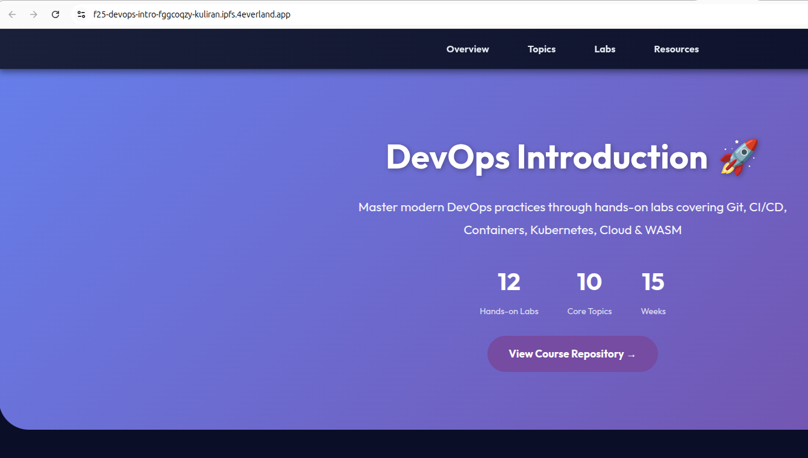
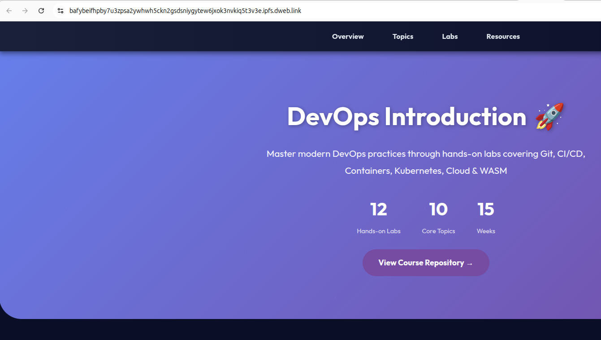

# Lab 11 — Decentralized Web Hosting with IPFS & 4EVERLAND
## Task 1 — Local IPFS Node Setup and File Publishing
### Connected peers


### Network traffic statistics


### Export a test file
```bash
echo "Hello IPFS Lab!" > testfile.txt
docker cp testfile.txt ipfs_node:/export/
docker exec ipfs_node ipfs add /export/testfile.txt
```

**CID**: `QmbsssJaQzrJWpiX3P1QFrLRhpah3AY2Wf5pK3nGmNCjjN`

### Check exported file accessibility
1. **Via Local Gateway**
Open in browser: `http://localhost:8080/ipfs/<CID>`



2. **Via Public Gateway**
- Inspection on Web UI



- Public Gateway (`https://bafybeigje7iemfnrpsppdvjnijskoezv7cnm6i7cczgj4scnt7neb5tdje.ipfs.dweb.link/`)



- The following links do not work:
    - https://ipfs.io/ipfs/<YOUR_CID>
    - https://cloudflare-ipfs.com/ipfs/<YOUR_CID>


### Analysis
How does IPFS's content addressing differ from traditional URLs?
- IPFS references content based on its actual data rather than its location on a server, via a unique Content Identifier (CID).

### Reflection
What are the advantages and disadvantages of decentralized storage?
- Advantages: content accessibility and longevity in case of single-point failures, cost efficiency, immutability (blockchain integrity, hard to tamper), possibly faster content provision due to geographical distribution
- Disadvantages: retrieval speed may be slower compared to optimized centers, lack of accountability and regulatory support (hard to trace)

## Task 2 — Static Site Deployment with 4EVERLAND
### Project deployed on 4EVERLAND


### Website access through 4EVERLAND domain


4EVERLAND project URL: `https://f25-devops-intro-fggcoqzy-kuliran.ipfs.4everland.app/`

### Website access through IPFS gateway


IPFS link: `https://bafybeifhpby7u3zpsa2ywhwh5ckn2gsdsniygytew6jxok3nvkiq5t3v3e.ipfs.dweb.link/`

### Analysis
How does 4EVERLAND simplify IPFS deployment compared to manual methods?
- It provides a fully managed, user-friendly platform that automates much of the manual setup and maintenance required with traditional IPFS deployment methods, such as installing and configuring IPFS nodes, handling file uploads and managing CIDs

### Comparison
What are the trade-offs between traditional web hosting and IPFS hosting?
- IPFS hosting supplies content as long as at least one node pins it, increasing **data lifespan**. It makes it **harder for a single entity to censor** and take down content compared to a traditional server. However, it may have **variable performance** and higher latency
- Traditional web hosting allows for more **consistent high-speed access**, especially with **CDNs**, and better **control** of the hosting **nodes**. Additionally, it ensures policy enforcement, **accountability and legal protection** of the content. However, it presents a single point of failure and **outage risks**