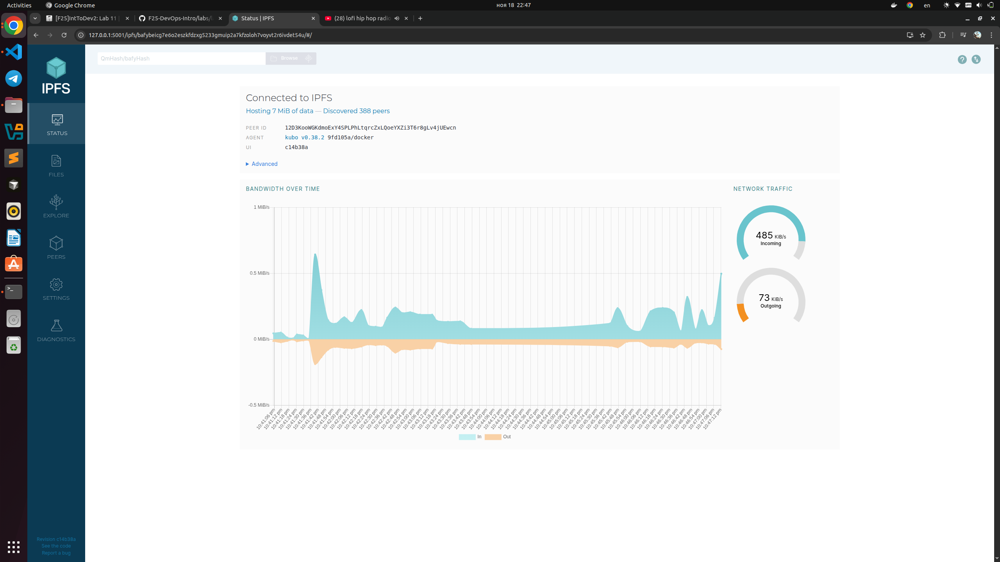
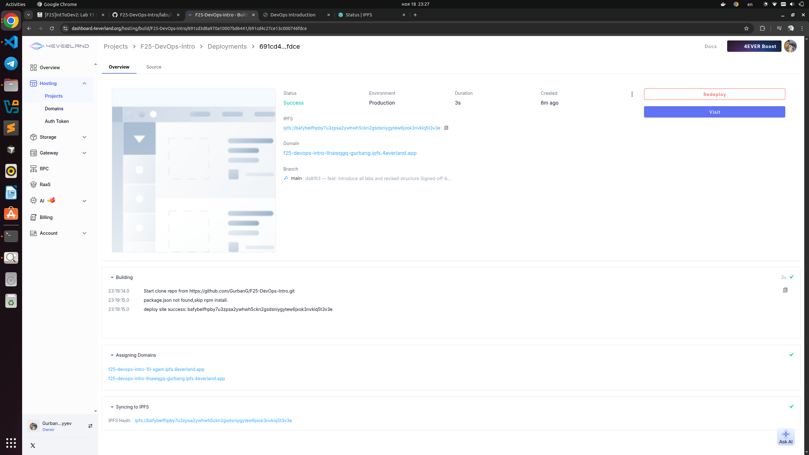
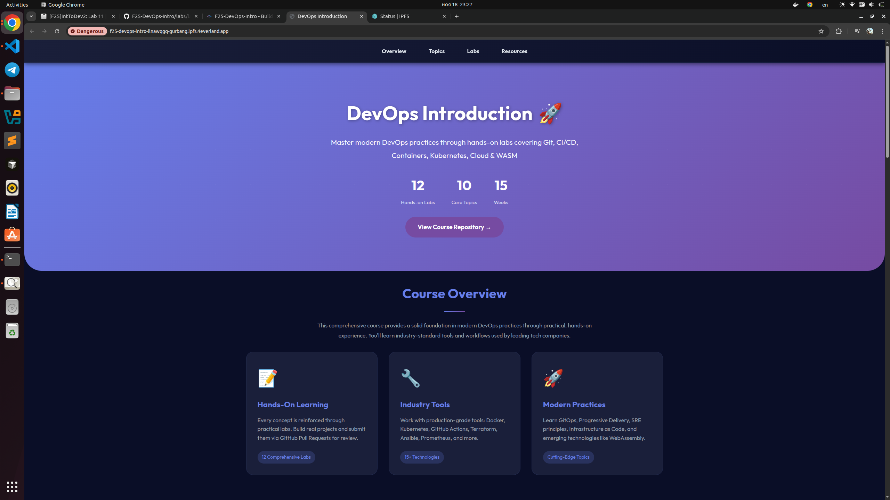
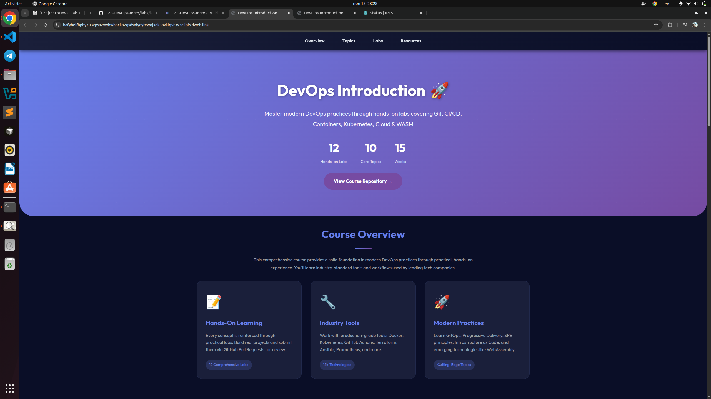

# Decentralized Web Hosting with IPFS & 4EVERLAND
## 1. Local IPFS Node Setup and File Publishing
### 1. IPFS node peer count from Web UI:
#### Node count: 388
### 2. Network bandwidth statistics:
- Incoming: 485 KiB/s
- Outgoing: 73 KiB/s
 
### 3. Test file CID: QmUFJmQRosK4Amzcjwbip8kV3gkJ8jqCURjCNxuv3bWYS1
### 4. Screenshots of local gateway access

### 5. Public gateway URLs
- https://ipfs.io/ipfs/QmUFJmQRosK4Amzcjwbip8kV3gkJ8jqCURjCNxuv3bWYS1
- https://cloudflare-ipfs.com/ipfs/QmUFJmQRosK4Amzcjwbip8kV3gkJ8jqCURjCNxuv3bWYS1
### 6. Analysis: How does IPFS's content addressing differ from traditional URLs?
- **Traditional URLs directyly point to the specific server that contians it. IPFS's content addressing uses CID (Content Identifier) to identify files and any node that contains it can be used to retrieve it from.**
### 7. Reflection: What are the advantages and disadvantages of decentralized storage?
#### Advantages:
- **high availability - even if 1 node goes offline, files maybe retrieved from other nodes.**
- **fast distribution - P2P network model allows for faster service, because multiple peers can server**
#### Disadvantages:
- **Complex setup: Running nodes, managing CIDs, and technical stuff could lead to harder implementation.**
- **Slower initial retrieval: If few peers have the content, fetching it may take longer compared to a centralized server.**

## 2. Static Site Deployment with 4EVERLAND
### 1. 4EVERLAND project URL
- **URL: f25-devops-intro-llnawqgq-gurbang.ipfs.4everland.app**
### 2. GitHub repository used: https://github.com/GurbanG/F25-DevOps-Intro
### 3. IPFS CID from 4EVERLAND dashboard: bafybeifhpby7u3zpsa2ywhwh5ckn2gsdsniygytew6jxok3nvkiq5t3v3e
### 4. Screenshots

### 5. Analysis: How does 4EVERLAND simplify IPFS deployment compared to manual methods?
**4EVERLAND simplifies IPFS deployment by automating the entire hosting workflow. It automatically uploads your project, publishes it to IPFS, and provides a gateway URL and CID without requiring you to interact with the IPFS CLI or manage storage manually.**
### 6. Comparison: What are the trade-offs between traditional web hosting and IPFS hosting?
#### Traditional Web Hosting:
- **Pros: easy to update and manage, widely supported**
- **Cons: centralized - relies only on 1 server**
#### IPFS Hosting:
- **Pros: decentrilized and resilient, content integrity through CIDs**
- **Cons: complex setup, slower initial retrieval**