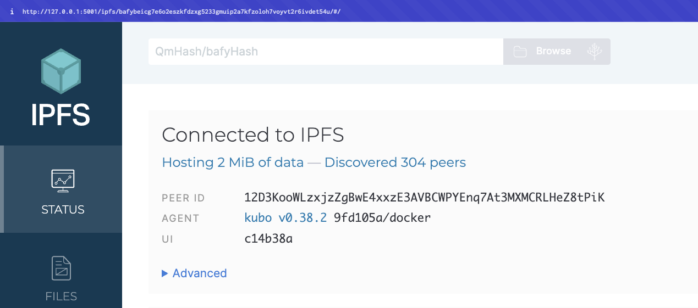
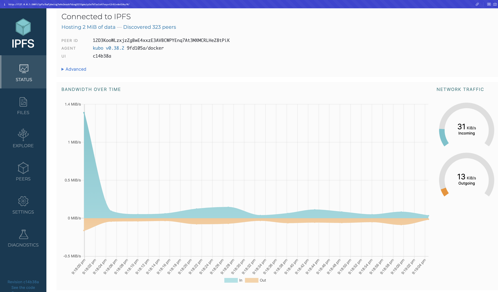
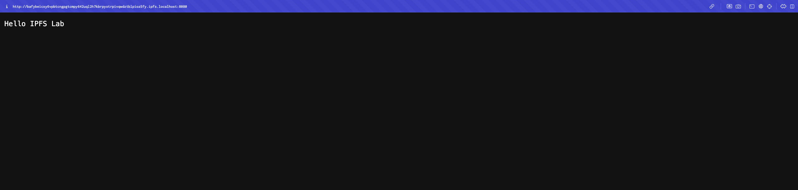
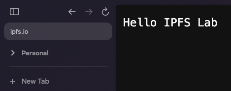
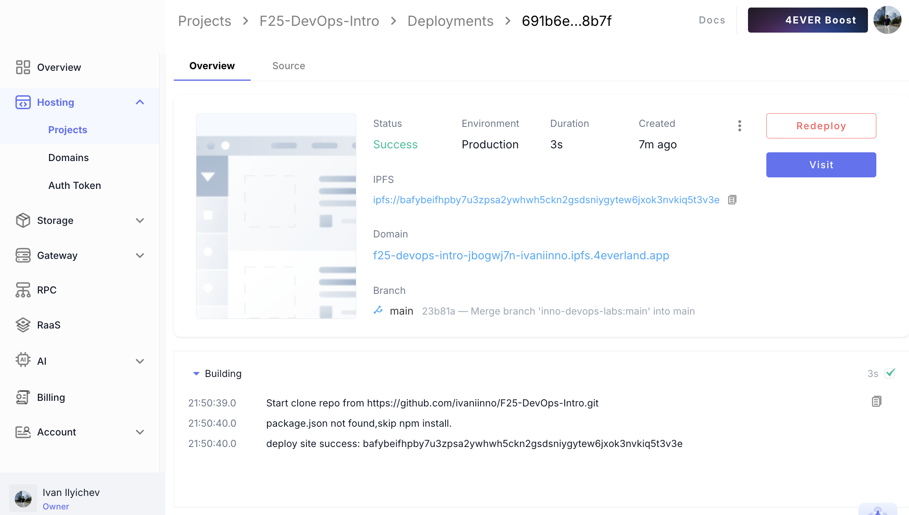
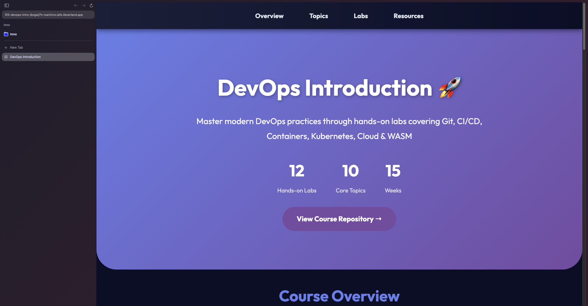
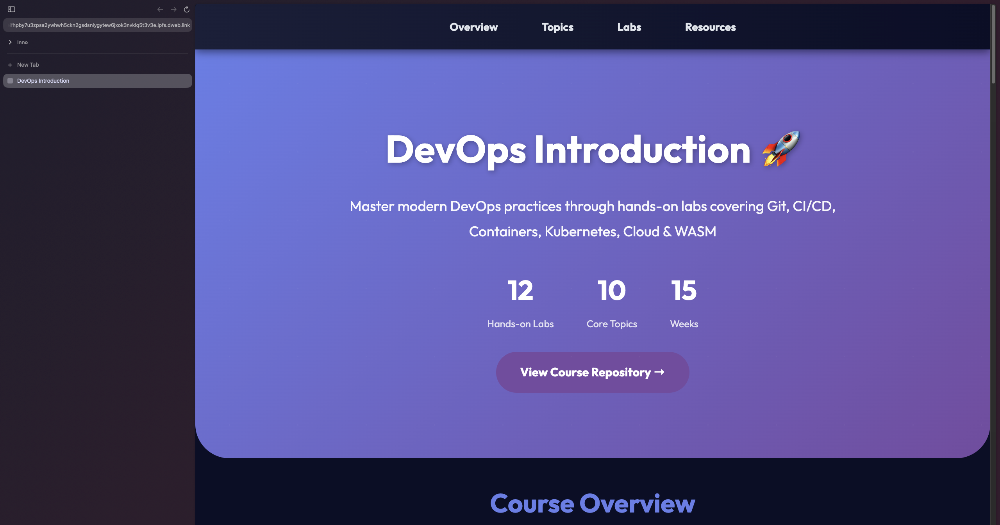

# Lab 11 — Decentralized Web Hosting with IPFS & 4EVERLAND

## Task 1 — Local IPFS Node Setup and File Publishing

### 1.1: Start IPFS Container

Command:

```bash
docker run -d --name ipfs_node \
    -v ipfs_staging:/export \
    -v ipfs_data:/data/ipfs \
    -p 4001:4001 -p 8080:8080 -p 5001:5001 \
    ipfs/kubo:latest
```

### 1.2: Verify Node Operation

**Check Connected Peers:**

Command:

```bash
docker exec ipfs_node ipfs swarm peers
> /ip4/X.X.X.X/udp/4001/quic-v1/p2p/**
> /ip4/X.X.X.X/tcp/4001/p2p/**
> /ip4/X.X.X.X/tcp/4001/p2p/**
> ...
```


**Access IPFS Web UI:**

Opened my browser and navigated to: `http://127.0.0.1:5001/webui/`

Observed 304 peers




Network Bandwith Stats:


### 1.3: Add File to IPFS

**Create Test File:**

A text file was created and added to IPFS

```bash
echo "Hello IPFS Lab" > testfile.txt
docker cp testfile.txt ipfs_node:/export/
```

**Add File to IPFS:**

Command:

```bash
docker exec ipfs_node ipfs add /export/testfile.txt
```

**CID Obtained:**

`QmUFJmQRosK4Amzcjwbip8kV3gkJ8jqCURjCNxuv3bWYS1`


### 1.4: Access Content

**Via Local Gateway:**

Opened in browser: (http://localhost:8080/ipfs/QmUFJmQRosK4Amzcjwbip8kV3gkJ8jqCURjCNxuv3bWYS1)



**Via Public Gateways:**

   - (https://ipfs.io/ipfs/QmUFJmQRosK4Amzcjwbip8kV3gkJ8jqCURjCNxuv3bWYS1)
   - (https://cloudflare-ipfs.com/ipfs/QmUFJmQRosK4Amzcjwbip8kV3gkJ8jqCURjCNxuv3bWYS1)

**Result:**

Accesses were successful, as demonstrated on an sample below:




### Task 1 Analysis: How does IPFS's content addressing differ from traditional URLs?

IPFS's content addressing fundamentally differs from traditional URLs in several key ways:

**Traditional URLs (Location-Based Addressing):**
- URLs point to a **location** where content is stored (e.g., `https://example.com/page.html`)
- The address is tied to a specific server or domain
- If the server goes down or the content is moved, the URL breaks
- Content can be changed at the same URL without users knowing
- Requires a central authority (DNS, hosting provider) to resolve addresses
- Single point of failure: if the server is unavailable, content is inaccessible

**IPFS CIDs (Content-Based Addressing):**
- CIDs (Content Identifiers) are derived from the **content itself** using cryptographic hashing
- The CID is a unique fingerprint of the file's content (e.g., `QmUFJmQRosK4Amzcjwbip8kV3gkJ8jqCURjCNxuv3bWYS1`)
- Same content always produces the same CID, regardless of where it's stored
- Content integrity is guaranteed: if content changes, the CID changes
- No central authority needed: content can be retrieved from any IPFS node that has it
- Resilient to failures: content remains accessible as long as at least one node in the network has it

**Key Differences:**
1. **Addressing Model**: Traditional URLs answer "where is it?" while IPFS CIDs answer "what is it?"
2. **Immutability**: IPFS content is immutable by design—changing content creates a new CID, ensuring version integrity
3. **Decentralization**: IPFS doesn't rely on a single server; content can be served from any peer in the network
4. **Verification**: CIDs allow automatic verification that you received the exact content you requested
5. **Permanence**: Traditional URLs can break when servers move; IPFS content persists as long as nodes pin it


### Task 1 Reflection: What are the advantages and disadvantages of decentralized storage?

#### Advantages:

1. **Resilience and Redundancy:**
   - Content remains accessible even if individual nodes or servers fail
   - Automatic replication as more nodes access and cache content

2. **Censorship Resistance:**
   - No central authority can remove content from the network
   - Content persists as long as at least one node has it pinned

3. **Content Integrity:**
   - Cryptographic hashing ensures content hasn't been tampered with
   - CIDs provide built-in verification of content authenticity
   - Immutable content addressing prevents unauthorized modifications

4. **Global Distribution:**
   - Content is automatically cached by nodes that access it
   - Reduces latency by serving content from geographically closer nodes

5. **Version Control:**
   - Each version of content has a unique CID
   - Easy to reference specific versions of files
   - Natural support for content versioning and history

#### Disadvantages:

1. **Content Availability:**
   - Content may become unavailable if no nodes are hosting it
   - Requires active pinning to ensure persistence

2. **Performance Variability:**
   - Access speed depends on network topology and peer availability
   - Cold content (rarely accessed) may have slower retrieval times

3. **Propagation Delays:**
   - New content takes time to propagate through the network
   - Requires patience for content to become widely available

4. **Limited Dynamic Content:**
   - Best suited for static content
   - Difficult to host dynamic, database-driven applications
   - Not ideal for real-time, frequently changing content

5. **Network Dependency:**
   - Requires active network of peers
   - Performance degrades if network is sparse
   - Relies on community participation for content availability

6. **Privacy Concerns:**
   - Content is publicly accessible to anyone with the CID
   - No built-in access control or authentication
   - Requires additional layers for private content


## Task 2 — Static Site Deployment with 4EVERLAND

### 2.1: Set Up 4EVERLAND Project

**Create Account:**

Signed up at [4EVERLAND.org](https://www.4everland.org/)

**Create New Project:**

Created project from course repository as follows:

1. Clicked "Create New Project" → "Connect GitHub repository"
2. Selected my current course repository (https://github.com/ivaniinno/F25-DevOps-Intro)
3. Chose branch to deploy (main)
4. Configured build settings:
    - **Platform:** IPFS/Filecoin
    - **Framework:** Other 
    - **Publish directory:** `labs/lab11/app` 
5. Clicked "Deploy"


### 2.2: Verify Deployment

**Check Deployment Status:**

The page is available at:

(https://f25-devops-intro-jbogwj7n-ivaniinno.ipfs.4everland.app/)

The static site is located at `labs/lab11/app`, so it will automatically be redeployed when anything pushed to the main branch.

The deployment dashboard:



**Verify on Public Gateway:**

Obtained CID: `bafybeifhpby7u3zpsa2ywhwh5ckn2gsdsniygytew6jxok3nvkiq5t3v3e`

Accessed site via 4everland (https://f25-devops-intro-jbogwj7n-ivaniinno.ipfs.4everland.app/):



Accessed site via IPFS (https://bafybeifhpby7u3zpsa2ywhwh5ckn2gsdsniygytew6jxok3nvkiq5t3v3e.ipfs.dweb.link/):




### Task 2 Analysis: How does 4EVERLAND simplify IPFS deployment compared to manual methods?

**Simplifications:**

1. **GitHub Integration:**
   - Direct connection to Git repositories eliminates manual file transfers

2. **Automated Build Process:**
   - Handles static site generation automatically
   - Supports various frameworks (React, Vue, Next.js, etc.)
   - Configurable build commands and publish directories

3. **Continuous Deployment:**
   - Every push to the connected branch automatically triggers a new deployment
   - No manual intervention required for updates
   - Maintains deployment history and rollback capabilities

4. **Content Pinning:**
   - Automatically pins deployed content to IPFS

5. **User-Friendly URLs:**
   - Provides custom `*.4everland.app` subdomains
   - Automatically maps to IPFS CIDs

6. **Deployment Dashboard:**
   - Visual interface for monitoring deployments
   - Deployment logs and error tracking

7. **Multi-Gateway Access:**
   - Content automatically available through multiple IPFS gateways


### Task 2 Comparison: What are the trade-offs between traditional web hosting and IPFS hosting?

#### Traditional Web Hosting

**Advantages:**
- **Guaranteed Availability**: Hosting providers offer SLAs with uptime guarantees
- **Predictable Performance**: Consistent response times and bandwidth
- **Dynamic Content Support**: Full support for server-side rendering, databases, and APIs
- **Easy Updates**: Simple file replacement, instant content updates
- **Access Control**: Built-in authentication, authorization, and private content
- **Optimization**: Traditional domains and URLs are well-indexed by search engines
- **Mature Ecosystem**: Extensive tooling, documentation, and community support
- **Customer Support**: Professional support from hosting providers

**Disadvantages:**
- **Centralized Control**: Single point of failure, vulnerable to outages
- **Vendor Lock-in**: Dependency on specific hosting providers
- **Costs**: Monthly hosting fees, bandwidth charges, scaling costs
- **Geographic Limitations**: Content served from specific data center locations

#### IPFS Hosting

**Advantages:**
- **Decentralization**: No single point of failure, distributed across network
- **Censorship Resistance**: Difficult to remove content once published
- **Content Integrity**: Cryptographic verification ensures content authenticity
- **Cost Efficiency**: Lower costs for static content, pay-per-pin models
- **Permanence**: Content persists as long as nodes pin it
- **Version Control**: Immutable CIDs enable natural content versioning
- **No Vendor Lock-in**: Content accessible through any IPFS gateway

**Disadvantages:**
- **Performance Variability**: Speed depends on network topology and peer availability
- **Static Content Focus**: Limited support for dynamic, database-driven applications
- **Propagation Delays**: New content takes time to propagate through network
- **Technical Complexity**: Requires understanding of IPFS protocols and concepts
- **Limited Access Control**: No built-in authentication or private content support
- **Storage Management**: Requires active pinning to ensure persistence
