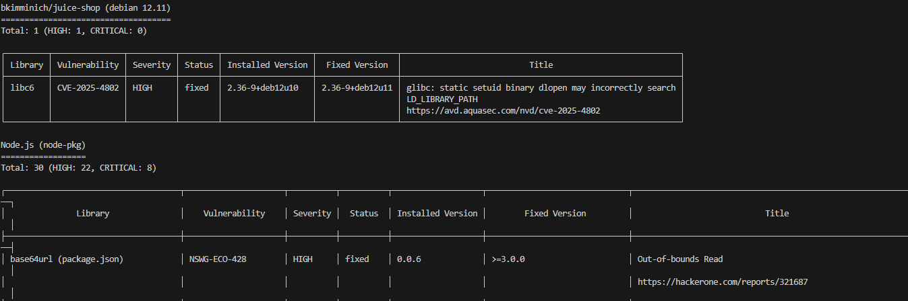
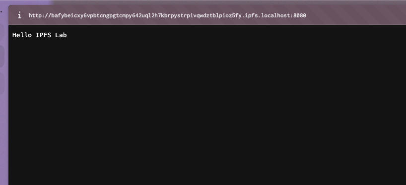

# Task 1 — Local IPFS Node Setup and File Publishing 

  
### 🔹 IPFS Node Overview
- **Peer Count:** ~100+ peers (from Web UI and `ipfs swarm peers`)  
- **Network Bandwidth:** Observed via Web UI; varies with active connections  
- **Node Status:** Running and connected  

### 🔹 Accessing Content
- **Local Gateway:**  
  `http://localhost:8080/ipfs/QmUFJmQRosK4Amzcjwbip8kV3gkJ8jqCURjCNxuv3bWYS1`  
  

- **Public Gateways:**  
  - `https://ipfs.io/ipfs/QmUFJmQRosK4Amzcjwbip8kV3gkJ8jqCURjCNxuv3bWYS1`    

```bash
docker exec ipfs_node ipfs add /export/testfile.txt
 15 B / ? added QmUFJmQRosK4Amzcjwbip8kV3gkJ8jqCURjCNxuv3bWYS1 testfile.txt
 ```


 ### Analysis: Content Addressing vs Traditional URLs
IPFS uses **content-based addressing** via a **CID (Content Identifier)** instead of a location-based URL:
- The CID is derived from the file’s cryptographic hash.  
- Ensures **immutability** — the content cannot change without changing the CID.  
- Access is **decentralized**; any node storing the content can serve it.  

Traditional URLs rely on server locations (`http://server.com/file.txt`) and can break if the server is down.

---

### Reflection: Advantages and Disadvantages of Decentralized Storage

**Advantages:**  
- High availability and redundancy  
- Content integrity guaranteed via cryptographic hashing  
- Reduced reliance on centralized servers  

**Disadvantages:**  
- Public gateway propagation may be slow (2–5 mins)  
- Performance depends on network and connected peers  
- Storage and pinning management required to retain content


# Task 2 — Static Site Deployment with 4EVERLAND 

### Deployment Overview
- **4EVERLAND Project URL:** `https://f25-devops-intro-wrugfth2-vougeress.ipfs.4everland.app/`  
- **GitHub Repository Used:** Course repository  
- **IPFS CID:** `ipfs://bafybeifhpby7u3zpsa2ywhwh5ckn2gsdsniygytew6jxok3nvkiq5t3v3e`

### 🔹 Screenshots
- **Deployment Dashboard:**  
    
- **Site via 4EVERLAND Domain:**  
    
- **Site via Public IPFS Gateway:**  
    

---

### Analysis: How 4EVERLAND Simplifies IPFS Deployment
- Automates **IPFS publishing** and CID generation  
- Provides a **subdomain** and HTTPS for IPFS-hosted sites  
- Integrates **CI/CD workflows**, redeploying on GitHub pushes  
- Eliminates manual steps like running a local IPFS node, managing peers, and pinning files  

---

### Comparison: Traditional Web Hosting vs IPFS Hosting

| Feature | Traditional Hosting | IPFS Hosting (4EVERLAND) |
|---------|------------------|-------------------------|
| Deployment | Upload files to server or via FTP | Automatic IPFS publishing from GitHub |
| Addressing | Domain-based, location-dependent | Content-based CID addressing |
| Availability | Depends on server uptime | Decentralized, served from multiple nodes |
| Security | HTTPS and server configs | Immutable content, cryptographic hashes |
| Performance | CDN optional | Peer-dependent; public gateways may propagate slowly |
| CI/CD Integration | Manual or with DevOps tools | Built-in in 4EVERLAND |

**Summary:**  
4EVERLAND reduces the complexity of IPFS hosting, providing a user-friendly interface and automated deployment. The main trade-offs are **slightly higher propagation latency** and reliance on **public gateways** compared to traditional centralized hosting.
