# Lab 11 Submission — Reproducible Builds with Nix

## Task 1 — Build Reproducible Artifacts from Scratch

### Installation steps and verification output

I’m using macOS. I installed Nix using the Determinate Systems installer:

```bash
curl -fsSL https://install.determinate.systems/nix | sh -s -- install
```

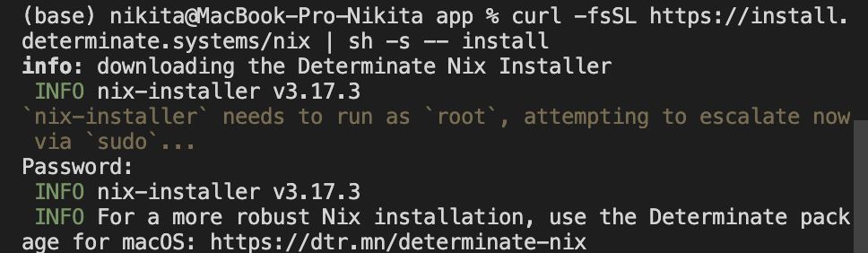

After installation, I verified Nix works by running a program directly from `nixpkgs` (without installing it system-wide):

```bash
nix run nixpkgs#hello
```

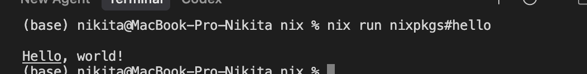

I also verified the Nix version:

```text
nix (Determinate Nix 3.17.3) 2.33.3
```

### My `default.nix` file (with explanations)

File: `labs/lab11/app/default.nix`

This derivation uses `pkgs.stdenv.mkDerivation` to produce a single output directory (`$out`) containing the compiled Go binary. The important parts are:

- **Pinned build environment via `pkgs`**: `pkgs ? import <nixpkgs> { }` provides the package set used for the build. Nix will record the exact `nixpkgs` path + dependency closure in the derivation, so the build input set is explicit.
- **Identity metadata**: `pname` and `version` become part of the output path suffix (the human-readable part after the hash).
- **Source input**: `src = ./.;` tells Nix the *only* source input is this directory contents (e.g., `main.go`, `default.nix`). If the source changes, the derivation hash changes.
- **Explicit dependencies**: `nativeBuildInputs = [ pkgs.go ];` ensures Go is available inside the isolated build environment without relying on the host machine.
- **Deterministic build choices (Go-specific)**:
  - `CGO_ENABLED=0` avoids linking against host C toolchains / libc.
  - `HOME` and `GOCACHE` are redirected to `$TMPDIR` so the build doesn’t depend on user-specific paths.
  - `-trimpath` removes local filesystem paths from the binary.
  - `-ldflags="-s -w"` strips debug symbols to avoid embedding extra build metadata and to keep output stable/smaller.
- **Controlled output**: `installPhase` copies the produced binary into `$out/bin/lab11-app`. In Nix, `$out` is the only “published” artifact location; everything else is ephemeral.

```nix
{ pkgs ? import <nixpkgs> { } }:

pkgs.stdenv.mkDerivation rec {
  pname = "lab11-app";
  version = "0.1.0";

  # Build context (the local directory with main.go and default.nix).
  src = ./.;

  # Build-time dependencies only (keeps the environment explicit).
  nativeBuildInputs = [
    pkgs.go
  ];

  buildPhase = ''
    runHook preBuild

    # Reduce non-determinism:
    # - Disable CGO so the binary doesn't depend on host libc/tooling.
    # - Make build/cache paths stable and ephemeral.
    export CGO_ENABLED=0
    export HOME="$TMPDIR"
    export GOCACHE="$TMPDIR/go-build"

    # -trimpath removes local filesystem paths from the binary.
    # -ldflags "-s -w" strips debug info (smaller output; also avoids some path metadata).
    go build -trimpath -ldflags="-s -w" -o lab11-app ./main.go
    runHook postBuild
  '';

  installPhase = ''
    runHook preInstall
    install -D -m 0755 lab11-app "$out/bin/lab11-app"
    runHook postInstall
  '';
}
```

### Store path from multiple builds (proving they’re identical)

I built the derivation, recorded the `result` store path, removed `result`, and built again. The store path stayed identical across builds:

```text
/nix/store/3fqmys6y4n1sbzrm513ckbvvcx74imj8-lab11-app-0.1.0
```

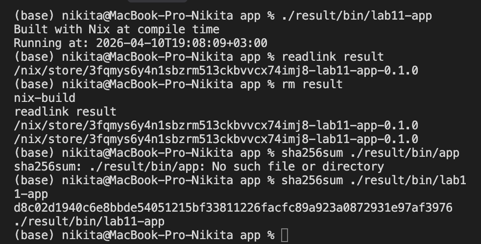

### SHA256 hash of the binary

I computed the SHA256 of the produced binary:

```text
d8c02d1940c6e8bbde54051215bf33811226facfc89a923a0872931e97af3976  ./result/bin/lab11-app
```


### Comparison with Docker: why Docker is not reproducible

I also built the same program using a traditional `Dockerfile` (Task 1.4):

File: `labs/lab11/app/Dockerfile`

```dockerfile
FROM golang:1.22
WORKDIR /app
COPY main.go .
RUN go build -o app main.go
```

I built the image twice:

```bash
docker build -t test-app .
docker build -t test-app .
```

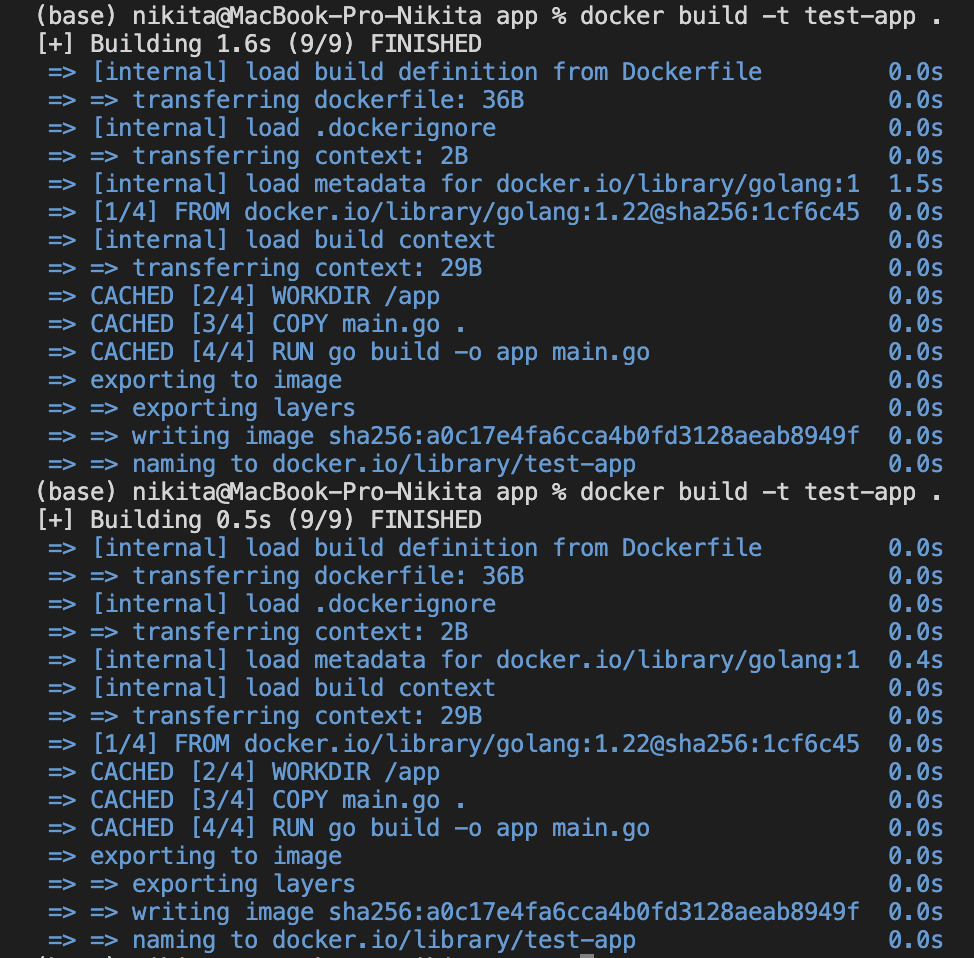

**Why Docker is not truly reproducible (even if two local builds may look identical due to caching):**

- **Base image drift**: `FROM golang:1.22` can change over time (security updates, rebuilds), so the same Dockerfile can produce different outputs on different days/machines.
- **Layer metadata/timestamps**: Docker layers contain metadata (including timestamps and creation metadata) which can change build-to-build, affecting final digests.
- **Ambient inputs**: Docker builds can depend on the daemon version, builder backend, platform, and local cache state. Two “identical” digests locally can just mean you hit cache; it doesn’t guarantee bit-for-bit reproducibility across time/machines.

### Analysis: what makes Nix builds reproducible?

Nix achieves reproducibility through:

- **Pure, sandboxed builds**: the build only sees declared dependencies (here: `pkgs.go`), not whatever happens to be installed on the host.
- **Content-addressed store outputs**: the output path is determined by the full set of inputs (derivation, dependencies, environment), so same inputs produce the same store path and can be reused.
- **Determinism practices in the build**: for Go, I reduced sources of nondeterminism by disabling CGO and using `-trimpath`, plus isolating `HOME`/`GOCACHE` inside `$TMPDIR`.

### Nix store path format: what each part means

Example store path from my build:

```text
/nix/store/3fqmys6y4n1sbzrm513ckbvvcx74imj8-lab11-app-0.1.0
```

- **`/nix/store/`**: the Nix store root, where all build outputs live.
- **`3fqmys6y4n1sbzrm513ckbvvcx74imj8`**: a hash derived from the *full dependency graph and build recipe inputs* (the derivation + exact versions/paths of dependencies). If any input changes, this hash changes.
- **`lab11-app-0.1.0`**: the human-readable name portion, built from `pname` and `version` in `default.nix`.

### Evidence of building and running the app

This screenshot shows the build and a successful run of the produced binary:

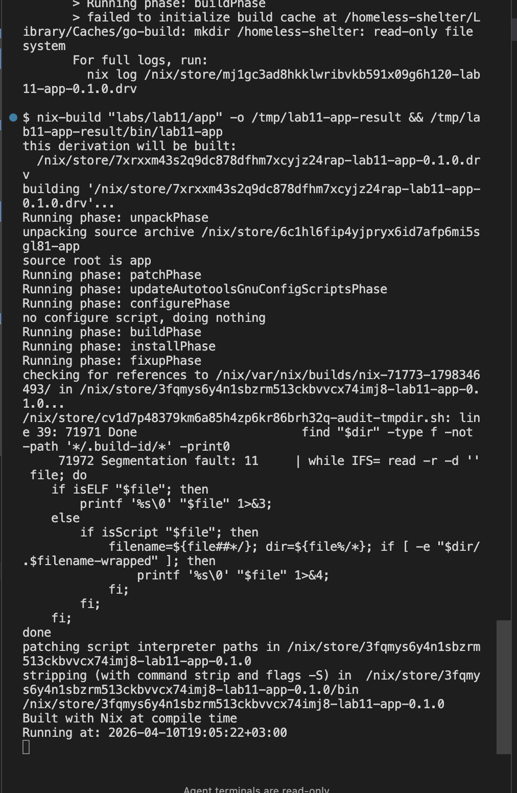

---

## Task 2 — Reproducible Docker Images with Nix

### My `docker.nix` file (with explanations)

File: `labs/lab11/app/docker.nix`

**What this file does:** It uses `pkgs.dockerTools.buildLayeredImage` to turn a Nix derivation into a Docker image tarball. The image runs on **Linux** (Docker), so the inner `appLinux` derivation cross-compiles the Go program with `GOOS=linux` and `GOARCH=arm64` (Apple Silicon Docker reports `linux/aarch64`).

**Field-by-field meaning:**

- **`appLinux` (`stdenv.mkDerivation`)**: Same idea as Task 1, but the build explicitly targets Linux so `docker run` does not hit `exec format error` (a darwin binary cannot run in a Linux container).
- **`buildLayeredImage`**: Splits the closure into layers (here: e.g. `tzdata` and the app) for caching and sharing; layer comments in `docker history` show **Nix store paths**.
- **`name` / `tag`**: Become the image reference `lab11-app:nix` after `docker load`.
- **`contents`**: Store paths copied into the image; only `appLinux` is listed, but its runtime dependencies (e.g. timezone data) can appear as separate layers.
- **`created = "1970-01-01T00:00:00Z"`**: Avoids “now” timestamps so image metadata stays **deterministic** and reproducible (Docker UI may show this as “56 years ago”, i.e. Unix epoch).
- **`config.Cmd`**: Default process; points at the immutable path `${appLinux}/bin/lab11-app` under `/nix/store/...`.

```nix
{ pkgs ? import <nixpkgs> { } }:

let
  appLinux = pkgs.stdenv.mkDerivation rec {
    pname = "lab11-app";
    version = "0.1.0";

    src = ./.;

    nativeBuildInputs = [
      pkgs.go
    ];

    buildPhase = ''
      runHook preBuild

      export CGO_ENABLED=0
      export GOOS=linux
      export GOARCH=arm64

      export HOME="$TMPDIR"
      export GOCACHE="$TMPDIR/go-build"

      go build -trimpath -ldflags="-s -w" -o lab11-app ./main.go
      runHook postBuild
    '';

    installPhase = ''
      runHook preInstall
      install -D -m 0755 lab11-app "$out/bin/lab11-app"
      runHook postInstall
    '';
  };
in
pkgs.dockerTools.buildLayeredImage {
  name = "lab11-app";
  tag = "nix";

  contents = [
    appLinux
  ];

  created = "1970-01-01T00:00:00Z";

  config = {
    Cmd = [ "${appLinux}/bin/lab11-app" ];
  };
}
```

**Build, load, and run (evidence):**

I ran `nix-build docker.nix`, then loaded the tarball into Docker. The build log shows the image config (OS `linux`, arch `arm64`, fixed `created`, `repo_tag` `lab11-app:nix`, and store layers):

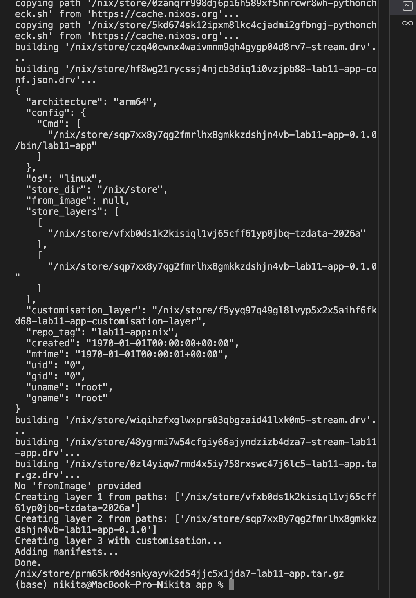

After `docker load`, the container runs correctly:

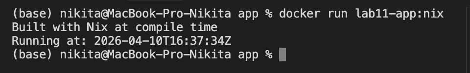

### Traditional comparison image (`Dockerfile.traditional`)

For a fair “minimal container” baseline I use a multi-stage Dockerfile: compile in `golang:1.22`, then copy only the static binary into `scratch` (file: `labs/lab11/app/Dockerfile.traditional`).

```dockerfile
FROM golang:1.22 AS builder
WORKDIR /src
COPY main.go .

ENV CGO_ENABLED=0 GOOS=linux GOARCH=arm64
RUN go build -trimpath -ldflags="-s -w" -o /out/lab11-app ./main.go

FROM scratch
COPY --from=builder /out/lab11-app /lab11-app
ENTRYPOINT ["/lab11-app"]
```

Build: `docker build -f Dockerfile.traditional -t traditional-app .`

### Image size comparison: Nix vs traditional

**Docker image sizes** (`docker images | grep -E "lab11-app|traditional-app"`):

| Image | Size (reported) | Notes |
|--------|-------------------|--------|
| `traditional-app:latest` | **1.38MB** | `scratch` + single copied binary only |
| `lab11-app:nix` | **3.52MB** | Nix closure layers (app + dependencies such as `tzdata`) |

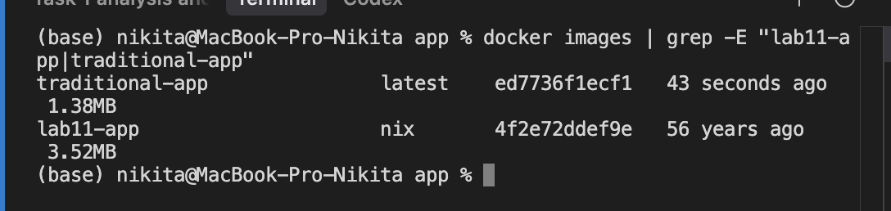

The tarball produced by Nix is tracked via the `result` symlink (points at `...-lab11-app.tar.gz` in the store):

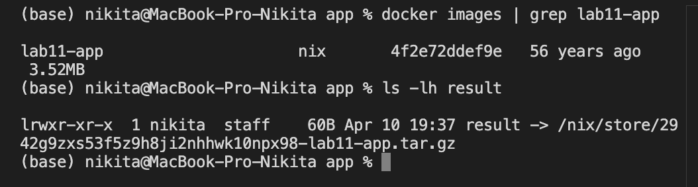

**Honest takeaway:** For this tiny app, the **traditional scratch image is smaller** because it contains almost nothing except the binary. The Nix image is **larger** here because `dockerTools` layers include **additional store paths** (e.g. timezone data) and the layered layout is optimized for **sharing and reproducibility**, not always minimal byte size for a one-off image.

### SHA256 hashes proving reproducibility (Nix tarball)

The lab suggests rebuilding with `--option build-repeat 2` and hashing `result`. I recorded the SHA256 of the image tarball after a Nix build:

```text
c7bfb4d2f3a2f41b3d367854b502d3763a13a7c3d1c588385fb32ae7a723a0b4  result
```

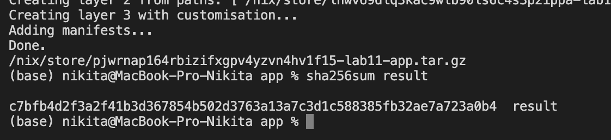

**Interpretation:** If inputs are unchanged (same `nixpkgs`, same derivations, fixed `created`), rebuilding should yield the **same store path for `result`** and the **same `sha256sum`**; `build-repeat` asks Nix to build twice and verify identical outputs.

### `docker history`: Nix image vs traditional

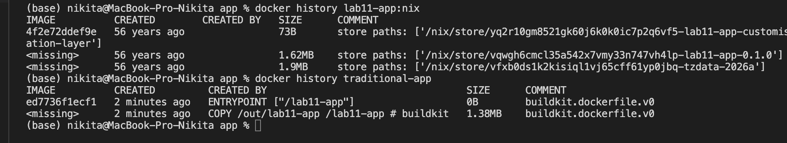

**Nix image (`lab11-app:nix`):**

- Layers are annotated with **`store paths: ['/nix/store/...']`** — each layer corresponds to **content-addressed** Nix store entries.
- **Created** times show as **“56 years ago”** (Unix epoch), matching our fixed `created` / reproducibility-oriented metadata.

**Traditional image (`traditional-app`):**

- Layers reflect **Dockerfile steps** (`COPY`, `ENTRYPOINT`) and **BuildKit**; **Created** times are **recent** (actual build time).

### Analysis: why Nix-built images are often *more reproducible* (and when they can be larger)

**Reproducibility:**

- **Fixed image metadata** (`created`, deterministic mtime patterns) avoids timestamp noise that changes digests.
- **Layers are derived from the Nix store**: same derivation graph → same paths → same tarball when nothing drifts.
- **No “latest” surprise inside the Nix closure**: dependencies are those Nix resolved for this `nixpkgs`, not whatever a registry tag points to next week.

**Size:**

- **Traditional `scratch` + one binary** is hard to beat for raw megabytes on a hello-sized program.
- **Nix images** may pull in **small but real runtime dependencies** (here, `tzdata` shows up as its own layer) and use a **layering strategy** meant for **deduplication** across many images on a host, not necessarily the smallest possible single image.

### Layer structure comparison (short)

| Aspect | `lab11-app:nix` | `traditional-app` |
|--------|------------------|-------------------|
| Layer meaning | Nix **store paths** (dependencies + app) | Dockerfile **instructions** (`COPY`, `ENTRYPOINT`) |
| Timestamps | Epoch / deterministic presentation | Wall-clock build time |
| Sharing | Same `/nix/store/...` layers reused across images | Layers unique per image unless identical Dockerfile/cache |

### Practical advantages of content-addressable Docker images

- **Auditability:** You can see **exact store paths** in history; they tie back to Nix derivations and binary caches.
- **Caching:** Identical store paths **reuse layers** across projects that share dependencies.
- **CI trust:** Same `sha256sum` on `result` (tarball) gives a **strong artifact identity** independent of “it built on my laptop yesterday”.
- **Less tag drift:** You are not relying on a moving `FROM` tag for the *contents* of the Nix closure the way a long-lived `FROM debian:bookworm` line might drift over months.