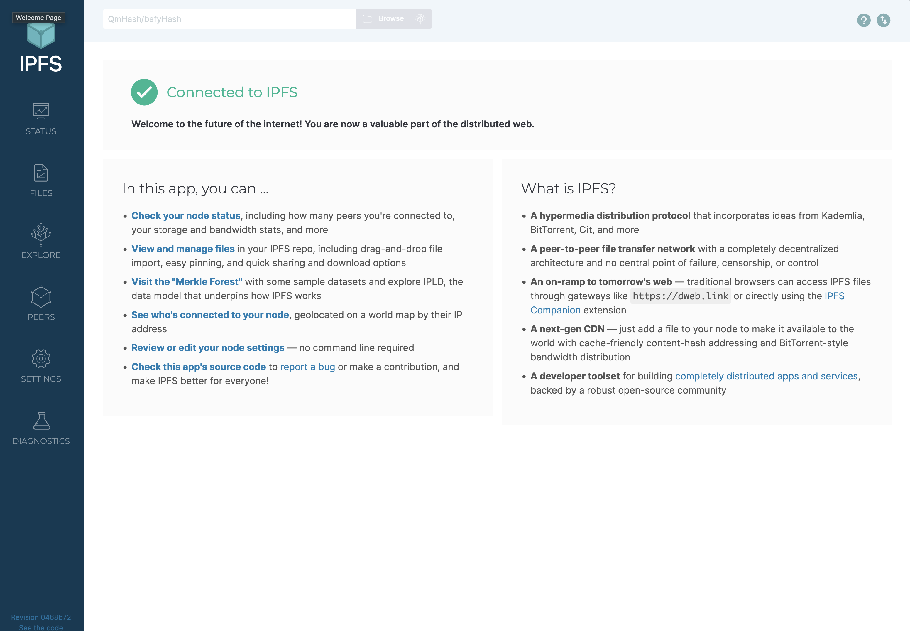
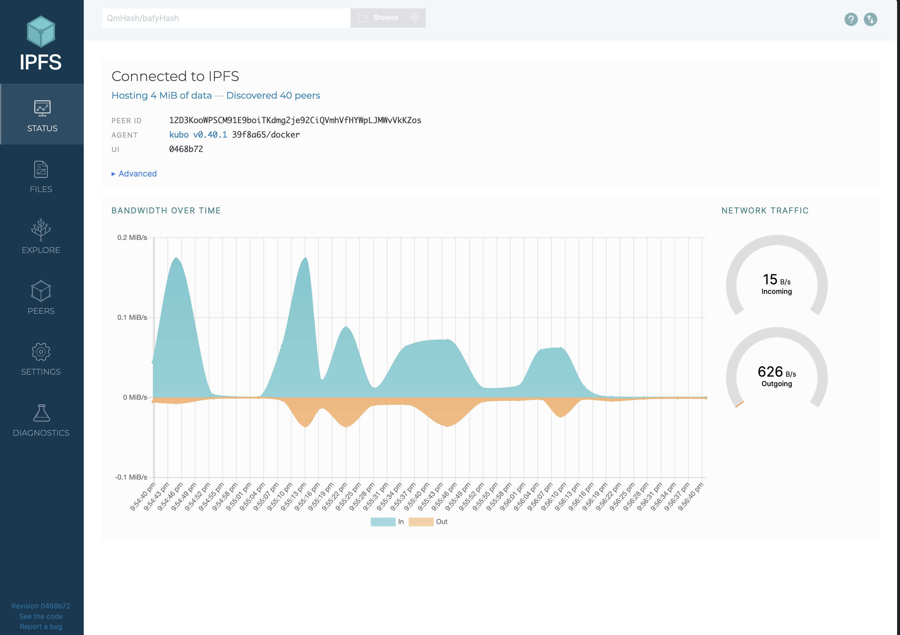
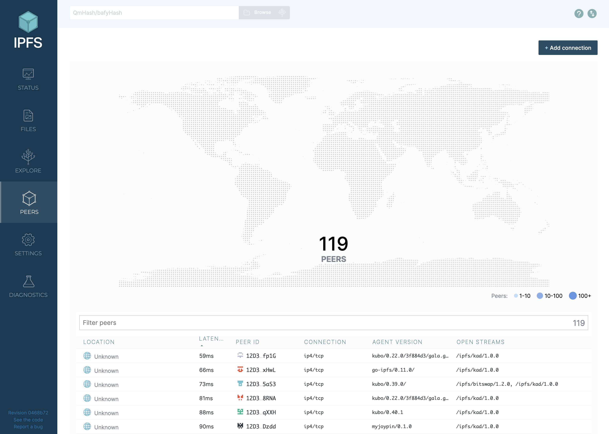
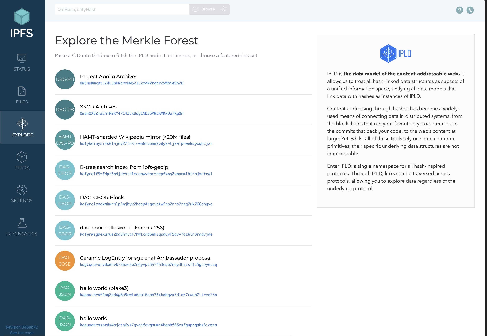
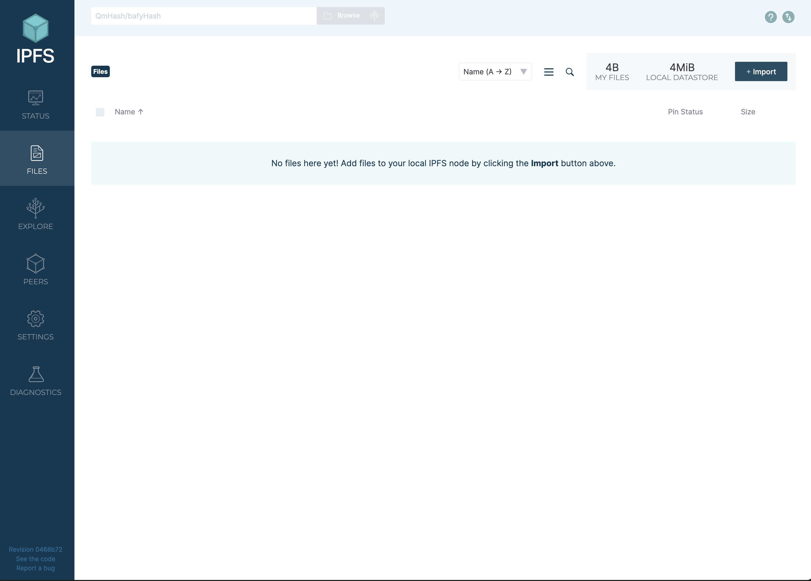

### Task 1

#### 1.1: Start IPFS Container

```bash
$ docker run -d --name ipfs_node \
  -v ipfs_staging:/export \
  -v ipfs_data:/data/ipfs \
  -p 4001:4001 -p 8080:8080 -p 5001:5001 \
  ipfs/kubo:latest
b9907a480509b819ee9b6d5c978d947a86ccc9fa6e363040c60e28888d31937d
```

#### 1.2: Verify Node Operation

```bash
$ docker exec ipfs_node ipfs swarm peers
... large list of connected peers ...
```

- IPFS node peer count from Web UI: `119`
- Network bandwidth statistics: `15 B/s incoming`, `626 B/s outgoing`

Web UI screenshots:







#### 1.3: Add File to IPFS

```bash
$ echo "Hello IPFS Lab" > testfile.txt
$ docker cp testfile.txt ipfs_node:/export/
Successfully copied 2.05kB to ipfs_node:/export/

$ docker exec ipfs_node ipfs add /export/testfile.txt
15 B / ? added QmUFJmQRosK4Amzcjwbip8kV3gkJ8jqCURjCNxuv3bWYS1 testfile.txt
15 B / 15 B  100.00%
```

- Test file CID: `QmUFJmQRosK4Amzcjwbip8kV3gkJ8jqCURjCNxuv3bWYS1`

#### 1.4: Access Content

- Local gateway URL: `http://localhost:8080/ipfs/QmUFJmQRosK4Amzcjwbip8kV3gkJ8jqCURjCNxuv3bWYS1`
- Public gateway URL 1: `https://ipfs.io/ipfs/QmUFJmQRosK4Amzcjwbip8kV3gkJ8jqCURjCNxuv3bWYS1`
- Public gateway URL 2: `https://cloudflare-ipfs.com/ipfs/QmUFJmQRosK4Amzcjwbip8kV3gkJ8jqCURjCNxuv3bWYS1`

### Observations and Analysis

IPFS uses content addressing, where the identifier is derived from the content itself. Traditional URLs usually point to a location such as a domain and path. Because of that, if content changes in IPFS, its CID changes too. In a traditional URL, the same address can still point to changed content.

Advantages of decentralized storage:
- content can be available from multiple peers
- content integrity is easier to verify through CID
- there is less dependence on one server or provider

Disadvantages:
- public gateway access may require some propagation time
- performance depends on peer/network availability
- setup and troubleshooting are less straightforward than regular web hosting

### Task 2

- 4EVERLAND project URL: `https://prodsaj-5lr4.ipfs.4everland.app/`
- Additional public domain: `https://bafybeicxy6vpbtcngpgtcmpy642uql2h7kbrpystrpivqwdztblpioz5fy.ipfs.dweb.link/`
- GitHub repository used: current course repository
- IPFS CID from 4EVERLAND dashboard: `QmUFJmQRosK4Amzcjwbip8kV3gkJ8jqCURjCNxuv3bWYS1`

#### 4EVERLAND deployment dashboard


### Observations and Analysis

4EVERLAND simplifies IPFS deployment because it gives a dashboard, deployment status, generated domain, and published IPFS CID without needing to pin and manage everything manually from the command line. It is more convenient than manual IPFS publishing, especially for repeated deployments.

Compared to traditional hosting, IPFS hosting is more content-oriented and decentralized, but it is less straightforward when you want a normal website workflow. Traditional hosting is simpler for fixed domains, updates, and standard web deployment. IPFS hosting is useful when content integrity and decentralized distribution matter more.

#### Note

In my case, 4EVERLAND asked for a repository but then also accepted a CID. I used the CID generated in Task 1, so the deployment currently points to the small published IPFS content rather than a full static site. This still shows that deployment through 4EVERLAND works, but for a more complete website deployment it would be better to publish a folder with an `index.html` file instead of a single text file CID.

