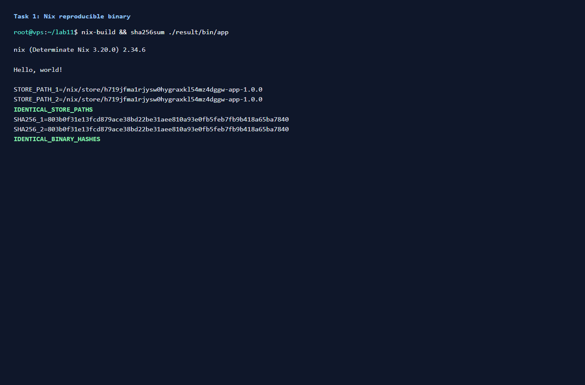
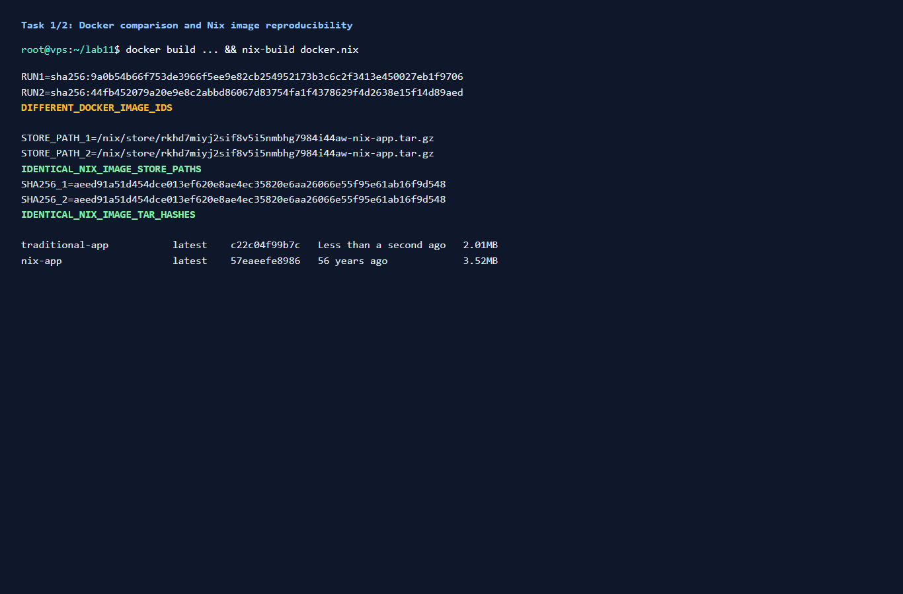
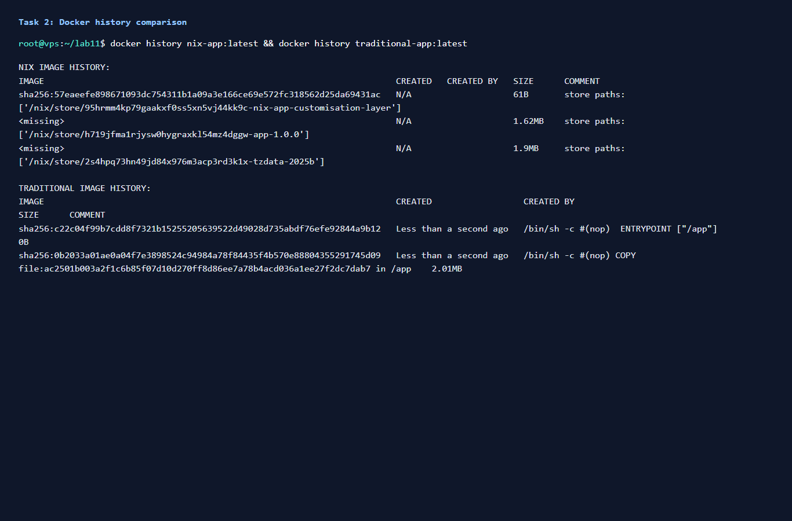
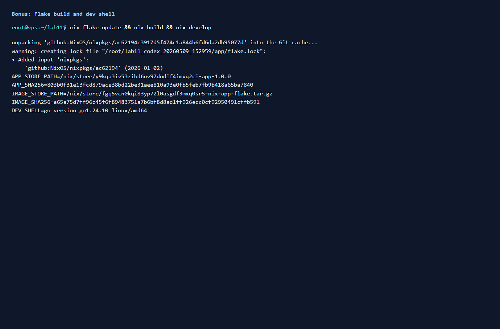

# Lab 11 — Reproducible Builds with Nix

## Task 1 — Build Reproducible Artifacts from Scratch

### Установка и проверка Nix

Я установила Nix через Determinate Systems installer:

```bash
curl --proto '=https' --tlsv1.2 -sSf -L https://install.determinate.systems/nix | sh -s -- install --no-confirm
```

После установки проверила версию Nix и базовый запуск пакета без постоянной установки:

```bash
nix --version
nix run nixpkgs#hello
```

Вывод:

```text
nix (Determinate Nix 3.20.0) 2.34.6
Hello, world!
```



### Простое Go-приложение

Файл `labs/lab11/app/main.go`:

```go
package main

import (
	"fmt"
	"time"
)

func main() {
	fmt.Println("Built with Nix at compile time")
	fmt.Printf("Running at: %s\n", time.Now().Format(time.RFC3339))
}
```

Файл `labs/lab11/app/go.mod`:

```go
module app

go 1.22
```

`time.Now()` здесь используется только во время запуска программы. На бинарник это не влияет, поэтому hash сборки остается одинаковым.

### Nix derivation

Файл `labs/lab11/app/default.nix`:

```nix
let
  pkgs = import (fetchTarball "https://github.com/NixOS/nixpkgs/archive/nixos-25.05.tar.gz") {};
in
pkgs.buildGoModule {
  pname = "app";
  version = "1.0.0";
  src = pkgs.lib.cleanSource ./.;
  vendorHash = null;
}
```

- `buildGoModule` собирает Go-приложение в контролируемом окружении Nix.
- `pname` и `version` попадают в имя результата в `/nix/store`.
- `src = pkgs.lib.cleanSource ./.` убирает лишние временные файлы из источника.
- `vendorHash = null` подходит, потому что у приложения нет внешних Go-зависимостей.

### Проверка воспроизводимости

Я собрала приложение два раза:

```bash
nix-build
readlink result
sha256sum ./result/bin/app

rm result
nix-build
readlink result
sha256sum ./result/bin/app
```

Результат:

```text
STORE_PATH_1=/nix/store/h719jfma1rjysw0hygraxkl54mz4dggw-app-1.0.0
STORE_PATH_2=/nix/store/h719jfma1rjysw0hygraxkl54mz4dggw-app-1.0.0
IDENTICAL_STORE_PATHS

SHA256_1=803b0f31e13fcd879ace38bd22be31aee810a93e0fb5feb7fb9b418a65ba7840
SHA256_2=803b0f31e13fcd879ace38bd22be31aee810a93e0fb5feb7fb9b418a65ba7840
IDENTICAL_BINARY_HASHES
```

Store path и SHA256 бинарника совпали. Это означает, что при одинаковых исходниках и одинаковом Nix expression получился один и тот же артефакт.

### Сравнение с обычным Docker build

Файл `labs/lab11/app/Dockerfile`:

```dockerfile
FROM golang:1.22
WORKDIR /app
COPY go.mod main.go ./
RUN go build -o app .
CMD ["/app/app"]
```

Я собрала этот Dockerfile два раза с одинаковым исходным кодом:

```bash
docker build --pull --no-cache -t lab11-test-app:run1 .
docker build --pull --no-cache -t lab11-test-app:run2 .
```

Получились разные image ID:

```text
RUN1=sha256:9a0b54b66f753de3966f5ee9e82cb254952173b3c6c2f3413e450027eb1f9706
RUN2=sha256:44fb452079a20e9e8c2abbd86067d83754fa1f4378629f4d2638e15f14d89aed
DIFFERENT_DOCKER_IMAGE_IDS
```

Причина простая: обычная Docker-сборка включает изменяющиеся metadata, например timestamps слоев. Поэтому даже при одном и том же `main.go` итоговый image ID меняется.

### Почему Nix воспроизводимый

Nix фиксирует входы сборки и запускает build в изолированном окружении. Сборка не должна зависеть от случайного состояния машины: системных библиотек, локального PATH, временных файлов или текущей даты. Если входы не меняются, Nix получает тот же store path и тот же бинарный hash.

Формат Nix store path:

```text
/nix/store/h719jfma1rjysw0hygraxkl54mz4dggw-app-1.0.0
```

- `/nix/store` — глобальное хранилище Nix.
- `h719jfma1rjysw0hygraxkl54mz4dggw` — hash, связанный с входами derivation.
- `app-1.0.0` — имя пакета и версия.

Если поменять исходник, версию или зависимости, hash-часть пути тоже изменится.

## Task 2 — Reproducible Docker Images with Nix

### Docker image через dockerTools

Файл `labs/lab11/app/docker.nix`:

```nix
let
  pkgs = import (fetchTarball "https://github.com/NixOS/nixpkgs/archive/nixos-25.05.tar.gz") {};
  app = pkgs.buildGoModule {
    pname = "app";
    version = "1.0.0";
    src = pkgs.lib.cleanSource ./.;
    vendorHash = null;
  };
in
pkgs.dockerTools.buildLayeredImage {
  name = "nix-app";
  tag = "latest";
  contents = [ app ];
  config = {
    Cmd = [ "${app}/bin/app" ];
  };
}
```

Здесь я переиспользовала тот же Go package и завернула его в Docker image через `pkgs.dockerTools.buildLayeredImage`. Я специально не использовала `created = "now"`, потому что текущая дата ломает воспроизводимость.

Сборка и запуск:

```bash
nix-build docker.nix
docker load -i result
docker run --rm nix-app:latest
```

Вывод контейнера:

```text
Built with Nix at compile time
Running at: 2026-05-09T15:33:46Z
```



### Проверка reproducible image

Я два раза собрала `docker.nix` и сравнила tarball:

```text
STORE_PATH_1=/nix/store/rkhd7miyj2sif8v5i5nmbhg7984i44aw-nix-app.tar.gz
STORE_PATH_2=/nix/store/rkhd7miyj2sif8v5i5nmbhg7984i44aw-nix-app.tar.gz
IDENTICAL_NIX_IMAGE_STORE_PATHS

SHA256_1=aeed91a51d454dce013ef620e8ae4ec35820e6aa26066e55f95e61ab16f9d548
SHA256_2=aeed91a51d454dce013ef620e8ae4ec35820e6aa26066e55f95e61ab16f9d548
IDENTICAL_NIX_IMAGE_TAR_HASHES
```

Также Docker после загрузки показал фиксированное время создания:

```text
ID=sha256:57eaeefe898671093dc754311b1a09a3e166ce69e572fc318562d25da69431ac
CREATED=1970-01-01T00:00:01Z
SIZE=3517333
```

Фиксированный `CREATED=1970-01-01T00:00:01Z` важен: Nix не подставляет текущую дату, поэтому image artifact можно пересобрать идентично.

### Traditional Dockerfile comparison

Файл `labs/lab11/app/Dockerfile.traditional`:

```dockerfile
FROM golang:1.22 AS builder
WORKDIR /src
COPY go.mod main.go ./
ENV CGO_ENABLED=0
RUN go build -o /out/app .

FROM scratch
COPY --from=builder /out/app /app
ENTRYPOINT ["/app"]
```

Размеры:

```text
traditional-app   latest   c22c04f99b7c   Less than a second ago   2.01MB
nix-app           latest   57eaeefe8986   56 years ago             3.52MB
```

В моем конкретном сравнении traditional `scratch` image оказался меньше: `2.01MB` против `3.52MB`. Это нормально, потому что Nix image дополнительно включил store layer с `tzdata`, а traditional image содержит только один статический бинарник.

Главный результат здесь не размер, а воспроизводимость: Nix image tarball пересобрался с тем же hash, а обычный Docker image получил текущий timestamp.

### Docker history

История Nix image:

```text
IMAGE                                                                     CREATED   CREATED BY   SIZE      COMMENT
sha256:57eaeefe898671093dc754311b1a09a3e166ce69e572fc318562d25da69431ac   N/A                    61B       store paths: ['/nix/store/95hrmm4kp79gaakxf0ss5xn5vj44kk9c-nix-app-customisation-layer']
<missing>                                                                 N/A                    1.62MB    store paths: ['/nix/store/h719jfma1rjysw0hygraxkl54mz4dggw-app-1.0.0']
<missing>                                                                 N/A                    1.9MB     store paths: ['/nix/store/2s4hpq73hn49jd84x976m3acp3rd3k1x-tzdata-2025b']
```

История traditional image:

```text
IMAGE                                                                     CREATED                  CREATED BY                                                                                              SIZE      COMMENT
sha256:c22c04f99b7cdd8f7321b15255205639522d49028d735abdf76efe92844a9b12   Less than a second ago   /bin/sh -c #(nop)  ENTRYPOINT ["/app"]                                                                  0B
sha256:0b2033a01ae0a04f7e3898524c94984a78f84435f4b570e88804355291745d09   Less than a second ago   /bin/sh -c #(nop) COPY file:ac2501b003a2f1c6b85f07d10d270ff8d86ee7a78b4acd036a1ee27f2dc7dab7 in /app    2.01MB
```



### Анализ Docker image через Nix

Nix image более прозрачен по структуре: в history видно, какие `/nix/store/...` paths попали в слои. Это удобно для аудита: можно понять, из каких конкретных Nix outputs состоит image.

Практические плюсы content-addressable Docker images:

- повторная сборка дает тот же tarball hash;
- легче сравнивать артефакты между CI jobs;
- зависимости видны через Nix store paths;
- меньше риска "у меня собралось по-другому";
- rollback проще, потому что артефакт связан с точными входами.

## Bonus Task — Modern Nix with Flakes

Я также выполнила bonus task, чтобы зафиксировать `nixpkgs` через `flake.lock`.

Файл `labs/lab11/app/flake.nix`:

```nix
{
  description = "Lab 11 reproducible Go app";

  inputs = {
    nixpkgs.url = "github:NixOS/nixpkgs/nixos-25.05";
  };

  outputs = { self, nixpkgs }:
    let
      system = "x86_64-linux";
      pkgs = import nixpkgs { inherit system; };
      app = pkgs.buildGoModule {
        pname = "app";
        version = "1.0.0";
        src = pkgs.lib.cleanSource ./.;
        vendorHash = null;
      };
      image = pkgs.dockerTools.buildLayeredImage {
        name = "nix-app-flake";
        tag = "latest";
        contents = [ app ];
        config = {
          Cmd = [ "${app}/bin/app" ];
        };
      };
    in {
      packages.${system}.default = app;
      dockerImages.${system}.default = image;
      devShells.${system}.default = pkgs.mkShell {
        buildInputs = [
          pkgs.go
          pkgs.gopls
        ];
      };
    };
}
```

Фрагмент `flake.lock`:

```json
{
  "locked": {
    "lastModified": 1767313136,
    "narHash": "sha256-16KkgfdYqjaeRGBaYsNrhPRRENs0qzkQVUooNHtoy2w=",
    "owner": "NixOS",
    "repo": "nixpkgs",
    "rev": "ac62194c3917d5f474c1a844b6fd6da2db95077d",
    "type": "github"
  },
  "original": {
    "owner": "NixOS",
    "ref": "nixos-25.05",
    "repo": "nixpkgs",
    "type": "github"
  }
}
```

Команды:

```bash
nix flake update
nix build .#packages.x86_64-linux.default
nix build .#dockerImages.x86_64-linux.default
nix develop --command go version
```

Результаты:

```text
APP_STORE_PATH=/nix/store/y9kqa3iv53zibd6nv97dndif4imvq2ci-app-1.0.0
APP_SHA256=803b0f31e13fcd879ace38bd22be31aee810a93e0fb5feb7fb9b418a65ba7840
IMAGE_STORE_PATH=/nix/store/fgq5vcn0kqi83yp72l0asgdf3mxq0sr5-nix-app-flake.tar.gz
IMAGE_SHA256=a65a75d7ff96c45f6f89483751a7b6bf8d8ad1ff926ecc0cf92950491cffb591
DEV_SHELL=go version go1.24.10 linux/amd64
```

Повторная flake-сборка приложения дала тот же результат:

```text
/nix/store/y9kqa3iv53zibd6nv97dndif4imvq2ci-app-1.0.0
803b0f31e13fcd879ace38bd22be31aee810a93e0fb5feb7fb9b418a65ba7840  ./result/bin/app
/nix/store/y9kqa3iv53zibd6nv97dndif4imvq2ci-app-1.0.0
803b0f31e13fcd879ace38bd22be31aee810a93e0fb5feb7fb9b418a65ba7840  ./result/bin/app
```



### Почему flakes лучше обычного default.nix

Обычный `default.nix` может быть воспроизводимым, но ему нужно отдельно аккуратно фиксировать источник `nixpkgs`. Flakes делают это стандартно через `flake.lock`: там записан commit, `narHash` и источник. Поэтому другой человек может взять тот же репозиторий и получить тот же набор зависимостей.

Dev shell тоже полезен: вместо ручной установки Go и `gopls` можно зайти в окружение через `nix develop`. Так у всех участников проекта будет одинаковый набор инструментов.

## Итог

В этой лабораторной у меня получилось:

- собрать Go binary через Nix два раза с одинаковым store path;
- получить одинаковый SHA256 бинарника;
- показать, что обычный Docker build дает разные image ID;
- собрать Docker image через Nix и получить одинаковый tarball hash;
- сравнить layer history Nix image и traditional image;
- добавить flake, lock file и dev shell.

Основной вывод: Nix хорошо подходит для CI/CD, потому что он делает build inputs явными. Это уменьшает случайные отличия между локальной машиной, VPS и pipeline.
