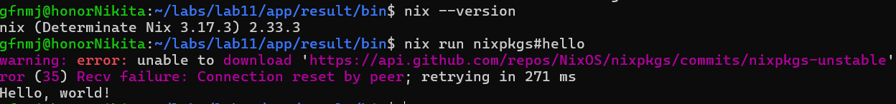
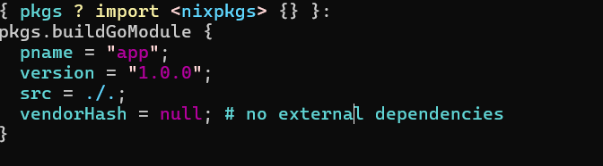
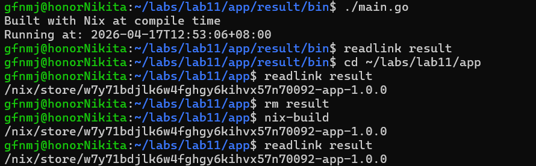
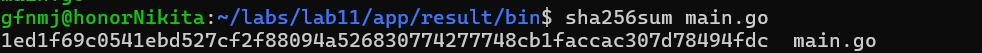
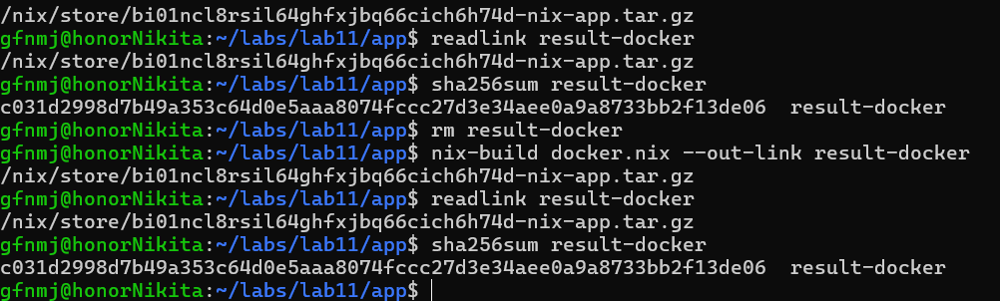

# task 1
## 1.1 verification output


## 1.2 default.nix file



## 1.3 indetical paths


## 1.4 sha256 hash


## 1.5 comparison with docker

Observed image IDs:

```text
sha256:1dcf826c703815e039e415d2ba00422f93765075e01ee6fd91c7f7b1ad4fe763
sha256:460b15b26642940af5f0795e6faeaa13918ed80367efb854349515a3e38ddd08
```

## analyze

Several factors prevent Docker from achieving reproducible builds:

- Running the same source code can result in different image IDs;
- Metadata and variations in layers affect Docker build outputs;
- Build timestamps and the state of the build environment influence traditional Docker builds.

### Analysis: what enables reproducible builds in Nix

Nix ensures reproducibility through the following features:

- All dependencies are explicitly specified;
- Build processes are isolated from the surrounding environment;
- Build results are identified by their content hashes;
- Identical inputs always lead to the same output path and binary hash.

### Explanation of the Nix store path format

Example:

```text
/nix/store/w7y71bdjlk6w4fghgy6kihvx57n70092-app-1.0.0
```

Breakdown:

/nix/store serves as the global storage location for Nix;

w7y71bdjlk6w4fghgy6kihvx57n70092 is a hash computed from all build inputs;

app-1.0.0 indicates the package name and its version.

# task 2

## shas and hashs from programm




## test run

Output:

```text
Built with Nix at compile time
Running at: 2026-04-17T13:38:24Z
```


## sizes
nix-app:1.0.0          13.49MB
traditional-app:first   2.93MB
traditional-app:second  2.93MB


## Analysis
### Why Nix-built images are more reproducible:

image contents come from Nix derivations instead of imperative Docker build steps;

the tarball hash is stable across repeated builds;

content-addressed outputs make the image easier to reproduce and verify.

### Practical advantages of content-addressable Docker images:

easier verification of identical results;

more predictable CI/CD behavior;

stronger guarantees against hidden changes in the build environment.
