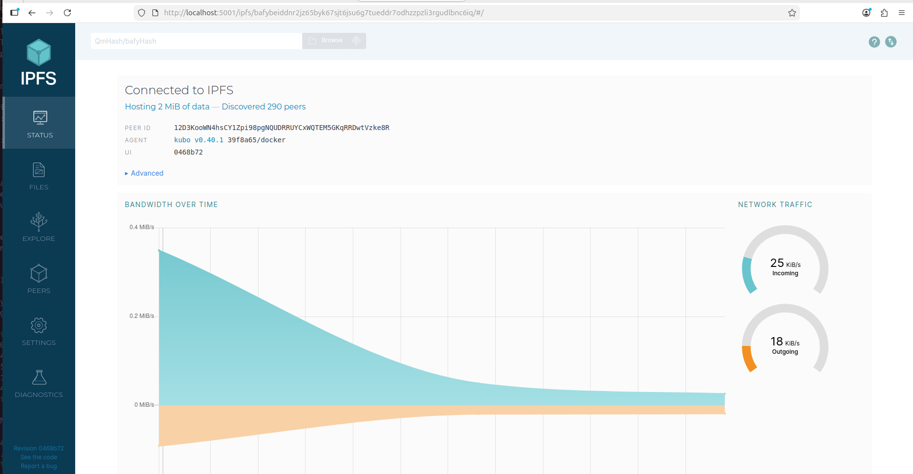
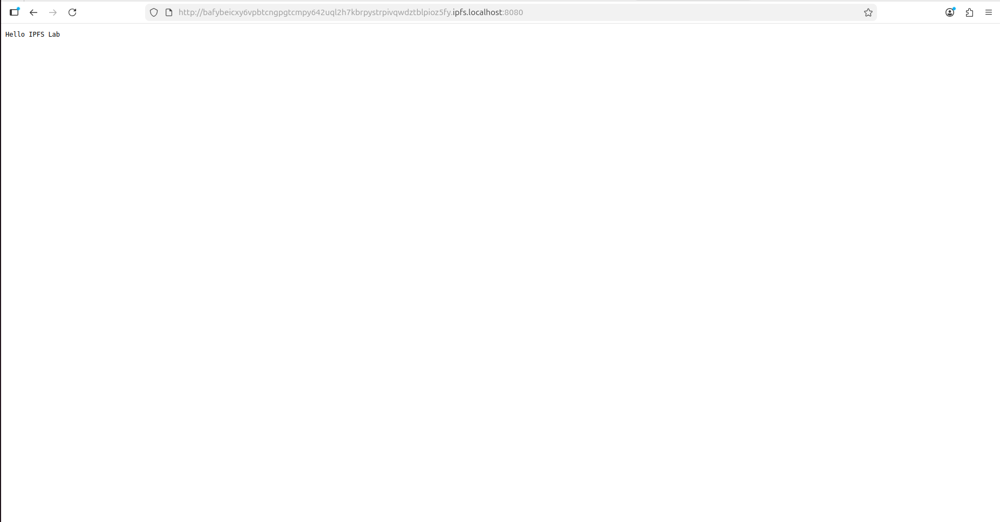
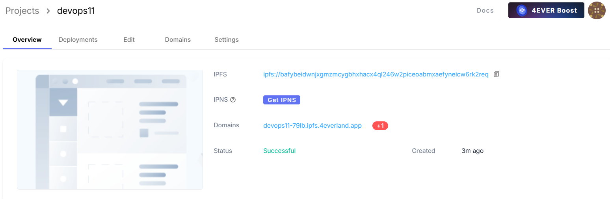
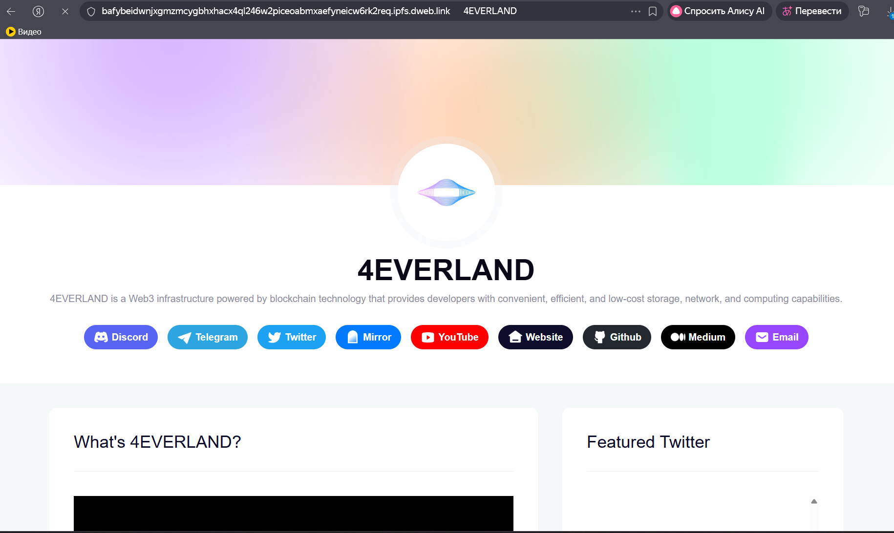

# Task 1 

## 1. IPFS Node Setup

A local IPFS node was successfully deployed using Docker with the official `ipfs/kubo:latest` image.

The container was started with the required port mappings:
- `4001` — P2P communication with other IPFS nodes
- `5001` — IPFS API and Web UI
- `8080` — HTTP gateway for accessing IPFS content

The container started successfully and showed healthy status.

## 2. Connected Peers

The node successfully connected to multiple peers in the IPFS network.

This was verified using:

```
docker exec ipfs_node ipfs swarm peers
```

The command returned a list of connected peers, which confirms that the node joined the distributed IPFS network.

Peer count from Web UI: 290 discovered peers.

---
 ## 3. Network Bandwidth Statistics

The IPFS Web UI was available at:

```
http://127.0.0.1:5001/webui
```

The Web UI showed active node statistics during verification:

- peer count: 290 discovered peers
- incoming traffic: 25 KiB/s
- outgoing traffic: 18 KiB/s

---
## 4. Test File CID

A test file was created with the content:
```
Hello IPFS Lab
```

The file was added to IPFS, and the following CID was generated:

```
QmUFJmQRosK4Amzcjwbip8kV3gkJ8jqCURjCNxuv3bWYS1
```

---
## 5. Local Gateway Access

Local gateway URL:

```
http://localhost:8080/ipfs/QmUFJmQRosK4Amzcjwbip8kV3gkJ8jqCURjCNxuv3bWYS1
```
During verification, the local IPFS gateway successfully redirected the request to a subdomain-based local gateway URL and displayed the published content.

The content was successfully accessible through the local gateway and displayed:

```
Hello IPFS Lab
```

---
## 6. Public Gateway URLs

Public gateway URLs:

```
https://ipfs.io/ipfs/QmUFJmQRosK4Amzcjwbip8kV3gkJ8jqCURjCNxuv3bWYS1
https://cloudflare-ipfs.com/ipfs/QmUFJmQRosK4Amzcjwbip8kV3gkJ8jqCURjCNxuv3bWYS1
```

---
## 7. Analysis

Traditional URLs use location-based addressing: they point to a specific server or domain where the file is stored.

IPFS uses content-based addressing. A file is identified by its CID, which is generated from the content itself. This means:

- the integrity of the file is guaranteed
- the same content can be retrieved from any node that stores it
- access does not depend on one central server

This makes IPFS more resilient and better suited for decentralized systems.

---
## 8. Reflection
Advantages of decentralized storage
- no single point of failure
- content integrity through hashing
- distributed access to data
- better resilience for decentralized applications

Disadvantages of decentralized storage
- content propagation is not immediate
- gateway access may be unreliable or delayed
- persistence requires pinning
- the system is more complex than centralized storage

---
## 9. Screenshots

### IPFS Web UI

The screenshot below shows the IPFS Web UI with:
- peer count: 290 discovered peers
- incoming traffic: 25 KiB/s
- outgoing traffic: 18 KiB/s



### Local Gateway Access

The screenshot below shows successful access to the published file through the local IPFS gateway. The request was redirected to a subdomain-based local gateway URL, which is expected behavior in modern IPFS gateways.



# Task 2 — Static Site Deployment with 4EVERLAND

## 1. 4EVERLAND Project URL

The deployed site URL:

```
https://devops11-79lb.ipfs.4everland.app
```

---
## 2. GitHub Repository Used

No personal GitHub repository was used for this deployment.

The site was deployed using a 4EVERLAND template directly from the hosting dashboard.

---
## 3. IPFS CID from 4EVERLAND Dashboard

The deployment generated the following IPFS CID:


```
bafybeidwnjxgmzmcygbhxhacx4ql246w2piceoabmxaeifyneicw6rk2req
```

---
## 4. Deployment Verification

The deployment completed successfully in the 4EVERLAND dashboard.

Deployment status:

```
Successful
```

The site was accessible through the 4EVERLAND domain and through a public IPFS gateway.


---
## 5. Site Access via 4EVERLAND Domain

4EVERLAND domain:

```
https://devops11-79lb.ipfs.4everland.app
```

---
## 6. Site Access via Public IPFS Gateway

Public IPFS gateway URL:

```
https://bafybeidwnjxgmzmcygbhxhacx4ql246w2piceoabmxaeifyneicw6rk2req.ipfs.dweb.link
```

---
## 7. Screenshots

**4EVERLAND deployment dashboard**



**Site accessed through the 4EVERLAND domain**


**Site accessed through the public IPFS gateway**



---
## 8. Analysis

4EVERLAND simplifies IPFS deployment by providing a managed hosting workflow. Instead of manually running a local IPFS node, adding files, and handling publication steps one by one, the platform automates deployment and provides an accessible domain and dashboard.

This makes the process much closer to a traditional CI/CD-style deployment workflow and is more convenient for static websites.


---
## 9. Comparison

Traditional web hosting and IPFS hosting have different trade-offs.

Traditional hosting
- simple and familiar deployment model
- direct control over the hosting server
- content is location-based and depends on a specific provider

IPFS hosting
- content is addressed by CID
- content integrity is guaranteed by hashing
- more decentralized and resilient
- public access may depend on propagation and gateway availability

Overall, 4EVERLAND makes IPFS hosting easier to use by hiding much of the complexity of decentralized deployment.