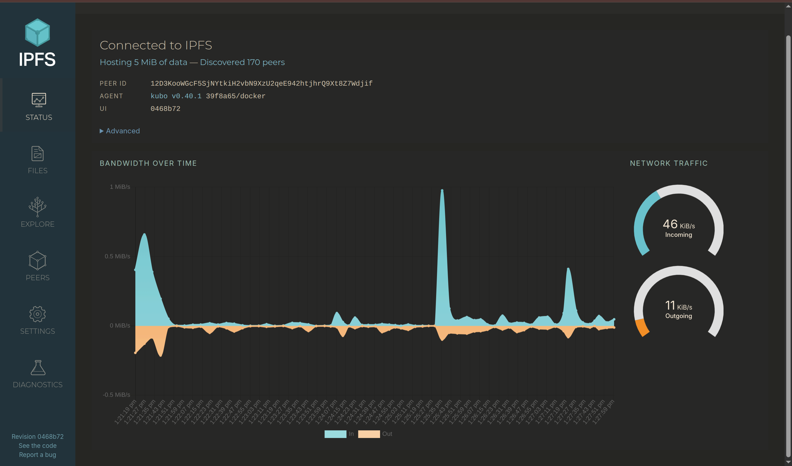
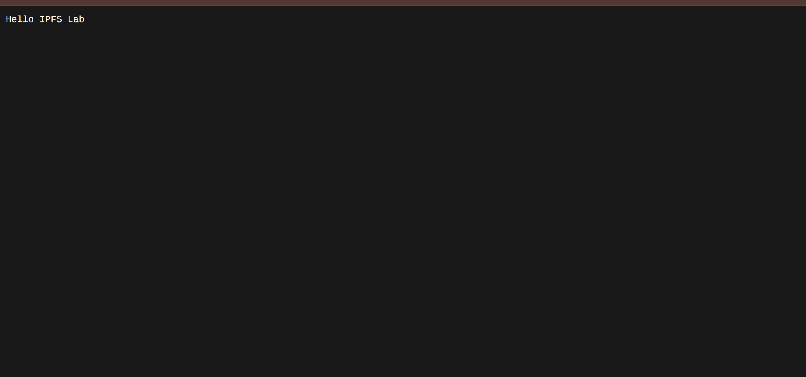
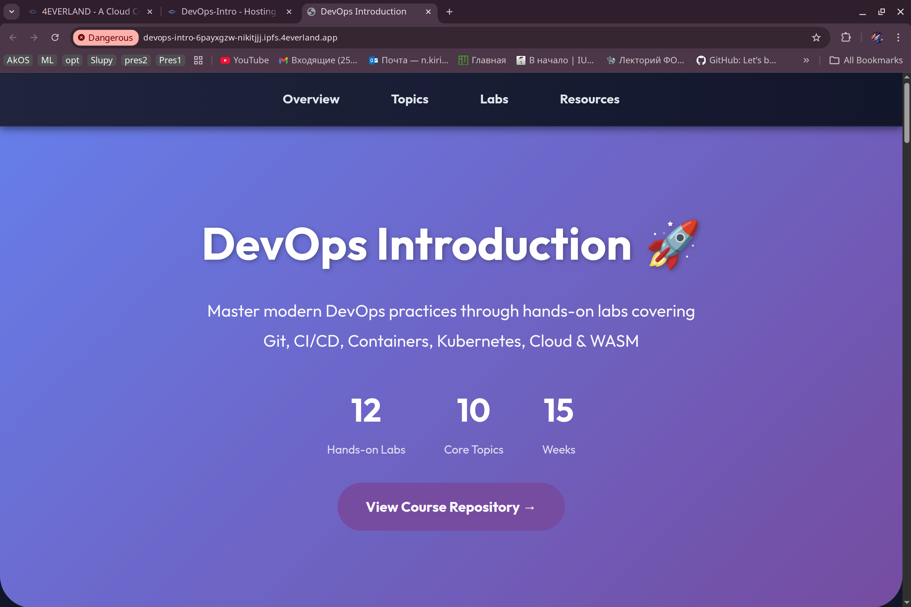
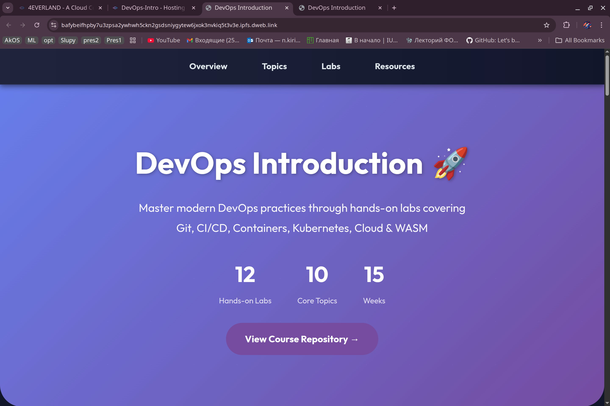

# Lab 11 Submission — Decentralized Web Hosting with IPFS & 4EVERLAND

## Task 1 — Local IPFS Node Setup and File Publishing

### 1.1–1.2: IPFS Node Setup & Verification
- **Docker command used:**  
  ```bash
  sudo docker run -d --name ipfs_node \
    -v ipfs_staging:/export \
    -v ipfs_data:/data/ipfs \
    -p 4001:4001 -p 8080:8080 -p 5001:5001 \
    ipfs/kubo:latest
  ```
- **Node status (after pull & start):**  
  - Image pulled successfully (`ipfs/kubo:latest`, digest `sha256:9c70a3dba0b5f362bf99317a02384a194f5c91cf5388abdb8fe7d64d83dd20bb`)  
  - Container ID: `a9fd37c620e96ee780436ebb806ad54ef13a2e70393dc7126cf54fb6b8dcd20d`  
  - **Discovered peers:** 170  
  - **Hosting:** 2 MiB of data  
  - **Peer ID:** `12D3KooWGcF5SjNYtkiH2vbN9XzU2qeE942htjhrQ9Xt8Z7Wdjif`  
  - **Agent version:** `kubov0.40.1` (39f8a65/docker)  
- **Bandwidth statistics (from terminal output / Web UI at http://127.0.0.1:5001/webui/):**  
  - Incoming: 46 KiB/s  
  - Outgoing: 11 KiB/s  



### 1.3–1.4: File Publishing & Access
- **Test file created:** `testfile.txt` (“Hello IPFS Lab”, 15 bytes)  
- **CID obtained:**  
  **QmUFJmQRosK4Amzcjwbip8kV3gkJ8jqCURjCNxuv3bWYS1**

**Access links:**
- Local gateway: `http://localhost:8080/ipfs/QmUFJmQRosK4Amzcjwbip8kV3gkJ8jqCURjCNxuv3bWYS1` 
  
- Public gateways:  
  - https://ipfs.io/ipfs/QmUFJmQRosK4Amzcjwbip8kV3gkJ8jqCURjCNxuv3bWYS1  
  - https://cloudflare-ipfs.com/ipfs/QmUFJmQRosK4Amzcjwbip8kV3gkJ8jqCURjCNxuv3bWYS1  

**Analysis:**  
IPFS uses **content addressing** (CID = cryptographic hash of the file content) instead of traditional location-based URLs. A traditional URL (`https://example.com/file.txt`) points to a specific server and can break if the server goes down or the file is moved. An IPFS CID is unique to the *content itself* — the same file always has the same address, no matter which node serves it. This guarantees integrity (the CID verifies the file hasn’t changed) and makes the content portable across the entire decentralized network.

**Reflection:**  
**Advantages of decentralized storage:**  
- No single point of failure — content stays available as long as at least one node pins it.  
- Censorship resistance — no central authority can take the file down.  
- Built-in versioning and deduplication via content hashing.  

**Disadvantages:**  
- Propagation delay (2–5 minutes for public gateways).  
- Content can be garbage-collected if not pinned.  
- Slightly higher latency and complexity compared to centralized hosting.  

## Task 2 — Static Site Deployment with 4EVERLAND

### 2.1–2.2: Project Setup & Deployment
- **4EVERLAND project URL:**  
  - https://devops-intro-6payxgzw-nikitjjj.ipfs.4everland.app  
  - (Previous deployment: https://devops-intro-4-uj4s.ipfs.4everland.app)  
- **GitHub repository used:** course repository (branch `feature/lab11`)  
- **IPFS CID from 4EVERLAND dashboard:**  
  **bafybeifhpby7u3zpsa2ywhwh5ckn2gsdsniygytew6jxok3nvkiq5t3v3e**

**Access links:**
- 4EVERLAND subdomain: https://devops-intro-6payxgzw-nikitjjj.ipfs.4everland.app

- Public IPFS gateway: https://bafybeifhpby7u3zpsa2ywhwh5ckn2gsdsniygytew6jxok3nvkiq5t3v3e.ipfs.dweb.link/
  
- Direct IPFS protocol: `ipfs://bafybeifhpby7u3zpsa2ywhwh5ckn2gsdsniygytew6jxok3nvkiq5t3v3e`

**Deployment info:**  
- Status: **Successful**  
- Build time: 3s  
- Last updated: 5m ago

*(Screenshots to attach in PR:*
- 4EVERLAND dashboard showing “Successful”, CID, and deployment time  
- Site loaded on `devops-intro-6payxgzw-nikitjjj.ipfs.4everland.app`  
- Same site loaded via public gateway `bafybeifhpby7u3zpsa2ywhwh5ckn2gsdsniygytew6jxok3nvkiq5t3v3e.ipfs.dweb.link`)*

**Analysis:**  
4EVERLAND dramatically simplifies IPFS deployment compared to manual methods. Instead of running `ipfs add`, pinning manually, and managing gateways yourself, 4EVERLAND offers:
- One-click GitHub integration + automatic CI/CD on every push.
- Automatic pinning on IPFS/Filecoin (no manual `ipfs pin add` needed).
- Built-in custom subdomain (`*.ipfs.4everland.app`) and analytics dashboard.
- Framework detection and build settings for static sites.

You simply connect a repo, choose the publish directory (`labs/lab11/app`), and 4EVERLAND handles the rest.

**Comparison: Traditional web hosting vs IPFS hosting**

| Aspect                  | Traditional Hosting (Web 2.0)          | IPFS + 4EVERLAND (Web3)                     |
|-------------------------|----------------------------------------|---------------------------------------------|
| Addressing              | Location-based URL                     | Content-based CID                           |
| Availability            | Single server = single point of failure| Distributed; survives node failures         |
| Update process          | Overwrite file on server               | New CID on every change (immutable)         |
| Censorship resistance   | Low (provider can remove)              | High                                        |
| Cost model              | Monthly subscription                   | Pay-once pinning / free tier available      |
| Speed / Latency         | Usually faster                         | Slightly slower (propagation + gateway)     |
| Ease of use             | Very simple                            | Simplified by 4EVERLAND                    |
