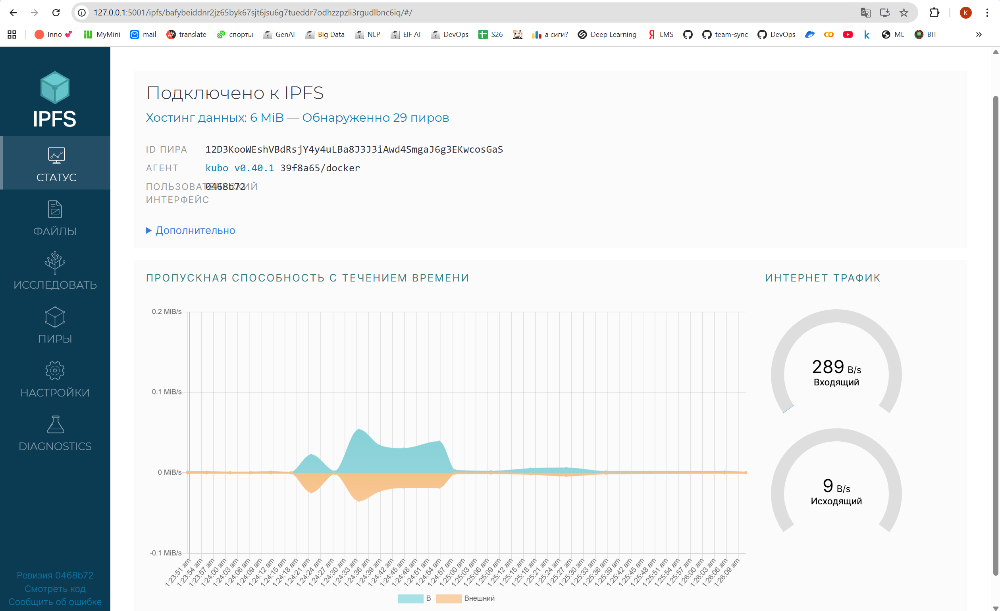
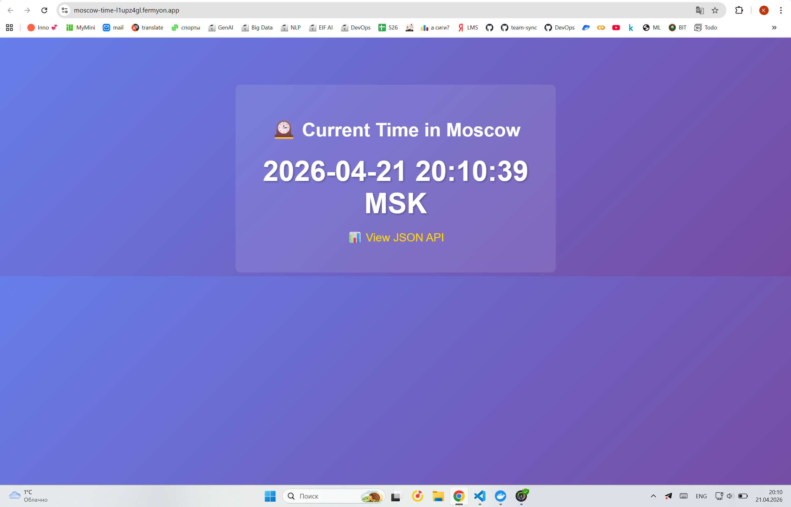
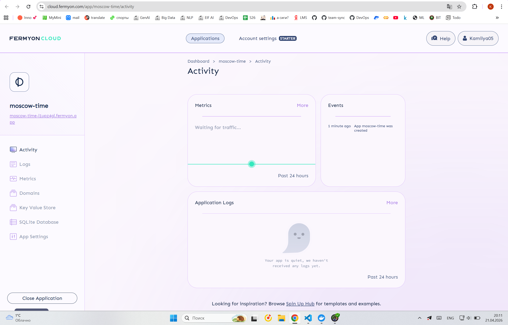
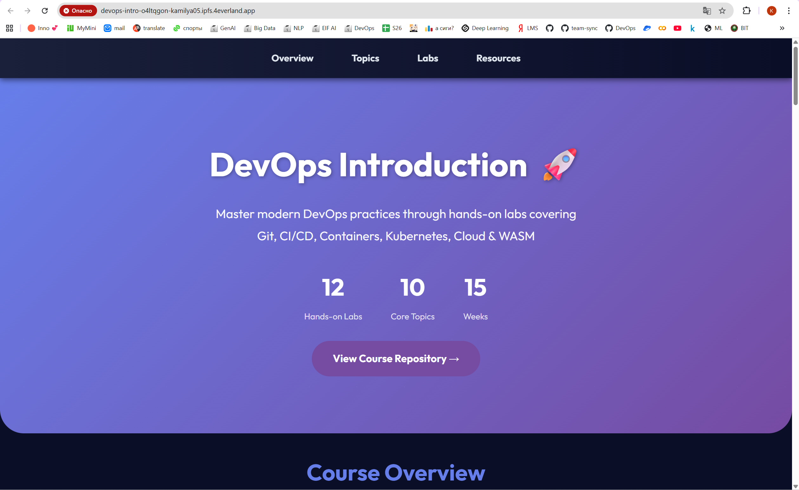
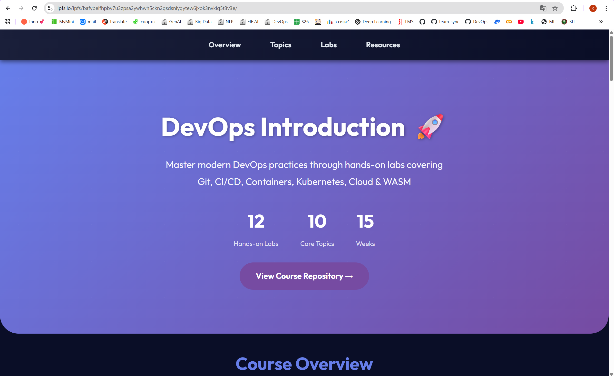

# Lab 11 — Decentralized Web Hosting with IPFS & 4EVERLAND

**Student:** Kamilya Shakirova  
**Date:** 11-04-2026  

---

## Task 1 — Local IPFS Node Setup and File Publishing

- [x] IPFS node peer count from Web UI
- [x] Network bandwidth statistics
- [x] Test file CID
- [x] Screenshots of local gateway access
- [x] Public gateway URLs
- [x] Analysis: How does IPFS's content addressing differ from traditional URLs?
- [x] Reflection: What are the advantages and disadvantages of decentralized storage?

### 1.1 Start IPFS Container

1. **Deploy IPFS Node:**

```bash
kamilya@Kama:/mnt/d/Programs/DevOps-Intro$ docker run -d --name ipfs_node -v ipfs_staging:/export -v ipfs_data:/data/ipfs -p 4001:4001 -p 8080:8080 -p 5001:5001 ipfs/kubo:latest
Unable to find image 'ipfs/kubo:latest' locally
latest: Pulling from ipfs/kubo
46d362e03e6a: Pull complete 
cb759faa3aee: Pull complete 
77b921033c2e: Pull complete 
2ae54af8de36: Pull complete 
f91d6fce5da1: Pull complete 
430080cd79ea: Pull complete 
13ecce80d2ec: Pull complete 
a02b07683205: Pull complete 
46e123f20291: Pull complete 
b146a600d9d6: Pull complete 
Digest: sha256:9c70a3dba0b5f362bf99317a02384a194f5c91cf5388abdb8fe7d64d83dd20bb
Status: Downloaded newer image for ipfs/kubo:latest
7f99171b6458810e8edd7296dbcc7a9af316e4c156f6060115c6abe1b9f505da
```

   <details>
   <summary>🔍 Understanding IPFS ports</summary>

   - `4001`: P2P communication with other IPFS nodes
   - `8080`: HTTP gateway for accessing IPFS content
   - `5001`: API endpoint for IPFS commands and Web UI

   </details>

2. **Wait for Initialization:**

   Wait 60 seconds for the node to initialize and connect to peers.

### 1.2 Verify Node Operation

1. **Check Connected Peers:**

```bash
kamilya@Kama:/mnt/d/Programs/DevOps-Intro$ docker exec ipfs_node ipfs swarm peers
/ip4/101.71.239.177/udp/60506/quic-v1/p2p/12D3KooWNiTw8sNu7L6YjzhznneTPY6Uquo6EP6UUiD1VK4XKsZS
/ip4/106.173.203.109/tcp/48888/p2p/12D3KooWFXPsmQE6r3AYBuWJf76utuQQ75ALNjjdqrpC4DzENRXG
/ip4/141.95.145.190/udp/4001/quic-v1/p2p/12D3KooWKSMTgHEZWv82tVE51XSw5PAJLRE3rLvfVWy1nc319oiD
/ip4/178.63.54.56/udp/4001/quic-v1/p2p/12D3KooWH15vm3ZMFWX8cmEwfou8kBUVrq6xzqhCk53e43MCgspL
/ip4/185.239.209.97/udp/4001/quic-v1/p2p/12D3KooWQTTkKzF1TJrASBBo2YWf1Mq4fW2rvrJqJrsHHayxe3yc
/ip4/212.69.86.113/udp/4001/quic-v1/p2p/12D3KooWS3QLnth1V5ASfzHc4yjPq3MAmcrFSt9sQzHBRcPyiSmF
/ip4/3.91.223.212/udp/9020/quic-v1/p2p/12D3KooWMnSWYvkr2iaMpE26puHSust7RBxosQqxf7zp9KFkzhaQ
/ip4/38.242.192.199/udp/4001/quic-v1/p2p/12D3KooWLYa36h6qGN3AnRSLmXpWu8fPN8mtRhCWLbJo4ocWTpf2
/ip4/45.14.49.28/udp/4001/quic-v1/p2p/12D3KooWSo8LM5rKexBXvSVfk3dHiaZxt2m2sHk5AGxnfi6rTqNJ
/ip4/46.4.114.29/tcp/4001/p2p/12D3KooWMW32CrNzN2FRSgv2VUeyNVBJmyRaeCdTnoVY144ZYSkh
/ip4/51.81.93.51/udp/4001/webrtc-direct/p2p/QmQCU2EcMqAqQPR2i9bChDtGNJchTbq5TbXJJ16u19uLTa
/ip4/52.221.217.163/tcp/4001/p2p/12D3KooWFRwiPisAGn7cLHYSPQiY9Dfh3AZF42HVmmaCx96DxM9s
/ip4/54.38.47.166/udp/4001/webrtc-direct/p2p/QmbLHAnMoJPWSCR5Zhtx6BHJX9KiKNN6tpvbUcqanj75Nb
/ip4/65.108.192.161/udp/4001/quic-v1/p2p/12D3KooWHA8e2Thc1xf63qu6tp5ASsqJH57MqqvJhySc4cM1GtnL
/ip4/65.109.101.122/udp/4001/quic-v1/p2p/12D3KooWKw6mG8wokvuZHBvsjUDhZ4uPkBS5ECL7WLNTMdFkQoyK
/ip4/65.109.68.62/udp/4001/quic-v1/p2p/12D3KooWNkkCgghJz3mDGQqw3okkrb79EDHz7nZamQSxNnaycfzC
/ip4/65.109.81.226/udp/4001/quic-v1/p2p/12D3KooWM432YvcDMdDgwsNiBmEswjKXffoVaLC6qF7ZWe2aZXm2
```

   You should see a list of connected IPFS peers.

2. **Access IPFS Web UI:**

   Open your browser and navigate to: `http://127.0.0.1:5001/webui/`

   Explore:
   - Connected peers count
   - Network bandwidth statistics
   - Node status

    This site can open on my laptop only with VPN.
    

### 1.3 Add File to IPFS

1. **Create Test File:**

```bash
kamilya@Kama:/mnt/d/Programs/DevOps-Intro$ echo "Hello IPFS Lab" > testfile.txt
kamilya@Kama:/mnt/d/Programs/DevOps-Intro$ docker cp testfile.txt ipfs_node:/export/
Successfully copied 2.05kB to ipfs_node:/export/
```

2. **Add File to IPFS:**

```bash
kamilya@Kama:/mnt/d/Programs/DevOps-Intro$ docker exec ipfs_node ipfs add /export/testfile.txt
 15 B / 15 B  100.00%added QmUFJmQRosK4Amzcjwbip8kV3gkJ8jqCURjCNxuv3bWYS1 testfile.txt
```

Note the generated CID (Content Identifier), e.g., `QmUFJmQRosK4Amzcjwbip8kV3gkJ8jqCURjCNxuv3bWYS1`

### 1.4 Access Content

1. **Via Local Gateway:**

   Open in browser: `http://localhost:8080/ipfs/<YOUR_CID>`

    

2. **Via Public Gateways:**

   - `https://ipfs.io/ipfs/<YOUR_CID>`
   - `https://cloudflare-ipfs.com/ipfs/<YOUR_CID>`
   
    

   > **Note:** Public gateway access may take 2-5 minutes to propagate


### 1.5 Analysis: How does IPFS's content addressing differ from traditional URLs?
Traditional web addressing uses location-based URLs (e.g., https://example.com/file.txt). These URLs point to a specific server where the content is hosted. If the server goes offline or the file is moved, the link breaks.

IPFS uses content-based addressing. Each file is given a unique cryptographic hash called a CID (Content Identifier), derived directly from the file's contents. The CID remains the same regardless of where the file is stored. When you request a CID, the IPFS network locates any node that holds the content and retrieves it from the nearest available source. This decouples content from a single point of failure and enables verifiability: you can trust that the content matches the CID without trusting the provider.

### 1.6 Reflection: What are the advantages and disadvantages of decentralized storage?

**Advantages:**
- Resilience and censorship resistance: Content is not tied to a single server; multiple nodes can serve the same file, making it harder to take down.
- Data integrity: The CID acts as a built-in checksum. Any modification to the content yields a different CID, ensuring authenticity.
- Efficiency: Files can be retrieved from nearby peers, potentially reducing bandwidth costs and latency.
- Permanence: Content remains accessible as long as at least one node on the network stores it.

**Disadvantages:**
- Speed and latency: Content retrieval may be slower than centralized CDNs, especially for newly added or unpopular files that are not widely replicated.
- Lack of built-in privacy: By default, files are public on the IPFS network. Anyone with the CID can access the content.
- No guaranteed persistence: Unless you pin your content or pay a pinning service, it may be garbage-collected over time if no node keeps it.
- Mutable content challenges: IPFS is immutable by design. Updating a website requires publishing a new CID and updating references (e.g., using IPNS or DNSLink), which adds complexity.


---

## Task 2 — Static Site Deployment with 4EVERLAND

- [x] 4EVERLAND project URL (`your-site.4everland.app`)
- [x] GitHub repository used (if personal project)
- [x] IPFS CID from 4EVERLAND dashboard
- [x] Screenshots of:
  - 4EVERLAND deployment dashboard
  - Site accessed through 4EVERLAND domain
  - Site accessed through public IPFS gateway
- [x] Analysis: How does 4EVERLAND simplify IPFS deployment compared to manual methods?
- [x] Comparison: What are the trade-offs between traditional web hosting and IPFS hosting?


### 2.1 Set Up 4EVERLAND Project

1. **Create Account:**

   Sign up at [4EVERLAND.org](https://www.4everland.org/) (use GitHub or wallet authentication)

   

2. **Create New Project:**

   <details>
   <summary>📋 Project Setup Steps</summary>

   1. Click "Create New Project" → "Connect GitHub repository"
   2. Select your current course repository (or any personal web app/site)
   3. Choose branch to deploy
   4. Configure build settings:
      - **Platform:** IPFS/Filecoin
      - **Framework:** Other (or select appropriate framework)
      - **Publish directory:** `labs/lab11/app` (adjust based on your project structure)
   5. Click "Deploy"

   </details>

   
   

### 2.2 Verify Deployment

1. **Check Deployment Status:**

   In 4EVERLAND dashboard:
   - Wait for deployment to complete
   - Note the IPFS CID under "Site Info"
   - Access site via provided `*.4everland.app` subdomain

   `https://devops-intro-o4ltqgon-kamilya05.ipfs.4everland.app/`
   

2. **Verify on Public Gateway:**

   Access your site via: `https://ipfs.io/ipfs/<CID-from-4EVERLAND>`
   
   
   `https://ipfs.io/ipfs/bafybeifhpby7u3zpsa2ywhwh5ckn2gsdsniygytew6jxok3nvkiq5t3v3e/`
   

3. **Test Continuous Deployment (Optional):**

   - Make a change to your repository
   - Push to GitHub
   - Observe automatic redeployment in 4EVERLAND


### 2.3 Analysis: How does 4EVERLAND simplify IPFS deployment compared to manual methods?

Manual IPFS deployment involves:
- Running and maintaining an IPFS node (or using a local daemon).
- Adding files/folders manually with `ipfs add`.
- Ensuring the content is pinned (either on your own node or via a pinning service) to prevent garbage collection.
- Setting up IPNS or DNSLink for human-readable names that can update.

4EVERLAND abstracts all of this by:
- Providing a **Git-based CI/CD pipeline** that automatically builds and uploads your static site to IPFS with each push.
- **Automatic pinning** on their infrastructure, ensuring content persistence without user intervention.
- Offering a **free subdomain** (`*.4everland.app`) with automatic IPNS/DNSLink updates, so the same URL always points to the latest CID.
- Providing a **dashboard** with deployment history, CIDs, and analytics, making management trivial for developers.

### 2.4 Comparison: What are the trade-offs between traditional web hosting and IPFS hosting?

| Feature | Traditional Hosting (e.g., Vercel, Netlify, Shared Hosting) | IPFS Hosting (via 4EVERLAND) |
|---------|------------------------------------------------------------|------------------------------|
| **Content Addressing** | Location-based (URL points to server) | Content-based (CID derived from file hashes) |
| **Censorship Resistance** | Low – server can be taken down or blocked | High – content exists on multiple nodes globally |
| **Data Integrity** | Relies on TLS and trust in provider | Cryptographic verification inherent in CID |
| **Speed & Latency** | Optimized via CDNs, often very fast | Variable; depends on peer availability and caching |
| **Persistence** | Guaranteed as long as you pay | Requires pinning; 4EVERLAND handles this automatically |
| **Ease of Updates** | Simple – upload new files or push to Git | Immutable; each update produces new CID; requires IPNS/DNSLink (4EVERLAND automates this) |
| **Cost** | Varies; often monthly subscription | 4EVERLAND offers generous free tier (IPFS) |
| **Privacy** | Content can be private with authentication | Public by default; any CID can be accessed |

**Trade-offs:**  
IPFS hosting via 4EVERLAND offers superior censorship resistance, built-in integrity verification, and a truly decentralized architecture. However, it may be slightly slower for first-time content retrieval and lacks native support for private content or server-side processing. For static sites and public data, the benefits of decentralization and permanence are compelling. For dynamic applications or content requiring access control, traditional hosting remains more practical.

