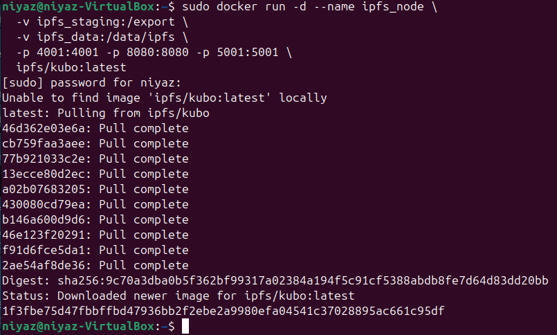
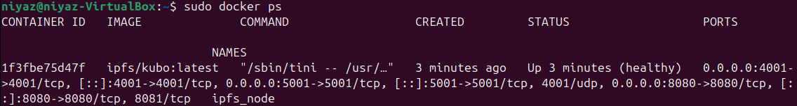
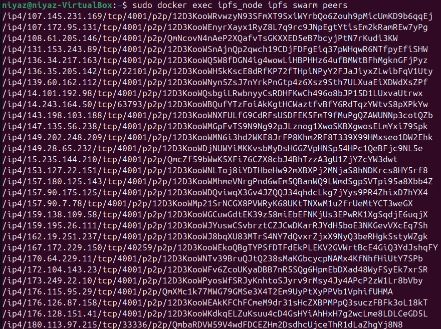
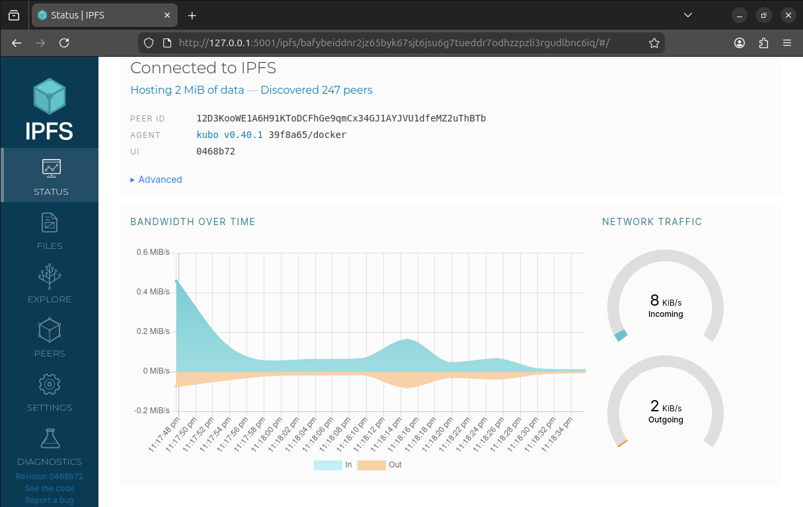
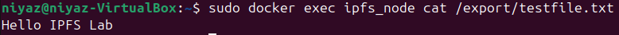

# Lab 11 – IPFS & Decentralized Storage

## Task 1 – Local IPFS Node Setup and File Publishing

### 1. Start IPFS Container

**Command:**

```sh
docker run -d --name ipfs_node \
  -v ipfs_staging:/export \
  -v ipfs_data:/data/ipfs \
  -p 4001:4001 -p 8080:8080 -p 5001:5001 \
  ipfs/kubo:latest
```

**Output:**



### 2. Verify Node Operation

**Check running container:**

```sh
docker ps
```



**Check connected peers:**

```sh
docker exec ipfs_node ipfs swarm peers
```



**IPFS Web UI:**

URL:

```
http://127.0.0.1:5001/webui/
```



**Node Information:**

* Peer count: `247`
* Network bandwidth statistics:
  - Incoming traffic: `8 KiB/s`
  - Outgoing traffic: `2 KiB/s`

### 3. Add File to IPFS

**Create test file:**

```sh
echo "Hello IPFS Lab" > testfile.txt
docker cp testfile.txt ipfs_node:/export/
```

The file was intended to be copied into the container using:
`docker cp testfile.txt ipfs_node:/export/`

However, due to a Docker copy issue (`no such directory` error), the file was created directly inside the container instead:

`docker exec ipfs_node sh -c 'echo "Hello IPFS Lab" > /export/testfile.txt'`

This resulted in the same outcome, with the file successfully placed in the `/export` directory.

**Add file to IPFS:**

```sh
docker exec ipfs_node ipfs add /export/testfile.txt
```



```
added QmUFJmQRosk4AmzcjWbip8kV3gkJ8jqcURjCNXuv3bWYS1 testfile.txt
```

**Test file CID:**

**CID:** `QmUFJmQRosk4AmzcjWbip8kV3gkJ8jqcURjCNXuv3bWYS1`

### 4. Access Content

**Local gateway:**

```
http://localhost:8080/ipfs/QmUFJmQRosk4AmzcjWbip8kV3gkJ8jqcURjCNXuv3bWYS1
```


**Public gateways:**

```
https://ipfs.io/ipfs/QmUFJmQRosk4AmzcjWbip8kV3gkJ8jqcURjCNXuv3bWYS1
https://cloudflare-ipfs.com/ipfs/QmUFJmQRosk4AmzcjWbip8kV3gkJ8jqcURjCNXuv3bWYS1
```
Public gateways may not retrieve the content immediately because the node has not yet been discovered by the IPFS network. Content propagation in IPFS takes time.

### Analysis

IPFS uses content addressing instead of location-based addressing.
Traditional URLs point to a specific server location (e.g., domain name), while IPFS uses a cryptographic hash (CID) that represents the content itself. This means that data is retrieved based on its content rather than its location, ensuring integrity and enabling decentralized distribution.

### Reflection

Advantages:

* Decentralization (no single point of failure)
* Content integrity via hashing
* High availability through distributed nodes

Disadvantages:

* Slower initial access (content propagation)
* Dependence on peers availability
* Less control compared to centralized storage

## Task 2 – Static Site Deployment with 4EVERLAND

### 1. 4EVERLAND Project Setup

A 4EVERLAND account was created and connected via GitHub.

A new project was created with the following configuration:

* Platform: IPFS/Filecoin
* Framework: Other
* Repository: *Relator-001/DevOps-Intro*
* Branch: *feature/lab11*
* Publish directory: *labs/lab11/app*

### 2. Deployment Verification

After deployment completed successfully, the following information was obtained:

* **Project URL:**

  ```
  https://devops-intro-3-tzsk.ipfs.4everland.app
  ```

* **IPFS CID (from 4EVERLAND dashboard):**

  ```
  bafybeihvufmo3q6tn6iuqtauei2isrpzjsw5xp3oheocxwpzlyqgdyxlwa
  ```


### 3. Access via 4EVERLAND Domain

The deployed website is accessible via:

```
https://devops-intro-3-tzsk.ipfs.4everland.app
```


### 4. Access via Public IPFS Gateway

The same content is accessible through a public IPFS gateway:

```
https://ipfs.io/ipfs/bafybeihvufmo3q6tn6iuqtauei2isrpzjsw5xp3oheocxwpzlyqgdyxlwa
```


### Analysis

4EVERLAND simplifies IPFS deployment by automating the process of uploading, pinning, and distributing content across the IPFS network.
Unlike manual IPFS usage, where users must manage nodes, pinning, and content propagation, 4EVERLAND provides a CI/CD-like workflow with automatic deployment from GitHub repositories.


### Comparison

**Traditional Web Hosting:**

* Centralized servers
* Location-based addressing (URLs)
* Controlled by hosting providers
* Single point of failure

**IPFS Hosting (via 4EVERLAND):**

* Decentralized network
* Content-based addressing (CID)
* No single point of failure
* Content persistence via pinning

**Trade-offs:**

* IPFS offers higher resilience and integrity
* Traditional hosting provides faster and more predictable access


