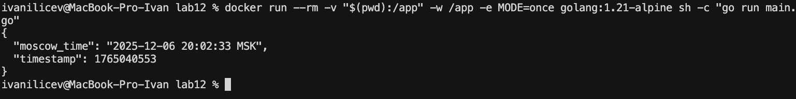
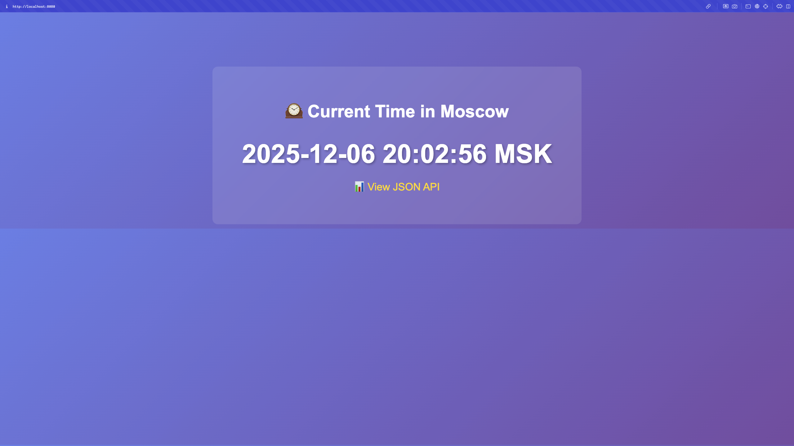
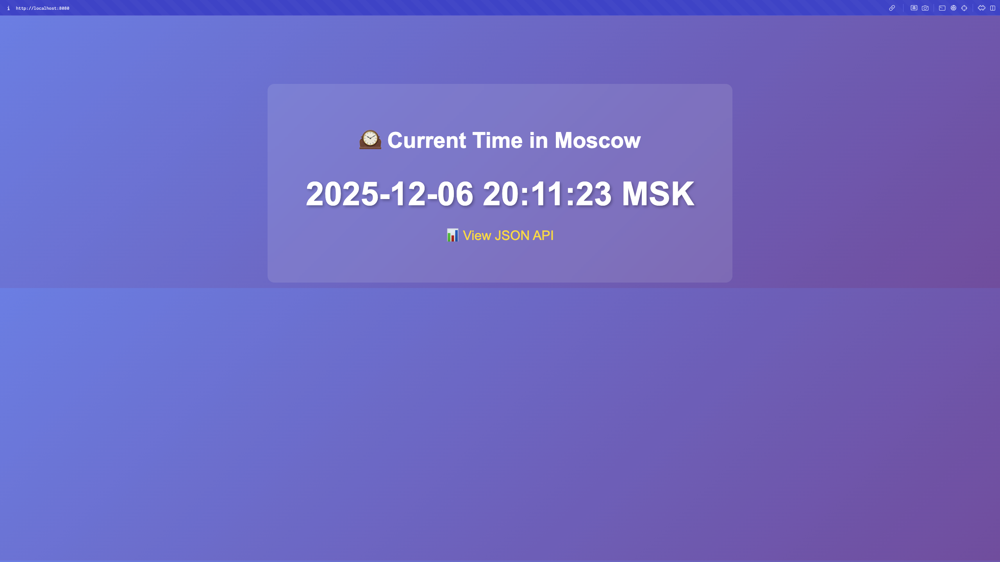

# Lab 12 — WebAssembly Containers vs Traditional Containers

## Task 1 — Create the Moscow Time Application

**Working Directory:** `labs/lab12/`

### How `main.go` Works in Three Contexts

The single `main.go` file adapts to different execution environments:

1. **CLI Mode** (`MODE=once`): Checks `os.Getenv("MODE") == "once"`, prints JSON to STDOUT, exits. Used for benchmarking.

2. **WAGI Mode** (Spin): `isWagi()` detects `REQUEST_METHOD` env var set by Spin. `runWagiOnce()` reads `PATH_INFO`, prints HTTP headers and body to STDOUT (CGI-style), exits. No Spin SDK needed.

3. **Server Mode** (Traditional Docker): Falls back to standard `net/http` server with `http.ListenAndServe(":8080", nil)`.

**Key Design:** Uses `time.FixedZone` instead of `time.LoadLocation` to avoid timezone database dependencies in WASM environments.

### Screenshots

The container was used because I do not have go installed on my system

**CLI Mode Output:**


**Server Mode Browser:**


---

## Task 2 — Build Traditional Docker Container

### Task 2.1 Review the Provided Dockerfile

File was reviewed

### Task 2.2 Build and Run Traditional Container

Build Commands Used:

```bash
docker build -t moscow-time-traditional -f Dockerfile .
docker run --rm -e MODE=once moscow-time-traditional
docker run --rm -p 8080:8080 moscow-time-traditional
```

### Task 2.3 Performance Measurements

#### Task 2.3.1 Binary Size

Command used:

```bash
ls -lh moscow-time-traditional
> -rwxr-xr-x@ 1 ivanilicev  staff   4.4M Dec  6 20:10 moscow-time-traditional
```

#### Task 2.3.2 Image Size

Commands used:

```bash
docker images moscow-time-traditional
> REPOSITORY                TAG       IMAGE ID       CREATED         SIZE
moscow-time-traditional   latest    f4226ac48775   2 minutes ago   4.59MB
```

```bash
docker image inspect moscow-time-traditional --format '{{.Size}}' | \
       awk '{print $1/1024/1024 " MB"}'
> 4.375 MB
```

#### Task 2.3.3 Startup Time

Command used: 

```bash
for i in {1..5}; do
    /usr/bin/time -f "%e" docker run --rm -e MODE=once moscow-time-traditional 2>&1 | tail -n 1
done | awk '{sum+=$1; count++} END {print "Average:", sum/count, "seconds"}'
> Average: 0 seconds
```

#### Task 2.3.4 Memory Usage (Server)

Commands used:

In one terminal:

```bash
docker run --rm --name test-traditional -p 8080:8080 moscow-time-traditional
```

In another terminal:

```bash
docker stats test-traditional --no-stream
> CONTAINER ID   NAME               CPU %     MEM USAGE / LIMIT     MEM %     NET I/O         BLOCK I/O     PIDS
9bdb6dfa008e   test-traditional   0.00%     6.844MiB / 7.653GiB   0.09%     1.75kB / 126B   4.18MB / 0B   5
```


**Screenshot:**


---


