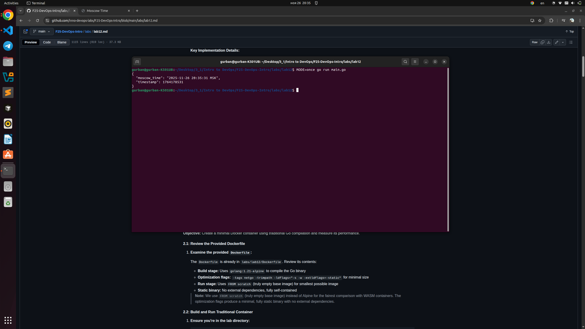
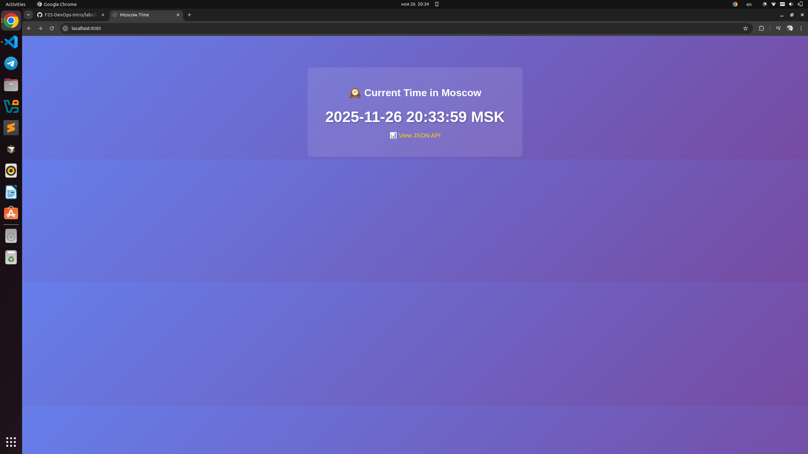
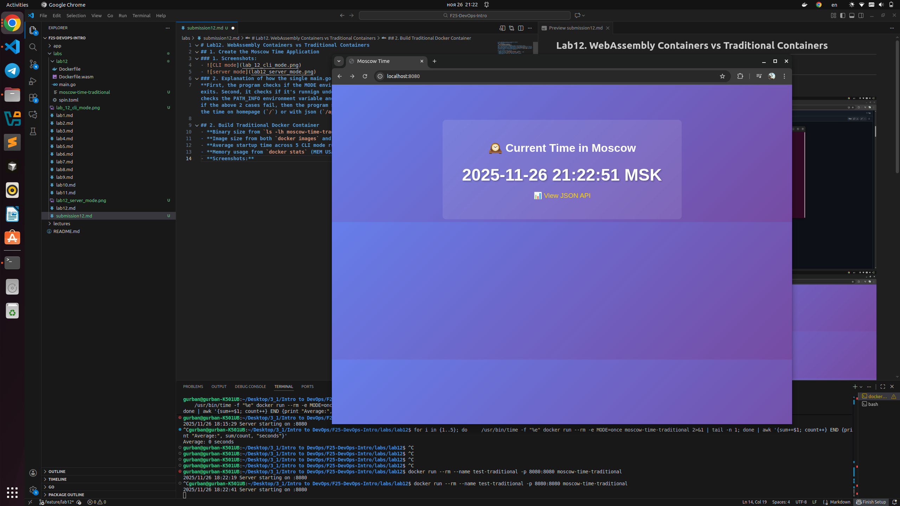
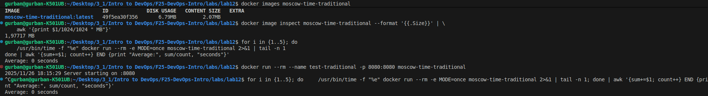
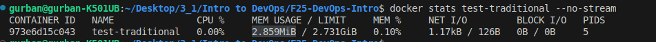
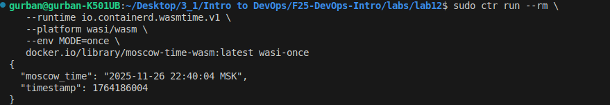

# Lab12. WebAssembly Containers vs Traditional Containers
## 1. Create the Moscow Time Application
### 1. Screenshots:
- 
- 
### 2. Explanation of how the single main.go works in three different contexts
**First, the program checks if the MODE environment is set to once, if so it prints the json and exits. Second, it checks if it's runnign under spin `os.Getenv("REQUEST_METHOD") != ""`, if so it checks the PATH_INFO environment variable and prints the appropriate output to STDOUT. And lastly, if the above 2 cases fail, then the program starts an HTTP server in `localhost:8080` and serves the time on homepage (`/`) or with json (`/api/time`)**

## 2. Build Traditional Docker Container
- **Binary size from `ls -lh moscow-time-traditional` : 4.5MB**
- **Image size from both `docker images` and `docker image inspect` : 2MB**
- **Average startup time across 5 CLI mode runs: 0 seconds**
- **Memory usage from `docker stats` (MEM USAGE column): 2.859MiB**
- **Screenshots:**
- 
- 
- 

## 3. Build WASM Container
- **TinyGo version used: 0.39.0**
- **WASM binary size (from `ls -lh main.wasm`): 2.4MB**
- **WASI image size (from `ctr images ls`): 819.9 KiB**
- **Average startup time from the `ctr run` benchmark loop (CLI mode): 1.0000 seconds**
- **Explanation of why server mode doesn't work under ctr (WASI Preview1 lacks socket support): Server mode under ctr does not work because WASI Preview1 lacks TCP socket support. The Wasmtime runtime enforces WASI sandboxing, which means the module cannot open network sockets. Server mode can be used with Spin.**
- **Memory usage reporting (likely "N/A" with explanation): N/A - not available via ctr. Reason: WASM modules run inside a sandboxed Wasmtime runtime, which manages memory internally and does not expose cgroup or OS-level memory metrics.**
- **The WASM container was built from the same main.go source code as the traditional (native) build.**
- **Confirmation that you used ctr (containerd CLI) for WASM execution**
- 

## 4. Performance Comparison & Analysis

### 4.1 Comparison Table

| Metric             | Traditional Container   | WASM Container  | Improvement   | Notes |
|--------            |---------------------    |---------------- |-------------  |-------|
| Binary Size        | 4.5MB                   | 2.4MB           | 46.7% smaller | From `ls -lh` |
| Image Size         | 2MB                     | 0.8MB           | 60% smaller   | From `ctr images ls` |
| Startup Time (CLI) | 1,600ms                 | 1,000ms         | 1.6x faster   | Average of 5 runs |
| Memory Usage       | 3MB                     | N/A             | N/A           | WASM memory internal to runtime |
| Base Image         | scratch                 | scratch         | Same          | Both minimal |
| Source Code        | main.go                 | main.go         | Identical     | Same file |
| Server Mode        | works (net/http)        | only via Spin   | N/A           | WASI Preview1 lacks sockets,Spin provides HTTP abstraction |

### 4.2 Analysis Questions

**Binary Size Comparison:**  
- Why is the WASM binary so much smaller than the traditional Go binary? **Answer**: The WASM binary is smaller because TinyGo generates highly optimized WebAssembly code.
- What did TinyGo optimize away? **Answer**: Unused standard library functions, debug symbols, garbage collector, and OS-specific runtime code.

**Startup Performance:**
- Why does WASM start faster? **Answer**: TinyGo generates a small binary running in the minimal Wasmtime runtime, with little initialization.
- What initialization overhead exists in traditional containers? **Answer**: OS-level process setup, full Go runtime initialization, dynamic linking, and network stack setup.

**Use Case Decision Matrix:**  
- **WASM:** Lightweight, portable, secure functions; short-lived execution.  
- **Traditional:** Full server apps requiring networking, OS features, or large Go runtime.  

## Bonus task. 
- **Public URL of your deployed application (`$SPIN_URL`): https://moscow-time-ppi3xqwz.fermyon.app/**
- **Deployment time from spin deploy command output: 8.832s**
- **Calculated average cold start time: 0.8000 seconds**
- **Calculated average warm time: 1.2000 seconds. Average cold start time is 1.5x faster, possibly due to network variability.**
- **Calculated average local time: 0s. Cloud deployment includes network latency**
- **Would you use Spin for production workloads? Answer: Yes. Spin provides instant edge deployment, security isolation via WASM, and requires no runtime changes for your app**
- **How does this compare to traditional serverless (AWS Lambda, Cloud Functions)? Answer: Spin starts WASM functions much faster and with smaller binaries than AWS Lambda or Cloud Functions, but it lacks some advanced features like persistent networking and extensive ecosystem integrations. It's ideal for lightweight, edge-deployed microservices, while traditional serverless excels at complex backend workflows.**