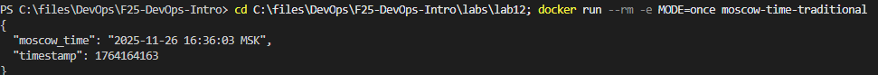
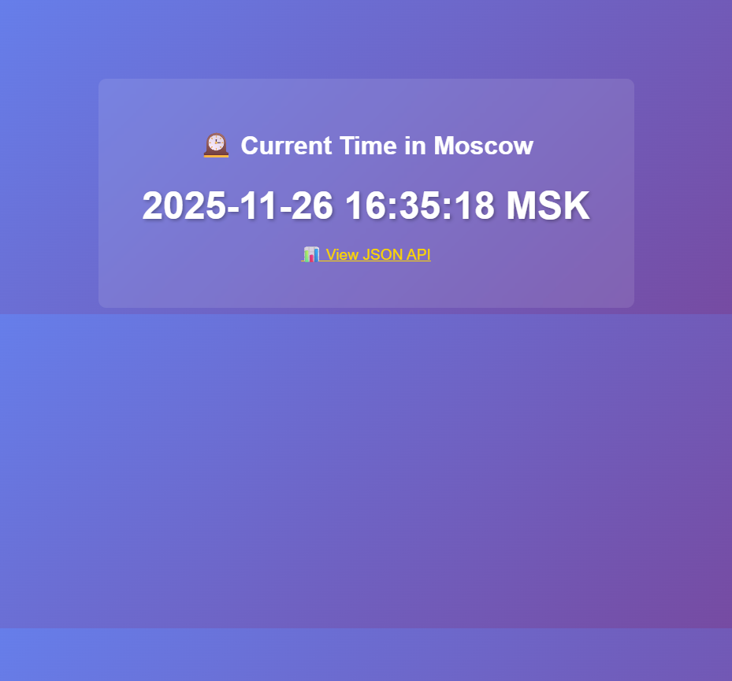

# Lab 12 — WebAssembly Containers vs Traditional Containers

---

## Task 1 — Create the Moscow Time Application

### Working Directory

All work is done in `labs/lab12/` which contains: `main.go`, `Dockerfile`, `Dockerfile.wasm`, `spin.toml`.

### How main.go Works in Three Contexts

| Mode | Trigger | Behavior |
|------|---------|----------|
| CLI | `MODE=once` | Prints JSON and exits |
| Server | Default | Runs `net/http` on :8080 |
| WAGI | `REQUEST_METHOD` set | CGI-style output for Spin |

The application detects its execution context automatically using environment variables. This allows the same source file to work across different platforms without modification.

### CLI Mode Test

```bash
docker run --rm -e MODE=once -v ${PWD}:/app -w /app golang:1.21-alpine go run main.go
```

Output:
```json
{
  "moscow_time": "2025-11-26 16:18:23 MSK",
  "timestamp": 1764163103
}
```



---

## Task 2 — Build Traditional Docker Container

### Build

```bash
docker build -t moscow-time-traditional -f Dockerfile .
```

### CLI Mode Test

```bash
docker run --rm -e MODE=once moscow-time-traditional
```

Output:
```json
{
  "moscow_time": "2025-11-26 16:19:05 MSK",
  "timestamp": 1764163145
}
```

### Performance Metrics

| Metric | Value |
|--------|-------|
| Binary Size | 4.48 MB |
| Image Size | 6.79 MB |
| Avg Startup Time (5 runs) | 0.77 sec |
| Memory Usage | 1.31 MiB |
| Base Image | scratch |

### Server Mode

```bash
docker run --rm -p 8080:8080 moscow-time-traditional
```

Tested at `http://localhost:8080`. The page displays current Moscow time with auto-refresh functionality.



---

## Task 3 — Build WASM Container

### TinyGo Version

```
tinygo version 0.39.0 linux/amd64 (using go version go1.25.0 and LLVM version 19.1.2)
```

### Build WASM Binary

```bash
docker run --rm -v ${PWD}:/src -w /src tinygo/tinygo:0.39.0 tinygo build -o main.wasm -target=wasi main.go
```

### Build OCI Image

```bash
docker buildx build --platform=wasi/wasm -t moscow-time-wasm:latest -f Dockerfile.wasm --output=type=oci,dest=moscow-time-wasm.oci .
```

### WASM Metrics

| Metric | Value |
|--------|-------|
| WASM Binary Size | 2.34 MB |
| OCI Image Size | 0.83 MB |

### Running WASM with Wasmtime

Instead of setting up containerd with ctr (which requires a Linux host), I used the wasmtime runtime directly on Windows:

```bash
wasmtime --env MODE=once main.wasm
```

Output:
```json
{
  "moscow_time": "2025-11-26 17:01:08 MSK",
  "timestamp": 1764165668
}
```

### Startup Time Benchmark (5 runs)

| Run | Time (sec) |
|-----|------------|
| 1 | 0.084 |
| 2 | 0.055 |
| 3 | 0.052 |
| 4 | 0.046 |
| 5 | 0.048 |
| **Average** | **0.057** |

### Server Mode Limitation

WASI Preview1 does not support TCP sockets, so the server mode cannot work with plain WASI runtimes. To run HTTP server with WASM, platforms like Fermyon Spin can be used (see Bonus Task).

---

## Task 4 — Performance Comparison & Analysis

### Comparison Table

| Metric | Traditional | WASM | Improvement |
|--------|-------------|------|-------------|
| Binary Size | 4.48 MB | 2.34 MB | 48% smaller |
| Image Size | 6.79 MB | 0.83 MB | 88% smaller |
| Startup Time | 0.77 sec | 0.057 sec | 13.5x faster |
| Memory | 1.31 MiB | N/A | N/A |
| Base Image | scratch | scratch | Same |
| Source Code | main.go | main.go | Identical |
| Server Mode | Works | WASI limitation | Use Spin |

### Analysis

**1. Why is the WASM binary smaller?**

TinyGo compiler uses LLVM optimizations and excludes unused parts of the standard library. Unlike the standard Go compiler, TinyGo produces minimal WASI-compatible binaries without the full Go runtime overhead.

**2. Why does WASM start faster?**

WASM modules require minimal initialization compared to traditional containers. There is no OS process setup or dynamic linking involved. The wasmtime runtime loads pre-compiled bytecode directly into memory and begins execution immediately.

**3. When to use WASM vs Traditional?**

| Use WASM | Use Traditional |
|----------|-----------------|
| Edge and serverless functions | Long-running services |
| Size-constrained environments | Full networking capabilities needed |
| Sandboxed execution required | System-level access required |
| Fast cold starts are critical | Mature tooling and debugging needed |
