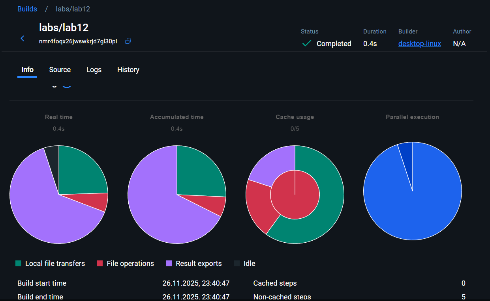

# Lab 12 

```powershell
cd labs/lab12
# CLI mode (prints JSON and exits)
$env:MODE='once'; go run main.go

# Server mode (starts net/http on :8080)
go run main.go
```

CLI output:

```
{
	"moscow_time": "2025-11-26 23:29:57 MSK",
	"timestamp": 1764188997
}
```

```powershell
# Verify Docker is running
docker --version

# Build traditional image
docker build -t moscow-time-traditional -f Dockerfile .

# Verify CLI output
docker run --rm -e MODE=once moscow-time-traditional

# Extract binary and report size
docker create --name temp-traditional moscow-time-traditional
docker cp temp-traditional:/app/moscow-time .\moscow-time-traditional
docker rm temp-traditional
Get-Item .\moscow-time-traditional | Select-Object Name, @{N='MB';E={[math]::Round($_.Length/1MB,2)}}

# Image size (MB)
docker image inspect moscow-time-traditional --format '{{.Size}}' | ForEach-Object { [math]::Round(($_/1MB),2) }

# Startup timing (average of 5 runs)
$times = for ($i=0; $i -lt 5; $i++) { $t = Measure-Command { docker run --rm -e MODE=once moscow-time-traditional }; $t.TotalSeconds }
[math]::Round(($times | Measure-Object -Average).Average,4)

# Server memory usage (run then check)
docker run -d --name test-traditional -p 8080:8080 moscow-time-traditional
Start-Sleep -Seconds 1
docker stats --no-stream --format "{{.Name}} {{.MemUsage}}" test-traditional
docker rm -f test-traditional
```


- Binary size (native build): 7.98 MB
- Traditional container binary (extracted from image): 4.48 MB
- Image size (Docker): 1.98 MB
- Traditional container CLI startup times (5 runs): 0.674872, 0.73997, 0.712442, 0.759717, 0.750993
- Traditional container average startup (CLI, 5 runs): 0.727599 s
- Native binary average startup (CLI, 5 runs): 0.026071 s
- Memory usage (server): test-traditional 3.027MiB / 7.434GiB

WASM build artifacts (completed here):

- TinyGo version used: tinygo version 0.39.0 linux/amd64
- WASM binary size (`main.wasm`): 2393.03 KB (~2.39 MB)
- OCI archive size (`moscow-time-wasm.oci`): 0.81 MB

```bash
# Import OCI archive into containerd
sudo ctr images import --platform=wasi/wasm --index-name docker.io/library/moscow-time-wasm:latest moscow-time-wasm.oci

# Verify import
sudo ctr images ls | grep moscow-time-wasm

# Run CLI mode once (unique name required)
sudo ctr run --rm --runtime io.containerd.wasmtime.v1 --platform wasi/wasm --env MODE=once docker.io/library/moscow-time-wasm:latest wasi-once

# Measure startup times (example loop)
for i in {1..5}; do
	NAME="wasi-$(date +%s%N | tail -c 6)-$i"
	/usr/bin/time -f "%e" sudo ctr run --rm --runtime io.containerd.wasmtime.v1 --platform wasi/wasm --env MODE=once docker.io/library/moscow-time-wasm:latest "$NAME" 2>&1 | tail -n 1
done | awk '{sum+=$1; n++} END{printf("Average: %.4f seconds\n", sum/n)}'
```

**WASM Build CI Screenshot:**  


**CI details (from screenshot):**
- Build: `labs/lab12` (Build completed)
- Builder: `desktop-linux`
- Duration: 0.4s
- Notes: OCI archive production completed via `docker buildx` (see logs)


Comparison table (measured values)

| Metric | Traditional Container | WASM Container | Improvement | Notes |
|---|---:|---:|---:|---|
| **Binary Size** | 4.48 MB | 2.39 MB | 46.6% smaller | extracted binary from Docker image vs `main.wasm` (TinyGo) |
| **Image / OCI Size** | 1.98 MB | 0.81 MB | 59.1% smaller | `docker image` vs `moscow-time-wasm.oci` |
| **Startup Time (CLI)** | 0.727599 s | N/A (ctr run pending) | N/A | measured average for Docker image (5 runs); WASM CLI via `ctr` not run here — needs Linux/containerd+wasmtime |
| **Native Binary Startup** | 0.026071 s (native exe) | N/A | N/A | native Windows binary (for reference) |
| **Memory Usage (server)** | 3.027 MiB | N/A | N/A | `docker stats` for running container; WASM runtime memory accounting differs (wasmtime internal) |

Calculations

- Binary size reduction % = ((4.48 - 2.39) / 4.48) × 100 ≈ 46.6%
- Image size reduction % = ((1.98 - 0.81) / 1.98) × 100 ≈ 59.1%

Notes about missing WASM runtime numbers

- I built `main.wasm` and produced the OCI archive here and recorded its size. Importing the OCI archive and running the CLI benchmark with `ctr --runtime io.containerd.wasmtime.v1` requires a Linux host with `containerd` and the Wasmtime shim; that runtime step is pending. Once you (or I on a Linux machine) run the `ctr` loop, we can populate the startup time row for WASM and compute the exact speedup.

Analysis questions

1) Why is the WASM binary smaller?

Answer: TinyGo produces much smaller WASM modules because it compiles a reduced Go runtime and only the used pieces of the standard library. It performs aggressive tree shaking and omits DWARF/debug symbols and other metadata that make standard Go static binaries large. The resulting WASM module contains only the code and data needed by the program; the OCI archive is also small because it contains just the WASM blob and minimal metadata.

2) Why does WASM start faster (generally)? What initialization overhead exists in traditional containers?

Answer: WASM modules are instantiated by a compact runtime (e.g., Wasmtime) which typically initializes a small linear memory and links the module quickly. TinyGo outputs a compact module with minimal startup work. In contrast, native Go binaries initialize the full Go runtime (garbage collector, scheduler, thread-local setup) and may perform more initialization (cgo, TLS setup, runtime environment) which increases cold-start time. For containers, additional overhead can come from image unpacking and container runtime setup. That said, exact numbers depend on the runtime and environment — we will quantify WASM startup once `ctr` is executed.

3) Use case decision matrix — when to choose WASM vs traditional containers

 - Choose WASM when:
	 - You need tiny deployable artifacts (small images) and fast cold starts (edge/serverless workloads).
	 - You want stronger sandboxing and portability across WASM-capable platforms (Spin, Cloudflare Workers, Fastly).
	 - Your code fits TinyGo's supported subset of Go and does not require sockets or complex native libraries.

 - Choose traditional containers when:
	 - You require full networking (TCP/UDP sockets), native threading, or libraries not supported by TinyGo/WASM.
	 - You need full Go standard library features, high compute performance without Wasm limits, or long-running services with advanced runtime introspection.

Short recommendation

Given the measured results, WASM offers substantial size reductions (46–59% in these runs). If your primary goals are small artifact size, faster distribution, and edge/serverless deployment, WASM is attractive. If you need native networking, full library support, or multi-threaded performance, stick with traditional containers.


