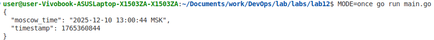
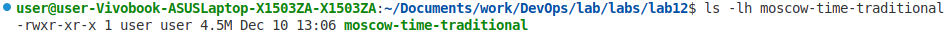
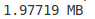
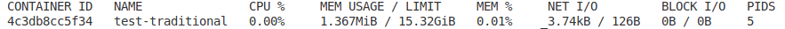
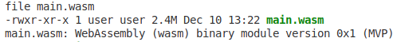
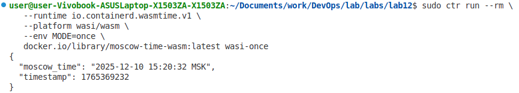

# Lab 12 — WebAssembly Containers vs Traditional Containers
### Task 1 — Create the Moscow Time Application
##### CLI output
```bash
MODE=once go run main.go
```



##### How it works in 3 contexts
- `isWagi()` function detects if running under Spin by checking for `REQUEST_METHOD` env var
- `runWagiOnce()` handles a single HTTP request by printing headers and body to STDOUT (CGI/WAGI style)
- Falls back to standard `net/http` server if not in CLI or WAGI mode

### Task 2 — Build Traditional Docker Container
##### Binary size
```bash
ls -lh moscow-time-traditional
```



##### Image size
```bash
docker image inspect moscow-time-traditional --format '{{.Size}}' | \
    awk '{print $1/1024/1024 " MB"}'
```


##### Startup time
```bash
for i in {1..5}; do
    /usr/bin/time -f "%e" docker run --rm -e MODE=once moscow-time-traditional 2>&1 | tail -n 1
done | awk '{sum+=$1; count++} END {print "Average:", sum/count, "seconds"}'
```


##### Memory usage (server mode)
In one terminal:
```bash
docker run --rm --name test-traditional -p 8080:8080 moscow-time-traditional
```

In another:
```bash
docker stats test-traditional --no-stream
```



##### Screenshot of application in browser


### Task 3 — Build WASM Container (ctr-based)
##### TinyGo version


##### Verification of WASM binary
```bash
ls -lh main.wasm
file main.wasm
```


##### Image size
```bash
sudo ctr images ls | awk 'NR>1 && $1 ~ /moscow-time-wasm/ {print "IMAGE:", $1, "SIZE:", $4}'
```


##### Startup time
```bash
for i in {1..5}; do
    NAME="wasi-$(date +%s%N | tail -c 6)-$i"
    /usr/bin/time -f "%e" sudo ctr run --rm \
        --runtime io.containerd.wasmtime.v1 \
        --platform wasi/wasm \
        --env MODE=once \
        docker.io/library/moscow-time-wasm:latest "$NAME" 2>&1 | tail -n 1
done | awk '{sum+=$1; n++} END{printf("Average: %.4f seconds\n", sum/n)}'
```


##### Confirmation of using ctr for WASM execution

- Note: used same source code as traditional build

##### Server Mode Limitation
Plain WASI (Preview1) modules do not support TCP sockets. Server mode under ctr is **not supported** for the standard `main.wasm` just built, because WASI Preview1 lacks networking capabilities.
- Note: server mode can be demonstrated via Spin using the same main.wasm

##### Memory reporting
Memory reporting is **N/A via ctr**.
WASM runs in a sandboxed runtime with **different resource accounting mechanisms** than traditional Linux containers.
The wasmtime runtime manages WASM memory internally, and traditional container metrics (cgroups) don't apply.

### Task 4 — Performance Comparison & Analysis
#### Comprehensive comparison table

| Metric | Traditional Container | WASM Container | Improvement | Notes |
|--------|----------------------|----------------|-------------|-------|
| **Binary Size** | 4.5 MB | 2.4 MB | 46.67% smaller | From `ls -lh` |
| **Image Size** | 1.9772 MiB | 0.8 MiB | 59.54% smaller | From `docker image inspect` |
| **Startup Time (CLI)** | 0.932 ms | 0.574 ms | 1.63x faster | Average of 5 runs |
| **Memory Usage** | 1.367 MiB | N/A | N/A | From `docker stats` |
| **Base Image** | scratch | scratch | Same | Both minimal |
| **Source Code** | main.go | main.go | Identical | ✅ Same file! |
| **Server Mode** | ✅ Works (net/http) | ❌ Not via ctr <br> ✅ Via Spin (WAGI) | N/A | WASI Preview1 lacks sockets; <br> Spin provides HTTP abstraction |

#### Analysis questions

Answer the following in your submission:

1. **Binary Size Comparison:**
   - Why is the WASM binary so much smaller than the traditional Go binary?
        - TinyGo targets constrained environments and aggressively strips unused parts of the Go runtime, GC, reflection, and large standard‑library helpers that the regular Go toolchain always links in
   - What did TinyGo optimize away?
        - It performed whole‑program optimization (via LLVM), dead‑code elimination, simpler runtime, and can avoid heavy packages like `fmt`

2. **Startup Performance:**
   - Why does WASM start faster?
        - A WASM module is just a compiled sandboxed binary loaded into an existing runtime — no OS boot, no container filesystem, no separate process
   - What initialization overhead exists in traditional containers?
        - A traditional container has to create a process namespace, set up cgroups, mount or prepare a filesystem layer, configure networking, and start a full user‑space runtime

3. **Use Case Decision Matrix:**
   - When would you choose WASM over traditional containers?
        - When needing very fast cold starts, high instance density, small binary size or network transfer, while able to live within the WASI/runtime capability surface (limited direct OS access, more constrained I/O model)
   - When would you stick with traditional containers?
        - When needing full Linux/OS compatibility, rich system calls, mature ecosystem or heavily dependent on the filesystem