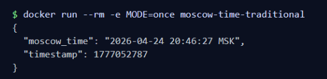
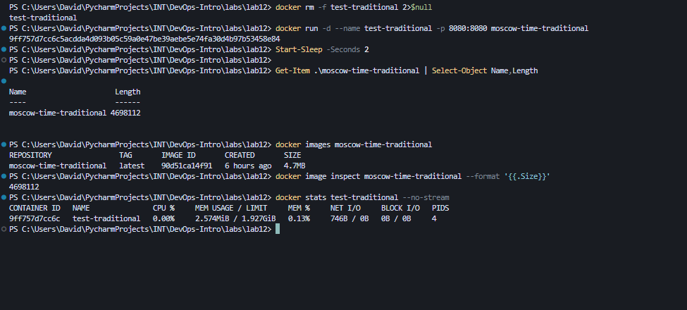
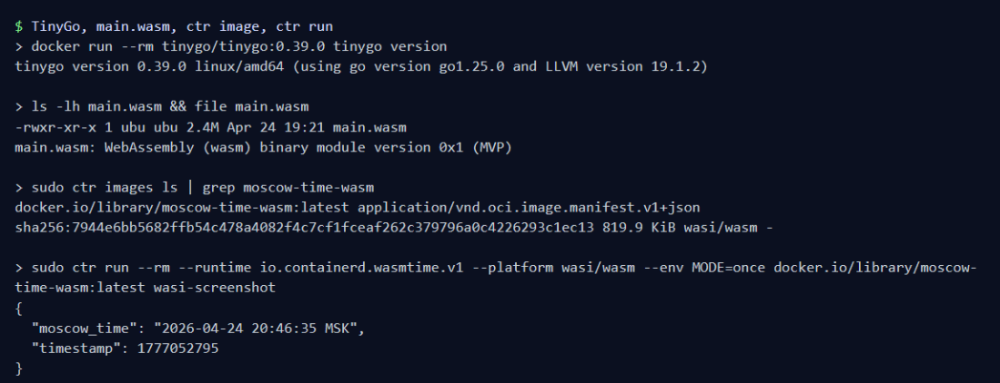
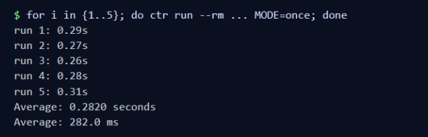
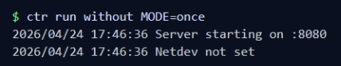

# Lab 12 Submission

## Task 1 - Moscow Time Application

### Working directory

All commands were executed from:

```bash
cd labs/lab12
```

The same source file, `main.go`, was used for all targets.

### CLI mode output

Command:

```bash
docker run --rm -e MODE=once moscow-time-traditional
```

Output:

```json
{
  "moscow_time": "2026-04-24 21:23:23 MSK",
  "timestamp": 1777055003
}
```

CLI mode screenshot:


### Server mode output

Command:

```bash
docker run -d --rm --name lab12-source-server \
  -v "$PWD:/src" \
  -w /src \
  -p 8081:8080 \
  golang:1.21-alpine \
  go run main.go
curl http://localhost:8081/api/time
```

Output:

```json
{"moscow_time":"2026-04-25 01:12:22 MSK","timestamp":1777068742}
```

Browser screenshot:


### How one `main.go` works in three contexts

The application chooses its runtime behavior from environment variables:

- `MODE=once` enables CLI mode, prints the Moscow time JSON once, and exits. This is used for both Docker and WASM startup benchmarks.
- If `REQUEST_METHOD` is present, `isWagi()` detects Spin/WAGI mode. `runWagiOnce()` writes CGI-style HTTP headers and the response body to stdout.
- Otherwise, the application starts a normal `net/http` server on `:8080`, which works in the traditional Docker container.

The code uses `time.FixedZone("MSK", 3*60*60)` instead of loading a timezone database, which keeps it portable in minimal WASM/WASI environments.

## Task 2 - Traditional Docker Container

### Build and run

Command:

```bash
docker build -t moscow-time-traditional -f Dockerfile .
docker run --rm -e MODE=once moscow-time-traditional
```

The container was built from `golang:1.21-alpine` and copied into a `scratch` runtime image.

Traditional container build and CLI run screenshot:



### Binary size

Commands:

```bash
docker create --name temp-traditional moscow-time-traditional
docker cp temp-traditional:/app/moscow-time ./moscow-time-traditional
docker rm temp-traditional
ls -lh moscow-time-traditional
file moscow-time-traditional
```

Output:

```text
-rwxrwxrwx 1 Milter Milter 4.5M Apr 24 19:15 moscow-time-traditional
moscow-time-traditional: ELF 64-bit LSB executable, x86-64, statically linked, stripped
```

Exact size:

```text
4,698,112 bytes = 4.48 MiB
```

### Image size

Command:

```bash
docker images moscow-time-traditional
docker image inspect moscow-time-traditional --format '{{.Size}}'
```

Output:

```text
REPOSITORY                TAG       IMAGE ID       CREATED          SIZE
moscow-time-traditional   latest    90d51ca14f91   53 seconds ago   4.7MB

4698112
```

Exact image size:

```text
4,698,112 bytes = 4.48 MiB
```

### Startup time benchmark

Command:

```bash
for i in 1 2 3 4 5; do
  echo run $i
  /usr/bin/time -f %e docker run --rm -e MODE=once moscow-time-traditional >/dev/null
done
```

Output:

```text
run 1
run 2
run 3
run 4
run 5
0.61
0.73
0.64
0.67
0.65
```

Average startup time:

```text
0.660 seconds = 660 ms
```

### Memory usage

Command:

```bash
docker run -d --name test-traditional -p 8080:8080 moscow-time-traditional
docker stats test-traditional --no-stream --format '{{.Name}} {{.MemUsage}} {{.CPUPerc}}'
```

Output:

```text
CONTAINER ID   NAME               CPU %     MEM USAGE / LIMIT     MEM %     NET I/O     BLOCK I/O   PIDS
9ff757d7cc6c   test-traditional   0.00%     2.574MiB / 1.927GiB   0.13%     746B / 0B   0B / 0B     4
```

Traditional container metrics screenshot:



Traditional server browser screenshot:


## Task 3 - WASM Container with `ctr`

### Build environment

Traditional Docker and TinyGo builds were performed from the `labs/lab12` directory. WASM execution was performed in an Ubuntu environment with `containerd`, `ctr`, and the Wasmtime runtime shim.

Containerd version:

```text
Client:
  Version:  2.2.1
  Revision:
  Go version: go1.24.4

Server:
  Version:  2.2.1
  Revision:
  UUID: f0543bc5-4cec-4eb2-b788-88b13a3a1f31
```

Wasmtime shim:

```text
-rwxr-xr-x 1 root root 31M Apr 24 21:00 /usr/local/bin/containerd-shim-wasmtime-v1
```

Runtime registration check:

```bash
sudo containerd config dump | grep -A8 -B2 wasmtime
```

Output:

```text
[plugins.'io.containerd.cri.v1.runtime'.containerd.runtimes.wasmtime]
  runtime_type = 'io.containerd.wasmtime.v1'
  runtime_path = ''
  pod_annotations = []
  container_annotations = []
  privileged_without_host_devices = false
  privileged_without_host_devices_all_devices_allowed = false
  cgroup_writable = false
  base_runtime_spec = ''

[plugins.'io.containerd.cri.v1.runtime'.containerd.runtimes.wasmtime.options]
  BinaryName = '/usr/local/bin/containerd-shim-wasmtime-v1'
```

### TinyGo version

Command:

```bash
docker run --rm tinygo/tinygo:0.39.0 tinygo version
```

Output:

```text
tinygo version 0.39.0 linux/amd64 (using go version go1.25.0 and LLVM version 19.1.2)
```

### WASM binary build

Command:

```powershell
docker run --rm -v ${PWD}:/src -w /src tinygo/tinygo:0.39.0 tinygo build -o main.wasm -target=wasi main.go
```

Verification:

```bash
ls -lh main.wasm
file main.wasm
```

Output:

```text
-rwxr-xr-x 1 Milter Milter 2.4M Apr 24 19:22 main.wasm
main.wasm: WebAssembly (wasm) binary module version 0x1 (MVP)
```

Exact size:

```text
2,450,459 bytes = 2.34 MiB
```

### WASI OCI image build and import

OCI archive build:

```bash
docker buildx build \
  --platform=wasi/wasm \
  -t moscow-time-wasm:latest \
  -f Dockerfile.wasm \
  --output=type=oci,dest=moscow-time-wasm.oci,annotation=index:org.opencontainers.image.ref.name=moscow-time-wasm:latest \
  .
```

Import into containerd:

```bash
sudo ctr images import \
  --platform wasi/wasm \
  --index-name docker.io/library/moscow-time-wasm:latest \
  moscow-time-wasm.oci
```

Image list:

```text
REF                                       TYPE                                       DIGEST                                                                  SIZE      PLATFORMS LABELS
docker.io/library/moscow-time-wasm:latest application/vnd.oci.image.manifest.v1+json sha256:81d5ce1ffe7a99b6d629a3ca71cd93324feb4eb410b42f4b3af143292cddce23 819.9 KiB wasi/wasm -
```

### WASM CLI mode with `ctr`

Command:

```bash
sudo ctr run --rm \
  --runtime io.containerd.wasmtime.v1 \
  --platform wasi/wasm \
  --env MODE=once \
  docker.io/library/moscow-time-wasm:latest wasi-once
```

Output:

```json
{
  "moscow_time": "2026-04-24 21:27:37 MSK",
  "timestamp": 1777055257
}
```

WASM `ctr` CLI mode screenshot:



### WASM startup time benchmark

Command:

```bash
for i in 1 2 3 4 5; do
  NAME="wasi-$(date +%s%N)-$i"
  /usr/bin/time -f "%e" sudo ctr run --rm \
    --runtime io.containerd.wasmtime.v1 \
    --platform wasi/wasm \
    --env MODE=once \
    docker.io/library/moscow-time-wasm:latest "$NAME" 2>&1 | tail -n 1
done
```

Output:

```text
3.02
1.07
1.03
1.05
1.05
```

Average startup time:

```text
1.444 seconds = 1444 ms
```

WASM startup benchmark screenshot:



This result was measured in the local lab environment. The first run included sudo authentication overhead, so the numbers can vary depending on shell state, VM state, storage, and runtime setup.

### Server mode limitation

Command:

```bash
sudo ctr run --rm \
  --runtime io.containerd.wasmtime.v1 \
  --platform wasi/wasm \
  docker.io/library/moscow-time-wasm:latest wasi-server-test
```

Output:

```text
2026/04/24 18:11:00 Server starting on :8080
2026/04/24 18:11:00 Netdev not set
```

WASM server limitation screenshot:



Plain WASI Preview1 does not provide TCP sockets, so `net/http` server mode cannot bind to `:8080` under `ctr`. Server mode can work through Spin/WAGI because Spin provides the HTTP trigger and invokes the module per request with CGI-style environment variables.

### Memory usage

WASM memory usage via `ctr` is documented as:

```text
N/A - not available via ctr in this environment.
```

The Wasmtime shim manages the WASM module memory differently from a normal Linux process in a Docker container, and `docker stats`-style cgroup metrics are not directly comparable here.

## Task 4 - Performance Comparison and Analysis

### Comparison table

| Metric | Traditional Container | WASM Container | Improvement | Notes |
|---|---:|---:|---:|---|
| Binary Size | 4.48 MiB | 2.34 MiB | 47.8% smaller | From `ls -lh` / exact bytes |
| Image Size | 4.48 MiB | 819.9 KiB | 82.1% smaller | Docker image inspect vs `ctr images ls` |
| Startup Time (CLI) | 660 ms | 1444 ms | 0.46x | Measured in local lab environment |
| Memory Usage | 2.574 MiB | N/A | N/A | WASM memory unavailable via `ctr` |
| Base Image | scratch | scratch | Same | Both minimal |
| Source Code | `main.go` | `main.go` | Identical | Same file used |
| Server Mode | Works with `net/http` | Not via `ctr`; possible via Spin/WAGI | N/A | WASI Preview1 lacks sockets |

### Calculations

Binary size reduction:

```text
((4.48 - 2.34) / 4.48) * 100 = 47.8%
```

Image size reduction:

```text
819.9 KiB = 0.80 MiB
((4.48 - 0.80) / 4.48) * 100 = 82.1%
```

Startup comparison:

```text
0.660 / 1.444 = 0.46x
```

In this environment, the measured WASM run was slower than the traditional Docker run. The result still demonstrates the full WASI/containerd workflow, but benchmark numbers can vary significantly depending on the host, VM, storage, and runtime setup.

### 1. Binary size comparison

The WASM binary is smaller because TinyGo performs a much more aggressive whole-program compilation than the standard Go toolchain. It removes unused runtime features, trims parts of the standard library that are not needed, and targets WASI instead of a full Linux userspace.

The traditional Go binary is still optimized and stripped, but it includes the normal Go runtime, scheduler, garbage collector support, and static pieces needed for a native Linux executable.

### 2. Startup performance

WASM often starts faster because the runtime loads a small sandboxed module instead of starting a full Linux container process with the normal OCI runtime path. In a clean host setup, this can reduce process setup and isolation overhead.

Traditional Docker startup includes Docker CLI/daemon communication, OCI runtime setup, namespace/cgroup setup, filesystem snapshot work, and process launch.

My measured WASM result was slower in this local setup. In a direct Linux host environment, WASM containers can reduce startup overhead because the runtime loads a compact sandboxed module instead of launching a full native Linux container process.

### 3. Use case decision matrix

I would choose WASM containers for:

- short-lived CLI or function-style workloads;
- serverless and edge functions;
- untrusted plugin or extension execution;
- workloads where small image size and portability matter;
- HTTP workloads on platforms like Spin that provide a host HTTP abstraction.

I would choose traditional containers for:

- long-running services that need normal TCP/UDP sockets;
- applications requiring broad Linux system access;
- workloads that depend on full Go runtime behavior or CGO/native libraries;
- existing Kubernetes/Docker deployments where compatibility matters more than minimal startup time.


## Bonus - Spin Cloud

Not completed. The required Tasks 1-4 were completed; Spin Cloud deployment was left as optional extra credit.
