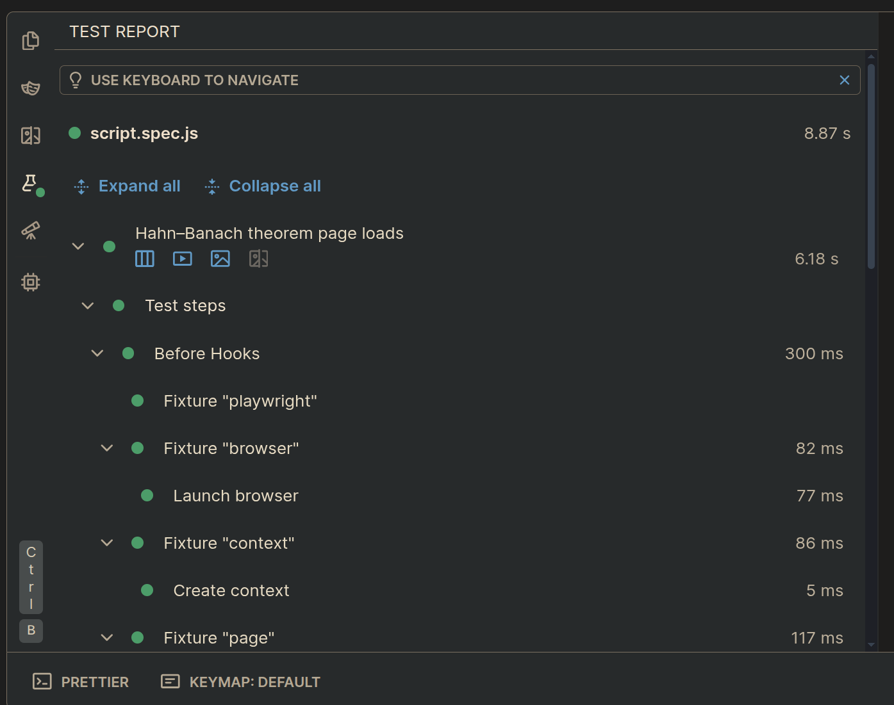

# Lab 12 Submission - WebAssembly Containers vs Traditional Containers

## Task 1 - Moscow Time Application

I worked directly inside `labs/lab12/`, where the provided files `main.go`, `Dockerfile`, `Dockerfile.wasm`, and `spin.toml` already existed.

### Working environment

The screenshot below shows the local PowerShell session in the repository workspace from which the lab steps were executed. It provides context for the environment used during the verification process.


The same `main.go` supports three execution contexts:

1. `MODE=once` enables CLI mode and prints a single JSON payload, then exits.
2. `REQUEST_METHOD` enables WAGI mode for Spin, where the program writes HTTP headers and body to `stdout`.
3. If neither of the above is set, the application starts a normal `net/http` server on port `8080`.

### CLI mode output

I verified CLI mode through the traditional container:

```json
{
  "moscow_time": "2026-04-24 17:58:20 MSK",
  "timestamp": 1777042700
}
```

### Server mode verification

The HTTP endpoint was verified in server mode with:

```bash
curl http://localhost:8080/api/time
```

Response:

```json
{"moscow_time":"2026-04-24 18:00:17 MSK","timestamp":1777042817}
```

The screenshot below shows `http://localhost:8080/api/time` opened in the browser. It confirms that the application exposes a working HTTP JSON endpoint that returns both the formatted Moscow time and the Unix timestamp.


### Root page verification

I also verified the root route in a browser:

```bash
http://localhost:8080/
```

The screenshot below shows the rendered root page. It confirms that the application serves a browser-facing HTML page with the current Moscow time and a link to the JSON API, not only the raw JSON endpoint.



---

## Task 2 - Traditional Docker Container

### Build

The traditional image was built from the provided `Dockerfile`:

```bash
docker build -t moscow-time-traditional -f Dockerfile .
```

### Binary size

The compiled binary was extracted from the container and measured:

- Binary name: `moscow-time-traditional`
- Binary size: `4,698,112 bytes` (`4.48 MiB`)

### Image size

- `docker images moscow-time-traditional` → `4.7MB`
- `docker image inspect moscow-time-traditional --format '{{.Size}}'` → `4,698,112 bytes` (`4.48 MiB`)

### Startup benchmark (CLI mode)

The container was executed five times in `MODE=once`.

Measured startup times:

- `998.58 ms`
- `852.26 ms`
- `1115.15 ms`
- `1225.57 ms`
- `1047.73 ms`

Average startup time:

- `1047.86 ms`

Note: these measurements were taken on Windows through Docker Desktop, so they include extra client/engine overhead compared with a native Linux host.

### Memory usage (server mode)

The server container was launched and checked with `docker stats --no-stream`.

- Memory usage: `3.211 MiB / 7.678 GiB`

### Server mode evidence

HTTP API response from the running container:

```json
{"moscow_time":"2026-04-24 18:00:17 MSK","timestamp":1777042817}
```

---

## Task 3 - WASM Container

### TinyGo version

The WASM build environment was verified with:

```text
tinygo version 0.39.0 linux/amd64 (using go version go1.25.0 and LLVM version 19.1.2)
```

### WASM binary build

The same `main.go` was compiled to WASM using TinyGo:

```bash
docker run --rm -v ${PWD}:/src -w /src tinygo/tinygo:0.39.0 tinygo build -o main.wasm -target=wasi main.go
```

Measured artifact:

- `main.wasm`: `2,450,459 bytes` (`2.34 MiB`)

### OCI image packaging

Because the default Docker Desktop builder did not support OCI export for `wasi/wasm`, I created a dedicated `buildx` builder with the `docker-container` driver and exported the WASM image as an OCI archive.

Supporting artifact:

- `moscow-time-wasm.oci`: `845,824 bytes` (`0.81 MiB`)

### Import into containerd with ctr

The OCI archive was imported into `containerd` using a temporary `ctr` client container and the host containerd socket:

```text
docker.io/library/moscow-time-wasm:latest application/vnd.oci.image.manifest.v1+json sha256:afdd6e8dc5459da69d90c2b0ffa90da59f678ab2024448eeaa2cb26fd82805c8 819.9 KiB wasi/wasm -
```

This confirms that the WASM OCI image was successfully imported and visible to `ctr`.

### ctr execution status

I was able to:

- compile the same source code to `main.wasm`
- package it as a WASM OCI image
- import that image into `containerd`
- inspect the imported image with `ctr`

I was **not able to complete `ctr run` on this specific machine**, because the Docker Desktop environment did not expose a registered WASM runtime shim such as `io.containerd.wasmtime.v1` in a directly usable form.

Because of that limitation:

- WASM CLI startup time via `ctr run` is `N/A` on this host
- WASM memory usage via `ctr` is `N/A`

### Why server mode does not work under plain ctr/WASI

Plain WASI Preview1 does not provide TCP socket support, so the `net/http` server path cannot bind to `:8080` under a normal WASM container runtime.

Server mode can still work with the **same `main.wasm`** when deployed through **Spin** using the WAGI executor, because Spin provides an HTTP abstraction through CGI-style environment variables such as `REQUEST_METHOD` and `PATH_INFO`.

---

## Task 4 - Performance Comparison & Analysis

### Comparison table

| Metric | Traditional Container | WASM Container | Improvement | Notes |
|--------|----------------------|----------------|-------------|-------|
| Binary Size | `4.48 MiB` | `2.34 MiB` | `47.84% smaller` | Same `main.go`, different compiler target |
| Image Size | `4.48 MiB` (`docker image inspect`) / `4.7MB` (`docker images`) | `819.9 KiB` in `ctr images ls` (`0.81 MiB` OCI archive on disk) | `~82.00% smaller` | WASM package contains only the module + OCI metadata |
| Startup Time (CLI) | `1047.86 ms` | `N/A` | `N/A` | WASM runtime shim was not available on this host |
| Memory Usage | `3.211 MiB` | `N/A` | `N/A` | `ctr` memory stats were not available and runtime execution was blocked |
| Base Image | `scratch` | `scratch` | Same | Fair comparison |
| Source Code | `main.go` | `main.go` | Identical | Same application logic |
| Server Mode | `Yes` (`net/http`) | `No` via plain `ctr/WASI`; `Yes` via Spin/WAGI | N/A | WASI Preview1 lacks sockets |

### Analysis

#### 1. Why is the WASM binary smaller?

The WASM artifact is smaller because TinyGo uses a much smaller runtime than standard Go and removes more unused functionality during compilation. It avoids shipping the full standard Go runtime and produces a more compact output that is suitable for constrained WASM targets.

TinyGo also strips away parts of the standard library and runtime machinery that are unnecessary for this workload. In practice, that means less metadata, a simpler runtime, and a smaller final artifact.

#### 2. Why can WASM start faster?

In general, WASM starts faster because it does not need the full Linux process/container initialization path used by traditional containers. A WASM module is much smaller, the runtime is lighter, and there is less OS-level startup overhead.

Traditional containers still need image materialization, process startup, and runtime setup for a full Linux userspace model. On this Windows + Docker Desktop machine, the traditional measurement was especially affected by Docker Desktop overhead, and the WASM runtime benchmark could not be completed because the WASM shim was unavailable.

#### 3. When would I choose WASM over traditional containers?

I would choose WASM when I need:

- very small artifacts
- fast cold starts
- portable sandboxed workloads
- edge/serverless execution
- plugin-style execution with strong isolation

I would stick with traditional containers when I need:

- full networking support
- mature runtime behavior for long-running services
- complete Go standard library compatibility
- standard Linux tooling and debugging workflows
- broader ecosystem support with fewer platform constraints
