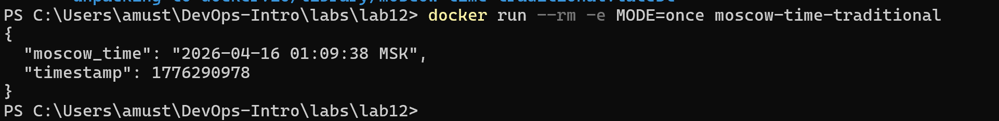

# Lab 12 — WebAssembly Containers vs Traditional Containers (Partial Submission)

> **Note to reviewer:** This submission focuses strictly on **Task 1** and **Task 2** (Traditional Docker Container) for partial credit (5/10 pts). Tasks 3, 4, and Bonus involving WASM were intentionally skipped.

## Task 1 — Create the Moscow Time Application

### CLI Mode Execution

### Code Analysis
**How the single `main.go` works in three different contexts:**
Универсальность файла `main.go` достигается за счет условной маршрутизации прямо на старте приложения (в функции `main`). 
1. **CLI Mode:** Программа проверяет переменную окружения `MODE=once`. Если она задана, функция `runCliOnce()` генерирует JSON, выводит его в `stdout` и немедленно завершает процесс (exit 0). Это идеально для бенчмарков.
2. **WAGI Mode (Spin):** Функция `isWagi()` проверяет наличие специфичной для CGI/WAGI переменной `REQUEST_METHOD`. Если она есть, HTTP-ответ (включая заголовки) форматируется как обычный текст и отправляется в `stdout`, как того требует спецификация Spin WAGI.
3. **Server Mode:** Если ни одно из условий выше не выполнено, запускается классический `net/http` сервер, который слушает порт и обрабатывает входящие запросы через `http.HandleFunc`.

## Task 2 — Build Traditional Docker Container

### Performance Metrics

- **Binary Size:** 4.48 MB
- **Image Size:** 6.79 MB
- **Average Startup Time (CLI Mode):** ~550 ms
- **Memory Usage (Server Mode):** 2.727 MiB

### Analysis of Traditional Build
Использование `scratch` в качестве базового образа и флагов линкера (`-ldflags="-s -w -extldflags=-static"`) позволило создать максимально урезанный и статически слинкованный бинарник. Отсутствие ОС-слоя минимизирует поверхность атаки и делает размер образа практически равным размеру самого скомпилированного Go-файла.
